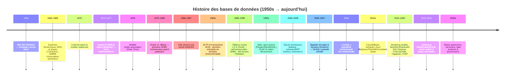
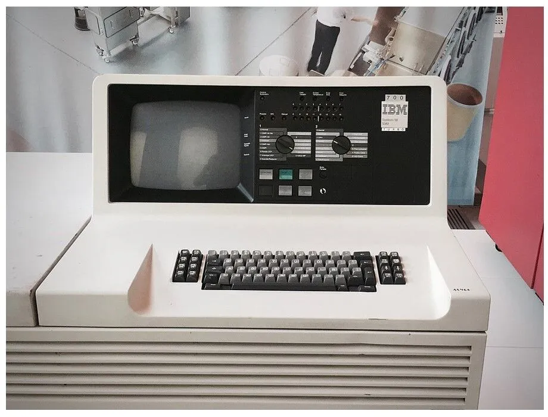
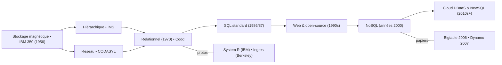
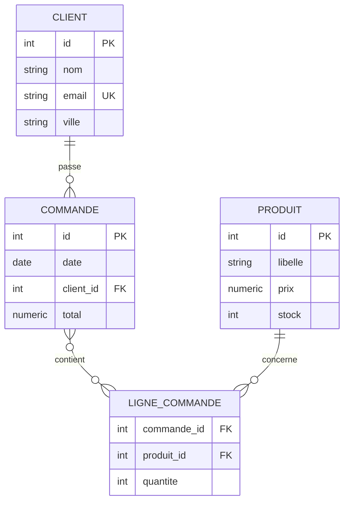
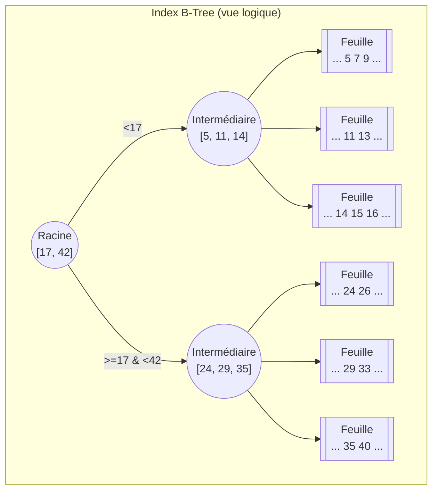
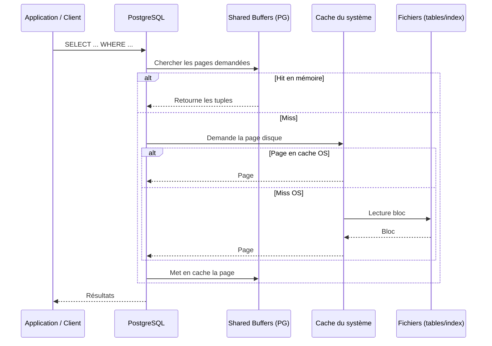

# 1. Historique des bases de données

Au fil du temps, les systèmes de gestion de bases de données (SGBD) ont évolué à travers plusieurs modèles clés. Voici une frise chronologique des grandes étapes de leur histoire :

* **Années 1950-1960 - Premières stockages informatisés :** Les premiers disques durs apparaissent en 1956, rendant possible le stockage de données sur ordinateur
data-bird.co
. Le terme « base de données » (Data Base) est inventé en 1964 pour décrire une collection d’informations partagée dans un système militaire
data-bird.co
. Vers 1960 émergent les bases de données hiérarchiques, organisées en arborescences de dossiers parent/enfant
data-bird.co
. Peu après, un modèle réseau (CODASYL) est proposé (notamment par Charles Bachman) où les enregistrements forment un graphe plus flexible que la hiérarchie pure
quickbase.com
. Un exemple marquant de cette époque est le système SABRE d’IBM pour les réservations d’avion (American Airlines), qui connut un grand succès commercial
quickbase.com

* **Années 1970 – Naissance du relationnel :** En 1970, Edgar F. Codd publie une thèse révolutionnaire qui jette les bases des bases de données relationnelles
data-bird.co
quickbase.com
. Son idée majeure est de séparer le schéma logique des données de leur stockage physique
quickbase.com
. Les données sont organisées en tables reliées par des relations mathématiques, ce qui apporte flexibilité et rigueur. Entre 1974 et 1977, les premiers prototypes de SGBD relationnels voient le jour, comme System R (IBM, qui introduit le langage SEQUEL, ancêtre du SQL) et Ingres (Université de Berkeley)
quickbase.com
. En 1976, le modèle entité-association (diagramme E/R) est proposé par Peter Chen, facilitant la conception de schémas en se focalisant sur les entités et leurs relations
quickbase.com

* **Années 1980 – Standardisation et essor :** Le langage SQL (Structured Query Language) est normalisé en 1986-87 et devient le standard universel pour interroger les bases relationnelles
quickbase.com
. Les SGBD relationnels explosent commercialement, éclipsant progressivement les anciens modèles hiérarchiques et réseau
quickbase.com
. IBM lance DB2, Oracle commercialise son SGBDR (Oracle v2 en 1979), suivis par d’autres (Informix, Sybase, etc.). Les PC se généralisant, apparaissent des SGBD pour micro-ordinateurs (dBase, Paradox, etc.)
quickbase.com
. En fin de décennie, on expérimente aussi des bases orientées objet (intégrant les concepts de programmation objet dans le stockage)
data-bird.co

* **Années 1990 – Démocratisation & web :** L’essor d’Internet et des applications client-serveur fait exploser les besoins en bases de données en réseau
quickbase.com
. Les SGBD open-source comme MySQL et PostgreSQL apparaissent et se diffusent. On perfectionne les outils de requêtage (ODBC, outils décisionnels OLAP, etc.). On assiste aussi aux premiers pas des bases NoSQL : en 1998, Carlo Strozzi nomme « NoSQL » une base qu’il propose (bien que relationnelle)
quickbase.com
– le terme sera vraiment repris en 2009 lors d’un événement consacré aux bases non-relationnelles, marquant le début de la popularisation de NoSQL moderne
quickbase.com

* **Années 2000 – Big Data et NoSQL :** À partir de 2005 environ, les géants du web (Google, Amazon, Facebook) font face à des volumes de données colossaux et à des besoins de haute disponibilité. Ils développent de nouvelles bases NoSQL optimisées pour la scalabilité horizontale et les données non structurées (ex : BigTable de Google en 2004, Dynamo d’Amazon en 2007, Cassandra, MongoDB…)
data-bird.co
. Le terme NoSQL en vient à désigner un ensemble de systèmes “pas seulement SQL” offrant plus de flexibilité. En parallèle, les SGBD relationnels restent très utilisés et évoluent (meilleure partitionnement des données, réplication, etc.).

* **Années 2010-2020 – Diversification et cloud :** Le paysage se diversifie avec des SGBD spécialisés (colonnes, graphes, mémoire in-memory, NewSQL combinant SQL et scalabilité). Le cloud rend les bases de données accessibles en mode service (DBaaS). En 2020, on parle même de bases de données autonomes (auto-administration grâce à l’IA)
data-bird.co
. Aujourd’hui, les bases de données sont omniprésentes : des services cloud personnels aux applications mobiles, en passant par l’IoT. Les SGBD relationnels classiques (Oracle, MySQL/MariaDB, PostgreSQL, SQL Server…) cohabitent avec des solutions NoSQL (MongoDB, Cassandra, Firebase, etc.), chacune ayant ses avantages pour des cas d’usage spécifiques.

> À savoir : Les premiers systèmes de gestion (années 60) liaient étroitement données et programmes, ce qui rendait les modifications coûteuses. L’avènement du modèle relationnel a introduit l’indépendance des données (schéma logique séparé du stockage physique), une avancée fondamentale qui perdure
quickbase.com
. Cette idée de Codd permet d’adapter la structure sans réécrire toutes les applications, et a ouvert la voie aux SGBD modernes.

# 2. Fondations techniques des SGBD relationnels

Avant de pratiquer, il est crucial de comprendre les concepts techniques de base d’une base de données relationnelle,
ainsi que les structures de données sous le capot :

* **Tables, lignes et colonnes :** Une base relationnelle organise les données en tables (appelées aussi relations). Une
  table est un tableau à deux dimensions composé de lignes (enregistrements) et de colonnes (champs).
  Chaque table représente une entité (par ex. Clients, Produits, Commandes), chaque ligne correspond à une occurrence (
  un client donné, un produit donné, etc.) et chaque colonne représente un attribut élémentaire de l’entité (nom, date,
  prix, etc.). L’ensemble des tables et de leurs relations forme la base de données. Ce modèle tabulaire simple est
  l’héritier direct du travail de Codd en 1970.

* **Clés primaires et étrangères :** Pour identifier de manière unique chaque enregistrement, on définit une **clé
  primaire (PK)** sur chaque table (souvent un ID numérique auto-incrémenté ou un identifiant unique).
  Cette clé primaire sert de référence stable pour chaque ligne. Une **clé étrangère (FK)** est un champ dans une table
  qui fait référence à la PK d’une autre table.
  C’est ainsi que l’on crée des liens entre tables : par exemple, la table Commandes peut avoir une colonne client_id
  qui est une FK pointant vers le id du client dans la table Clients. Les clés étrangères garantissent **l’intégrité
  référentielle** : un enregistrement lié ne peut exister que si la référence existe dans la table cible (on ne peut pas
  avoir une commande assignée à un client inexistant). Elles permettent aussi d’exploiter la puissance des jointures
  SQL (voir partie SQL).

* **Index et B-arbres :** Pour accélérer la recherche des données, les SGBD utilisent des **index**, structures de
  données
  additionnelles qui fonctionnent comme des annuaires. Un index classique est implémenté sous forme d’**arbre B (B-Tree)**
  équilibré. Un arbre B est une structure arborescente multi-étages où chaque nœud peut contenir plusieurs clés triées
  et des pointeurs vers des nœuds enfants.Le « B » signifie généralement balanced (équilibré) : la hauteur de l’arbre est
  maintenue minimale grâce à un
  rééquilibrage automatique lors des insertions/suppressions, de sorte que les opérations de recherche s’exécutent en
  temps logarithmique. En pratique, cela signifie qu’avec un index B-Tree, trouver une ligne via sa clé (indexée) sera
  très rapide même
  dans une table contenant des millions de lignes, car le SGBD n’a pas à parcourir toute la table (recherche
  séquentielle) mais descend dans l’arbre en suivant les pointeurs.

> Exemple d’un index B-Tree équilibré (ici un arbre B d’ordre 5) : les clés sont stockées de manière triée dans les
> nœuds, ce qui permet de trouver rapidement la plage de valeurs recherchée en navigant de la racine vers les feuilles.

Un index agit comme une table des matières : il est redondant par rapport aux données brutes mais accélère grandement
les requêtes sur les colonnes indexées (en particulier pour les clauses WHERE et les jointures). **Attention toutefois :
**
indexer tout et n’importe quoi peut dégrader les performances en écriture (chaque insertion doit mettre à jour l’index).
On choisit donc prudemment les colonnes à indexer, en se concentrant sur les clés et les champs fréquemment filtrés.

* **Stockage physique et pages :** Sous le capot, un SGBD stocke les tables sur disque sous forme de fichiers de **pages
  ** (
  blocs). Les lignes d’une table sont enregistrées séquentiellement dans des pages. Les index, eux, occupent d’autres
  pages organisées en arbre. La notion de page est importante car les SGBD chargent et écrivent des données par pages
  entières pour optimiser les entrées/sorties (I/O). Des structures comme les B-arbres sont conçues pour minimiser le
  nombre de pages à parcourir. Concrètement, lorsqu’on exécute une requête, le moteur du SGBD charge en mémoire les
  pages nécessaires (mécanisme de buffer), utilise éventuellement un index pour cibler les bonnes pages, puis parcourt
  les données. Comprendre ceci aide à appréhender pourquoi la taille des données, la présence d’index ou la répartition
  en partitions influencent tant les performances.

* **Schéma conceptuel et normalisation :** Avant de créer physiquement des tables, on réalise souvent un **schéma
  conceptuel** (modèle entité-association) pour structurer les données de manière logique. Cela consiste à identifier
  les
  entités (typiquement une entité = une table) et leurs **attributs**, puis les **relations** entre entités (1-à-N,
  N-à-N…). Un
  bon schéma évite les doublons inutiles en suivant les principes de **normalisation** (formes normales). Par exemple,
  on évitera de stocker une information redondante dans deux tables différentes ; on la stockera dans une seule table et
  les autres y feront référence via des clés étrangères. La normalisation (jusqu’à la 3e forme normale en général)
  garantit l’intégrité et la cohérence des données, en évitant les anomalies d’insertion, de suppression ou de mise à
  jour. À l’inverse, dénormaliser (dupliquer volontairement de l’information) peut parfois se justifier pour des raisons
  de performance, mais c’est une optimisation à réserver aux cas nécessaires et en comprenant les conséquences.

> **Exemple d’entités et de relations :** imaginons un mini-système de gestion de commandes. On peut identifier trois
> entités principales : **Client, Produit, Commande**. Un client peut passer plusieurs commandes (relation 1-N entre
> Client et
> Commande), et chaque commande peut contenir plusieurs produits (relation N-N entre Commande et Produit, qu’on
> implémentera via une table d’association LigneCommande par exemple). Chaque entité a ses attributs : Client(id, nom,
> email, adresse,…), Produit(id, libellé, prix, stock,…), Commande(id, date, client_id, total,…), LigneCommande(
> commande_id, produit_id, quantité,…). Ce modèle bien pensé servira de base pour créer les tables et écrire les
> requêtes
> SQL correspondantes.
