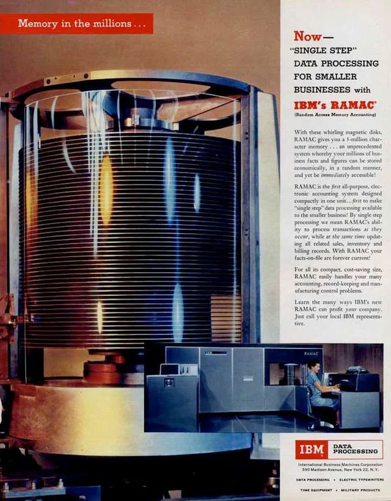

# 1. Historique des bases de données

Au fil du temps, les systèmes de gestion de bases de données (SGBD) ont évolué à travers plusieurs modèles clés. Voici une frise chronologique des grandes étapes de leur histoire :

* **Années 1950-1960 - Premières stockages informatisés :** Les premiers disques durs apparaissent en 1956, rendant possible le stockage de données sur ordinateur
data-bird.co
. Le terme « base de données » (Data Base) est inventé en 1964 pour décrire une collection d’informations partagée dans un système militaire
data-bird.co
. Vers 1960 émergent les bases de données hiérarchiques, organisées en arborescences de dossiers parent/enfant
data-bird.co
. Peu après, un modèle réseau (CODASYL) est proposé (notamment par Charles Bachman) où les enregistrements forment un graphe plus flexible que la hiérarchie pure
quickbase.com
. Un exemple marquant de cette époque est le système SABRE d’IBM pour les réservations d’avion (American Airlines), qui connut un grand succès commercial
quickbase.com

* **Années 1970 – Naissance du relationnel :** En 1970, Edgar F. Codd publie une thèse révolutionnaire qui jette les bases des bases de données relationnelles
data-bird.co
quickbase.com
. Son idée majeure est de séparer le schéma logique des données de leur stockage physique
quickbase.com
. Les données sont organisées en tables reliées par des relations mathématiques, ce qui apporte flexibilité et rigueur. Entre 1974 et 1977, les premiers prototypes de SGBD relationnels voient le jour, comme System R (IBM, qui introduit le langage SEQUEL, ancêtre du SQL) et Ingres (Université de Berkeley)
quickbase.com
. En 1976, le modèle entité-association (diagramme E/R) est proposé par Peter Chen, facilitant la conception de schémas en se focalisant sur les entités et leurs relations
quickbase.com

* **Années 1980 – Standardisation et essor :** Le langage SQL (Structured Query Language) est normalisé en 1986-87 et devient le standard universel pour interroger les bases relationnelles
quickbase.com
. Les SGBD relationnels explosent commercialement, éclipsant progressivement les anciens modèles hiérarchiques et réseau
quickbase.com
. IBM lance DB2, Oracle commercialise son SGBDR (Oracle v2 en 1979), suivis par d’autres (Informix, Sybase, etc.). Les PC se généralisant, apparaissent des SGBD pour micro-ordinateurs (dBase, Paradox, etc.)
quickbase.com
. En fin de décennie, on expérimente aussi des bases orientées objet (intégrant les concepts de programmation objet dans le stockage)
data-bird.co

* **Années 1990 – Démocratisation & web :** L’essor d’Internet et des applications client-serveur fait exploser les besoins en bases de données en réseau
quickbase.com
. Les SGBD open-source comme MySQL et PostgreSQL apparaissent et se diffusent. On perfectionne les outils de requêtage (ODBC, outils décisionnels OLAP, etc.). On assiste aussi aux premiers pas des bases NoSQL : en 1998, Carlo Strozzi nomme « NoSQL » une base qu’il propose (bien que relationnelle)
quickbase.com
– le terme sera vraiment repris en 2009 lors d’un événement consacré aux bases non-relationnelles, marquant le début de la popularisation de NoSQL moderne
quickbase.com

* **Années 2000 – Big Data et NoSQL :** À partir de 2005 environ, les géants du web (Google, Amazon, Facebook) font face à des volumes de données colossaux et à des besoins de haute disponibilité. Ils développent de nouvelles bases NoSQL optimisées pour la scalabilité horizontale et les données non structurées (ex : BigTable de Google en 2004, Dynamo d’Amazon en 2007, Cassandra, MongoDB…)
data-bird.co
. Le terme NoSQL en vient à désigner un ensemble de systèmes “pas seulement SQL” offrant plus de flexibilité. En parallèle, les SGBD relationnels restent très utilisés et évoluent (meilleure partitionnement des données, réplication, etc.).

* **Années 2010-2020 – Diversification et cloud :** Le paysage se diversifie avec des SGBD spécialisés (colonnes, graphes, mémoire in-memory, NewSQL combinant SQL et scalabilité). Le cloud rend les bases de données accessibles en mode service (DBaaS). En 2020, on parle même de bases de données autonomes (auto-administration grâce à l’IA)
data-bird.co
. Aujourd’hui, les bases de données sont omniprésentes : des services cloud personnels aux applications mobiles, en passant par l’IoT. Les SGBD relationnels classiques (Oracle, MySQL/MariaDB, PostgreSQL, SQL Server…) cohabitent avec des solutions NoSQL (MongoDB, Cassandra, Firebase, etc.), chacune ayant ses avantages pour des cas d’usage spécifiques.

> À savoir : Les premiers systèmes de gestion (années 60) liaient étroitement données et programmes, ce qui rendait les modifications coûteuses. L’avènement du modèle relationnel a introduit l’indépendance des données (schéma logique séparé du stockage physique), une avancée fondamentale qui perdure
quickbase.com
. Cette idée de Codd permet d’adapter la structure sans réécrire toutes les applications, et a ouvert la voie aux SGBD modernes.
