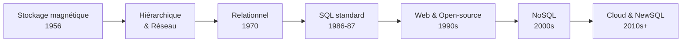
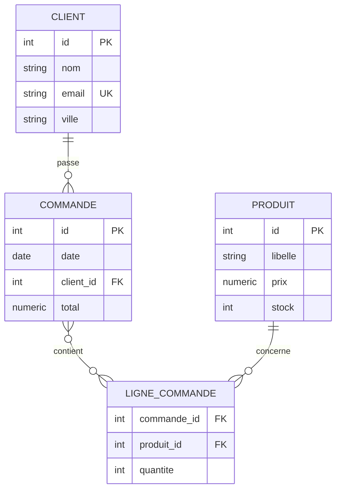
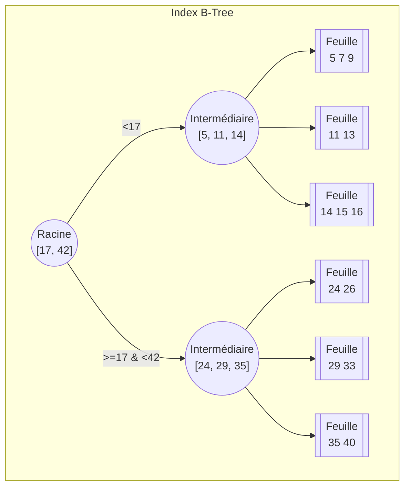
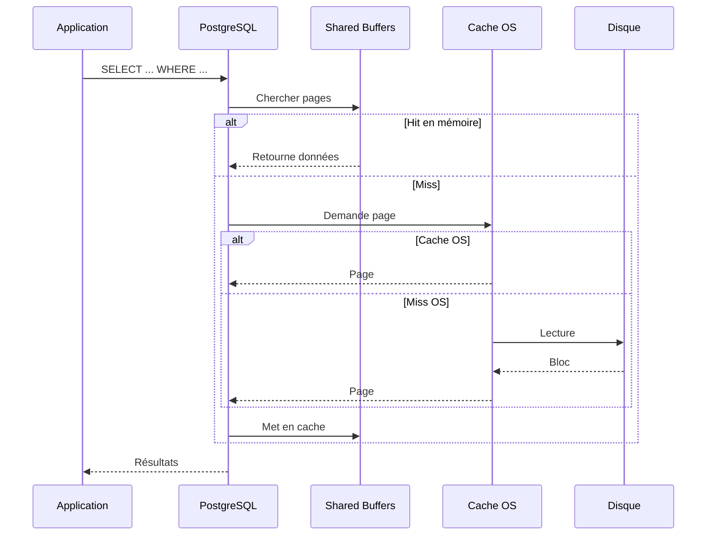

# Rappel des épisodes précédents - Séance 1

## 📚 Résumé de la Séance 1 : Fondamentaux & découverte des bases

Bienvenue à la Séance 2 ! Avant de plonger dans les requêtes SQL avancées et la base de données CRM, faisons un rappel des concepts essentiels vus lors de la première séance.

---

## 🕰️ 1. Histoire des bases de données

### Les grandes étapes

**Années 1950-1960 : Les débuts**
- 1956 : Premier disque dur IBM 350 (RAMAC) - stockage magnétique
- 1964 : Invention du terme "base de données" (Data Base)
- Modèles hiérarchiques (arborescences parent/enfant)
- Modèles réseau (CODASYL) - graphes plus flexibles
- Exemple marquant : SABRE d'IBM pour les réservations aériennes

**Années 1970 : La révolution relationnelle**
- 1970 : Edgar F. Codd publie sa thèse sur le modèle relationnel
- Innovation majeure : séparation du schéma logique et du stockage physique
- 1974-1977 : Premiers prototypes (System R d'IBM, Ingres de Berkeley)
- 1976 : Modèle entité-association (E/R) de Peter Chen

**Années 1980 : Standardisation**
- 1986-87 : SQL devient une norme ANSI/ISO
- Explosion commerciale des SGBD relationnels (Oracle, DB2, Informix)
- Apparition de SGBD pour micro-ordinateurs (dBase, Paradox)
- Propriétés ACID pour garantir la fiabilité des transactions

**Années 1990 : Démocratisation**
- Essor d'Internet et des applications client-serveur
- Apparition des SGBD open-source (MySQL, PostgreSQL)
- Outils décisionnels OLAP
- Premiers pas du NoSQL (terme créé en 1998)

**Années 2000 : Big Data et NoSQL**
- 2004-2007 : Google BigTable, Amazon Dynamo
- 2009 : Popularisation du terme "NoSQL"
- Réponse aux besoins de scalabilité horizontale
- Bases optimisées pour données non structurées

**Années 2010-2020 : Cloud et diversification**
- Bases de données en mode service (DBaaS)
- NewSQL : combinaison de SQL et scalabilité
- Bases spécialisées (colonnes, graphes, in-memory)
- 2020 : Bases autonomes avec IA

### Points clés à retenir



> 💡 **L'innovation de Codd** : L'indépendance des données (schéma logique séparé du stockage physique) a permis d'adapter la structure sans réécrire les applications - une avancée fondamentale qui perdure aujourd'hui.

---

## 🏗️ 2. Fondations techniques des SGBD relationnels

### 2.1 Tables, lignes et colonnes

**Concept de base** :
- Une **table** = une entité (Clients, Produits, Commandes)
- Une **ligne** = un enregistrement (un client spécifique)
- Une **colonne** = un attribut (nom, email, prix)

**Exemple** :
```
Table : Client
┌────┬──────────┬─────────────────────┬────────┐
│ id │   nom    │       email         │ ville  │
├────┼──────────┼─────────────────────┼────────┤
│ 1  │ Alice    │ alice@example.com   │ Paris  │
│ 2  │ Bob      │ bob@example.com     │ Lyon   │
│ 3  │ Charlie  │ charlie@example.com │ Paris  │
└────┴──────────┴─────────────────────┴────────┘
```

### 2.2 Clés primaires et étrangères

**Clé primaire (PK)** :
- Identifie de manière unique chaque enregistrement
- Souvent un ID numérique auto-incrémenté (SERIAL)
- Ne peut pas être NULL
- Doit être unique

**Clé étrangère (FK)** :
- Référence la clé primaire d'une autre table
- Crée des liens entre tables
- Garantit l'intégrité référentielle
- Exemple : `client_id` dans la table Commandes pointe vers `id` dans la table Clients



### 2.3 Index et B-arbres

**Pourquoi les index ?**
- Accélèrent la recherche de données
- Fonctionnent comme un annuaire ou une table des matières
- Implémentés sous forme d'arbres B (B-Tree) équilibrés

**Arbre B (B-Tree)** :
- Structure arborescente multi-étages
- Chaque nœud contient plusieurs clés triées
- Hauteur minimale grâce au rééquilibrage automatique
- Recherche en temps logarithmique O(log n)



**⚠️ Attention** :
- Indexer tout dégrade les performances en écriture
- Choisir prudemment les colonnes à indexer
- Se concentrer sur les clés et champs fréquemment filtrés

### 2.4 Stockage physique et pages

**Concept** :
- Les données sont stockées en **pages** (blocs) sur disque
- Les SGBD chargent et écrivent par pages entières
- Mécanisme de **buffer** : pages en mémoire pour optimiser les I/O
- Les index minimisent le nombre de pages à parcourir

**Flux de lecture** :


### 2.5 Schéma conceptuel et normalisation

**Modèle entité-association** :
- Identifier les **entités** (futures tables)
- Définir les **attributs** de chaque entité
- Établir les **relations** entre entités (1:N, N:N)

**Normalisation** :
- Évite les doublons et redondances
- Garantit l'intégrité et la cohérence
- Prévient les anomalies d'insertion, suppression, mise à jour
- Généralement jusqu'à la 3ème forme normale (3NF)

**Exemple de relations** :
- Client → Commande : relation 1:N (un client peut avoir plusieurs commandes)
- Commande → Produit : relation N:N (via table d'association LigneCommande)

---

## 🗂️ 3. Notion : Modélisation simple

### Concepts clés de Notion

**Base de données Notion** :
- Collection de pages avec propriétés communes
- Chaque ligne = une page avec contenu riche
- Propriétés = colonnes (texte, nombre, date, sélection, etc.)

### Types de propriétés principales

| Type | Usage | Exemple |
|------|-------|---------|
| **Titre** | Nom principal | "Projet Alpha" |
| **Texte** | Description | "Description du projet" |
| **Nombre** | Valeurs numériques | Budget: 15000 |
| **Sélection** | Choix unique | Statut: "En cours" |
| **Multi-sélection** | Choix multiples | Tags: "Urgent", "Client" |
| **Date** | Dates et heures | Échéance: 15/12/2024 |
| **Personne** | Assignation | @Marie Dupont |
| **Case à cocher** | Booléen | ☑️ Terminé |

### Vues de base de données

- **📋 Table** : Vue classique en lignes/colonnes
- **📌 Tableau** : Kanban par statut
- **📅 Calendrier** : Planning par dates
- **📜 Liste** : Vue simplifiée verticale
- **🖼️ Galerie** : Cartes visuelles
- **⏳ Chronologie** : Diagramme de Gantt

### Relations et Rollups

**Relations** (équivalent des FK en SQL) :
- Créer des liens entre bases de données
- Bidirectionnelles automatiquement
- Plusieurs éléments possibles

**Rollups** (équivalent des agrégations) :
- Prérequis : avoir une relation existante
- Fonctions : Count, Sum, Average, Min, Max
- Exemple : Compter le nombre de tâches par projet

### Filtres, Tris et Groupes

**Filtres** (équivalent WHERE) :
- Texte : contient, ne contient pas, est vide
- Nombre : =, ≠, >, <, ≥, ≤
- Date : avant, après, cette semaine

**Tris** (équivalent ORDER BY) :
- Croissant (A→Z, 1→9)
- Décroissant (Z→A, 9→1)

**Groupes** (équivalent GROUP BY) :
- Regrouper par Sélection, Personne, Date
- Affichage en sections avec compteurs

---

## 💻 4. Introduction à SQL avec PostgreSQL

### 4.1 Docker : Environnement standardisé

**Qu'est-ce que Docker ?**
- Plateforme de conteneurisation
- Empaquette application + dépendances
- Conteneurs légers et portables
- Partage le noyau de l'OS hôte

**Avantages** :
- Environnement identique pour tous
- Pas de "ça marche sur ma machine"
- Déploiement simplifié
- Isolation des applications

**Conteneurs vs VMs** :
- Conteneurs : légers (quelques Mo), démarrage rapide (secondes)
- VMs : lourdes (plusieurs Go), démarrage lent (minutes)

### 4.2 Notre stack technique

**Services déployés** :
- **PostgreSQL** : Serveur de base de données (port 5432)
- **pgAdmin** : Interface web d'administration (port 8080)
- **Metabase** : Outil de visualisation (port 3000)

**Commandes Docker essentielles** :
```bash
# Démarrer l'environnement
docker compose -p master up -d

# Vérifier les services
docker compose -p master ps

# Voir les logs
docker compose -p master logs -f

# Arrêter l'environnement
docker compose -p master down

# Réinitialiser complètement
docker compose -p master down -v
docker compose -p master up -d
```

### 4.3 Langage SQL : Les bases

**DDL (Data Definition Language)** - Structure :
```sql
-- Créer une table
CREATE TABLE Client (
    client_id SERIAL PRIMARY KEY,
    nom VARCHAR(100) NOT NULL,
    email VARCHAR(255) UNIQUE,
    ville VARCHAR(50)
);

-- Modifier une table
ALTER TABLE Client ADD COLUMN age INT;

-- Supprimer une table
DROP TABLE Client;

-- Créer un index
CREATE INDEX idx_client_ville ON Client(ville);
```

**DML (Data Manipulation Language)** - Données :
```sql
-- Insérer des données
INSERT INTO Client(nom, email, ville)
VALUES ('Alice', 'alice@example.com', 'Paris');

-- Mettre à jour
UPDATE Client SET ville='Marseille' WHERE nom='Alice';

-- Supprimer
DELETE FROM Client WHERE client_id=5;
```

**⚠️ Attention** : Toujours utiliser WHERE avec UPDATE et DELETE !

### 4.4 Requêtes SELECT : Interroger les données

**Requête simple** :
```sql
-- Tout sélectionner
SELECT * FROM Client;

-- Colonnes spécifiques
SELECT nom, ville FROM Client;

-- Avec filtre
SELECT nom, ville FROM Client WHERE ville='Paris';

-- Avec tri
SELECT * FROM Client ORDER BY nom ASC;

-- Limiter les résultats
SELECT * FROM Produit ORDER BY prix DESC LIMIT 5;
```

**Jointures** :
```sql
-- INNER JOIN : correspondances uniquement
SELECT Commande.id, Client.nom, Commande.total
FROM Commande
JOIN Client ON Commande.client_id = Client.client_id;

-- LEFT JOIN : toutes les lignes de gauche
SELECT Client.nom, Commande.id
FROM Client
LEFT JOIN Commande ON Commande.client_id = Client.client_id;
```

**Agrégations** :
```sql
-- Compter
SELECT COUNT(*) FROM Client;

-- Grouper et compter
SELECT ville, COUNT(*) as nb_clients
FROM Client
GROUP BY ville;

-- Avec filtre sur agrégat
SELECT ville, COUNT(*) as nb_clients
FROM Client
GROUP BY ville
HAVING COUNT(*) > 5;
```

---

## 🎯 Ce qu'on a appris

### Concepts théoriques
✅ Histoire des bases de données (des années 50 à aujourd'hui)
✅ Modèle relationnel et ses avantages
✅ Tables, clés primaires et étrangères
✅ Index et arbres B pour les performances
✅ Normalisation et intégrité des données

### Outils pratiques
✅ Notion pour la modélisation simple
✅ Docker pour l'environnement standardisé
✅ PostgreSQL comme SGBD relationnel
✅ pgAdmin et Metabase pour l'interface

### SQL de base
✅ DDL : CREATE, ALTER, DROP
✅ DML : INSERT, UPDATE, DELETE
✅ SELECT : filtres, tris, jointures
✅ Agrégations : COUNT, SUM, AVG, GROUP BY

---

## 🚀 Pour la Séance 2

Maintenant que les fondamentaux sont en place, nous allons :

1. **Travailler sur une base réelle** : `exemple_crm`
   - 7 tables interconnectées
   - 400+ enregistrements
   - Données cohérentes et réalistes

2. **Pratiquer les requêtes SQL** :
   - Requêtes simples et complexes
   - Jointures multiples
   - Analyses de données métier

3. **Résoudre des problèmes concrets** :
   - Chiffre d'affaires par client
   - Produits les plus vendus
   - Factures en retard
   - Taux de conversion

**Documentation disponible** :
- [Schéma de la base CRM](2_2_shema_base_crm.md) - Diagrammes et descriptions
- [Exercices pratiques](2_3_exercices_crm.md) - 15+ exercices avec solutions

---

**Prêt pour la suite ? Allons-y ! 💪**
