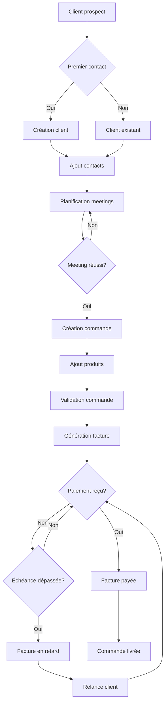
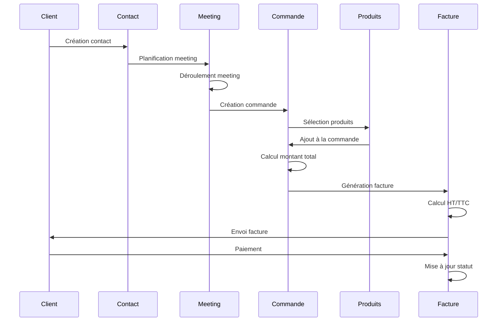
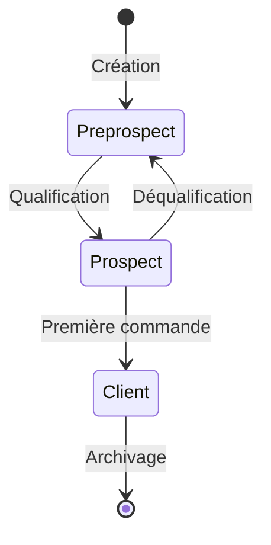
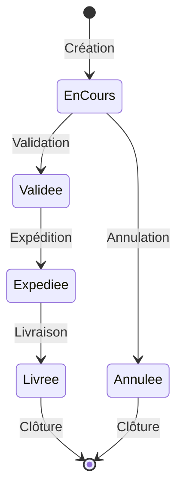
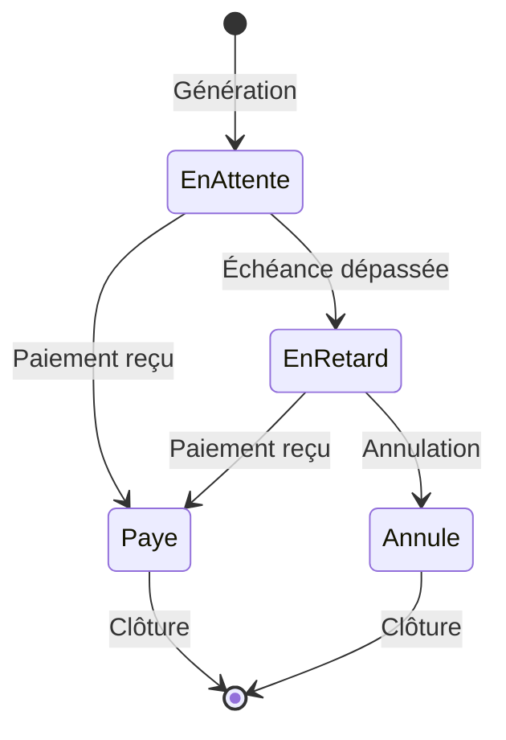
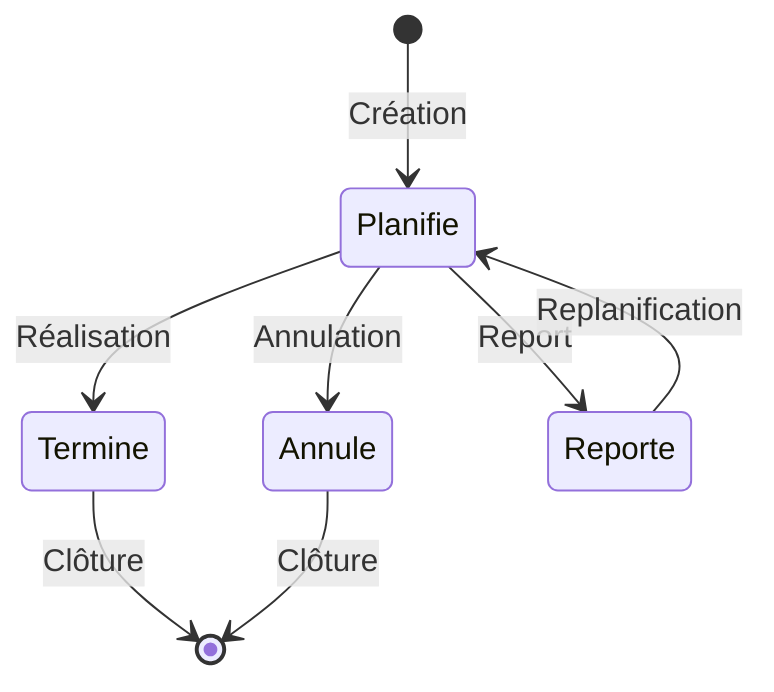

# Schéma de la base de données CRM

## 📋 Vue d'ensemble

La base de données `exemple_crm` est un système complet de gestion de la relation client (Customer Relationship Management) qui permet de gérer :
- Les entreprises clientes et leurs contacts
- Les rendez-vous commerciaux
- Le catalogue de produits et services
- Les commandes et leur facturation

## 🗺️ Schéma relationnel complet

```mermaid
erDiagram
    clients ||--o{ contacts : "possède"
    clients ||--o{ commandes : "passe"
    contacts ||--o{ meetings : "participe à"
    commandes ||--o{ commandes_produits : "contient"
    produits ||--o{ commandes_produits : "est commandé dans"
    commandes ||--o| factures : "génère"

    clients {
        int id PK
        varchar nom
        varchar email UK
        varchar telephone
        text adresse
        varchar type_client
        timestamp date_creation
        timestamp date_modification
    }

    contacts {
        int id PK
        int client_id FK
        varchar prenom
        varchar nom
        varchar email
        varchar telephone
        varchar poste
        timestamp date_creation
    }

    meetings {
        int id PK
        int contact_id FK
        varchar titre
        text description
        timestamp date_meeting
        int duree_minutes
        varchar statut
        timestamp date_creation
    }

    produits {
        int id PK
        varchar nom
        text description
        decimal prix_unitaire
        int stock
        varchar categorie
        timestamp date_creation
    }

    commandes {
        int id PK
        int client_id FK
        timestamp date_commande
        varchar statut
        decimal montant_total
        timestamp date_creation
    }

    commandes_produits {
        int id PK
        int commande_id FK
        int produit_id FK
        int quantite
        decimal prix_unitaire
    }

    factures {
        int id PK
        int commande_id FK
        varchar numero_facture UK
        timestamp date_facture
        timestamp date_echeance
        decimal montant_ht
        decimal montant_ttc
        decimal tva
        varchar statut_paiement
        timestamp date_creation
    }
```



## 📊 Diagramme de flux : Cycle de vie d'une commande



## 🔄 Diagramme de séquence : Processus de commande



## 📈 Diagramme d'état : Statuts des entités

### Statuts des clients



### Statuts des commandes



### Statuts des factures



### Statuts des meetings



## 📋 Description détaillée des tables

### Table `clients`

**Rôle** : Stocke les informations sur les entreprises clientes.

**Colonnes** :
- `id` : Identifiant unique auto-incrémenté
- `nom` : Nom de l'entreprise (obligatoire)
- `email` : Email de contact (unique, obligatoire)
- `telephone` : Numéro de téléphone
- `adresse` : Adresse complète de l'entreprise
- `type_client` : Type de client avec contrainte CHECK
  - `preprospect` : Contact initial, non qualifié
  - `prospect` : Contact qualifié, en cours de négociation
  - `client` : Client actif ayant passé au moins une commande
- `date_creation` : Date de création automatique
- `date_modification` : Date de dernière modification automatique

**Index** :
- `idx_clients_type_client` : Optimise les recherches par type
- `idx_clients_email` : Optimise les recherches par email

**Données** : 20 clients (5 préprospects, 8 prospects, 7 clients)

### Table `contacts`

**Rôle** : Stocke les personnes de contact au sein des entreprises.

**Colonnes** :
- `id` : Identifiant unique auto-incrémenté
- `client_id` : Référence au client (clé étrangère avec CASCADE)
- `prenom` : Prénom du contact (obligatoire)
- `nom` : Nom du contact (obligatoire)
- `email` : Email du contact (obligatoire)
- `telephone` : Téléphone du contact
- `poste` : Fonction dans l'entreprise
- `date_creation` : Date de création automatique

**Relations** :
- Appartient à un client (N:1)
- Peut avoir plusieurs meetings (1:N)

**Index** :
- `idx_contacts_client_id` : Optimise les jointures avec clients
- `idx_contacts_email` : Optimise les recherches par email

**Données** : 44 contacts (1 à 5 par client)

### Table `meetings`

**Rôle** : Stocke les rendez-vous commerciaux avec les contacts.

**Colonnes** :
- `id` : Identifiant unique auto-incrémenté
- `contact_id` : Référence au contact (clé étrangère avec CASCADE)
- `titre` : Titre du rendez-vous (obligatoire)
- `description` : Description détaillée
- `date_meeting` : Date et heure du rendez-vous (obligatoire)
- `duree_minutes` : Durée en minutes (défaut: 60, > 0)
- `statut` : Statut avec contrainte CHECK
  - `planifie` : Rendez-vous à venir
  - `termine` : Rendez-vous effectué
  - `annule` : Rendez-vous annulé
  - `reporte` : Rendez-vous reporté
- `date_creation` : Date de création automatique

**Index** :
- `idx_meetings_contact_id` : Optimise les jointures avec contacts
- `idx_meetings_date_meeting` : Optimise les recherches par date

**Données** : 50 meetings avec dates variées

### Table `produits`

**Rôle** : Catalogue des produits et services disponibles.

**Colonnes** :
- `id` : Identifiant unique auto-incrémenté
- `nom` : Nom du produit (obligatoire)
- `description` : Description détaillée
- `prix_unitaire` : Prix unitaire (≥ 0, obligatoire)
- `stock` : Quantité en stock (≥ 0, défaut: 0)
- `categorie` : Catégorie du produit
- `date_creation` : Date de création automatique

**Catégories disponibles** :
- Informatique (30 produits)
- Mobilier (20 produits)
- Logiciel (15 produits)
- Fournitures (20 produits)
- Services (15 produits)

**Données** : 100 produits avec prix réalistes

### Table `commandes`

**Rôle** : Stocke les commandes passées par les clients.

**Colonnes** :
- `id` : Identifiant unique auto-incrémenté
- `client_id` : Référence au client (clé étrangère avec RESTRICT)
- `date_commande` : Date de la commande (défaut: maintenant)
- `statut` : Statut avec contrainte CHECK
  - `en_cours` : Commande en préparation
  - `validee` : Commande validée
  - `expediee` : Commande expédiée
  - `livree` : Commande livrée
  - `annulee` : Commande annulée
- `montant_total` : Montant total (≥ 0, défaut: 0)
- `date_creation` : Date de création automatique

**Relations** :
- Appartient à un client (N:1)
- Contient plusieurs produits via commandes_produits (N:N)
- Peut avoir une facture (1:1)

**Index** :
- `idx_commandes_client_id` : Optimise les jointures avec clients
- `idx_commandes_date_commande` : Optimise les recherches par date

**Données** : 40 commandes avec différents statuts

### Table `commandes_produits`

**Rôle** : Table de liaison entre commandes et produits (relation many-to-many).

**Colonnes** :
- `id` : Identifiant unique auto-incrémenté
- `commande_id` : Référence à la commande (clé étrangère avec CASCADE)
- `produit_id` : Référence au produit (clé étrangère avec RESTRICT)
- `quantite` : Quantité commandée (> 0, obligatoire)
- `prix_unitaire` : Prix unitaire au moment de la commande (≥ 0, obligatoire)

**Note** : Le prix est stocké ici pour conserver l'historique, même si le prix du produit change.

**Index** :
- `idx_commandes_produits_commande_id` : Optimise les jointures avec commandes
- `idx_commandes_produits_produit_id` : Optimise les jointures avec produits

**Données** : 120 lignes (plusieurs produits par commande)

### Table `factures`

**Rôle** : Stocke les factures liées aux commandes.

**Colonnes** :
- `id` : Identifiant unique auto-incrémenté
- `commande_id` : Référence à la commande (clé étrangère avec RESTRICT)
- `numero_facture` : Numéro unique (format: FAC-YYYY-NNNN)
- `date_facture` : Date d'émission (défaut: maintenant)
- `date_echeance` : Date limite de paiement (obligatoire)
- `montant_ht` : Montant hors taxes (≥ 0, obligatoire)
- `montant_ttc` : Montant toutes taxes comprises (≥ 0, obligatoire)
- `tva` : Taux de TVA en % (≥ 0, défaut: 20.00)
- `statut_paiement` : Statut avec contrainte CHECK
  - `en_attente` : En attente de paiement
  - `paye` : Facture payée
  - `en_retard` : Paiement en retard
  - `annule` : Facture annulée
- `date_creation` : Date de création automatique

**Index** :
- `idx_factures_commande_id` : Optimise les jointures avec commandes
- `idx_factures_statut_paiement` : Optimise les recherches par statut

**Données** : 15 factures avec statuts variés

## 🔍 Requêtes SQL utiles

### Statistiques générales

```sql
-- Nombre d'entités par table
SELECT 
    'Clients' as table_name, COUNT(*) as total FROM clients
UNION ALL SELECT 'Contacts', COUNT(*) FROM contacts
UNION ALL SELECT 'Meetings', COUNT(*) FROM meetings
UNION ALL SELECT 'Produits', COUNT(*) FROM produits
UNION ALL SELECT 'Commandes', COUNT(*) FROM commandes
UNION ALL SELECT 'Factures', COUNT(*) FROM factures;
```

### Analyse des clients

```sql
-- Répartition des clients par type
SELECT type_client, COUNT(*) as nombre
FROM clients
GROUP BY type_client
ORDER BY nombre DESC;

-- Clients avec le plus de contacts
SELECT c.nom, COUNT(co.id) as nb_contacts
FROM clients c
LEFT JOIN contacts co ON c.id = co.client_id
GROUP BY c.id, c.nom
ORDER BY nb_contacts DESC
LIMIT 10;
```

### Analyse des ventes

```sql
-- Chiffre d'affaires par client
SELECT 
    cl.nom,
    cl.type_client,
    COUNT(cmd.id) as nb_commandes,
    SUM(cmd.montant_total) as ca_total
FROM clients cl
LEFT JOIN commandes cmd ON cl.id = cmd.client_id
GROUP BY cl.id, cl.nom, cl.type_client
ORDER BY ca_total DESC;

-- Produits les plus vendus
SELECT 
    p.nom,
    p.categorie,
    SUM(cp.quantite) as quantite_totale,
    SUM(cp.quantite * cp.prix_unitaire) as ca_produit
FROM produits p
JOIN commandes_produits cp ON p.id = cp.produit_id
GROUP BY p.id, p.nom, p.categorie
ORDER BY quantite_totale DESC
LIMIT 10;
```

## 💡 Cas d'usage pédagogiques

Cette base de données permet d'enseigner :

1. **Requêtes simples** : SELECT, WHERE, ORDER BY
2. **Jointures** : INNER JOIN, LEFT JOIN, RIGHT JOIN
3. **Agrégations** : COUNT, SUM, AVG, GROUP BY, HAVING
4. **Sous-requêtes** : IN, EXISTS, sous-requêtes corrélées
5. **Fonctions de fenêtrage** : ROW_NUMBER, RANK, PARTITION BY
6. **Transactions** : BEGIN, COMMIT, ROLLBACK
7. **Contraintes** : PRIMARY KEY, FOREIGN KEY, CHECK, UNIQUE
8. **Index** : Création et utilisation
9. **Vues** : Création de vues métier
10. **Procédures stockées** : Automatisation de traitements

## 📚 Ressources complémentaires

- Fichier source : `docker-configuration/postgres/01-create-databases.sql`
- Documentation complète : `README_CRM.md`
- Accès pgAdmin : http://localhost:8080 (admin@example.com / admin123)

