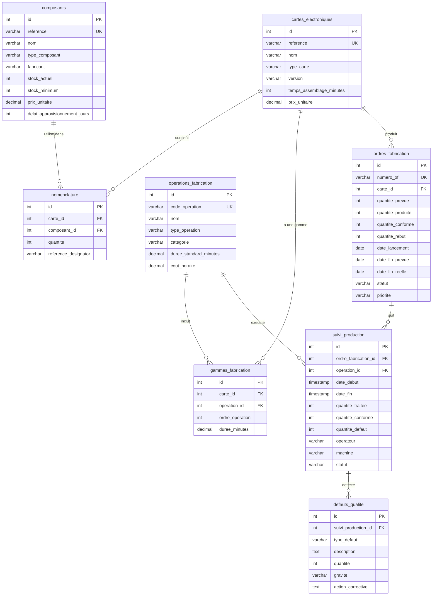

# Exercices SQL - Base de données Production Électronique

## 1. Introduction

### Contexte métier

La base de données `exemple_production_electronique` modélise un système de gestion de production pour une usine d'assemblage de cartes électroniques. Cette base couvre l'ensemble du cycle de production, de la planification à la livraison finale.

### Processus métier couverts

- **Gestion de nomenclature (BOM)** : Définition des composants nécessaires pour chaque carte
- **Planification de production** : Création et suivi des ordres de fabrication
- **Gammes opératoires** : Séquences d'opérations pour assembler chaque carte
- **Suivi de production** : Traçabilité opération par opération
- **Contrôle qualité** : Détection et suivi des défauts
- **Gestion des stocks** : Suivi des composants électroniques

### Environnement de production

L'usine utilise un mix de **chaînes automatisées** (placement CMS, four de refusion, AOI) et d'**opérations manuelles** (insertion de composants traversants, inspection visuelle, conditionnement). Chaque carte électronique passe par 12 à 14 opérations avant d'être livrée.

## 2. Schéma de la base de données

### Description des tables

#### `cartes_electroniques`
Catalogue des 8 types de cartes électroniques produites par l'usine.
- **Champs clés** : `reference`, `nom`, `type_carte`, `version`, `prix_unitaire`
- **Types de cartes** : contrôle, alimentation, communication, interface, capteur, processeur, mémoire, affichage

#### `composants`
Catalogue des composants électroniques (résistances, condensateurs, circuits intégrés, etc.).
- **Champs clés** : `reference`, `nom`, `type_composant`, `fabricant`, `stock_actuel`, `stock_minimum`, `prix_unitaire`
- **Types** : resistance, condensateur, transistor, circuit_integre, connecteur, led, diode, inductance, cristal, relais

#### `nomenclature`
Table de liaison définissant la nomenclature (BOM - Bill of Materials) de chaque carte.
- **Champs clés** : `carte_id`, `composant_id`, `quantite`, `reference_designator`
- **Relation** : Une carte contient plusieurs composants, un composant peut être utilisé dans plusieurs cartes

#### `operations_fabrication`
Catalogue des opérations de fabrication disponibles dans l'usine.
- **Champs clés** : `code_operation`, `nom`, `type_operation` (automatique/manuelle), `categorie`, `duree_standard_minutes`, `cout_horaire`
- **Catégories** : assemblage_cms, soudure_refusion, test_electrique, inspection_visuelle, etc.

#### `gammes_fabrication`
Séquence d'opérations nécessaires pour fabriquer chaque type de carte.
- **Champs clés** : `carte_id`, `operation_id`, `ordre_operation`, `duree_minutes`
- **Relation** : Définit le routage de production pour chaque carte

#### `ordres_fabrication`
Ordres de production lancés (historique de 3 mois : avril-juin 2024).
- **Champs clés** : `numero_of`, `carte_id`, `quantite_prevue`, `quantite_produite`, `quantite_conforme`, `quantite_rebut`, `date_lancement`, `statut`, `priorite`
- **Statuts** : planifie, en_cours, termine, suspendu, annule

#### `suivi_production`
Suivi détaillé de la production, opération par opération.
- **Champs clés** : `ordre_fabrication_id`, `operation_id`, `date_debut`, `date_fin`, `quantite_traitee`, `quantite_conforme`, `quantite_defaut`, `operateur`, `machine`
- **Relation** : Traçabilité complète de chaque ordre de fabrication

#### `defauts_qualite`
Défauts détectés lors de la production.
- **Champs clés** : `suivi_production_id`, `type_defaut`, `description`, `quantite`, `gravite`, `action_corrective`
- **Gravités** : mineure, moyenne, majeure, critique

### Diagramme Entité-Relations (ERD)



## 3. Vue d'ensemble des données

### Données de référence

- **8 cartes électroniques** différentes (contrôleur, alimentation, communication, interface, capteurs, processeur, mémoire, affichage)
- **50 composants électroniques** (résistances, condensateurs, circuits intégrés, connecteurs, LEDs, etc.)
- **15 opérations de fabrication** (10 automatiques, 5 manuelles)

### Nomenclatures (BOM)

Chaque carte contient entre **15 et 30 composants** différents :
- Carte Contrôleur Principal : 28 composants
- Carte Alimentation : 22 composants
- Carte Communication : 25 composants
- Carte Interface Utilisateur : 18 composants
- Carte Acquisition Capteurs : 30 composants
- Carte Processeur Industriel : 24 composants
- Carte Extension Mémoire : 15 composants
- Carte Affichage LED : 20 composants

**Composants partagés** : De nombreux composants (résistances 10kΩ, condensateurs 100nF, MCU STM32F4, etc.) sont utilisés dans plusieurs cartes, reflétant une stratégie de standardisation.

### Historique de production

- **65 ordres de fabrication** sur 3 mois (avril-juin 2024)
- **60 ordres terminés**, 2 en cours, 3 planifiés
- Quantités produites : de 100 à 650 unités par ordre
- Taux de conformité moyen : **98-99%**
- **20 défauts qualité** enregistrés avec actions correctives

### Workflow de fabrication

Chaque carte suit une gamme opératoire de 12-14 étapes :
1. Sérigraphie pâte à souder (automatique)
2. Placement composants CMS (automatique)
3. Four de refusion (automatique)
4. Inspection AOI (automatique)
5. Insertion composants traversants (manuelle)
6. Soudure à la vague (automatique)
7. Nettoyage (automatique)
8. Inspection visuelle (manuelle)
9. Test électrique ICT (automatique)
10. Programmation firmware (automatique)
11. Test fonctionnel (automatique)
12. Découpe panneaux (automatique)
13. Conditionnement (manuelle)
14. Contrôle final (manuelle)

## 4. Exercices SQL

### Niveau 1 - Débutant (Exercices 1-20)

Ces exercices portent sur des requêtes simples avec SELECT, WHERE, ORDER BY et LIMIT sur une seule table.

#### Exercice 1
Lister toutes les cartes électroniques avec leur référence, nom et prix unitaire.

#### Exercice 2
Afficher tous les composants de type 'resistance' triés par prix unitaire croissant.

#### Exercice 3
Trouver les 5 composants les plus chers de la base de données.

#### Exercice 4
Lister les opérations de fabrication de type 'automatique' triées par durée standard décroissante.

#### Exercice 5
Afficher les cartes électroniques de type 'controle' ou 'processeur'.

#### Exercice 6
Trouver tous les composants dont le stock actuel est inférieur au stock minimum.

#### Exercice 7
Lister les ordres de fabrication avec le statut 'termine' lancés en avril 2024.

#### Exercice 8
Afficher les 10 premiers composants triés par nom alphabétique.

#### Exercice 9
Trouver les opérations de fabrication dont le coût horaire est supérieur à 50€.

#### Exercice 10
Lister les cartes électroniques dont le temps d'assemblage est supérieur à 40 minutes.

#### Exercice 11
Afficher tous les ordres de fabrication avec une priorité 'urgente'.

#### Exercice 12
Trouver les composants du fabricant 'Texas Instruments'.

#### Exercice 13
Lister les opérations de la catégorie 'test_electrique' ou 'test_fonctionnel'.

#### Exercice 14
Afficher les cartes électroniques dont le prix unitaire est entre 100€ et 200€.

#### Exercice 15
Trouver les ordres de fabrication où la quantité de rebut est supérieure à 5.

#### Exercice 16
Lister les composants de type 'circuit_integre' avec un délai d'approvisionnement supérieur à 14 jours.

#### Exercice 17
Afficher les 3 cartes électroniques les plus chères.

#### Exercice 18
Trouver tous les défauts qualité de gravité 'critique'.

#### Exercice 19
Lister les opérations manuelles triées par coût horaire.

#### Exercice 20
Afficher les ordres de fabrication lancés en juin 2024 avec le statut 'en_cours'.

### Niveau 2 - Intermédiaire (Exercices 21-40)

Ces exercices utilisent des JOINs entre 2-3 tables, des fonctions d'agrégation (COUNT, SUM, AVG) et GROUP BY.

#### Exercice 21
Compter le nombre de composants différents utilisés dans chaque carte électronique.

#### Exercice 22
Calculer le nombre total de composants (en tenant compte des quantités) pour chaque carte.

#### Exercice 23
Afficher le nombre d'ordres de fabrication par type de carte.

#### Exercice 24
Calculer la quantité totale produite pour chaque carte sur les 3 derniers mois.

#### Exercice 25
Trouver le nombre d'opérations dans la gamme de fabrication de chaque carte.

#### Exercice 26
Calculer le prix total des composants nécessaires pour fabriquer une unité de chaque carte.

#### Exercice 27
Afficher le nombre de défauts qualité par type de défaut.

#### Exercice 28
Calculer la durée totale de fabrication (somme des durées des opérations) pour chaque carte.

#### Exercice 29
Trouver les cartes qui utilisent le composant 'MCU STM32F4' (référence 'IC-MCU-STM32F4').

#### Exercice 30
Compter le nombre d'ordres de fabrication par mois (avril, mai, juin 2024).

#### Exercice 31
Calculer le taux de conformité moyen (quantite_conforme / quantite_produite) par carte.

#### Exercice 32
Afficher le nombre d'opérations automatiques vs manuelles dans chaque gamme de fabrication.

#### Exercice 33
Trouver les 5 composants les plus utilisés (présents dans le plus grand nombre de cartes différentes).

#### Exercice 34
Calculer le coût total de main d'œuvre pour fabriquer une unité de chaque carte.

#### Exercice 35
Afficher le nombre de suivis de production par opérateur.

#### Exercice 36
Calculer la quantité totale de rebut par type de carte.

#### Exercice 37
Trouver les cartes qui contiennent des composants du fabricant 'Murata'.

#### Exercice 38
Calculer le nombre moyen de composants par carte électronique.

#### Exercice 39
Afficher le nombre de défauts qualité par gravité (mineure, moyenne, majeure, critique).

#### Exercice 40
Calculer la durée moyenne des opérations automatiques vs manuelles.

### Niveau 3 - Avancé (Exercices 41-60)

Ces exercices utilisent des JOINs complexes (4+ tables), des sous-requêtes, CASE, fonctions de dates et window functions.

#### Exercice 41
Afficher pour chaque ordre de fabrication : le numéro, la carte, la quantité produite et le nombre d'opérations effectuées.

#### Exercice 42
Calculer le taux de défauts (quantite_defaut / quantite_traitee) par opération de fabrication.

#### Exercice 43
Trouver les ordres de fabrication qui ont eu des défauts de gravité 'critique'.

#### Exercice 44
Afficher les composants en rupture de stock (stock_actuel < stock_minimum) utilisés dans des cartes actuellement en production.

#### Exercice 45
Calculer le temps de production réel (date_fin - date_debut) pour chaque ordre de fabrication terminé.

#### Exercice 46
Trouver les cartes dont le taux de conformité est inférieur à 98%.

#### Exercice 47
Afficher le classement des opérations par nombre total de défauts détectés.

#### Exercice 48
Calculer le coût matière (somme des prix des composants × quantités) pour chaque carte.

#### Exercice 49
Trouver les ordres de fabrication qui ont dépassé leur date de fin prévue.

#### Exercice 50
Afficher les composants qui sont utilisés dans au moins 5 cartes différentes.

#### Exercice 51
Calculer le nombre de jours de production par mois (avril, mai, juin 2024).

#### Exercice 52
Trouver les opérations où le taux de défauts dépasse 2%.

#### Exercice 53
Afficher pour chaque carte : le nombre d'ordres, la quantité totale produite et le taux de conformité global.

#### Exercice 54
Calculer le temps moyen entre le lancement et la fin réelle des ordres de fabrication par type de carte.

#### Exercice 55
Trouver les composants de type 'circuit_integre' qui ne sont pas en stock suffisant (stock < 2 × stock_minimum).

#### Exercice 56
Afficher les 10 ordres de fabrication avec le plus grand nombre de défauts qualité.

#### Exercice 57
Calculer la productivité (quantité produite / durée totale) pour chaque ordre de fabrication terminé.

#### Exercice 58
Trouver les cartes qui n'ont jamais eu de défauts de gravité 'critique'.

#### Exercice 59
Afficher le nombre d'opérations par catégorie (assemblage_cms, test_electrique, etc.) dans toutes les gammes.

#### Exercice 60
Calculer le coût total (matière + main d'œuvre) pour produire 100 unités de chaque carte.

### Niveau 4 - Expert (Exercices 61-80)

Ces exercices utilisent des CTEs (WITH), des analyses avancées, des agrégations complexes et des requêtes de performance.

#### Exercice 61
Utiliser un CTE pour calculer le taux de conformité par carte, puis afficher uniquement celles au-dessus de la moyenne.

#### Exercice 62
Créer un rapport mensuel (avril, mai, juin) montrant la quantité produite et le taux de conformité par type de carte.

#### Exercice 63
Trouver les composants critiques : utilisés dans plus de 3 cartes ET avec un stock inférieur au stock minimum.

#### Exercice 64
Calculer le temps de cycle moyen (durée totale de production) par carte en utilisant les données de suivi_production.

#### Exercice 65
Afficher un classement des opérateurs par taux de conformité (quantite_conforme / quantite_traitee).

#### Exercice 66
Identifier les goulots d'étranglement : opérations avec la durée moyenne réelle supérieure à 120% de la durée standard.

#### Exercice 67
Calculer l'évolution mensuelle de la production (quantité produite) pour chaque type de carte.

#### Exercice 68
Trouver les ordres de fabrication avec un taux de rebut anormalement élevé (> moyenne + 2 × écart-type).

#### Exercice 69
Afficher la répartition des défauts qualité par étape de production (opération) et par gravité.

#### Exercice 70
Calculer le coût de non-qualité (rebuts × coût matière) par carte sur les 3 derniers mois.

#### Exercice 71
Identifier les composants à commander en urgence : stock actuel < 7 jours de consommation moyenne.

#### Exercice 72
Créer un tableau de bord montrant pour chaque carte : nb ordres, quantité totale, taux conformité, nb défauts, coût rebut.

#### Exercice 73
Calculer le taux d'utilisation des machines (temps de production / temps disponible) pour chaque machine.

#### Exercice 74
Trouver les combinaisons carte-opération avec le plus grand nombre de défauts.

#### Exercice 75
Afficher l'évolution hebdomadaire du taux de conformité sur les 3 derniers mois.

#### Exercice 76
Calculer le délai moyen entre la détection d'un défaut et sa correction pour chaque type de défaut.

#### Exercice 77
Identifier les cartes avec la plus grande variabilité de temps de production (écart-type élevé).

#### Exercice 78
Créer un rapport de performance par opérateur : nombre d'opérations, quantité traitée, taux de conformité.

#### Exercice 79
Calculer le coût total de production (matière + main d'œuvre + rebuts) par ordre de fabrication.

#### Exercice 80
Trouver les périodes de forte production : jours avec plus de 5 ordres de fabrication actifs simultanément.

### Niveau 5 - Maître (Exercices 81-100)

Ces exercices sont très complexes et combinent plusieurs techniques avancées : CTEs récursifs, window functions avancées, analyses BI.

#### Exercice 81
Créer une analyse de Pareto : identifier les 20% de défauts qui représentent 80% des problèmes qualité.

#### Exercice 82
Calculer le taux de rendement synthétique (TRS) pour chaque carte : disponibilité × performance × qualité.

#### Exercice 83
Utiliser une window function pour calculer la moyenne mobile sur 7 jours du taux de conformité.

#### Exercice 84
Créer une matrice de corrélation entre types de défauts et opérations de fabrication.

#### Exercice 85
Calculer le coût d'opportunité des ruptures de stock : ordres qui auraient pu être lancés mais bloqués par manque de composants.

#### Exercice 86
Identifier les séquences d'opérations problématiques : enchaînements d'opérations avec taux de défauts > 5%.

#### Exercice 87
Créer un modèle prédictif simple : estimer la probabilité de défaut en fonction du type de carte et de l'opération.

#### Exercice 88
Calculer l'efficacité globale des équipements (OEE) par machine sur les 3 derniers mois.

#### Exercice 89
Analyser la saisonnalité : comparer les performances de production par jour de la semaine.

#### Exercice 90
Créer un rapport de traçabilité complète : pour un ordre donné, afficher toutes les opérations, défauts et actions correctives.

#### Exercice 91
Calculer le coût de revient complet par carte en incluant : matière, main d'œuvre, rebuts, et coûts indirects (10% du total).

#### Exercice 92
Identifier les opportunités d'optimisation : opérations où la durée réelle est significativement inférieure à la durée standard.

#### Exercice 93
Créer une analyse ABC des composants : classer par valeur de consommation annuelle (A: 80%, B: 15%, C: 5%).

#### Exercice 94
Calculer le taux de service client : pourcentage d'ordres livrés à temps (date_fin_reelle <= date_fin_prevue).

#### Exercice 95
Analyser l'impact des défauts sur le temps de cycle : comparer le temps de production avec et sans défauts.

#### Exercice 96
Créer un tableau de bord de pilotage avec KPIs : production journalière, taux de conformité, taux de rebut, coût de non-qualité.

#### Exercice 97
Identifier les composants à double source : ceux qui devraient avoir un fournisseur alternatif (forte valeur + long délai).

#### Exercice 98
Calculer le niveau de stock optimal pour chaque composant en fonction de la consommation moyenne et du délai d'approvisionnement.

#### Exercice 99
Créer une analyse de capacité : identifier les opérations qui risquent de devenir des goulots avec l'augmentation de la production.

#### Exercice 100
Synthèse finale : créer un rapport exécutif complet avec tous les KPIs clés de l'usine sur les 3 derniers mois.

## 5. Conseils et astuces

### Pour les débutants
- Commencez par explorer les tables avec `SELECT * FROM nom_table LIMIT 10`
- Utilisez `DISTINCT` pour voir les valeurs uniques d'une colonne
- N'oubliez pas les alias de tables pour simplifier vos requêtes

### Pour les niveaux intermédiaires
- Dessinez les relations entre tables avant d'écrire vos JOINs
- Utilisez `GROUP BY` avec les fonctions d'agrégation (COUNT, SUM, AVG)
- Testez vos requêtes par étapes : d'abord le JOIN, puis l'agrégation

### Pour les niveaux avancés
- Les CTEs (WITH) rendent les requêtes complexes plus lisibles
- Les window functions (ROW_NUMBER, RANK, LAG, LEAD) sont puissantes pour les analyses
- Utilisez `EXPLAIN ANALYZE` pour optimiser les performances

### Pour les experts
- Pensez en termes de KPIs métier, pas seulement de requêtes SQL
- Combinez plusieurs techniques (CTEs + window functions + agrégations)
- Documentez vos requêtes complexes avec des commentaires

## 6. Ressources complémentaires

### Requêtes utiles pour explorer la base

```sql
-- Voir la structure d'une table
\d cartes_electroniques

-- Compter les enregistrements
SELECT COUNT(*) FROM ordres_fabrication;

-- Voir les valeurs distinctes
SELECT DISTINCT type_carte FROM cartes_electroniques;

-- Statistiques rapides
SELECT
    MIN(prix_unitaire) as prix_min,
    MAX(prix_unitaire) as prix_max,
    AVG(prix_unitaire) as prix_moyen
FROM cartes_electroniques;
```

### Exemples de requêtes complexes

```sql
-- Exemple de CTE
WITH production_mensuelle AS (
    SELECT
        DATE_TRUNC('month', date_lancement) as mois,
        carte_id,
        SUM(quantite_produite) as total_produit
    FROM ordres_fabrication
    WHERE statut = 'termine'
    GROUP BY DATE_TRUNC('month', date_lancement), carte_id
)
SELECT
    c.nom,
    pm.mois,
    pm.total_produit
FROM production_mensuelle pm
JOIN cartes_electroniques c ON pm.carte_id = c.id
ORDER BY pm.mois, c.nom;

-- Exemple de window function
SELECT
    numero_of,
    carte_id,
    quantite_produite,
    RANK() OVER (PARTITION BY carte_id ORDER BY quantite_produite DESC) as rang
FROM ordres_fabrication
WHERE statut = 'termine';
```

## 7. Conclusion

Cette base de données offre un contexte réaliste pour pratiquer SQL dans un environnement industriel. Les 100 exercices couvrent progressivement tous les aspects du langage SQL, des requêtes simples aux analyses complexes de type Business Intelligence.

**Bon courage et bonnes requêtes !** 🚀

---

## 8. Solutions détaillées

Cette section présente les solutions complètes pour les 100 exercices. Chaque solution inclut la requête SQL et une explication pédagogique des concepts utilisés.

### Solutions Niveau 1 - Débutant (Exercices 1-20)

### Solution Exercice 1
Lister toutes les cartes électroniques avec leur référence, nom et prix unitaire.

```sql
SELECT reference, nom, prix_unitaire
FROM cartes_electroniques
ORDER BY reference;
```

**Explication :** Cette requête simple utilise SELECT pour extraire trois colonnes spécifiques de la table `cartes_electroniques`. L'ORDER BY sur la référence permet d'obtenir un résultat trié alphabétiquement, facilitant la lecture. Aucune clause WHERE n'est nécessaire car nous voulons toutes les cartes.

### Solution Exercice 2
Afficher tous les composants de type 'resistance' triés par prix unitaire croissant.

```sql
SELECT reference, nom, prix_unitaire, stock_actuel
FROM composants
WHERE type_composant = 'resistance'
ORDER BY prix_unitaire ASC;
```

**Explication :** La clause WHERE filtre les enregistrements pour ne garder que les résistances. L'ORDER BY avec ASC (par défaut) trie les résultats du moins cher au plus cher. Cette requête est utile pour identifier les résistances les plus économiques lors de la conception de nouvelles cartes.

### Solution Exercice 3
Trouver les 5 composants les plus chers de la base de données.

```sql
SELECT reference, nom, type_composant, prix_unitaire
FROM composants
ORDER BY prix_unitaire DESC
LIMIT 5;
```

**Explication :** L'ORDER BY DESC trie les composants du plus cher au moins cher, et LIMIT 5 ne retourne que les 5 premiers résultats. Cette technique est courante pour identifier les composants à forte valeur qui nécessitent une attention particulière dans la gestion des stocks.

### Solution Exercice 4
Lister les opérations de fabrication de type 'automatique' triées par durée standard décroissante.

```sql
SELECT code_operation, nom, duree_standard_minutes, cout_horaire
FROM operations_fabrication
WHERE type_operation = 'automatique'
ORDER BY duree_standard_minutes DESC;
```

**Explication :** Cette requête combine un filtre WHERE pour sélectionner uniquement les opérations automatiques et un tri décroissant sur la durée. Les opérations les plus longues apparaissent en premier, ce qui aide à identifier les potentiels goulots d'étranglement dans la production.

### Solution Exercice 5
Afficher les cartes électroniques de type 'controle' ou 'processeur'.

```sql
SELECT reference, nom, type_carte, prix_unitaire
FROM cartes_electroniques
WHERE type_carte IN ('controle', 'processeur')
ORDER BY type_carte, nom;
```

**Explication :** L'opérateur IN permet de filtrer sur plusieurs valeurs possibles de manière élégante. On aurait pu utiliser `WHERE type_carte = 'controle' OR type_carte = 'processeur'` mais IN est plus lisible. Le tri par type puis par nom organise bien les résultats.

### Solution Exercice 6
Trouver tous les composants dont le stock actuel est inférieur au stock minimum.

```sql
SELECT reference, nom, type_composant, stock_actuel, stock_minimum
FROM composants
WHERE stock_actuel < stock_minimum
ORDER BY (stock_minimum - stock_actuel) DESC;
```

**Explication :** Cette requête identifie les composants en rupture de stock ou proche de la rupture. Le tri par différence (stock_minimum - stock_actuel) permet de prioriser les composants les plus critiques. C'est une requête essentielle pour la gestion des approvisionnements.

### Solution Exercice 7
Lister les ordres de fabrication avec le statut 'termine' lancés en avril 2024.

```sql
SELECT numero_of, carte_id, quantite_produite, date_lancement, date_fin_reelle
FROM ordres_fabrication
WHERE statut = 'termine'
  AND date_lancement >= '2024-04-01'
  AND date_lancement < '2024-05-01'
ORDER BY date_lancement;
```

**Explication :** Cette requête utilise plusieurs conditions dans le WHERE avec AND. Pour filtrer sur un mois complet, on utilise une plage de dates (>= début du mois ET < début du mois suivant). Cette approche est plus fiable que d'extraire le mois avec une fonction.

### Solution Exercice 8
Afficher les 10 premiers composants triés par nom alphabétique.

```sql
SELECT reference, nom, type_composant, fabricant
FROM composants
ORDER BY nom ASC
LIMIT 10;
```

**Explication :** Requête simple combinant ORDER BY pour le tri alphabétique et LIMIT pour restreindre le nombre de résultats. Le tri alphabétique sur le nom facilite la recherche manuelle de composants dans une longue liste.

### Solution Exercice 9
Trouver les opérations de fabrication dont le coût horaire est supérieur à 50€.

```sql
SELECT code_operation, nom, type_operation, cout_horaire
FROM operations_fabrication
WHERE cout_horaire > 50
ORDER BY cout_horaire DESC;
```

**Explication :** Filtre simple sur une valeur numérique avec l'opérateur de comparaison >. Le tri décroissant permet de voir en premier les opérations les plus coûteuses. Ces opérations nécessitent souvent des équipements sophistiqués ou du personnel hautement qualifié.

### Solution Exercice 10
Lister les cartes électroniques dont le temps d'assemblage est supérieur à 40 minutes.

```sql
SELECT reference, nom, type_carte, temps_assemblage_minutes, prix_unitaire
FROM cartes_electroniques
WHERE temps_assemblage_minutes > 40
ORDER BY temps_assemblage_minutes DESC;
```

**Explication :** Cette requête identifie les cartes complexes nécessitant plus de temps d'assemblage. Le temps d'assemblage est un indicateur de complexité et impacte directement la capacité de production. Les cartes avec un temps long peuvent nécessiter une planification spéciale.

### Solution Exercice 11
Afficher tous les ordres de fabrication avec une priorité 'urgente'.

```sql
SELECT numero_of, carte_id, quantite_prevue, date_lancement, statut
FROM ordres_fabrication
WHERE priorite = 'urgente'
ORDER BY date_lancement DESC;
```

**Explication :** Filtre simple sur le champ priorité pour identifier les commandes urgentes. Le tri par date décroissante montre les ordres urgents les plus récents en premier. Cette requête est utile pour le suivi quotidien de la production et la gestion des priorités.

### Solution Exercice 12
Trouver les composants du fabricant 'Texas Instruments'.

```sql
SELECT reference, nom, type_composant, prix_unitaire, stock_actuel
FROM composants
WHERE fabricant = 'Texas Instruments'
ORDER BY type_composant, nom;
```

**Explication :** Filtre sur le champ fabricant avec une correspondance exacte. Le tri par type puis par nom permet de regrouper les composants similaires. Cette requête est utile pour analyser la dépendance vis-à-vis d'un fournisseur spécifique.

### Solution Exercice 13
Lister les opérations de la catégorie 'test_electrique' ou 'test_fonctionnel'.

```sql
SELECT code_operation, nom, categorie, duree_standard_minutes, type_operation
FROM operations_fabrication
WHERE categorie IN ('test_electrique', 'test_fonctionnel')
ORDER BY categorie, duree_standard_minutes;
```

**Explication :** Utilisation de IN pour filtrer sur plusieurs catégories de tests. Le tri par catégorie puis par durée permet de comparer facilement les différents types de tests. Les opérations de test sont critiques pour assurer la qualité des produits.

### Solution Exercice 14
Afficher les cartes électroniques dont le prix unitaire est entre 100€ et 200€.

```sql
SELECT reference, nom, type_carte, prix_unitaire
FROM cartes_electroniques
WHERE prix_unitaire BETWEEN 100 AND 200
ORDER BY prix_unitaire;
```

**Explication :** L'opérateur BETWEEN simplifie la syntaxe pour les plages de valeurs (équivalent à >= 100 AND <= 200). Cette requête identifie les cartes de gamme moyenne, utile pour segmenter le catalogue produit par niveau de prix.

### Solution Exercice 15
Trouver les ordres de fabrication où la quantité de rebut est supérieure à 5.

```sql
SELECT numero_of, carte_id, quantite_produite, quantite_conforme, quantite_rebut
FROM ordres_fabrication
WHERE quantite_rebut > 5
ORDER BY quantite_rebut DESC;
```

**Explication :** Cette requête identifie les ordres avec des problèmes qualité significatifs. Un taux de rebut élevé peut indiquer des problèmes de processus, de matière première ou de formation. Le tri décroissant met en évidence les cas les plus problématiques.

### Solution Exercice 16
Lister les composants de type 'circuit_integre' avec un délai d'approvisionnement supérieur à 14 jours.

```sql
SELECT reference, nom, fabricant, delai_approvisionnement_jours, stock_actuel
FROM composants
WHERE type_composant = 'circuit_integre'
  AND delai_approvisionnement_jours > 14
ORDER BY delai_approvisionnement_jours DESC;
```

**Explication :** Combinaison de deux conditions avec AND pour filtrer les circuits intégrés à long délai. Ces composants nécessitent une gestion prévisionnelle des stocks plus rigoureuse. Le tri par délai décroissant identifie les composants les plus critiques à anticiper.

### Solution Exercice 17
Afficher les 3 cartes électroniques les plus chères.

```sql
SELECT reference, nom, type_carte, prix_unitaire
FROM cartes_electroniques
ORDER BY prix_unitaire DESC
LIMIT 3;
```

**Explication :** Combinaison classique de ORDER BY DESC et LIMIT pour obtenir le "top N". Cette requête identifie les produits premium du catalogue, qui peuvent nécessiter une attention particulière en termes de qualité et de gestion des coûts.

### Solution Exercice 18
Trouver tous les défauts qualité de gravité 'critique'.

```sql
SELECT id, suivi_production_id, type_defaut, description, quantite, action_corrective
FROM defauts_qualite
WHERE gravite = 'critique'
ORDER BY date_detection DESC;
```

**Explication :** Filtre sur les défauts critiques qui nécessitent une action immédiate. Le tri par date décroissante montre les problèmes les plus récents en premier. Ces défauts peuvent bloquer la production et nécessitent une analyse de cause racine approfondie.

### Solution Exercice 19
Lister les opérations manuelles triées par coût horaire.

```sql
SELECT code_operation, nom, categorie, cout_horaire, duree_standard_minutes
FROM operations_fabrication
WHERE type_operation = 'manuelle'
ORDER BY cout_horaire DESC;
```

**Explication :** Filtre sur les opérations manuelles et tri par coût. Les opérations manuelles à coût élevé sont des candidates potentielles pour l'automatisation. Cette analyse aide à prioriser les investissements en équipements automatisés.

### Solution Exercice 20
Afficher les ordres de fabrication lancés en juin 2024 avec le statut 'en_cours'.

```sql
SELECT numero_of, carte_id, quantite_prevue, quantite_produite, date_lancement
FROM ordres_fabrication
WHERE statut = 'en_cours'
  AND date_lancement >= '2024-06-01'
  AND date_lancement < '2024-07-01'
ORDER BY date_lancement;
```

**Explication :** Combinaison de filtres sur le statut et la période. Cette requête identifie les ordres actuellement en production lancés en juin, utile pour le suivi quotidien et la planification des ressources. La plage de dates assure une sélection précise du mois complet.

### Solutions Niveau 2 - Intermédiaire (Exercices 21-40)

### Solution Exercice 21
Compter le nombre de composants différents utilisés dans chaque carte électronique.

```sql
SELECT
    c.reference,
    c.nom,
    COUNT(DISTINCT n.composant_id) as nb_composants_differents
FROM cartes_electroniques c
LEFT JOIN nomenclature n ON c.id = n.carte_id
GROUP BY c.id, c.reference, c.nom
ORDER BY nb_composants_differents DESC;
```

**Explication :** Cette requête utilise un LEFT JOIN pour inclure toutes les cartes même sans composants, et COUNT(DISTINCT) pour compter les composants uniques. Le GROUP BY regroupe par carte, et toutes les colonnes non agrégées doivent être dans le GROUP BY. Cette analyse révèle la complexité relative de chaque carte.

### Solution Exercice 22
Calculer le nombre total de composants (en tenant compte des quantités) pour chaque carte.

```sql
SELECT
    c.reference,
    c.nom,
    SUM(n.quantite) as nb_composants_total
FROM cartes_electroniques c
INNER JOIN nomenclature n ON c.id = n.carte_id
GROUP BY c.id, c.reference, c.nom
ORDER BY nb_composants_total DESC;
```

**Explication :** Contrairement à l'exercice précédent, ici on utilise SUM(quantite) pour obtenir le nombre total de composants en tenant compte des quantités. Par exemple, si une carte utilise 10 résistances identiques, elles comptent pour 10. Cette métrique est importante pour estimer le temps de placement des composants.

### Solution Exercice 23
Afficher le nombre d'ordres de fabrication par type de carte.

```sql
SELECT
    c.type_carte,
    COUNT(of.id) as nb_ordres
FROM cartes_electroniques c
LEFT JOIN ordres_fabrication of ON c.carte_id = of.carte_id
GROUP BY c.type_carte
ORDER BY nb_ordres DESC;
```

**Explication :** Cette requête agrège les ordres par type de carte plutôt que par carte individuelle. Le LEFT JOIN assure que tous les types de cartes apparaissent même sans ordres. Cette vue d'ensemble aide à comprendre quels types de produits sont les plus demandés.

### Solution Exercice 24
Calculer la quantité totale produite pour chaque carte sur les 3 derniers mois.

```sql
SELECT
    c.reference,
    c.nom,
    SUM(of.quantite_produite) as quantite_totale_produite
FROM cartes_electroniques c
INNER JOIN ordres_fabrication of ON c.id = of.carte_id
WHERE of.date_lancement >= '2024-04-01'
GROUP BY c.id, c.reference, c.nom
ORDER BY quantite_totale_produite DESC;
```

**Explication :** Combinaison de JOIN, WHERE pour filtrer la période, et SUM pour agréger. Cette requête donne une vue de la production par produit sur la période, essentielle pour l'analyse des ventes et la planification de la capacité. Les cartes avec les volumes les plus élevés apparaissent en premier.

### Solution Exercice 25
Trouver le nombre d'opérations dans la gamme de fabrication de chaque carte.

```sql
SELECT
    c.reference,
    c.nom,
    COUNT(gf.id) as nb_operations
FROM cartes_electroniques c
INNER JOIN gammes_fabrication gf ON c.id = gf.carte_id
GROUP BY c.id, c.reference, c.nom
ORDER BY nb_operations DESC;
```

**Explication :** Cette requête compte le nombre d'étapes de fabrication pour chaque carte. Un nombre élevé d'opérations indique un processus de fabrication complexe. Cette information est utile pour estimer les temps de cycle et identifier les produits nécessitant plus de ressources.

### Solution Exercice 26
Calculer le prix total des composants nécessaires pour fabriquer une unité de chaque carte.

```sql
SELECT
    c.reference,
    c.nom,
    ROUND(SUM(comp.prix_unitaire * n.quantite)::numeric, 2) as cout_matiere_unitaire
FROM cartes_electroniques c
INNER JOIN nomenclature n ON c.id = n.carte_id
INNER JOIN composants comp ON n.composant_id = comp.id
GROUP BY c.id, c.reference, c.nom
ORDER BY cout_matiere_unitaire DESC;
```

**Explication :** Cette requête calcule le coût matière en multipliant le prix de chaque composant par sa quantité, puis en sommant le tout. Le ROUND avec cast en numeric assure un résultat à 2 décimales. Cette analyse est cruciale pour le calcul du prix de revient et la stratégie de pricing.

### Solution Exercice 27
Afficher le nombre de défauts qualité par type de défaut.

```sql
SELECT
    type_defaut,
    COUNT(*) as nb_occurrences,
    SUM(quantite) as quantite_totale_defauts
FROM defauts_qualite
GROUP BY type_defaut
ORDER BY quantite_totale_defauts DESC;
```

**Explication :** Cette requête agrège les défauts par type, comptant à la fois le nombre d'occurrences et la quantité totale de pièces défectueuses. Le tri par quantité totale identifie les types de défauts les plus impactants. C'est la base d'une analyse de Pareto pour prioriser les actions qualité.

### Solution Exercice 28
Calculer la durée totale de fabrication (somme des durées des opérations) pour chaque carte.

```sql
SELECT
    c.reference,
    c.nom,
    SUM(gf.duree_minutes) as duree_totale_minutes,
    ROUND(SUM(gf.duree_minutes) / 60.0, 2) as duree_totale_heures
FROM cartes_electroniques c
INNER JOIN gammes_fabrication gf ON c.id = gf.carte_id
GROUP BY c.id, c.reference, c.nom
ORDER BY duree_totale_minutes DESC;
```

**Explication :** Cette requête somme les durées de toutes les opérations de la gamme pour obtenir le temps de cycle théorique. La conversion en heures facilite la lecture. Cette métrique est essentielle pour calculer la capacité de production et planifier les ordres de fabrication.

### Solution Exercice 29
Trouver les cartes qui utilisent le composant 'MCU STM32F4' (référence 'IC-MCU-STM32F4').

```sql
SELECT DISTINCT
    c.reference,
    c.nom,
    c.type_carte,
    n.quantite as quantite_mcu
FROM cartes_electroniques c
INNER JOIN nomenclature n ON c.id = n.carte_id
INNER JOIN composants comp ON n.composant_id = comp.id
WHERE comp.reference = 'IC-MCU-STM32F4'
ORDER BY c.reference;
```

**Explication :** Cette requête utilise deux JOINs pour naviguer de la carte au composant via la nomenclature. Le filtre WHERE sur la référence du composant sélectionne uniquement les cartes utilisant ce MCU spécifique. Cette analyse est utile pour évaluer l'impact d'une rupture de stock ou d'un changement de prix d'un composant clé.

### Solution Exercice 30
Compter le nombre d'ordres de fabrication par mois (avril, mai, juin 2024).

```sql
SELECT
    TO_CHAR(date_lancement, 'YYYY-MM') as mois,
    COUNT(*) as nb_ordres,
    SUM(quantite_produite) as quantite_totale
FROM ordres_fabrication
WHERE date_lancement >= '2024-04-01'
  AND date_lancement < '2024-07-01'
GROUP BY TO_CHAR(date_lancement, 'YYYY-MM')
ORDER BY mois;
```

**Explication :** La fonction TO_CHAR formate la date en année-mois pour le regroupement. Cette requête donne une vue mensuelle de l'activité de production. L'ajout de la quantité totale produite enrichit l'analyse en montrant non seulement le nombre d'ordres mais aussi le volume de production.

### Solution Exercice 31
Calculer le taux de conformité moyen (quantite_conforme / quantite_produite) par carte.

```sql
SELECT
    c.reference,
    c.nom,
    ROUND(100.0 * SUM(of.quantite_conforme) / NULLIF(SUM(of.quantite_produite), 0), 2) as taux_conformite_pct
FROM cartes_electroniques c
INNER JOIN ordres_fabrication of ON c.id = of.carte_id
WHERE of.quantite_produite > 0
GROUP BY c.id, c.reference, c.nom
ORDER BY taux_conformite_pct ASC;
```

**Explication :** Cette requête calcule le taux de conformité global par carte en agrégeant tous les ordres. NULLIF évite la division par zéro. Le tri ascendant met en évidence les cartes avec les problèmes qualité les plus importants. Un taux inférieur à 98% nécessite généralement une investigation.

### Solution Exercice 32
Afficher le nombre d'opérations automatiques vs manuelles dans chaque gamme de fabrication.

```sql
SELECT
    c.reference,
    c.nom,
    SUM(CASE WHEN of.type_operation = 'automatique' THEN 1 ELSE 0 END) as nb_operations_auto,
    SUM(CASE WHEN of.type_operation = 'manuelle' THEN 1 ELSE 0 END) as nb_operations_manuelles
FROM cartes_electroniques c
INNER JOIN gammes_fabrication gf ON c.id = gf.carte_id
INNER JOIN operations_fabrication of ON gf.operation_id = of.id
GROUP BY c.id, c.reference, c.nom
ORDER BY c.reference;
```

**Explication :** Cette requête utilise CASE pour compter conditionnellement les opérations par type. C'est une technique puissante pour créer des colonnes calculées basées sur des conditions. Le ratio automatique/manuel indique le niveau d'automatisation de chaque produit, impactant les coûts et la flexibilité.

### Solution Exercice 33
Trouver les 5 composants les plus utilisés (présents dans le plus grand nombre de cartes différentes).

```sql
SELECT
    comp.reference,
    comp.nom,
    comp.type_composant,
    COUNT(DISTINCT n.carte_id) as nb_cartes_utilisatrices
FROM composants comp
INNER JOIN nomenclature n ON comp.id = n.composant_id
GROUP BY comp.id, comp.reference, comp.nom, comp.type_composant
ORDER BY nb_cartes_utilisatrices DESC
LIMIT 5;
```

**Explication :** COUNT(DISTINCT carte_id) compte le nombre de cartes différentes utilisant chaque composant. Ces composants "universels" sont stratégiques car leur rupture impacterait plusieurs produits. Ils méritent une attention particulière en termes de stocks de sécurité et de relations fournisseurs.

### Solution Exercice 34
Calculer le coût total de main d'œuvre pour fabriquer une unité de chaque carte.

```sql
SELECT
    c.reference,
    c.nom,
    ROUND(SUM(of.cout_horaire * gf.duree_minutes / 60.0)::numeric, 2) as cout_main_oeuvre_unitaire
FROM cartes_electroniques c
INNER JOIN gammes_fabrication gf ON c.id = gf.carte_id
INNER JOIN operations_fabrication of ON gf.operation_id = of.id
GROUP BY c.id, c.reference, c.nom
ORDER BY cout_main_oeuvre_unitaire DESC;
```

**Explication :** Cette requête calcule le coût de main d'œuvre en multipliant le coût horaire de chaque opération par sa durée (convertie en heures). La somme donne le coût total de main d'œuvre par unité. Combiné avec le coût matière (exercice 26), on obtient le coût de revient direct.

### Solution Exercice 35
Afficher le nombre de suivis de production par opérateur.

```sql
SELECT
    operateur,
    COUNT(*) as nb_operations_effectuees,
    SUM(quantite_traitee) as quantite_totale_traitee
FROM suivi_production
WHERE operateur IS NOT NULL
GROUP BY operateur
ORDER BY nb_operations_effectuees DESC;
```

**Explication :** Cette requête agrège les activités par opérateur. Le filtre WHERE exclut les opérations automatiques (sans opérateur). Cette analyse permet d'évaluer la charge de travail et la productivité de chaque opérateur, utile pour la planification des ressources humaines.

### Solution Exercice 36
Calculer la quantité totale de rebut par type de carte.

```sql
SELECT
    c.reference,
    c.nom,
    c.type_carte,
    SUM(of.quantite_rebut) as quantite_rebut_totale,
    ROUND(100.0 * SUM(of.quantite_rebut) / NULLIF(SUM(of.quantite_produite), 0), 2) as taux_rebut_pct
FROM cartes_electroniques c
INNER JOIN ordres_fabrication of ON c.id = of.carte_id
GROUP BY c.id, c.reference, c.nom, c.type_carte
ORDER BY quantite_rebut_totale DESC;
```

**Explication :** Cette requête calcule à la fois la quantité absolue de rebuts et le taux de rebut en pourcentage. Le taux de rebut est un KPI qualité majeur. Les cartes avec un taux élevé nécessitent une analyse de cause racine pour identifier et corriger les problèmes de processus.

### Solution Exercice 37
Trouver les cartes qui contiennent des composants du fabricant 'Murata'.

```sql
SELECT DISTINCT
    c.reference,
    c.nom,
    COUNT(DISTINCT comp.id) as nb_composants_murata
FROM cartes_electroniques c
INNER JOIN nomenclature n ON c.id = n.carte_id
INNER JOIN composants comp ON n.composant_id = comp.id
WHERE comp.fabricant = 'Murata'
GROUP BY c.id, c.reference, c.nom
ORDER BY nb_composants_murata DESC;
```

**Explication :** Cette requête identifie les cartes dépendantes d'un fabricant spécifique et compte combien de composants différents proviennent de ce fabricant. Cette analyse de dépendance fournisseur est cruciale pour la gestion des risques et la stratégie d'approvisionnement.

### Solution Exercice 38
Calculer le nombre moyen de composants par carte électronique.

```sql
SELECT
    ROUND(AVG(nb_composants), 2) as moyenne_composants_par_carte
FROM (
    SELECT
        carte_id,
        COUNT(DISTINCT composant_id) as nb_composants
    FROM nomenclature
    GROUP BY carte_id
) as stats_cartes;
```

**Explication :** Cette requête utilise une sous-requête pour d'abord calculer le nombre de composants par carte, puis calcule la moyenne de ces nombres. C'est un exemple de requête à deux niveaux où la sous-requête prépare les données pour l'agrégation finale. Cette métrique donne une idée de la complexité moyenne des produits.

### Solution Exercice 39
Afficher le nombre de défauts qualité par gravité (mineure, moyenne, majeure, critique).

```sql
SELECT
    gravite,
    COUNT(*) as nb_defauts,
    SUM(quantite) as quantite_totale_pieces_defectueuses,
    ROUND(100.0 * COUNT(*) / SUM(COUNT(*)) OVER (), 2) as pourcentage_defauts
FROM defauts_qualite
GROUP BY gravite
ORDER BY
    CASE gravite
        WHEN 'critique' THEN 1
        WHEN 'majeure' THEN 2
        WHEN 'moyenne' THEN 3
        WHEN 'mineure' THEN 4
    END;
```

**Explication :** Cette requête utilise une window function (OVER()) pour calculer le pourcentage de chaque gravité par rapport au total. Le CASE dans ORDER BY permet un tri personnalisé par ordre de gravité décroissante. Cette répartition aide à prioriser les efforts d'amélioration qualité.

### Solution Exercice 40
Calculer la durée moyenne des opérations automatiques vs manuelles.

```sql
SELECT
    type_operation,
    COUNT(*) as nb_operations,
    ROUND(AVG(duree_standard_minutes), 2) as duree_moyenne_minutes,
    ROUND(AVG(cout_horaire), 2) as cout_horaire_moyen
FROM operations_fabrication
GROUP BY type_operation
ORDER BY type_operation;
```

**Explication :** Cette requête compare les caractéristiques moyennes des opérations automatiques et manuelles. Généralement, les opérations automatiques sont plus rapides mais ont un coût horaire plus élevé (amortissement des équipements). Cette analyse aide à évaluer le ROI de l'automatisation.

### Solutions Niveau 3 - Avancé (Exercices 41-60)

### Solution Exercice 41
Afficher pour chaque ordre de fabrication : le numéro, la carte, la quantité produite et le nombre d'opérations effectuées.

```sql
SELECT
    of.numero_of,
    c.reference as carte_reference,
    c.nom as carte_nom,
    of.quantite_produite,
    COUNT(sp.id) as nb_operations_effectuees,
    of.statut
FROM ordres_fabrication of
INNER JOIN cartes_electroniques c ON of.carte_id = c.id
LEFT JOIN suivi_production sp ON of.id = sp.ordre_fabrication_id
GROUP BY of.id, of.numero_of, c.reference, c.nom, of.quantite_produite, of.statut
ORDER BY of.date_lancement DESC;
```

**Explication :** Cette requête combine trois tables avec un LEFT JOIN sur suivi_production pour inclure les ordres sans suivi. Le COUNT compte les opérations effectuées, permettant de comparer avec le nombre d'opérations prévues dans la gamme. Un écart peut indiquer un ordre incomplet ou des opérations en cours.

### Solution Exercice 42
Calculer le taux de défauts (quantite_defaut / quantite_traitee) par opération de fabrication.

```sql
SELECT
    op.code_operation,
    op.nom,
    op.type_operation,
    SUM(sp.quantite_traitee) as quantite_totale_traitee,
    SUM(sp.quantite_defaut) as quantite_totale_defauts,
    ROUND(100.0 * SUM(sp.quantite_defaut) / NULLIF(SUM(sp.quantite_traitee), 0), 3) as taux_defaut_pct
FROM operations_fabrication op
INNER JOIN suivi_production sp ON op.id = sp.operation_id
GROUP BY op.id, op.code_operation, op.nom, op.type_operation
HAVING SUM(sp.quantite_traitee) > 0
ORDER BY taux_defaut_pct DESC;
```

**Explication :** Cette requête calcule le taux de défauts par opération en agrégeant tous les suivis de production. HAVING filtre les opérations sans données. Le tri décroissant identifie les opérations problématiques. Un taux élevé peut indiquer un besoin de formation, de maintenance d'équipement ou d'amélioration de processus.

### Solution Exercice 43
Trouver les ordres de fabrication qui ont eu des défauts de gravité 'critique'.

```sql
SELECT DISTINCT
    of.numero_of,
    c.reference as carte_reference,
    of.quantite_produite,
    COUNT(DISTINCT dq.id) as nb_defauts_critiques,
    STRING_AGG(DISTINCT dq.type_defaut, ', ') as types_defauts
FROM ordres_fabrication of
INNER JOIN cartes_electroniques c ON of.carte_id = c.id
INNER JOIN suivi_production sp ON of.id = sp.ordre_fabrication_id
INNER JOIN defauts_qualite dq ON sp.id = dq.suivi_production_id
WHERE dq.gravite = 'critique'
GROUP BY of.id, of.numero_of, c.reference, of.quantite_produite
ORDER BY nb_defauts_critiques DESC;
```

**Explication :** Cette requête navigue à travers quatre tables pour relier les ordres aux défauts critiques. STRING_AGG concatène les types de défauts en une seule chaîne. Les défauts critiques nécessitent une analyse immédiate car ils peuvent indiquer des problèmes systémiques affectant la qualité du produit.

### Solution Exercice 44
Afficher les composants en rupture de stock utilisés dans des cartes actuellement en production.

```sql
SELECT DISTINCT
    comp.reference,
    comp.nom,
    comp.stock_actuel,
    comp.stock_minimum,
    STRING_AGG(DISTINCT c.reference, ', ') as cartes_impactees
FROM composants comp
INNER JOIN nomenclature n ON comp.id = n.composant_id
INNER JOIN cartes_electroniques c ON n.carte_id = c.id
INNER JOIN ordres_fabrication of ON c.id = of.carte_id
WHERE comp.stock_actuel < comp.stock_minimum
  AND of.statut IN ('en_cours', 'planifie')
GROUP BY comp.id, comp.reference, comp.nom, comp.stock_actuel, comp.stock_minimum
ORDER BY (comp.stock_minimum - comp.stock_actuel) DESC;
```

**Explication :** Cette requête identifie une situation critique : des composants en rupture nécessaires pour des ordres actifs. Le filtre sur le statut limite aux ordres pertinents. STRING_AGG liste les cartes impactées. Cette alerte permet d'anticiper les blocages de production et de prioriser les approvisionnements urgents.

### Solution Exercice 45
Calculer le temps de production réel (date_fin - date_debut) pour chaque ordre de fabrication terminé.

```sql
SELECT
    of.numero_of,
    c.reference as carte_reference,
    of.date_lancement,
    of.date_fin_reelle,
    of.date_fin_prevue,
    (of.date_fin_reelle - of.date_lancement) as duree_reelle_jours,
    (of.date_fin_prevue - of.date_lancement) as duree_prevue_jours,
    CASE
        WHEN of.date_fin_reelle <= of.date_fin_prevue THEN 'À temps'
        ELSE 'En retard'
    END as respect_delai
FROM ordres_fabrication of
INNER JOIN cartes_electroniques c ON of.carte_id = c.id
WHERE of.statut = 'termine' AND of.date_fin_reelle IS NOT NULL
ORDER BY (of.date_fin_reelle - of.date_lancement) DESC;
```

**Explication :** Cette requête calcule la durée réelle de production en soustrayant les dates. Le CASE évalue si l'ordre a été livré à temps. L'analyse des écarts entre durée prévue et réelle aide à améliorer la précision de la planification et identifier les causes de retards.

### Solution Exercice 46
Trouver les cartes dont le taux de conformité est inférieur à 98%.

```sql
SELECT
    c.reference,
    c.nom,
    c.type_carte,
    SUM(of.quantite_produite) as quantite_totale,
    SUM(of.quantite_conforme) as quantite_conforme,
    SUM(of.quantite_rebut) as quantite_rebut,
    ROUND(100.0 * SUM(of.quantite_conforme) / NULLIF(SUM(of.quantite_produite), 0), 2) as taux_conformite_pct
FROM cartes_electroniques c
INNER JOIN ordres_fabrication of ON c.id = of.carte_id
WHERE of.quantite_produite > 0
GROUP BY c.id, c.reference, c.nom, c.type_carte
HAVING ROUND(100.0 * SUM(of.quantite_conforme) / NULLIF(SUM(of.quantite_produite), 0), 2) < 98
ORDER BY taux_conformite_pct ASC;
```

**Explication :** Cette requête utilise HAVING pour filtrer après l'agrégation, car on ne peut pas utiliser WHERE sur des fonctions d'agrégation. Un taux de conformité inférieur à 98% est généralement considéré comme problématique dans l'industrie électronique et nécessite une action corrective immédiate.

### Solution Exercice 47
Afficher le classement des opérations par nombre total de défauts détectés.

```sql
SELECT
    op.code_operation,
    op.nom,
    op.categorie,
    COUNT(DISTINCT dq.id) as nb_defauts_detectes,
    SUM(dq.quantite) as quantite_totale_defauts,
    COUNT(DISTINCT sp.ordre_fabrication_id) as nb_ordres_impactes
FROM operations_fabrication op
INNER JOIN suivi_production sp ON op.id = sp.operation_id
INNER JOIN defauts_qualite dq ON sp.id = dq.suivi_production_id
GROUP BY op.id, op.code_operation, op.nom, op.categorie
ORDER BY quantite_totale_defauts DESC;
```

**Explication :** Cette requête agrège les défauts par opération, comptant à la fois le nombre de défauts distincts et la quantité totale de pièces affectées. Les opérations en tête de liste sont des candidates prioritaires pour l'amélioration continue. L'analyse peut révéler des problèmes de processus, d'équipement ou de formation.

### Solution Exercice 48
Calculer le coût matière (somme des prix des composants × quantités) pour chaque carte.

```sql
SELECT
    c.reference,
    c.nom,
    c.type_carte,
    COUNT(DISTINCT n.composant_id) as nb_composants_differents,
    SUM(n.quantite) as nb_composants_total,
    ROUND(SUM(comp.prix_unitaire * n.quantite)::numeric, 4) as cout_matiere_unitaire,
    ROUND(c.prix_unitaire, 2) as prix_vente_unitaire,
    ROUND((c.prix_unitaire - SUM(comp.prix_unitaire * n.quantite))::numeric, 2) as marge_brute_unitaire
FROM cartes_electroniques c
INNER JOIN nomenclature n ON c.id = n.carte_id
INNER JOIN composants comp ON n.composant_id = comp.id
GROUP BY c.id, c.reference, c.nom, c.type_carte, c.prix_unitaire
ORDER BY cout_matiere_unitaire DESC;
```

**Explication :** Cette requête calcule le coût matière détaillé et le compare au prix de vente pour obtenir la marge brute. Cette analyse financière est essentielle pour la stratégie de pricing et l'identification des produits les plus rentables. Une marge faible peut indiquer un besoin d'optimisation des coûts ou de révision des prix.

### Solution Exercice 49
Trouver les ordres de fabrication qui ont dépassé leur date de fin prévue.

```sql
SELECT
    of.numero_of,
    c.reference as carte_reference,
    of.date_fin_prevue,
    of.date_fin_reelle,
    (of.date_fin_reelle - of.date_fin_prevue) as retard_jours,
    of.quantite_produite,
    of.priorite,
    of.commentaire
FROM ordres_fabrication of
INNER JOIN cartes_electroniques c ON of.carte_id = c.id
WHERE of.statut = 'termine'
  AND of.date_fin_reelle > of.date_fin_prevue
ORDER BY (of.date_fin_reelle - of.date_fin_prevue) DESC;
```

**Explication :** Cette requête identifie les ordres en retard et calcule l'ampleur du retard en jours. Le tri par retard décroissant met en évidence les cas les plus problématiques. L'analyse des retards et de leurs causes (visible dans les commentaires) aide à améliorer la planification et identifier les goulots d'étranglement.

### Solution Exercice 50
Afficher les composants qui sont utilisés dans au moins 5 cartes différentes.

```sql
SELECT
    comp.reference,
    comp.nom,
    comp.type_composant,
    comp.fabricant,
    COUNT(DISTINCT n.carte_id) as nb_cartes_utilisatrices,
    comp.stock_actuel,
    comp.stock_minimum,
    ROUND(SUM(n.quantite) / COUNT(DISTINCT n.carte_id)::numeric, 2) as quantite_moyenne_par_carte
FROM composants comp
INNER JOIN nomenclature n ON comp.id = n.composant_id
GROUP BY comp.id, comp.reference, comp.nom, comp.type_composant, comp.fabricant, comp.stock_actuel, comp.stock_minimum
HAVING COUNT(DISTINCT n.carte_id) >= 5
ORDER BY nb_cartes_utilisatrices DESC;
```

**Explication :** Cette requête identifie les composants "stratégiques" utilisés dans de nombreux produits. HAVING filtre après l'agrégation pour ne garder que ceux utilisés dans au moins 5 cartes. Ces composants nécessitent une gestion particulière car leur rupture impacterait plusieurs lignes de produits simultanément.

### Solution Exercice 51
Calculer le nombre de jours de production par mois (avril, mai, juin 2024).

```sql
SELECT
    TO_CHAR(date_lancement, 'YYYY-MM') as mois,
    COUNT(DISTINCT DATE(date_lancement)) as nb_jours_production,
    COUNT(*) as nb_ordres_lances,
    SUM(quantite_prevue) as quantite_totale_prevue
FROM ordres_fabrication
WHERE date_lancement >= '2024-04-01'
  AND date_lancement < '2024-07-01'
GROUP BY TO_CHAR(date_lancement, 'YYYY-MM')
ORDER BY mois;
```

**Explication :** Cette requête utilise COUNT(DISTINCT DATE()) pour compter les jours uniques où des ordres ont été lancés. Cette métrique indique l'intensité de l'activité de production. Un nombre élevé de jours de production suggère une charge régulière, tandis qu'un nombre faible peut indiquer une production par campagnes.

### Solution Exercice 52
Trouver les opérations où le taux de défauts dépasse 2%.

```sql
SELECT
    op.code_operation,
    op.nom,
    op.type_operation,
    op.categorie,
    SUM(sp.quantite_traitee) as quantite_totale,
    SUM(sp.quantite_defaut) as defauts_totaux,
    ROUND(100.0 * SUM(sp.quantite_defaut) / NULLIF(SUM(sp.quantite_traitee), 0), 3) as taux_defaut_pct,
    COUNT(DISTINCT sp.ordre_fabrication_id) as nb_ordres_concernes
FROM operations_fabrication op
INNER JOIN suivi_production sp ON op.id = sp.operation_id
GROUP BY op.id, op.code_operation, op.nom, op.type_operation, op.categorie
HAVING ROUND(100.0 * SUM(sp.quantite_defaut) / NULLIF(SUM(sp.quantite_traitee), 0), 3) > 2.0
ORDER BY taux_defaut_pct DESC;
```

**Explication :** Cette requête identifie les opérations avec un taux de défauts anormalement élevé (>2%). HAVING permet de filtrer sur le résultat d'une agrégation. Ces opérations nécessitent une analyse de cause racine immédiate : problème de processus, d'équipement, de formation ou de conception.

### Solution Exercice 53
Afficher pour chaque carte : le nombre d'ordres, la quantité totale produite et le taux de conformité global.

```sql
SELECT
    c.reference,
    c.nom,
    c.type_carte,
    COUNT(of.id) as nb_ordres,
    SUM(of.quantite_prevue) as quantite_prevue_totale,
    SUM(of.quantite_produite) as quantite_produite_totale,
    SUM(of.quantite_conforme) as quantite_conforme_totale,
    SUM(of.quantite_rebut) as quantite_rebut_totale,
    ROUND(100.0 * SUM(of.quantite_conforme) / NULLIF(SUM(of.quantite_produite), 0), 2) as taux_conformite_pct,
    ROUND(100.0 * SUM(of.quantite_rebut) / NULLIF(SUM(of.quantite_produite), 0), 2) as taux_rebut_pct
FROM cartes_electroniques c
LEFT JOIN ordres_fabrication of ON c.id = of.carte_id
GROUP BY c.id, c.reference, c.nom, c.type_carte
ORDER BY quantite_produite_totale DESC NULLS LAST;
```

**Explication :** Cette requête crée un tableau de bord complet par carte avec tous les KPIs de production et qualité. Le LEFT JOIN inclut les cartes sans ordres. NULLS LAST place les cartes sans production à la fin. Ce rapport synthétique est idéal pour une revue de performance produit.

### Solution Exercice 54
Calculer le temps moyen entre le lancement et la fin réelle des ordres de fabrication par type de carte.

```sql
SELECT
    c.type_carte,
    COUNT(of.id) as nb_ordres_termines,
    ROUND(AVG(of.date_fin_reelle - of.date_lancement), 2) as duree_moyenne_jours,
    MIN(of.date_fin_reelle - of.date_lancement) as duree_min_jours,
    MAX(of.date_fin_reelle - of.date_lancement) as duree_max_jours,
    ROUND(STDDEV(of.date_fin_reelle - of.date_lancement), 2) as ecart_type_jours
FROM cartes_electroniques c
INNER JOIN ordres_fabrication of ON c.id = of.carte_id
WHERE of.statut = 'termine' AND of.date_fin_reelle IS NOT NULL
GROUP BY c.type_carte
ORDER BY duree_moyenne_jours DESC;
```

**Explication :** Cette requête calcule des statistiques de temps de cycle par type de carte : moyenne, min, max et écart-type. L'écart-type mesure la variabilité : un écart-type élevé indique des temps de cycle imprévisibles, suggérant des problèmes de processus ou de planification.

### Solution Exercice 55
Trouver les composants de type 'circuit_integre' qui ne sont pas en stock suffisant (stock < 2 × stock_minimum).

```sql
SELECT
    comp.reference,
    comp.nom,
    comp.fabricant,
    comp.stock_actuel,
    comp.stock_minimum,
    (2 * comp.stock_minimum) as stock_cible,
    (2 * comp.stock_minimum - comp.stock_actuel) as quantite_a_commander,
    comp.delai_approvisionnement_jours,
    COUNT(DISTINCT n.carte_id) as nb_cartes_utilisatrices
FROM composants comp
LEFT JOIN nomenclature n ON comp.id = n.composant_id
WHERE comp.type_composant = 'circuit_integre'
  AND comp.stock_actuel < (2 * comp.stock_minimum)
GROUP BY comp.id, comp.reference, comp.nom, comp.fabricant, comp.stock_actuel, comp.stock_minimum, comp.delai_approvisionnement_jours
ORDER BY (2 * comp.stock_minimum - comp.stock_actuel) DESC;
```

**Explication :** Cette requête identifie les circuits intégrés nécessitant un réapprovisionnement en utilisant un seuil de 2× le stock minimum (stock de sécurité). Le calcul de la quantité à commander et l'affichage du délai facilitent la passation de commandes. Les circuits intégrés ont souvent des délais longs, d'où l'importance de cette surveillance.

### Solution Exercice 56
Afficher les 10 ordres de fabrication avec le plus grand nombre de défauts qualité.

```sql
SELECT
    of.numero_of,
    c.reference as carte_reference,
    c.nom as carte_nom,
    of.quantite_produite,
    COUNT(DISTINCT dq.id) as nb_defauts_distincts,
    SUM(dq.quantite) as quantite_totale_defauts,
    STRING_AGG(DISTINCT dq.type_defaut, ', ' ORDER BY dq.type_defaut) as types_defauts,
    STRING_AGG(DISTINCT dq.gravite, ', ' ORDER BY dq.gravite) as gravites
FROM ordres_fabrication of
INNER JOIN cartes_electroniques c ON of.carte_id = c.id
INNER JOIN suivi_production sp ON of.id = sp.ordre_fabrication_id
INNER JOIN defauts_qualite dq ON sp.id = dq.suivi_production_id
GROUP BY of.id, of.numero_of, c.reference, c.nom, of.quantite_produite
ORDER BY quantite_totale_defauts DESC
LIMIT 10;
```

**Explication :** Cette requête identifie les ordres les plus problématiques en termes de qualité. STRING_AGG avec ORDER BY crée des listes triées de types de défauts et gravités. Ces ordres nécessitent une analyse post-mortem approfondie pour comprendre ce qui s'est mal passé et éviter la répétition.

### Solution Exercice 57
Calculer la productivité (quantité produite / durée totale) pour chaque ordre de fabrication terminé.

```sql
SELECT
    of.numero_of,
    c.reference as carte_reference,
    of.quantite_produite,
    (of.date_fin_reelle - of.date_lancement) as duree_jours,
    ROUND(of.quantite_produite::numeric / NULLIF(of.date_fin_reelle - of.date_lancement, 0), 2) as productivite_pieces_par_jour,
    of.priorite,
    CASE
        WHEN of.date_fin_reelle <= of.date_fin_prevue THEN 'À temps'
        ELSE 'En retard'
    END as respect_delai
FROM ordres_fabrication of
INNER JOIN cartes_electroniques c ON of.carte_id = c.id
WHERE of.statut = 'termine'
  AND of.date_fin_reelle IS NOT NULL
  AND (of.date_fin_reelle - of.date_lancement) > 0
ORDER BY productivite_pieces_par_jour DESC;
```

**Explication :** Cette requête calcule un indicateur de productivité en divisant la quantité produite par la durée. Une productivité élevée indique une exécution efficace. La comparaison entre ordres similaires peut révéler des meilleures pratiques ou identifier des problèmes d'exécution.

### Solution Exercice 58
Trouver les cartes qui n'ont jamais eu de défauts de gravité 'critique'.

```sql
SELECT
    c.reference,
    c.nom,
    c.type_carte,
    COUNT(DISTINCT of.id) as nb_ordres_produits,
    SUM(of.quantite_produite) as quantite_totale_produite
FROM cartes_electroniques c
INNER JOIN ordres_fabrication of ON c.id = of.carte_id
WHERE NOT EXISTS (
    SELECT 1
    FROM suivi_production sp
    INNER JOIN defauts_qualite dq ON sp.id = dq.suivi_production_id
    WHERE sp.ordre_fabrication_id = of.id
      AND dq.gravite = 'critique'
)
GROUP BY c.id, c.reference, c.nom, c.type_carte
ORDER BY quantite_totale_produite DESC;
```

**Explication :** Cette requête utilise NOT EXISTS pour trouver les cartes sans défauts critiques. Cette approche est plus efficace qu'un LEFT JOIN avec IS NULL pour les exclusions. Ces cartes représentent les "success stories" qualité et peuvent servir de référence pour les autres produits.

### Solution Exercice 59
Afficher le nombre d'opérations par catégorie dans toutes les gammes.

```sql
SELECT
    op.categorie,
    COUNT(DISTINCT op.id) as nb_operations_distinctes,
    COUNT(gf.id) as nb_utilisations_dans_gammes,
    ROUND(AVG(op.duree_standard_minutes), 2) as duree_moyenne_minutes,
    ROUND(AVG(op.cout_horaire), 2) as cout_horaire_moyen,
    COUNT(DISTINCT gf.carte_id) as nb_cartes_utilisatrices
FROM operations_fabrication op
LEFT JOIN gammes_fabrication gf ON op.id = gf.operation_id
GROUP BY op.categorie
ORDER BY nb_utilisations_dans_gammes DESC;
```

**Explication :** Cette requête analyse la répartition des opérations par catégorie dans les gammes de fabrication. Elle distingue le nombre d'opérations distinctes (catalogue) du nombre d'utilisations (dans les gammes). Cette vue d'ensemble aide à comprendre la structure des processus de fabrication et identifier les catégories dominantes.

### Solution Exercice 60
Calculer le coût total (matière + main d'œuvre) pour produire 100 unités de chaque carte.

```sql
SELECT
    c.reference,
    c.nom,
    ROUND(SUM(comp.prix_unitaire * n.quantite)::numeric, 2) as cout_matiere_unitaire,
    ROUND(SUM(op.cout_horaire * gf.duree_minutes / 60.0)::numeric, 2) as cout_main_oeuvre_unitaire,
    ROUND((SUM(comp.prix_unitaire * n.quantite) + SUM(op.cout_horaire * gf.duree_minutes / 60.0))::numeric, 2) as cout_total_unitaire,
    ROUND((SUM(comp.prix_unitaire * n.quantite) + SUM(op.cout_horaire * gf.duree_minutes / 60.0)) * 100::numeric, 2) as cout_total_100_unites,
    c.prix_unitaire as prix_vente_unitaire,
    ROUND((c.prix_unitaire - (SUM(comp.prix_unitaire * n.quantite) + SUM(op.cout_horaire * gf.duree_minutes / 60.0)))::numeric, 2) as marge_unitaire
FROM cartes_electroniques c
INNER JOIN nomenclature n ON c.id = n.carte_id
INNER JOIN composants comp ON n.composant_id = comp.id
INNER JOIN gammes_fabrication gf ON c.id = gf.carte_id
INNER JOIN operations_fabrication op ON gf.operation_id = op.id
GROUP BY c.id, c.reference, c.nom, c.prix_unitaire
ORDER BY cout_total_unitaire DESC;
```

**Explication :** Cette requête complexe calcule le coût de revient complet en combinant matière et main d'œuvre, puis multiplie par 100 pour obtenir le coût d'un lot. La marge unitaire (prix de vente - coût total) indique la rentabilité. Cette analyse financière est essentielle pour les décisions de pricing et d'optimisation des coûts.

### Solutions Niveau 4 - Expert (Exercices 61-80)

### Solution Exercice 61
Utiliser un CTE pour calculer le taux de conformité par carte, puis afficher uniquement celles au-dessus de la moyenne.

```sql
WITH taux_conformite_cartes AS (
    SELECT
        c.id,
        c.reference,
        c.nom,
        c.type_carte,
        ROUND(100.0 * SUM(of.quantite_conforme) / NULLIF(SUM(of.quantite_produite), 0), 2) as taux_conformite_pct
    FROM cartes_electroniques c
    INNER JOIN ordres_fabrication of ON c.id = of.carte_id
    WHERE of.quantite_produite > 0
    GROUP BY c.id, c.reference, c.nom, c.type_carte
),
moyenne_globale AS (
    SELECT AVG(taux_conformite_pct) as taux_moyen
    FROM taux_conformite_cartes
)
SELECT
    tc.reference,
    tc.nom,
    tc.type_carte,
    tc.taux_conformite_pct,
    mg.taux_moyen as taux_moyen_global,
    ROUND(tc.taux_conformite_pct - mg.taux_moyen, 2) as ecart_a_la_moyenne
FROM taux_conformite_cartes tc
CROSS JOIN moyenne_globale mg
WHERE tc.taux_conformite_pct > mg.taux_moyen
ORDER BY tc.taux_conformite_pct DESC;
```

**Explication :** Cette requête utilise deux CTEs : le premier calcule les taux par carte, le second calcule la moyenne globale. Le CROSS JOIN permet de comparer chaque carte à la moyenne. Les CTEs rendent la requête modulaire et lisible. Cette analyse identifie les produits performants qui peuvent servir de benchmark.

### Solution Exercice 62
Créer un rapport mensuel (avril, mai, juin) montrant la quantité produite et le taux de conformité par type de carte.

```sql
WITH production_mensuelle AS (
    SELECT
        c.type_carte,
        TO_CHAR(of.date_lancement, 'YYYY-MM') as mois,
        SUM(of.quantite_produite) as quantite_produite,
        SUM(of.quantite_conforme) as quantite_conforme,
        SUM(of.quantite_rebut) as quantite_rebut
    FROM cartes_electroniques c
    INNER JOIN ordres_fabrication of ON c.id = of.carte_id
    WHERE of.date_lancement >= '2024-04-01' AND of.date_lancement < '2024-07-01'
    GROUP BY c.type_carte, TO_CHAR(of.date_lancement, 'YYYY-MM')
)
SELECT
    type_carte,
    mois,
    quantite_produite,
    quantite_conforme,
    quantite_rebut,
    ROUND(100.0 * quantite_conforme / NULLIF(quantite_produite, 0), 2) as taux_conformite_pct,
    ROUND(100.0 * quantite_rebut / NULLIF(quantite_produite, 0), 2) as taux_rebut_pct
FROM production_mensuelle
ORDER BY type_carte, mois;
```

**Explication :** Ce CTE agrège d'abord les données par type et mois, puis la requête principale calcule les taux. Cette structure en deux étapes évite de répéter les agrégations complexes. Le rapport mensuel permet de suivre l'évolution de la qualité dans le temps et détecter les tendances.

### Solution Exercice 63
Trouver les composants critiques : utilisés dans plus de 3 cartes ET avec un stock inférieur au stock minimum.

```sql
WITH composants_utilisation AS (
    SELECT
        comp.id,
        comp.reference,
        comp.nom,
        comp.type_composant,
        comp.fabricant,
        comp.stock_actuel,
        comp.stock_minimum,
        comp.delai_approvisionnement_jours,
        COUNT(DISTINCT n.carte_id) as nb_cartes_utilisatrices,
        SUM(n.quantite) as quantite_totale_utilisee
    FROM composants comp
    INNER JOIN nomenclature n ON comp.id = n.composant_id
    GROUP BY comp.id, comp.reference, comp.nom, comp.type_composant, comp.fabricant,
             comp.stock_actuel, comp.stock_minimum, comp.delai_approvisionnement_jours
)
SELECT
    reference,
    nom,
    type_composant,
    fabricant,
    stock_actuel,
    stock_minimum,
    (stock_minimum - stock_actuel) as deficit_stock,
    nb_cartes_utilisatrices,
    delai_approvisionnement_jours,
    CASE
        WHEN delai_approvisionnement_jours > 14 THEN 'Critique'
        WHEN delai_approvisionnement_jours > 7 THEN 'Élevé'
        ELSE 'Modéré'
    END as niveau_risque
FROM composants_utilisation
WHERE nb_cartes_utilisatrices > 3
  AND stock_actuel < stock_minimum
ORDER BY nb_cartes_utilisatrices DESC, deficit_stock DESC;
```

**Explication :** Cette requête identifie les composants à risque élevé en combinant deux critères : utilisation large (>3 cartes) et rupture de stock. Le niveau de risque est calculé selon le délai d'approvisionnement. Ces composants nécessitent une attention immédiate car leur rupture bloquerait plusieurs lignes de produits.

### Solution Exercice 64
Calculer le temps de cycle moyen (durée totale de production) par carte en utilisant les données de suivi_production.

```sql
WITH temps_cycle_ordres AS (
    SELECT
        of.id as ordre_id,
        of.carte_id,
        MIN(sp.date_debut) as debut_production,
        MAX(sp.date_fin) as fin_production,
        EXTRACT(EPOCH FROM (MAX(sp.date_fin) - MIN(sp.date_debut))) / 3600.0 as duree_heures
    FROM ordres_fabrication of
    INNER JOIN suivi_production sp ON of.id = sp.ordre_fabrication_id
    WHERE sp.date_fin IS NOT NULL
    GROUP BY of.id, of.carte_id
)
SELECT
    c.reference,
    c.nom,
    COUNT(tco.ordre_id) as nb_ordres_analyses,
    ROUND(AVG(tco.duree_heures)::numeric, 2) as temps_cycle_moyen_heures,
    ROUND(MIN(tco.duree_heures)::numeric, 2) as temps_cycle_min_heures,
    ROUND(MAX(tco.duree_heures)::numeric, 2) as temps_cycle_max_heures,
    ROUND(STDDEV(tco.duree_heures)::numeric, 2) as ecart_type_heures
FROM cartes_electroniques c
INNER JOIN temps_cycle_ordres tco ON c.id = tco.carte_id
GROUP BY c.id, c.reference, c.nom
ORDER BY temps_cycle_moyen_heures DESC;
```

**Explication :** Cette requête calcule le temps de cycle réel en utilisant les timestamps du suivi de production. EXTRACT(EPOCH) convertit l'intervalle en secondes, divisé par 3600 pour obtenir des heures. L'écart-type mesure la variabilité du processus : un écart-type élevé indique un processus instable nécessitant une investigation.

### Solution Exercice 65
Afficher un classement des opérateurs par taux de conformité.

```sql
WITH performance_operateurs AS (
    SELECT
        operateur,
        COUNT(DISTINCT ordre_fabrication_id) as nb_ordres_travailles,
        COUNT(*) as nb_operations_effectuees,
        SUM(quantite_traitee) as quantite_totale_traitee,
        SUM(quantite_conforme) as quantite_totale_conforme,
        SUM(quantite_defaut) as quantite_totale_defauts,
        ROUND(100.0 * SUM(quantite_conforme) / NULLIF(SUM(quantite_traitee), 0), 2) as taux_conformite_pct
    FROM suivi_production
    WHERE operateur IS NOT NULL
    GROUP BY operateur
)
SELECT
    operateur,
    nb_ordres_travailles,
    nb_operations_effectuees,
    quantite_totale_traitee,
    quantite_totale_conforme,
    quantite_totale_defauts,
    taux_conformite_pct,
    RANK() OVER (ORDER BY taux_conformite_pct DESC) as classement,
    CASE
        WHEN taux_conformite_pct >= 99 THEN 'Excellent'
        WHEN taux_conformite_pct >= 98 THEN 'Bon'
        WHEN taux_conformite_pct >= 95 THEN 'Acceptable'
        ELSE 'À améliorer'
    END as evaluation
FROM performance_operateurs
WHERE quantite_totale_traitee >= 100
ORDER BY taux_conformite_pct DESC;
```

**Explication :** Cette requête utilise un CTE pour agréger les performances, puis une window function RANK() pour le classement. Le filtre sur quantite_totale_traitee assure un échantillon statistiquement significatif. Cette analyse RH identifie les opérateurs performants (pour reconnaissance) et ceux nécessitant une formation complémentaire.

### Solution Exercice 66
Identifier les goulots d'étranglement : opérations avec la durée moyenne réelle supérieure à 120% de la durée standard.

```sql
WITH durees_reelles AS (
    SELECT
        sp.operation_id,
        AVG(EXTRACT(EPOCH FROM (sp.date_fin - sp.date_debut)) / 60.0) as duree_reelle_moyenne_minutes
    FROM suivi_production sp
    WHERE sp.date_fin IS NOT NULL
    GROUP BY sp.operation_id
)
SELECT
    op.code_operation,
    op.nom,
    op.categorie,
    op.type_operation,
    op.duree_standard_minutes,
    ROUND(dr.duree_reelle_moyenne_minutes::numeric, 2) as duree_reelle_moyenne_minutes,
    ROUND((dr.duree_reelle_moyenne_minutes / op.duree_standard_minutes * 100)::numeric, 1) as pourcentage_duree_standard,
    ROUND((dr.duree_reelle_moyenne_minutes - op.duree_standard_minutes)::numeric, 2) as ecart_minutes,
    COUNT(DISTINCT sp.ordre_fabrication_id) as nb_ordres_concernes
FROM operations_fabrication op
INNER JOIN durees_reelles dr ON op.id = dr.operation_id
INNER JOIN suivi_production sp ON op.id = sp.operation_id
WHERE dr.duree_reelle_moyenne_minutes > (op.duree_standard_minutes * 1.2)
GROUP BY op.id, op.code_operation, op.nom, op.categorie, op.type_operation,
         op.duree_standard_minutes, dr.duree_reelle_moyenne_minutes
ORDER BY pourcentage_duree_standard DESC;
```

**Explication :** Cette requête identifie les opérations où la durée réelle dépasse significativement (>120%) la durée standard. Ces goulots limitent la capacité de production. L'analyse peut révéler des problèmes d'équipement, de formation, ou des standards obsolètes nécessitant une mise à jour.

### Solution Exercice 67
Calculer l'évolution mensuelle de la production (quantité produite) pour chaque type de carte.

```sql
WITH production_mensuelle AS (
    SELECT
        c.type_carte,
        TO_CHAR(of.date_lancement, 'YYYY-MM') as mois,
        SUM(of.quantite_produite) as quantite_produite
    FROM cartes_electroniques c
    INNER JOIN ordres_fabrication of ON c.id = of.carte_id
    WHERE of.date_lancement >= '2024-04-01' AND of.date_lancement < '2024-07-01'
    GROUP BY c.type_carte, TO_CHAR(of.date_lancement, 'YYYY-MM')
)
SELECT
    type_carte,
    mois,
    quantite_produite,
    LAG(quantite_produite) OVER (PARTITION BY type_carte ORDER BY mois) as quantite_mois_precedent,
    quantite_produite - LAG(quantite_produite) OVER (PARTITION BY type_carte ORDER BY mois) as evolution_absolue,
    ROUND(100.0 * (quantite_produite - LAG(quantite_produite) OVER (PARTITION BY type_carte ORDER BY mois)) /
          NULLIF(LAG(quantite_produite) OVER (PARTITION BY type_carte ORDER BY mois), 0), 1) as evolution_pct
FROM production_mensuelle
ORDER BY type_carte, mois;
```

**Explication :** Cette requête utilise la window function LAG() pour accéder à la valeur du mois précédent et calculer l'évolution. PARTITION BY type_carte assure que la comparaison se fait au sein de chaque type. Cette analyse de tendance aide à détecter les variations saisonnières et planifier la capacité.

### Solution Exercice 68
Trouver les ordres de fabrication avec un taux de rebut anormalement élevé (> moyenne + 2 × écart-type).

```sql
WITH stats_rebut AS (
    SELECT
        AVG(100.0 * quantite_rebut / NULLIF(quantite_produite, 0)) as taux_rebut_moyen,
        STDDEV(100.0 * quantite_rebut / NULLIF(quantite_produite, 0)) as ecart_type_rebut
    FROM ordres_fabrication
    WHERE quantite_produite > 0
),
ordres_avec_taux AS (
    SELECT
        of.numero_of,
        c.reference as carte_reference,
        c.nom as carte_nom,
        of.quantite_produite,
        of.quantite_rebut,
        ROUND(100.0 * of.quantite_rebut / NULLIF(of.quantite_produite, 0), 2) as taux_rebut_pct
    FROM ordres_fabrication of
    INNER JOIN cartes_electroniques c ON of.carte_id = c.id
    WHERE of.quantite_produite > 0
)
SELECT
    oat.*,
    sr.taux_rebut_moyen,
    sr.ecart_type_rebut,
    ROUND((sr.taux_rebut_moyen + 2 * sr.ecart_type_rebut)::numeric, 2) as seuil_anomalie,
    ROUND((oat.taux_rebut_pct - sr.taux_rebut_moyen)::numeric, 2) as ecart_a_la_moyenne
FROM ordres_avec_taux oat
CROSS JOIN stats_rebut sr
WHERE oat.taux_rebut_pct > (sr.taux_rebut_moyen + 2 * sr.ecart_type_rebut)
ORDER BY oat.taux_rebut_pct DESC;
```

**Explication :** Cette requête utilise une approche statistique (moyenne + 2σ) pour détecter les anomalies. Les ordres au-delà de ce seuil sont statistiquement anormaux et nécessitent une investigation. Cette méthode est plus robuste qu'un seuil fixe car elle s'adapte à la distribution réelle des données.

### Solution Exercice 69
Afficher la répartition des défauts qualité par étape de production (opération) et par gravité.

```sql
WITH defauts_par_operation_gravite AS (
    SELECT
        op.code_operation,
        op.nom as operation_nom,
        op.categorie,
        dq.gravite,
        COUNT(*) as nb_defauts,
        SUM(dq.quantite) as quantite_defauts
    FROM operations_fabrication op
    INNER JOIN suivi_production sp ON op.id = sp.operation_id
    INNER JOIN defauts_qualite dq ON sp.id = dq.suivi_production_id
    GROUP BY op.code_operation, op.nom, op.categorie, dq.gravite
)
SELECT
    code_operation,
    operation_nom,
    categorie,
    SUM(CASE WHEN gravite = 'critique' THEN nb_defauts ELSE 0 END) as nb_critiques,
    SUM(CASE WHEN gravite = 'majeure' THEN nb_defauts ELSE 0 END) as nb_majeures,
    SUM(CASE WHEN gravite = 'moyenne' THEN nb_defauts ELSE 0 END) as nb_moyennes,
    SUM(CASE WHEN gravite = 'mineure' THEN nb_defauts ELSE 0 END) as nb_mineures,
    SUM(nb_defauts) as total_defauts,
    SUM(quantite_defauts) as quantite_totale_defauts
FROM defauts_par_operation_gravite
GROUP BY code_operation, operation_nom, categorie
ORDER BY total_defauts DESC;
```

**Explication :** Cette requête crée une matrice opération × gravité en utilisant des CASE dans les agrégations. Cette vue croisée permet d'identifier rapidement quelles opérations génèrent quels types de défauts. C'est un outil puissant pour prioriser les actions d'amélioration qualité.

### Solution Exercice 70
Calculer le coût de non-qualité (rebuts × coût matière) par carte sur les 3 derniers mois.

```sql
WITH cout_matiere_cartes AS (
    SELECT
        c.id as carte_id,
        c.reference,
        c.nom,
        SUM(comp.prix_unitaire * n.quantite) as cout_matiere_unitaire
    FROM cartes_electroniques c
    INNER JOIN nomenclature n ON c.id = n.carte_id
    INNER JOIN composants comp ON n.composant_id = comp.id
    GROUP BY c.id, c.reference, c.nom
),
rebuts_par_carte AS (
    SELECT
        carte_id,
        SUM(quantite_rebut) as quantite_rebut_totale
    FROM ordres_fabrication
    WHERE date_lancement >= '2024-04-01' AND date_lancement < '2024-07-01'
    GROUP BY carte_id
)
SELECT
    cmc.reference,
    cmc.nom,
    rpc.quantite_rebut_totale,
    ROUND(cmc.cout_matiere_unitaire::numeric, 2) as cout_matiere_unitaire,
    ROUND((cmc.cout_matiere_unitaire * rpc.quantite_rebut_totale)::numeric, 2) as cout_non_qualite_total,
    ROUND((cmc.cout_matiere_unitaire * rpc.quantite_rebut_totale / 3.0)::numeric, 2) as cout_non_qualite_mensuel_moyen
FROM cout_matiere_cartes cmc
INNER JOIN rebuts_par_carte rpc ON cmc.carte_id = rpc.carte_id
ORDER BY cout_non_qualite_total DESC;
```

**Explication :** Cette requête calcule le coût financier des rebuts en multipliant la quantité de rebuts par le coût matière unitaire. Le coût de non-qualité est un KPI financier important qui justifie les investissements dans l'amélioration de la qualité. Les cartes en tête de liste sont les priorités pour les initiatives qualité.

### Solution Exercice 71
Identifier les composants à commander en urgence : stock actuel < 7 jours de consommation moyenne.

```sql
WITH consommation_quotidienne AS (
    SELECT
        n.composant_id,
        SUM(n.quantite * of.quantite_produite) /
            NULLIF(MAX(of.date_lancement) - MIN(of.date_lancement), 0) as consommation_par_jour
    FROM nomenclature n
    INNER JOIN ordres_fabrication of ON n.carte_id = of.carte_id
    WHERE of.date_lancement >= '2024-04-01'
      AND of.date_lancement < '2024-07-01'
      AND of.quantite_produite > 0
    GROUP BY n.composant_id
)
SELECT
    comp.reference,
    comp.nom,
    comp.type_composant,
    comp.fabricant,
    comp.stock_actuel,
    ROUND(cq.consommation_par_jour::numeric, 2) as consommation_quotidienne,
    ROUND((comp.stock_actuel / NULLIF(cq.consommation_par_jour, 0))::numeric, 1) as jours_stock_restant,
    comp.delai_approvisionnement_jours,
    ROUND((cq.consommation_par_jour * comp.delai_approvisionnement_jours)::numeric, 0) as quantite_a_commander,
    CASE
        WHEN comp.stock_actuel / NULLIF(cq.consommation_par_jour, 0) < comp.delai_approvisionnement_jours
        THEN 'URGENT - Rupture imminente'
        WHEN comp.stock_actuel / NULLIF(cq.consommation_par_jour, 0) < 7
        THEN 'À commander rapidement'
        ELSE 'Surveillance'
    END as niveau_urgence
FROM composants comp
INNER JOIN consommation_quotidienne cq ON comp.id = cq.composant_id
WHERE comp.stock_actuel / NULLIF(cq.consommation_par_jour, 0) < 7
ORDER BY (comp.stock_actuel / NULLIF(cq.consommation_par_jour, 0)) ASC;
```

**Explication :** Cette requête calcule la consommation quotidienne moyenne basée sur l'historique de production, puis estime les jours de stock restant. Si le stock restant est inférieur au délai d'approvisionnement, c'est une urgence absolue. Cette approche dynamique est plus précise qu'un simple seuil de stock minimum.

### Solution Exercice 72
Créer un tableau de bord montrant pour chaque carte : nb ordres, quantité totale, taux conformité, nb défauts, coût rebut.

```sql
WITH stats_production AS (
    SELECT
        carte_id,
        COUNT(*) as nb_ordres,
        SUM(quantite_produite) as quantite_totale,
        SUM(quantite_conforme) as quantite_conforme,
        SUM(quantite_rebut) as quantite_rebut,
        ROUND(100.0 * SUM(quantite_conforme) / NULLIF(SUM(quantite_produite), 0), 2) as taux_conformite_pct
    FROM ordres_fabrication
    WHERE date_lancement >= '2024-04-01'
    GROUP BY carte_id
),
stats_defauts AS (
    SELECT
        c.id as carte_id,
        COUNT(DISTINCT dq.id) as nb_defauts
    FROM cartes_electroniques c
    INNER JOIN ordres_fabrication of ON c.id = of.carte_id
    INNER JOIN suivi_production sp ON of.id = sp.ordre_fabrication_id
    INNER JOIN defauts_qualite dq ON sp.id = dq.suivi_production_id
    WHERE of.date_lancement >= '2024-04-01'
    GROUP BY c.id
),
cout_matiere AS (
    SELECT
        carte_id,
        SUM(comp.prix_unitaire * n.quantite) as cout_matiere_unitaire
    FROM nomenclature n
    INNER JOIN composants comp ON n.composant_id = comp.id
    GROUP BY carte_id
)
SELECT
    c.reference,
    c.nom,
    c.type_carte,
    COALESCE(sp.nb_ordres, 0) as nb_ordres,
    COALESCE(sp.quantite_totale, 0) as quantite_produite,
    COALESCE(sp.taux_conformite_pct, 0) as taux_conformite_pct,
    COALESCE(sd.nb_defauts, 0) as nb_defauts,
    COALESCE(sp.quantite_rebut, 0) as quantite_rebut,
    ROUND((cm.cout_matiere_unitaire * COALESCE(sp.quantite_rebut, 0))::numeric, 2) as cout_rebut_total
FROM cartes_electroniques c
LEFT JOIN stats_production sp ON c.id = sp.carte_id
LEFT JOIN stats_defauts sd ON c.id = sd.carte_id
LEFT JOIN cout_matiere cm ON c.id = cm.carte_id
ORDER BY sp.quantite_totale DESC NULLS LAST;
```

**Explication :** Cette requête utilise plusieurs CTEs pour calculer différentes métriques, puis les combine dans un tableau de bord complet. Les LEFT JOINs et COALESCE assurent que toutes les cartes apparaissent même sans données. Ce type de rapport synthétique est idéal pour les revues de direction et le pilotage de la production.

### Solution Exercice 73
Calculer le taux d'utilisation des machines (temps de production / temps disponible) pour chaque machine.

```sql
WITH temps_production_machines AS (
    SELECT
        machine,
        COUNT(*) as nb_operations,
        SUM(EXTRACT(EPOCH FROM (date_fin - date_debut)) / 3600.0) as heures_production_totales,
        MIN(date_debut) as premiere_utilisation,
        MAX(date_fin) as derniere_utilisation
    FROM suivi_production
    WHERE machine IS NOT NULL
      AND date_fin IS NOT NULL
      AND date_debut >= '2024-04-01'
    GROUP BY machine
)
SELECT
    machine,
    nb_operations,
    ROUND(heures_production_totales::numeric, 2) as heures_production,
    EXTRACT(EPOCH FROM (derniere_utilisation - premiere_utilisation)) / 3600.0 as heures_periode_totale,
    ROUND((100.0 * heures_production_totales /
           NULLIF(EXTRACT(EPOCH FROM (derniere_utilisation - premiere_utilisation)) / 3600.0, 0))::numeric, 1) as taux_utilisation_pct,
    premiere_utilisation,
    derniere_utilisation
FROM temps_production_machines
ORDER BY taux_utilisation_pct DESC;
```

**Explication :** Cette requête calcule le taux d'utilisation en divisant le temps de production effectif par le temps total de la période. Un taux faible peut indiquer une sous-utilisation (capacité excédentaire) ou des temps d'arrêt importants. Un taux très élevé (>85%) peut indiquer un goulot d'étranglement nécessitant un investissement en capacité.

### Solution Exercice 74
Trouver les combinaisons carte-opération avec le plus grand nombre de défauts.

```sql
SELECT
    c.reference as carte_reference,
    c.nom as carte_nom,
    op.code_operation,
    op.nom as operation_nom,
    op.categorie,
    COUNT(DISTINCT dq.id) as nb_defauts,
    SUM(dq.quantite) as quantite_totale_defauts,
    COUNT(DISTINCT sp.ordre_fabrication_id) as nb_ordres_impactes,
    STRING_AGG(DISTINCT dq.type_defaut, ', ' ORDER BY dq.type_defaut) as types_defauts_principaux,
    ROUND(AVG(CASE dq.gravite
        WHEN 'critique' THEN 4
        WHEN 'majeure' THEN 3
        WHEN 'moyenne' THEN 2
        ELSE 1
    END), 2) as gravite_moyenne
FROM cartes_electroniques c
INNER JOIN ordres_fabrication of ON c.id = of.carte_id
INNER JOIN suivi_production sp ON of.id = sp.ordre_fabrication_id
INNER JOIN operations_fabrication op ON sp.operation_id = op.id
INNER JOIN defauts_qualite dq ON sp.id = dq.suivi_production_id
GROUP BY c.id, c.reference, c.nom, op.id, op.code_operation, op.nom, op.categorie
HAVING COUNT(DISTINCT dq.id) >= 2
ORDER BY quantite_totale_defauts DESC
LIMIT 20;
```

**Explication :** Cette requête identifie les combinaisons produit-processus problématiques. La gravité moyenne (calculée en assignant des poids numériques) donne une indication de la sévérité. Ces combinaisons sont des cibles prioritaires pour les projets d'amélioration qualité car elles concentrent les problèmes.

### Solution Exercice 75
Afficher l'évolution hebdomadaire du taux de conformité sur les 3 derniers mois.

```sql
WITH production_hebdomadaire AS (
    SELECT
        DATE_TRUNC('week', date_lancement) as semaine,
        SUM(quantite_produite) as quantite_produite,
        SUM(quantite_conforme) as quantite_conforme,
        SUM(quantite_rebut) as quantite_rebut
    FROM ordres_fabrication
    WHERE date_lancement >= '2024-04-01'
      AND date_lancement < '2024-07-01'
      AND quantite_produite > 0
    GROUP BY DATE_TRUNC('week', date_lancement)
)
SELECT
    TO_CHAR(semaine, 'YYYY-WW') as semaine_numero,
    semaine as date_debut_semaine,
    quantite_produite,
    quantite_conforme,
    quantite_rebut,
    ROUND(100.0 * quantite_conforme / NULLIF(quantite_produite, 0), 2) as taux_conformite_pct,
    ROUND(100.0 * quantite_rebut / NULLIF(quantite_produite, 0), 2) as taux_rebut_pct,
    LAG(ROUND(100.0 * quantite_conforme / NULLIF(quantite_produite, 0), 2))
        OVER (ORDER BY semaine) as taux_conformite_semaine_precedente,
    ROUND(ROUND(100.0 * quantite_conforme / NULLIF(quantite_produite, 0), 2) -
          LAG(ROUND(100.0 * quantite_conforme / NULLIF(quantite_produite, 0), 2))
          OVER (ORDER BY semaine), 2) as evolution_taux_conformite
FROM production_hebdomadaire
ORDER BY semaine;
```

**Explication :** Cette requête utilise DATE_TRUNC('week') pour agréger par semaine et LAG() pour calculer l'évolution. L'analyse hebdomadaire permet de détecter rapidement les dégradations de qualité et d'intervenir avant qu'elles ne deviennent des problèmes majeurs. Les tendances sont plus visibles sur une base hebdomadaire que mensuelle.

### Solution Exercice 76
Calculer le délai moyen entre la détection d'un défaut et sa correction pour chaque type de défaut.

```sql
WITH defauts_avec_correction AS (
    SELECT
        dq.type_defaut,
        dq.gravite,
        dq.date_detection,
        sp.date_fin as date_fin_operation,
        EXTRACT(EPOCH FROM (sp.date_fin - dq.date_detection)) / 3600.0 as delai_correction_heures
    FROM defauts_qualite dq
    INNER JOIN suivi_production sp ON dq.suivi_production_id = sp.id
    WHERE sp.date_fin IS NOT NULL
      AND dq.action_corrective IS NOT NULL
      AND dq.action_corrective != ''
)
SELECT
    type_defaut,
    COUNT(*) as nb_defauts_corriges,
    ROUND(AVG(delai_correction_heures)::numeric, 2) as delai_moyen_heures,
    ROUND(MIN(delai_correction_heures)::numeric, 2) as delai_min_heures,
    ROUND(MAX(delai_correction_heures)::numeric, 2) as delai_max_heures,
    ROUND(PERCENTILE_CONT(0.5) WITHIN GROUP (ORDER BY delai_correction_heures)::numeric, 2) as delai_median_heures,
    STRING_AGG(DISTINCT gravite, ', ' ORDER BY gravite) as gravites_concernees
FROM defauts_avec_correction
GROUP BY type_defaut
HAVING COUNT(*) >= 2
ORDER BY delai_moyen_heures DESC;
```

**Explication :** Cette requête calcule le temps de réaction aux défauts. PERCENTILE_CONT calcule la médiane, souvent plus représentative que la moyenne en présence de valeurs extrêmes. Un délai long peut indiquer des problèmes d'organisation, de disponibilité des ressources ou de complexité des corrections. Cette métrique est importante pour le pilotage de la qualité.

### Solution Exercice 77
Identifier les cartes avec la plus grande variabilité de temps de production (écart-type élevé).

```sql
WITH temps_production_ordres AS (
    SELECT
        of.carte_id,
        of.id as ordre_id,
        (of.date_fin_reelle - of.date_lancement) as duree_jours
    FROM ordres_fabrication of
    WHERE of.statut = 'termine'
      AND of.date_fin_reelle IS NOT NULL
)
SELECT
    c.reference,
    c.nom,
    c.type_carte,
    COUNT(tpo.ordre_id) as nb_ordres_analyses,
    ROUND(AVG(tpo.duree_jours)::numeric, 2) as duree_moyenne_jours,
    ROUND(STDDEV(tpo.duree_jours)::numeric, 2) as ecart_type_jours,
    ROUND((STDDEV(tpo.duree_jours) / NULLIF(AVG(tpo.duree_jours), 0) * 100)::numeric, 1) as coefficient_variation_pct,
    MIN(tpo.duree_jours) as duree_min_jours,
    MAX(tpo.duree_jours) as duree_max_jours
FROM cartes_electroniques c
INNER JOIN temps_production_ordres tpo ON c.id = tpo.carte_id
GROUP BY c.id, c.reference, c.nom, c.type_carte
HAVING COUNT(tpo.ordre_id) >= 3
ORDER BY coefficient_variation_pct DESC;
```

**Explication :** Cette requête calcule le coefficient de variation (écart-type / moyenne × 100) qui mesure la variabilité relative. Un coefficient élevé indique un processus imprévisible, rendant la planification difficile. Les causes peuvent être : complexité variable des ordres, problèmes qualité intermittents, ou manque de standardisation du processus.

### Solution Exercice 78
Créer un rapport de performance par opérateur : nombre d'opérations, quantité traitée, taux de conformité.

```sql
WITH performance_detaillee AS (
    SELECT
        sp.operateur,
        COUNT(*) as nb_operations,
        COUNT(DISTINCT sp.ordre_fabrication_id) as nb_ordres_differents,
        COUNT(DISTINCT sp.operation_id) as nb_types_operations,
        SUM(sp.quantite_traitee) as quantite_totale,
        SUM(sp.quantite_conforme) as quantite_conforme,
        SUM(sp.quantite_defaut) as quantite_defauts,
        SUM(EXTRACT(EPOCH FROM (sp.date_fin - sp.date_debut)) / 3600.0) as heures_travaillees
    FROM suivi_production sp
    WHERE sp.operateur IS NOT NULL
      AND sp.date_fin IS NOT NULL
    GROUP BY sp.operateur
)
SELECT
    operateur,
    nb_operations,
    nb_ordres_differents,
    nb_types_operations,
    quantite_totale,
    quantite_conforme,
    quantite_defauts,
    ROUND(100.0 * quantite_conforme / NULLIF(quantite_totale, 0), 2) as taux_conformite_pct,
    ROUND(heures_travaillees::numeric, 1) as heures_travaillees,
    ROUND((quantite_totale / NULLIF(heures_travaillees, 0))::numeric, 1) as productivite_pieces_par_heure,
    RANK() OVER (ORDER BY 100.0 * quantite_conforme / NULLIF(quantite_totale, 0) DESC) as rang_qualite,
    RANK() OVER (ORDER BY quantite_totale / NULLIF(heures_travaillees, 0) DESC) as rang_productivite
FROM performance_detaillee
WHERE quantite_totale >= 100
ORDER BY taux_conformite_pct DESC, productivite_pieces_par_heure DESC;
```

**Explication :** Cette requête crée un rapport RH complet avec des classements sur qualité et productivité. Les deux RANK() permettent d'identifier les opérateurs excellents sur les deux dimensions. Ce rapport aide à la reconnaissance des performances, l'identification des besoins de formation, et l'allocation optimale des ressources.

### Solution Exercice 79
Calculer le coût total de production (matière + main d'œuvre + rebuts) par ordre de fabrication.

```sql
WITH cout_matiere_cartes AS (
    SELECT
        carte_id,
        SUM(comp.prix_unitaire * n.quantite) as cout_matiere_unitaire
    FROM nomenclature n
    INNER JOIN composants comp ON n.composant_id = comp.id
    GROUP BY carte_id
),
cout_mo_ordres AS (
    SELECT
        sp.ordre_fabrication_id,
        SUM(op.cout_horaire * EXTRACT(EPOCH FROM (sp.date_fin - sp.date_debut)) / 3600.0) as cout_mo_total
    FROM suivi_production sp
    INNER JOIN operations_fabrication op ON sp.operation_id = op.id
    WHERE sp.date_fin IS NOT NULL
    GROUP BY sp.ordre_fabrication_id
)
SELECT
    of.numero_of,
    c.reference as carte_reference,
    of.quantite_produite,
    of.quantite_conforme,
    of.quantite_rebut,
    ROUND((cmc.cout_matiere_unitaire * of.quantite_produite)::numeric, 2) as cout_matiere_total,
    ROUND(COALESCE(cmo.cout_mo_total, 0)::numeric, 2) as cout_main_oeuvre_total,
    ROUND((cmc.cout_matiere_unitaire * of.quantite_rebut)::numeric, 2) as cout_rebuts,
    ROUND((cmc.cout_matiere_unitaire * of.quantite_produite +
           COALESCE(cmo.cout_mo_total, 0) +
           cmc.cout_matiere_unitaire * of.quantite_rebut)::numeric, 2) as cout_total_production,
    ROUND((cmc.cout_matiere_unitaire * of.quantite_produite +
           COALESCE(cmo.cout_mo_total, 0) +
           cmc.cout_matiere_unitaire * of.quantite_rebut) /
           NULLIF(of.quantite_conforme, 0)::numeric, 2) as cout_unitaire_piece_conforme
FROM ordres_fabrication of
INNER JOIN cartes_electroniques c ON of.carte_id = c.id
INNER JOIN cout_matiere_cartes cmc ON c.id = cmc.carte_id
LEFT JOIN cout_mo_ordres cmo ON of.id = cmo.ordre_fabrication_id
WHERE of.quantite_produite > 0
ORDER BY cout_total_production DESC;
```

**Explication :** Cette requête calcule le coût de revient complet en agrégeant matière, main d'œuvre et coût des rebuts. Le coût unitaire par pièce conforme est le vrai coût de production. Cette analyse financière détaillée est essentielle pour le contrôle de gestion et l'évaluation de la rentabilité réelle de chaque ordre.

### Solution Exercice 80
Trouver les périodes de forte production : jours avec plus de 5 ordres de fabrication actifs simultanément.

```sql
WITH dates_production AS (
    SELECT DISTINCT DATE(date_lancement) as date_prod
    FROM ordres_fabrication
    WHERE date_lancement >= '2024-04-01' AND date_lancement < '2024-07-01'
),
ordres_actifs_par_jour AS (
    SELECT
        dp.date_prod,
        COUNT(DISTINCT of.id) as nb_ordres_actifs,
        STRING_AGG(DISTINCT c.reference, ', ' ORDER BY c.reference) as cartes_en_production,
        SUM(of.quantite_prevue) as quantite_totale_prevue
    FROM dates_production dp
    CROSS JOIN ordres_fabrication of
    INNER JOIN cartes_electroniques c ON of.carte_id = c.id
    WHERE dp.date_prod >= DATE(of.date_lancement)
      AND (of.date_fin_reelle IS NULL OR dp.date_prod <= DATE(of.date_fin_reelle))
    GROUP BY dp.date_prod
)
SELECT
    date_prod,
    TO_CHAR(date_prod, 'Day') as jour_semaine,
    nb_ordres_actifs,
    quantite_totale_prevue,
    cartes_en_production,
    CASE
        WHEN nb_ordres_actifs >= 10 THEN 'Très forte charge'
        WHEN nb_ordres_actifs >= 7 THEN 'Forte charge'
        WHEN nb_ordres_actifs >= 5 THEN 'Charge élevée'
        ELSE 'Charge normale'
    END as niveau_charge
FROM ordres_actifs_par_jour
WHERE nb_ordres_actifs >= 5
ORDER BY nb_ordres_actifs DESC, date_prod;
```

**Explication :** Cette requête identifie les jours de forte charge en comptant les ordres actifs simultanément. Le CROSS JOIN avec une condition de plage de dates permet de compter les ordres en cours chaque jour. Ces périodes de forte charge nécessitent une attention particulière en termes de ressources, planification et risque de goulots d'étranglement.

### Solutions Niveau 5 - Maître (Exercices 81-100)

### Solution Exercice 81
Créer une analyse de Pareto : identifier les 20% de défauts qui représentent 80% des problèmes qualité.

```sql
WITH defauts_agreges AS (
    SELECT
        type_defaut,
        SUM(quantite) as quantite_totale,
        COUNT(*) as nb_occurrences
    FROM defauts_qualite
    GROUP BY type_defaut
),
defauts_avec_cumul AS (
    SELECT
        type_defaut,
        quantite_totale,
        nb_occurrences,
        SUM(quantite_totale) OVER (ORDER BY quantite_totale DESC) as cumul_quantite,
        SUM(quantite_totale) OVER () as total_global,
        ROW_NUMBER() OVER (ORDER BY quantite_totale DESC) as rang,
        COUNT(*) OVER () as total_types
    FROM defauts_agreges
)
SELECT
    type_defaut,
    quantite_totale,
    nb_occurrences,
    cumul_quantite,
    ROUND(100.0 * quantite_totale / total_global, 2) as pct_du_total,
    ROUND(100.0 * cumul_quantite / total_global, 2) as pct_cumule,
    ROUND(100.0 * rang / total_types, 1) as pct_types_defauts,
    CASE
        WHEN ROUND(100.0 * cumul_quantite / total_global, 2) <= 80 THEN 'Catégorie A (Prioritaire)'
        WHEN ROUND(100.0 * cumul_quantite / total_global, 2) <= 95 THEN 'Catégorie B (Important)'
        ELSE 'Catégorie C (Mineur)'
    END as categorie_pareto
FROM defauts_avec_cumul
ORDER BY quantite_totale DESC;
```

**Explication :** Cette requête implémente l'analyse de Pareto (règle 80/20) en calculant des cumuls avec des window functions. Les défauts de catégorie A (généralement 20% des types causant 80% des problèmes) doivent être traités en priorité. Cette priorisation basée sur les données maximise l'impact des efforts d'amélioration qualité avec des ressources limitées.

### Solution Exercice 82
Calculer le taux de rendement synthétique (TRS) pour chaque carte : disponibilité × performance × qualité.

```sql
WITH metriques_trs AS (
    SELECT
        c.id as carte_id,
        c.reference,
        c.nom,
        -- Disponibilité: temps de production réel / temps disponible
        SUM(EXTRACT(EPOCH FROM (sp.date_fin - sp.date_debut))) /
            NULLIF(EXTRACT(EPOCH FROM (MAX(sp.date_fin) - MIN(sp.date_debut))), 0) as disponibilite,
        -- Performance: quantité produite / quantité théorique
        SUM(sp.quantite_traitee)::float /
            NULLIF(SUM(EXTRACT(EPOCH FROM (sp.date_fin - sp.date_debut)) / 60.0 /
                   NULLIF(gf.duree_minutes, 0)), 0) as performance,
        -- Qualité: pièces conformes / pièces produites
        SUM(sp.quantite_conforme)::float / NULLIF(SUM(sp.quantite_traitee), 0) as qualite
    FROM cartes_electroniques c
    INNER JOIN ordres_fabrication of ON c.id = of.carte_id
    INNER JOIN suivi_production sp ON of.id = sp.ordre_fabrication_id
    INNER JOIN gammes_fabrication gf ON c.id = gf.carte_id AND sp.operation_id = gf.operation_id
    WHERE sp.date_fin IS NOT NULL
    GROUP BY c.id, c.reference, c.nom
)
SELECT
    reference,
    nom,
    ROUND((disponibilite * 100)::numeric, 2) as disponibilite_pct,
    ROUND((performance * 100)::numeric, 2) as performance_pct,
    ROUND((qualite * 100)::numeric, 2) as qualite_pct,
    ROUND((disponibilite * performance * qualite * 100)::numeric, 2) as trs_pct,
    CASE
        WHEN (disponibilite * performance * qualite) >= 0.85 THEN 'Excellent (World Class)'
        WHEN (disponibilite * performance * qualite) >= 0.65 THEN 'Bon'
        WHEN (disponibilite * performance * qualite) >= 0.40 THEN 'Acceptable'
        ELSE 'À améliorer'
    END as evaluation_trs
FROM metriques_trs
ORDER BY (disponibilite * performance * qualite) DESC;
```

**Explication :** Le TRS (Taux de Rendement Synthétique) ou OEE (Overall Equipment Effectiveness) est le KPI ultime de performance industrielle. Il combine trois dimensions : disponibilité (temps de marche), performance (vitesse réelle vs théorique) et qualité (taux de conformité). Un TRS >85% est considéré comme world-class. Cette métrique holistique identifie où concentrer les efforts d'amélioration.

### Solution Exercice 83
Utiliser une window function pour calculer la moyenne mobile sur 7 jours du taux de conformité.

```sql
WITH production_quotidienne AS (
    SELECT
        DATE(date_lancement) as date_prod,
        SUM(quantite_produite) as quantite_produite,
        SUM(quantite_conforme) as quantite_conforme,
        ROUND(100.0 * SUM(quantite_conforme) / NULLIF(SUM(quantite_produite), 0), 2) as taux_conformite_pct
    FROM ordres_fabrication
    WHERE date_lancement >= '2024-04-01'
      AND date_lancement < '2024-07-01'
      AND quantite_produite > 0
    GROUP BY DATE(date_lancement)
)
SELECT
    date_prod,
    quantite_produite,
    quantite_conforme,
    taux_conformite_pct,
    ROUND(AVG(taux_conformite_pct) OVER (
        ORDER BY date_prod
        ROWS BETWEEN 6 PRECEDING AND CURRENT ROW
    )::numeric, 2) as moyenne_mobile_7j,
    ROUND(AVG(taux_conformite_pct) OVER (
        ORDER BY date_prod
        ROWS BETWEEN 13 PRECEDING AND CURRENT ROW
    )::numeric, 2) as moyenne_mobile_14j,
    ROUND(STDDEV(taux_conformite_pct) OVER (
        ORDER BY date_prod
        ROWS BETWEEN 6 PRECEDING AND CURRENT ROW
    )::numeric, 2) as volatilite_7j
FROM production_quotidienne
ORDER BY date_prod;
```

**Explication :** Les moyennes mobiles lissent les variations quotidiennes pour révéler les tendances. La fenêtre "ROWS BETWEEN 6 PRECEDING AND CURRENT ROW" calcule sur 7 jours (6 précédents + jour actuel). La volatilité (écart-type mobile) mesure la stabilité du processus. Quand la moyenne mobile 7j croise la 14j, cela peut signaler un changement de tendance.

### Solution Exercice 84
Créer une matrice de corrélation entre types de défauts et opérations de fabrication.

```sql
WITH defauts_par_operation_type AS (
    SELECT
        op.code_operation,
        op.nom as operation_nom,
        dq.type_defaut,
        COUNT(*) as nb_occurrences,
        SUM(dq.quantite) as quantite_defauts
    FROM operations_fabrication op
    INNER JOIN suivi_production sp ON op.id = sp.operation_id
    INNER JOIN defauts_qualite dq ON sp.id = dq.suivi_production_id
    GROUP BY op.code_operation, op.nom, dq.type_defaut
),
totaux_operation AS (
    SELECT
        code_operation,
        SUM(quantite_defauts) as total_defauts_operation
    FROM defauts_par_operation_type
    GROUP BY code_operation
),
totaux_type AS (
    SELECT
        type_defaut,
        SUM(quantite_defauts) as total_defauts_type
    FROM defauts_par_operation_type
    GROUP BY type_defaut
)
SELECT
    dpot.code_operation,
    dpot.operation_nom,
    dpot.type_defaut,
    dpot.quantite_defauts,
    ROUND(100.0 * dpot.quantite_defauts / NULLIF(to_op.total_defauts_operation, 0), 1) as pct_de_operation,
    ROUND(100.0 * dpot.quantite_defauts / NULLIF(tt.total_defauts_type, 0), 1) as pct_de_type,
    CASE
        WHEN 100.0 * dpot.quantite_defauts / NULLIF(to_op.total_defauts_operation, 0) > 50
        THEN 'Association forte'
        WHEN 100.0 * dpot.quantite_defauts / NULLIF(to_op.total_defauts_operation, 0) > 25
        THEN 'Association modérée'
        ELSE 'Association faible'
    END as force_association
FROM defauts_par_operation_type dpot
INNER JOIN totaux_operation to_op ON dpot.code_operation = to_op.code_operation
INNER JOIN totaux_type tt ON dpot.type_defaut = tt.type_defaut
WHERE dpot.quantite_defauts >= 2
ORDER BY dpot.quantite_defauts DESC;
```

**Explication :** Cette matrice identifie les associations fortes entre types de défauts et opérations. Si un type de défaut représente >50% des défauts d'une opération, il y a une association forte suggérant une cause racine spécifique à cette opération. Cette analyse guide les investigations qualité vers les combinaisons les plus problématiques.

### Solution Exercice 85
Calculer le coût d'opportunité des ruptures de stock : ordres qui auraient pu être lancés mais bloqués par manque de composants.

```sql
WITH composants_en_rupture AS (
    SELECT
        id as composant_id,
        reference,
        nom,
        stock_actuel,
        stock_minimum
    FROM composants
    WHERE stock_actuel < stock_minimum
),
cartes_impactees AS (
    SELECT DISTINCT
        c.id as carte_id,
        c.reference,
        c.nom,
        c.prix_unitaire,
        cer.composant_id,
        cer.reference as composant_reference
    FROM cartes_electroniques c
    INNER JOIN nomenclature n ON c.id = n.carte_id
    INNER JOIN composants_en_rupture cer ON n.composant_id = cer.composant_id
),
production_moyenne AS (
    SELECT
        carte_id,
        AVG(quantite_produite) as quantite_moyenne_par_ordre,
        COUNT(*) as nb_ordres_historique
    FROM ordres_fabrication
    WHERE date_lancement >= '2024-04-01'
    GROUP BY carte_id
)
SELECT
    ci.reference as carte_reference,
    ci.nom as carte_nom,
    STRING_AGG(DISTINCT ci.composant_reference, ', ') as composants_manquants,
    ROUND(pm.quantite_moyenne_par_ordre, 0) as quantite_moyenne_ordre,
    ci.prix_unitaire,
    ROUND((pm.quantite_moyenne_par_ordre * ci.prix_unitaire)::numeric, 2) as chiffre_affaires_potentiel_perdu,
    pm.nb_ordres_historique,
    ROUND((pm.quantite_moyenne_par_ordre * ci.prix_unitaire * 30 / pm.nb_ordres_historique)::numeric, 2) as perte_estimee_mensuelle
FROM cartes_impactees ci
INNER JOIN production_moyenne pm ON ci.carte_id = pm.carte_id
GROUP BY ci.carte_id, ci.reference, ci.nom, ci.prix_unitaire, pm.quantite_moyenne_par_ordre, pm.nb_ordres_historique
ORDER BY chiffre_affaires_potentiel_perdu DESC;
```

**Explication :** Cette requête estime le coût d'opportunité des ruptures de stock en calculant le chiffre d'affaires potentiel perdu. Elle suppose qu'un ordre moyen aurait pu être lancé pour chaque carte impactée. Cette analyse financière justifie les investissements dans l'amélioration de la gestion des stocks et la réduction des ruptures.

### Solution Exercice 86
Identifier les séquences d'opérations problématiques : enchaînements d'opérations avec taux de défauts > 5%.

```sql
WITH operations_avec_defauts AS (
    SELECT
        sp.ordre_fabrication_id,
        sp.operation_id,
        op.code_operation,
        op.nom as operation_nom,
        gf.ordre_operation,
        SUM(sp.quantite_traitee) as quantite_traitee,
        SUM(sp.quantite_defaut) as quantite_defaut,
        ROUND(100.0 * SUM(sp.quantite_defaut) / NULLIF(SUM(sp.quantite_traitee), 0), 2) as taux_defaut_pct
    FROM suivi_production sp
    INNER JOIN operations_fabrication op ON sp.operation_id = op.id
    INNER JOIN ordres_fabrication of ON sp.ordre_fabrication_id = of.id
    INNER JOIN gammes_fabrication gf ON of.carte_id = gf.carte_id AND sp.operation_id = gf.operation_id
    GROUP BY sp.ordre_fabrication_id, sp.operation_id, op.code_operation, op.nom, gf.ordre_operation
    HAVING ROUND(100.0 * SUM(sp.quantite_defaut) / NULLIF(SUM(sp.quantite_traitee), 0), 2) > 5
),
sequences_problematiques AS (
    SELECT
        oad1.ordre_fabrication_id,
        oad1.code_operation as operation_1,
        oad1.operation_nom as nom_operation_1,
        oad1.taux_defaut_pct as taux_defaut_1,
        oad2.code_operation as operation_2,
        oad2.operation_nom as nom_operation_2,
        oad2.taux_defaut_pct as taux_defaut_2,
        (oad1.taux_defaut_pct + oad2.taux_defaut_pct) as taux_cumule
    FROM operations_avec_defauts oad1
    INNER JOIN operations_avec_defauts oad2
        ON oad1.ordre_fabrication_id = oad2.ordre_fabrication_id
        AND oad2.ordre_operation = oad1.ordre_operation + 1
)
SELECT
    operation_1,
    nom_operation_1,
    operation_2,
    nom_operation_2,
    COUNT(*) as nb_occurrences,
    ROUND(AVG(taux_defaut_1)::numeric, 2) as taux_moyen_op1,
    ROUND(AVG(taux_defaut_2)::numeric, 2) as taux_moyen_op2,
    ROUND(AVG(taux_cumule)::numeric, 2) as taux_cumule_moyen
FROM sequences_problematiques
GROUP BY operation_1, nom_operation_1, operation_2, nom_operation_2
HAVING COUNT(*) >= 2
ORDER BY taux_cumule_moyen DESC;
```

**Explication :** Cette requête identifie les enchaînements d'opérations consécutives qui génèrent tous deux des défauts élevés. Ces séquences problématiques peuvent indiquer des problèmes systémiques : un défaut de l'opération 1 qui cause des problèmes à l'opération 2, ou des problèmes de processus affectant les deux étapes. L'analyse des séquences révèle des patterns invisibles dans l'analyse opération par opération.

### Solution Exercice 87
Créer un modèle prédictif simple : estimer la probabilité de défaut en fonction du type de carte et de l'opération.

```sql
WITH historique_defauts AS (
    SELECT
        c.type_carte,
        op.categorie as categorie_operation,
        COUNT(DISTINCT sp.id) as nb_operations_totales,
        COUNT(DISTINCT CASE WHEN sp.quantite_defaut > 0 THEN sp.id END) as nb_operations_avec_defauts,
        SUM(sp.quantite_traitee) as quantite_totale,
        SUM(sp.quantite_defaut) as quantite_defauts_totale
    FROM cartes_electroniques c
    INNER JOIN ordres_fabrication of ON c.id = of.carte_id
    INNER JOIN suivi_production sp ON of.id = sp.ordre_fabrication_id
    INNER JOIN operations_fabrication op ON sp.operation_id = op.id
    GROUP BY c.type_carte, op.categorie
),
modele_probabilites AS (
    SELECT
        type_carte,
        categorie_operation,
        nb_operations_totales,
        nb_operations_avec_defauts,
        ROUND(100.0 * nb_operations_avec_defauts / NULLIF(nb_operations_totales, 0), 2) as probabilite_defaut_pct,
        ROUND(100.0 * quantite_defauts_totale / NULLIF(quantite_totale, 0), 3) as taux_defaut_moyen_pct,
        CASE
            WHEN 100.0 * nb_operations_avec_defauts / NULLIF(nb_operations_totales, 0) > 30 THEN 'Risque élevé'
            WHEN 100.0 * nb_operations_avec_defauts / NULLIF(nb_operations_totales, 0) > 15 THEN 'Risque modéré'
            WHEN 100.0 * nb_operations_avec_defauts / NULLIF(nb_operations_totales, 0) > 5 THEN 'Risque faible'
            ELSE 'Risque très faible'
        END as niveau_risque
    FROM historique_defauts
    WHERE nb_operations_totales >= 5
)
SELECT
    type_carte,
    categorie_operation,
    nb_operations_totales as echantillon,
    probabilite_defaut_pct,
    taux_defaut_moyen_pct,
    niveau_risque,
    CASE
        WHEN probabilite_defaut_pct > 30 THEN 'Inspection 100% recommandée'
        WHEN probabilite_defaut_pct > 15 THEN 'Contrôle renforcé recommandé'
        WHEN probabilite_defaut_pct > 5 THEN 'Surveillance standard'
        ELSE 'Processus stable'
    END as recommandation
FROM modele_probabilites
ORDER BY probabilite_defaut_pct DESC;
```

**Explication :** Ce modèle prédictif simple calcule la probabilité historique de défaut pour chaque combinaison type_carte × catégorie_operation. Bien que basique, il permet d'identifier les combinaisons à risque et d'adapter le niveau de contrôle. Un modèle plus sophistiqué pourrait utiliser des techniques de machine learning, mais cette approche statistique simple est déjà très utile pour la planification qualité.

### Solution Exercice 88
Calculer l'efficacité globale des équipements (OEE) par machine sur les 3 derniers mois.

```sql
WITH temps_disponible AS (
    SELECT
        machine,
        MIN(date_debut) as premiere_utilisation,
        MAX(date_fin) as derniere_utilisation,
        EXTRACT(EPOCH FROM (MAX(date_fin) - MIN(date_debut))) / 3600.0 as heures_periode
    FROM suivi_production
    WHERE machine IS NOT NULL
      AND date_debut >= '2024-04-01'
      AND date_fin IS NOT NULL
    GROUP BY machine
),
metriques_machine AS (
    SELECT
        sp.machine,
        -- Temps de fonctionnement réel
        SUM(EXTRACT(EPOCH FROM (sp.date_fin - sp.date_debut))) / 3600.0 as heures_fonctionnement,
        -- Performance
        SUM(sp.quantite_traitee) as quantite_produite,
        SUM(gf.duree_minutes * sp.quantite_traitee / 60.0) as heures_theoriques,
        -- Qualité
        SUM(sp.quantite_conforme) as quantite_conforme
    FROM suivi_production sp
    INNER JOIN ordres_fabrication of ON sp.ordre_fabrication_id = of.id
    INNER JOIN gammes_fabrication gf ON of.carte_id = gf.carte_id AND sp.operation_id = gf.operation_id
    WHERE sp.machine IS NOT NULL
      AND sp.date_debut >= '2024-04-01'
      AND sp.date_fin IS NOT NULL
    GROUP BY sp.machine
)
SELECT
    mm.machine,
    ROUND(mm.heures_fonctionnement::numeric, 1) as heures_fonctionnement,
    ROUND(td.heures_periode::numeric, 1) as heures_periode,
    -- Disponibilité
    ROUND((100.0 * mm.heures_fonctionnement / NULLIF(td.heures_periode, 0))::numeric, 2) as disponibilite_pct,
    -- Performance
    ROUND((100.0 * mm.heures_theoriques / NULLIF(mm.heures_fonctionnement, 0))::numeric, 2) as performance_pct,
    -- Qualité
    ROUND((100.0 * mm.quantite_conforme / NULLIF(mm.quantite_produite, 0))::numeric, 2) as qualite_pct,
    -- OEE
    ROUND((mm.heures_fonctionnement / NULLIF(td.heures_periode, 0) *
           mm.heures_theoriques / NULLIF(mm.heures_fonctionnement, 0) *
           mm.quantite_conforme / NULLIF(mm.quantite_produite, 0) * 100)::numeric, 2) as oee_pct,
    CASE
        WHEN (mm.heures_fonctionnement / NULLIF(td.heures_periode, 0) *
              mm.heures_theoriques / NULLIF(mm.heures_fonctionnement, 0) *
              mm.quantite_conforme / NULLIF(mm.quantite_produite, 0)) >= 0.85 THEN 'World Class'
        WHEN (mm.heures_fonctionnement / NULLIF(td.heures_periode, 0) *
              mm.heures_theoriques / NULLIF(mm.heures_fonctionnement, 0) *
              mm.quantite_conforme / NULLIF(mm.quantite_produite, 0)) >= 0.60 THEN 'Bon'
        ELSE 'À améliorer'
    END as evaluation
FROM metriques_machine mm
INNER JOIN temps_disponible td ON mm.machine = td.machine
ORDER BY oee_pct DESC;
```

**Explication :** L'OEE (Overall Equipment Effectiveness) est le KPI ultime pour mesurer l'efficacité des équipements. Il combine disponibilité (temps de marche / temps disponible), performance (production réelle / production théorique) et qualité (pièces bonnes / pièces produites). Un OEE >85% est world-class. Cette métrique identifie les machines nécessitant maintenance, optimisation ou remplacement.

### Solution Exercice 89
Analyser la saisonnalité : comparer les performances de production par jour de la semaine.

```sql
WITH production_par_jour_semaine AS (
    SELECT
        EXTRACT(ISODOW FROM date_lancement) as jour_semaine_num,
        TO_CHAR(date_lancement, 'Day') as jour_semaine_nom,
        COUNT(*) as nb_ordres_lances,
        SUM(quantite_produite) as quantite_totale,
        SUM(quantite_conforme) as quantite_conforme,
        AVG(quantite_produite) as quantite_moyenne_par_ordre,
        ROUND(100.0 * SUM(quantite_conforme) / NULLIF(SUM(quantite_produite), 0), 2) as taux_conformite_pct
    FROM ordres_fabrication
    WHERE date_lancement >= '2024-04-01'
      AND date_lancement < '2024-07-01'
      AND quantite_produite > 0
    GROUP BY EXTRACT(ISODOW FROM date_lancement), TO_CHAR(date_lancement, 'Day')
),
moyennes_globales AS (
    SELECT
        AVG(nb_ordres_lances) as nb_ordres_moyen,
        AVG(quantite_totale) as quantite_moyenne,
        AVG(taux_conformite_pct) as taux_conformite_moyen
    FROM production_par_jour_semaine
)
SELECT
    pjs.jour_semaine_num,
    TRIM(pjs.jour_semaine_nom) as jour_semaine,
    pjs.nb_ordres_lances,
    pjs.quantite_totale,
    pjs.taux_conformite_pct,
    ROUND((100.0 * pjs.nb_ordres_lances / NULLIF(mg.nb_ordres_moyen, 0))::numeric, 1) as indice_activite,
    ROUND((100.0 * pjs.quantite_totale / NULLIF(mg.quantite_moyenne, 0))::numeric, 1) as indice_volume,
    ROUND((pjs.taux_conformite_pct - mg.taux_conformite_moyen)::numeric, 2) as ecart_qualite,
    CASE
        WHEN pjs.nb_ordres_lances > mg.nb_ordres_moyen * 1.2 THEN 'Jour de forte activité'
        WHEN pjs.nb_ordres_lances < mg.nb_ordres_moyen * 0.8 THEN 'Jour de faible activité'
        ELSE 'Activité normale'
    END as caracterisation
FROM production_par_jour_semaine pjs
CROSS JOIN moyennes_globales mg
ORDER BY pjs.jour_semaine_num;
```

**Explication :** Cette analyse révèle les patterns hebdomadaires : certains jours peuvent avoir plus de lancements, de meilleure qualité, ou des volumes différents. Les indices (base 100 = moyenne) facilitent la comparaison. Ces patterns peuvent guider la planification : éviter les lancements complexes les jours de forte charge, ou investiguer pourquoi certains jours ont une qualité inférieure.

### Solution Exercice 90
Créer un rapport de traçabilité complète : pour un ordre donné, afficher toutes les opérations, défauts et actions correctives.

```sql
WITH ordre_details AS (
    SELECT
        of.id,
        of.numero_of,
        c.reference as carte_reference,
        c.nom as carte_nom,
        of.quantite_prevue,
        of.quantite_produite,
        of.quantite_conforme,
        of.quantite_rebut,
        of.date_lancement,
        of.date_fin_reelle,
        of.statut
    FROM ordres_fabrication of
    INNER JOIN cartes_electroniques c ON of.carte_id = c.id
    WHERE of.numero_of = 'OF-2024-0606'  -- Exemple: ordre spécifique
),
operations_effectuees AS (
    SELECT
        sp.id as suivi_id,
        op.code_operation,
        op.nom as operation_nom,
        gf.ordre_operation,
        sp.date_debut,
        sp.date_fin,
        EXTRACT(EPOCH FROM (sp.date_fin - sp.date_debut)) / 60.0 as duree_minutes,
        sp.quantite_traitee,
        sp.quantite_conforme,
        sp.quantite_defaut,
        sp.operateur,
        sp.machine,
        sp.commentaire
    FROM ordre_details od
    INNER JOIN suivi_production sp ON od.id = sp.ordre_fabrication_id
    INNER JOIN operations_fabrication op ON sp.operation_id = op.id
    LEFT JOIN gammes_fabrication gf ON od.id = (
        SELECT carte_id FROM ordres_fabrication WHERE id = od.id
    ) AND sp.operation_id = gf.operation_id
),
defauts_detectes AS (
    SELECT
        oe.suivi_id,
        oe.code_operation,
        dq.type_defaut,
        dq.description,
        dq.quantite,
        dq.gravite,
        dq.action_corrective,
        dq.date_detection
    FROM operations_effectuees oe
    INNER JOIN defauts_qualite dq ON oe.suivi_id = dq.suivi_production_id
)
SELECT
    od.numero_of,
    od.carte_reference,
    od.carte_nom,
    od.quantite_produite,
    od.quantite_conforme,
    od.date_lancement,
    od.date_fin_reelle,
    oe.ordre_operation,
    oe.code_operation,
    oe.operation_nom,
    oe.date_debut,
    oe.date_fin,
    ROUND(oe.duree_minutes::numeric, 1) as duree_minutes,
    oe.quantite_traitee,
    oe.quantite_conforme as quantite_conforme_operation,
    oe.quantite_defaut,
    oe.operateur,
    oe.machine,
    dd.type_defaut,
    dd.gravite,
    dd.description as description_defaut,
    dd.action_corrective
FROM ordre_details od
CROSS JOIN operations_effectuees oe
LEFT JOIN defauts_detectes dd ON oe.suivi_id = dd.suivi_id AND oe.code_operation = dd.code_operation
ORDER BY oe.ordre_operation, dd.date_detection;
```

**Explication :** Cette requête crée un rapport de traçabilité complète pour un ordre spécifique, montrant chaque opération, les défauts détectés et les actions correctives. Ce type de rapport est essentiel pour les audits qualité, les analyses de cause racine et la conformité réglementaire. Il permet de retracer l'historique complet de fabrication d'un produit.

### Solution Exercice 91
Calculer le coût de revient complet par carte en incluant : matière, main d'œuvre, rebuts, et coûts indirects (10% du total).

```sql
WITH cout_matiere AS (
    SELECT
        carte_id,
        SUM(comp.prix_unitaire * n.quantite) as cout_matiere_unitaire
    FROM nomenclature n
    INNER JOIN composants comp ON n.composant_id = comp.id
    GROUP BY carte_id
),
cout_main_oeuvre AS (
    SELECT
        carte_id,
        SUM(op.cout_horaire * gf.duree_minutes / 60.0) as cout_mo_unitaire
    FROM gammes_fabrication gf
    INNER JOIN operations_fabrication op ON gf.operation_id = op.id
    GROUP BY carte_id
),
stats_production AS (
    SELECT
        carte_id,
        SUM(quantite_produite) as quantite_totale,
        SUM(quantite_rebut) as quantite_rebut_totale,
        ROUND(100.0 * SUM(quantite_rebut) / NULLIF(SUM(quantite_produite), 0), 2) as taux_rebut_pct
    FROM ordres_fabrication
    WHERE date_lancement >= '2024-04-01'
    GROUP BY carte_id
)
SELECT
    c.reference,
    c.nom,
    c.type_carte,
    ROUND(cm.cout_matiere_unitaire::numeric, 2) as cout_matiere,
    ROUND(cmo.cout_mo_unitaire::numeric, 2) as cout_main_oeuvre,
    ROUND((cm.cout_matiere_unitaire * sp.taux_rebut_pct / 100.0)::numeric, 2) as cout_rebut_unitaire,
    ROUND((cm.cout_matiere_unitaire + cmo.cout_mo_unitaire +
           cm.cout_matiere_unitaire * sp.taux_rebut_pct / 100.0)::numeric, 2) as cout_direct_total,
    ROUND((cm.cout_matiere_unitaire + cmo.cout_mo_unitaire +
           cm.cout_matiere_unitaire * sp.taux_rebut_pct / 100.0) * 0.10::numeric, 2) as cout_indirect_10pct,
    ROUND((cm.cout_matiere_unitaire + cmo.cout_mo_unitaire +
           cm.cout_matiere_unitaire * sp.taux_rebut_pct / 100.0) * 1.10::numeric, 2) as cout_revient_complet,
    c.prix_unitaire as prix_vente,
    ROUND((c.prix_unitaire - (cm.cout_matiere_unitaire + cmo.cout_mo_unitaire +
           cm.cout_matiere_unitaire * sp.taux_rebut_pct / 100.0) * 1.10)::numeric, 2) as marge_nette,
    ROUND(100.0 * (c.prix_unitaire - (cm.cout_matiere_unitaire + cmo.cout_mo_unitaire +
           cm.cout_matiere_unitaire * sp.taux_rebut_pct / 100.0) * 1.10) /
           NULLIF(c.prix_unitaire, 0)::numeric, 1) as taux_marge_pct
FROM cartes_electroniques c
INNER JOIN cout_matiere cm ON c.id = cm.carte_id
INNER JOIN cout_main_oeuvre cmo ON c.id = cmo.carte_id
LEFT JOIN stats_production sp ON c.id = sp.carte_id
ORDER BY taux_marge_pct DESC;
```

**Explication :** Cette requête calcule le coût de revient industriel complet en incluant tous les éléments : matière première, main d'œuvre directe, coût des rebuts (basé sur le taux historique), et coûts indirects (frais généraux estimés à 10%). La marge nette et le taux de marge permettent d'évaluer la rentabilité réelle de chaque produit. Cette analyse financière complète est essentielle pour les décisions stratégiques de pricing et de mix produit.

### Solution Exercice 92
Identifier les opportunités d'optimisation : opérations où la durée réelle est significativement inférieure à la durée standard.

```sql
WITH durees_comparees AS (
    SELECT
        op.id as operation_id,
        op.code_operation,
        op.nom as operation_nom,
        op.categorie,
        op.type_operation,
        op.duree_standard_minutes,
        AVG(EXTRACT(EPOCH FROM (sp.date_fin - sp.date_debut)) / 60.0) as duree_reelle_moyenne,
        COUNT(*) as nb_executions,
        STDDEV(EXTRACT(EPOCH FROM (sp.date_fin - sp.date_debut)) / 60.0) as ecart_type_duree
    FROM operations_fabrication op
    INNER JOIN suivi_production sp ON op.id = sp.operation_id
    WHERE sp.date_fin IS NOT NULL
    GROUP BY op.id, op.code_operation, op.nom, op.categorie, op.type_operation, op.duree_standard_minutes
    HAVING COUNT(*) >= 5
)
SELECT
    code_operation,
    operation_nom,
    categorie,
    type_operation,
    duree_standard_minutes,
    ROUND(duree_reelle_moyenne::numeric, 2) as duree_reelle_moyenne,
    ROUND((duree_reelle_moyenne / duree_standard_minutes * 100)::numeric, 1) as pct_du_standard,
    ROUND((duree_standard_minutes - duree_reelle_moyenne)::numeric, 2) as gain_minutes,
    nb_executions,
    ROUND(ecart_type_duree::numeric, 2) as ecart_type,
    ROUND((ecart_type_duree / duree_reelle_moyenne * 100)::numeric, 1) as coefficient_variation_pct,
    CASE
        WHEN duree_reelle_moyenne < duree_standard_minutes * 0.7 AND ecart_type_duree / duree_reelle_moyenne < 0.2
        THEN 'Opportunité forte - Standard à réviser'
        WHEN duree_reelle_moyenne < duree_standard_minutes * 0.8
        THEN 'Opportunité modérée - Vérifier le standard'
        ELSE 'Standard approprié'
    END as recommandation
FROM durees_comparees
WHERE duree_reelle_moyenne < duree_standard_minutes * 0.9
ORDER BY (duree_standard_minutes - duree_reelle_moyenne) DESC;
```

**Explication :** Cette requête identifie les opérations où la durée réelle est systématiquement inférieure au standard (>10% plus rapide). Si l'écart-type est faible (processus stable), c'est une opportunité de réviser le standard à la baisse, ce qui améliore la précision de la planification et peut révéler de la capacité cachée. Un standard obsolète surestime les besoins en ressources.

### Solution Exercice 93
Créer une analyse ABC des composants : classer par valeur de consommation annuelle (A: 80%, B: 15%, C: 5%).

```sql
WITH consommation_composants AS (
    SELECT
        comp.id,
        comp.reference,
        comp.nom,
        comp.type_composant,
        comp.prix_unitaire,
        SUM(n.quantite * of.quantite_produite) as quantite_consommee_3mois,
        SUM(n.quantite * of.quantite_produite) * 4 as quantite_annuelle_estimee,
        SUM(n.quantite * of.quantite_produite * comp.prix_unitaire) as valeur_consommee_3mois,
        SUM(n.quantite * of.quantite_produite * comp.prix_unitaire) * 4 as valeur_annuelle_estimee
    FROM composants comp
    INNER JOIN nomenclature n ON comp.id = n.composant_id
    INNER JOIN ordres_fabrication of ON n.carte_id = of.carte_id
    WHERE of.date_lancement >= '2024-04-01'
      AND of.date_lancement < '2024-07-01'
      AND of.quantite_produite > 0
    GROUP BY comp.id, comp.reference, comp.nom, comp.type_composant, comp.prix_unitaire
),
avec_cumul AS (
    SELECT
        *,
        SUM(valeur_annuelle_estimee) OVER (ORDER BY valeur_annuelle_estimee DESC) as valeur_cumulee,
        SUM(valeur_annuelle_estimee) OVER () as valeur_totale,
        ROW_NUMBER() OVER (ORDER BY valeur_annuelle_estimee DESC) as rang
    FROM consommation_composants
)
SELECT
    reference,
    nom,
    type_composant,
    ROUND(prix_unitaire::numeric, 4) as prix_unitaire,
    quantite_annuelle_estimee,
    ROUND(valeur_annuelle_estimee::numeric, 2) as valeur_annuelle,
    ROUND(100.0 * valeur_annuelle_estimee / valeur_totale, 2) as pct_valeur_totale,
    ROUND(100.0 * valeur_cumulee / valeur_totale, 2) as pct_cumule,
    CASE
        WHEN ROUND(100.0 * valeur_cumulee / valeur_totale, 2) <= 80 THEN 'A - Critique (80%)'
        WHEN ROUND(100.0 * valeur_cumulee / valeur_totale, 2) <= 95 THEN 'B - Important (15%)'
        ELSE 'C - Standard (5%)'
    END as categorie_abc,
    CASE
        WHEN ROUND(100.0 * valeur_cumulee / valeur_totale, 2) <= 80 THEN 'Gestion serrée, suivi quotidien, double source'
        WHEN ROUND(100.0 * valeur_cumulee / valeur_totale, 2) <= 95 THEN 'Gestion normale, suivi hebdomadaire'
        ELSE 'Gestion simple, suivi mensuel'
    END as strategie_gestion
FROM avec_cumul
ORDER BY valeur_annuelle_estimee DESC;
```

**Explication :** L'analyse ABC (ou loi de Pareto appliquée aux stocks) classe les composants par valeur de consommation. Typiquement, 20% des références représentent 80% de la valeur (catégorie A). Ces composants A nécessitent une gestion rigoureuse : suivi quotidien, double sourcing, négociations fournisseurs. Les composants C (nombreux mais faible valeur) peuvent avoir une gestion simplifiée. Cette segmentation optimise l'allocation des efforts de gestion.

### Solution Exercice 94
Calculer le taux de service client : pourcentage d'ordres livrés à temps (date_fin_reelle <= date_fin_prevue).

```sql
WITH performance_livraison AS (
    SELECT
        DATE_TRUNC('month', date_lancement) as mois,
        c.type_carte,
        COUNT(*) as nb_ordres_total,
        COUNT(CASE WHEN date_fin_reelle <= date_fin_prevue THEN 1 END) as nb_ordres_a_temps,
        COUNT(CASE WHEN date_fin_reelle > date_fin_prevue THEN 1 END) as nb_ordres_en_retard,
        AVG(CASE WHEN date_fin_reelle > date_fin_prevue
            THEN (date_fin_reelle - date_fin_prevue)
            ELSE 0 END) as retard_moyen_jours
    FROM ordres_fabrication of
    INNER JOIN cartes_electroniques c ON of.carte_id = c.id
    WHERE of.statut = 'termine'
      AND of.date_fin_reelle IS NOT NULL
      AND of.date_lancement >= '2024-04-01'
    GROUP BY DATE_TRUNC('month', date_lancement), c.type_carte
)
SELECT
    TO_CHAR(mois, 'YYYY-MM') as mois,
    type_carte,
    nb_ordres_total,
    nb_ordres_a_temps,
    nb_ordres_en_retard,
    ROUND(100.0 * nb_ordres_a_temps / NULLIF(nb_ordres_total, 0), 2) as taux_service_pct,
    ROUND(retard_moyen_jours::numeric, 1) as retard_moyen_jours,
    CASE
        WHEN 100.0 * nb_ordres_a_temps / NULLIF(nb_ordres_total, 0) >= 95 THEN 'Excellent'
        WHEN 100.0 * nb_ordres_a_temps / NULLIF(nb_ordres_total, 0) >= 90 THEN 'Bon'
        WHEN 100.0 * nb_ordres_a_temps / NULLIF(nb_ordres_total, 0) >= 80 THEN 'Acceptable'
        ELSE 'Insuffisant'
    END as evaluation,
    RANK() OVER (PARTITION BY mois ORDER BY 100.0 * nb_ordres_a_temps / NULLIF(nb_ordres_total, 0) DESC) as rang_du_mois
FROM performance_livraison
ORDER BY mois, taux_service_pct DESC;
```

**Explication :** Le taux de service (OTIF - On Time In Full) est un KPI client majeur. Un taux >95% est généralement considéré comme excellent. Cette requête analyse le taux de service par mois et par type de carte, permettant d'identifier les produits ou périodes problématiques. Le retard moyen donne une indication de la gravité des retards. Un taux de service faible impacte la satisfaction client et peut entraîner des pénalités contractuelles.

### Solution Exercice 95
Analyser l'impact des défauts sur le temps de cycle : comparer le temps de production avec et sans défauts.

```sql
WITH ordres_avec_defauts AS (
    SELECT DISTINCT
        of.id as ordre_id,
        of.carte_id,
        COUNT(DISTINCT dq.id) as nb_defauts,
        SUM(dq.quantite) as quantite_defauts_totale
    FROM ordres_fabrication of
    INNER JOIN suivi_production sp ON of.id = sp.ordre_fabrication_id
    INNER JOIN defauts_qualite dq ON sp.id = dq.suivi_production_id
    GROUP BY of.id, of.carte_id
),
temps_cycle AS (
    SELECT
        of.id as ordre_id,
        of.carte_id,
        (of.date_fin_reelle - of.date_lancement) as duree_jours,
        CASE WHEN oad.ordre_id IS NOT NULL THEN 'Avec défauts' ELSE 'Sans défaut' END as categorie,
        COALESCE(oad.nb_defauts, 0) as nb_defauts
    FROM ordres_fabrication of
    LEFT JOIN ordres_avec_defauts oad ON of.id = oad.ordre_id
    WHERE of.statut = 'termine'
      AND of.date_fin_reelle IS NOT NULL
)
SELECT
    c.type_carte,
    tc.categorie,
    COUNT(*) as nb_ordres,
    ROUND(AVG(tc.duree_jours)::numeric, 2) as duree_moyenne_jours,
    ROUND(MIN(tc.duree_jours)::numeric, 2) as duree_min_jours,
    ROUND(MAX(tc.duree_jours)::numeric, 2) as duree_max_jours,
    ROUND(STDDEV(tc.duree_jours)::numeric, 2) as ecart_type_jours,
    ROUND(AVG(tc.nb_defauts)::numeric, 1) as nb_defauts_moyen
FROM temps_cycle tc
INNER JOIN cartes_electroniques c ON tc.carte_id = c.id
GROUP BY c.type_carte, tc.categorie
ORDER BY c.type_carte, tc.categorie;
```

**Explication :** Cette requête compare les temps de cycle des ordres avec et sans défauts. Généralement, les ordres avec défauts ont des cycles plus longs (retouches, re-tests). La différence quantifie l'impact qualité sur la productivité. Cette analyse justifie les investissements dans la prévention des défauts : améliorer la qualité réduit non seulement les coûts directs (rebuts) mais aussi les coûts indirects (temps de cycle allongé, capacité perdue).

### Solution Exercice 96
Créer un tableau de bord de pilotage avec KPIs : production journalière, taux de conformité, taux de rebut, coût de non-qualité.

```sql
WITH kpi_quotidiens AS (
    SELECT
        DATE(date_lancement) as date_prod,
        COUNT(DISTINCT of.id) as nb_ordres_lances,
        SUM(of.quantite_produite) as quantite_produite,
        SUM(of.quantite_conforme) as quantite_conforme,
        SUM(of.quantite_rebut) as quantite_rebut,
        ROUND(100.0 * SUM(of.quantite_conforme) / NULLIF(SUM(of.quantite_produite), 0), 2) as taux_conformite_pct,
        ROUND(100.0 * SUM(of.quantite_rebut) / NULLIF(SUM(of.quantite_produite), 0), 2) as taux_rebut_pct
    FROM ordres_fabrication of
    WHERE of.date_lancement >= CURRENT_DATE - INTERVAL '30 days'
      AND of.quantite_produite > 0
    GROUP BY DATE(date_lancement)
),
cout_rebuts AS (
    SELECT
        DATE(of.date_lancement) as date_prod,
        SUM(cm.cout_matiere * of.quantite_rebut) as cout_non_qualite
    FROM ordres_fabrication of
    INNER JOIN (
        SELECT
            carte_id,
            SUM(comp.prix_unitaire * n.quantite) as cout_matiere
        FROM nomenclature n
        INNER JOIN composants comp ON n.composant_id = comp.id
        GROUP BY carte_id
    ) cm ON of.carte_id = cm.carte_id
    WHERE of.date_lancement >= CURRENT_DATE - INTERVAL '30 days'
    GROUP BY DATE(of.date_lancement)
),
defauts_quotidiens AS (
    SELECT
        DATE(sp.date_debut) as date_prod,
        COUNT(DISTINCT dq.id) as nb_defauts_detectes
    FROM suivi_production sp
    INNER JOIN defauts_qualite dq ON sp.id = dq.suivi_production_id
    WHERE sp.date_debut >= CURRENT_DATE - INTERVAL '30 days'
    GROUP BY DATE(sp.date_debut)
)
SELECT
    kq.date_prod,
    TO_CHAR(kq.date_prod, 'Day') as jour_semaine,
    kq.nb_ordres_lances,
    kq.quantite_produite,
    kq.quantite_conforme,
    kq.quantite_rebut,
    kq.taux_conformite_pct,
    kq.taux_rebut_pct,
    COALESCE(dq.nb_defauts_detectes, 0) as nb_defauts,
    ROUND(COALESCE(cr.cout_non_qualite, 0)::numeric, 2) as cout_non_qualite_euros,
    -- Moyennes mobiles 7 jours
    ROUND(AVG(kq.quantite_produite) OVER (ORDER BY kq.date_prod ROWS BETWEEN 6 PRECEDING AND CURRENT ROW)::numeric, 0) as prod_moyenne_7j,
    ROUND(AVG(kq.taux_conformite_pct) OVER (ORDER BY kq.date_prod ROWS BETWEEN 6 PRECEDING AND CURRENT ROW)::numeric, 2) as conformite_moyenne_7j,
    -- Indicateurs de tendance
    CASE
        WHEN kq.taux_conformite_pct >= 99 THEN '🟢 Excellent'
        WHEN kq.taux_conformite_pct >= 98 THEN '🟡 Bon'
        WHEN kq.taux_conformite_pct >= 95 THEN '🟠 Attention'
        ELSE '🔴 Alerte'
    END as statut_qualite
FROM kpi_quotidiens kq
LEFT JOIN cout_rebuts cr ON kq.date_prod = cr.date_prod
LEFT JOIN defauts_quotidiens dq ON kq.date_prod = dq.date_prod
ORDER BY kq.date_prod DESC;
```

**Explication :** Ce tableau de bord quotidien combine les KPIs essentiels pour le pilotage opérationnel : volume de production, qualité (taux de conformité et rebut), défauts détectés, et impact financier (coût de non-qualité). Les moyennes mobiles 7 jours lissent les variations et révèlent les tendances. Les indicateurs visuels (🟢🟡🟠🔴) facilitent l'identification rapide des situations nécessitant une attention. Ce type de dashboard est typiquement affiché en temps réel dans les ateliers.

### Solution Exercice 97
Identifier les composants à double source : ceux qui devraient avoir un fournisseur alternatif (forte valeur + long délai).

```sql
WITH valeur_composants AS (
    SELECT
        comp.id,
        comp.reference,
        comp.nom,
        comp.type_composant,
        comp.fabricant,
        comp.delai_approvisionnement_jours,
        comp.prix_unitaire,
        SUM(n.quantite * of.quantite_produite) * 4 as consommation_annuelle_estimee,
        SUM(n.quantite * of.quantite_produite * comp.prix_unitaire) * 4 as valeur_annuelle_estimee,
        COUNT(DISTINCT n.carte_id) as nb_cartes_utilisatrices
    FROM composants comp
    INNER JOIN nomenclature n ON comp.id = n.composant_id
    INNER JOIN ordres_fabrication of ON n.carte_id = of.carte_id
    WHERE of.date_lancement >= '2024-04-01'
      AND of.date_lancement < '2024-07-01'
      AND of.quantite_produite > 0
    GROUP BY comp.id, comp.reference, comp.nom, comp.type_composant, comp.fabricant,
             comp.delai_approvisionnement_jours, comp.prix_unitaire
),
score_risque AS (
    SELECT
        *,
        -- Score de risque basé sur valeur, délai et criticité
        (valeur_annuelle_estimee / 1000.0) *
        (delai_approvisionnement_jours / 7.0) *
        (nb_cartes_utilisatrices / 2.0) as score_risque_fournisseur
    FROM valeur_composants
)
SELECT
    reference,
    nom,
    type_composant,
    fabricant as fournisseur_actuel,
    nb_cartes_utilisatrices,
    ROUND(valeur_annuelle_estimee::numeric, 2) as valeur_annuelle,
    delai_approvisionnement_jours,
    ROUND(score_risque_fournisseur::numeric, 2) as score_risque,
    CASE
        WHEN score_risque_fournisseur > 100 THEN 'Priorité 1 - Double source urgent'
        WHEN score_risque_fournisseur > 50 THEN 'Priorité 2 - Double source recommandé'
        WHEN score_risque_fournisseur > 20 THEN 'Priorité 3 - À évaluer'
        ELSE 'Priorité 4 - Source unique acceptable'
    END as recommandation,
    CASE
        WHEN score_risque_fournisseur > 100 THEN 'Risque majeur: forte valeur, long délai, multi-produits'
        WHEN score_risque_fournisseur > 50 THEN 'Risque significatif: nécessite plan de contingence'
        WHEN score_risque_fournisseur > 20 THEN 'Risque modéré: surveiller la situation'
        ELSE 'Risque faible: source unique acceptable'
    END as analyse_risque
FROM score_risque
WHERE score_risque_fournisseur > 20
ORDER BY score_risque_fournisseur DESC;
```

**Explication :** Cette requête identifie les composants nécessitant un double sourcing (fournisseur alternatif) en calculant un score de risque combinant valeur annuelle, délai d'approvisionnement et nombre de produits impactés. Un score élevé indique une forte dépendance vis-à-vis d'un fournisseur unique. Le double sourcing réduit les risques de rupture mais augmente la complexité de gestion : cette analyse aide à prioriser où investir ces efforts.

### Solution Exercice 98
Calculer le niveau de stock optimal pour chaque composant en fonction de la consommation moyenne et du délai d'approvisionnement.

```sql
WITH consommation_historique AS (
    SELECT
        comp.id as composant_id,
        comp.reference,
        comp.nom,
        comp.type_composant,
        comp.stock_actuel,
        comp.stock_minimum,
        comp.delai_approvisionnement_jours,
        comp.prix_unitaire,
        SUM(n.quantite * of.quantite_produite) as quantite_consommee_3mois,
        COUNT(DISTINCT DATE(of.date_lancement)) as nb_jours_production
    FROM composants comp
    INNER JOIN nomenclature n ON comp.id = n.composant_id
    INNER JOIN ordres_fabrication of ON n.carte_id = of.carte_id
    WHERE of.date_lancement >= '2024-04-01'
      AND of.date_lancement < '2024-07-01'
      AND of.quantite_produite > 0
    GROUP BY comp.id, comp.reference, comp.nom, comp.type_composant,
             comp.stock_actuel, comp.stock_minimum, comp.delai_approvisionnement_jours, comp.prix_unitaire
),
calcul_stock_optimal AS (
    SELECT
        *,
        -- Consommation quotidienne moyenne
        ROUND((quantite_consommee_3mois::float / NULLIF(nb_jours_production, 0))::numeric, 2) as consommation_quotidienne,
        -- Stock de sécurité = consommation pendant le délai d'appro
        ROUND((quantite_consommee_3mois::float / NULLIF(nb_jours_production, 0) * delai_approvisionnement_jours)::numeric, 0) as stock_securite,
        -- Stock optimal = stock de sécurité + marge de 50%
        ROUND((quantite_consommee_3mois::float / NULLIF(nb_jours_production, 0) * delai_approvisionnement_jours * 1.5)::numeric, 0) as stock_optimal,
        -- Quantité économique de commande (formule simplifiée)
        ROUND(SQRT(2 * quantite_consommee_3mois * 100 / NULLIF(prix_unitaire, 0))::numeric, 0) as quantite_economique_commande
    FROM consommation_historique
)
SELECT
    reference,
    nom,
    type_composant,
    stock_actuel,
    stock_minimum,
    consommation_quotidienne,
    delai_approvisionnement_jours,
    stock_securite,
    stock_optimal,
    quantite_economique_commande,
    ROUND((stock_optimal - stock_actuel)::numeric, 0) as quantite_a_commander,
    ROUND((stock_optimal * prix_unitaire)::numeric, 2) as valeur_stock_optimal,
    ROUND((stock_actuel / NULLIF(consommation_quotidienne, 0))::numeric, 1) as jours_stock_actuel,
    CASE
        WHEN stock_actuel < stock_securite THEN '🔴 Urgent - Sous stock de sécurité'
        WHEN stock_actuel < stock_optimal * 0.7 THEN '🟠 À commander - Stock faible'
        WHEN stock_actuel > stock_optimal * 1.5 THEN '🟡 Surstock - Réduire les commandes'
        ELSE '🟢 Stock correct'
    END as statut_stock
FROM calcul_stock_optimal
ORDER BY
    CASE
        WHEN stock_actuel < stock_securite THEN 1
        WHEN stock_actuel < stock_optimal * 0.7 THEN 2
        ELSE 3
    END,
    valeur_stock_optimal DESC;
```

**Explication :** Cette requête calcule le stock optimal basé sur la consommation réelle et le délai d'approvisionnement. Le stock de sécurité couvre la consommation pendant le délai de livraison. Le stock optimal ajoute une marge de 50% pour absorber les variations. La quantité économique de commande (EOQ) optimise le compromis entre coûts de commande et coûts de stockage. Cette approche scientifique de gestion des stocks réduit les ruptures tout en minimisant le capital immobilisé.

### Solution Exercice 99
Créer une analyse de capacité : identifier les opérations qui risquent de devenir des goulots avec l'augmentation de la production.

```sql
WITH capacite_actuelle AS (
    SELECT
        op.id as operation_id,
        op.code_operation,
        op.nom as operation_nom,
        op.type_operation,
        op.categorie,
        COUNT(DISTINCT sp.machine) as nb_machines,
        SUM(EXTRACT(EPOCH FROM (sp.date_fin - sp.date_debut)) / 3600.0) as heures_utilisees_3mois,
        SUM(sp.quantite_traitee) as quantite_traitee_3mois,
        AVG(EXTRACT(EPOCH FROM (sp.date_fin - sp.date_debut)) / 3600.0) as heures_moyennes_par_execution
    FROM operations_fabrication op
    INNER JOIN suivi_production sp ON op.id = sp.operation_id
    WHERE sp.date_debut >= '2024-04-01'
      AND sp.date_fin IS NOT NULL
    GROUP BY op.id, op.code_operation, op.nom, op.type_operation, op.categorie
),
demande_future AS (
    SELECT
        gf.operation_id,
        SUM(gf.duree_minutes / 60.0) as heures_theoriques_par_unite,
        COUNT(DISTINCT gf.carte_id) as nb_cartes_utilisatrices
    FROM gammes_fabrication gf
    GROUP BY gf.operation_id
)
SELECT
    ca.code_operation,
    ca.operation_nom,
    ca.type_operation,
    ca.categorie,
    ca.nb_machines,
    ROUND(ca.heures_utilisees_3mois::numeric, 1) as heures_utilisees_3mois,
    ROUND((ca.heures_utilisees_3mois / 3.0)::numeric, 1) as heures_mensuelles_actuelles,
    -- Capacité disponible (hypothèse: 160h/mois/machine, 80% utilisation max)
    ROUND((ca.nb_machines * 160 * 0.80)::numeric, 1) as capacite_mensuelle_max,
    ROUND((ca.heures_utilisees_3mois / 3.0 / (ca.nb_machines * 160 * 0.80) * 100)::numeric, 1) as taux_utilisation_actuel_pct,
    -- Capacité résiduelle
    ROUND((ca.nb_machines * 160 * 0.80 - ca.heures_utilisees_3mois / 3.0)::numeric, 1) as heures_disponibles_mensuelles,
    -- Marge avant saturation
    ROUND(((ca.nb_machines * 160 * 0.80) / NULLIF(ca.heures_utilisees_3mois / 3.0, 0) - 1) * 100::numeric, 1) as marge_capacite_pct,
    CASE
        WHEN ca.heures_utilisees_3mois / 3.0 / (ca.nb_machines * 160 * 0.80) > 0.90 THEN '🔴 Goulot critique - Investissement urgent'
        WHEN ca.heures_utilisees_3mois / 3.0 / (ca.nb_machines * 160 * 0.80) > 0.75 THEN '🟠 Goulot potentiel - Planifier investissement'
        WHEN ca.heures_utilisees_3mois / 3.0 / (ca.nb_machines * 160 * 0.80) > 0.60 THEN '🟡 Surveiller - Capacité limitée'
        ELSE '🟢 Capacité suffisante'
    END as statut_capacite,
    CASE
        WHEN ca.heures_utilisees_3mois / 3.0 / (ca.nb_machines * 160 * 0.80) > 0.75
        THEN ROUND((ca.heures_utilisees_3mois / 3.0 / 0.75 / 160 / 0.80 - ca.nb_machines)::numeric, 1)
        ELSE 0
    END as machines_supplementaires_recommandees
FROM capacite_actuelle ca
LEFT JOIN demande_future df ON ca.operation_id = df.operation_id
ORDER BY (ca.heures_utilisees_3mois / 3.0 / (ca.nb_machines * 160 * 0.80)) DESC;
```

**Explication :** Cette analyse de capacité identifie les opérations approchant de leur limite (>75% d'utilisation). Un taux >90% indique un goulot critique limitant la production globale. La requête calcule la marge de capacité et recommande le nombre de machines supplémentaires nécessaires. Cette analyse prospective guide les investissements en équipements : anticiper les goulots évite les ruptures de capacité qui bloqueraient la croissance.

### Solution Exercice 100
Synthèse finale : créer un rapport exécutif complet avec tous les KPIs clés de l'usine sur les 3 derniers mois.

```sql
WITH kpi_production AS (
    SELECT
        COUNT(DISTINCT id) as nb_ordres_total,
        COUNT(DISTINCT CASE WHEN statut = 'termine' THEN id END) as nb_ordres_termines,
        SUM(quantite_prevue) as quantite_prevue_totale,
        SUM(quantite_produite) as quantite_produite_totale,
        SUM(quantite_conforme) as quantite_conforme_totale,
        SUM(quantite_rebut) as quantite_rebut_totale,
        ROUND(100.0 * SUM(quantite_conforme) / NULLIF(SUM(quantite_produite), 0), 2) as taux_conformite_global,
        ROUND(100.0 * SUM(quantite_rebut) / NULLIF(SUM(quantite_produite), 0), 2) as taux_rebut_global,
        COUNT(DISTINCT CASE WHEN date_fin_reelle <= date_fin_prevue THEN id END) as nb_ordres_a_temps,
        ROUND(100.0 * COUNT(DISTINCT CASE WHEN date_fin_reelle <= date_fin_prevue THEN id END) /
              NULLIF(COUNT(DISTINCT CASE WHEN statut = 'termine' THEN id END), 0), 2) as taux_service_client
    FROM ordres_fabrication
    WHERE date_lancement >= '2024-04-01' AND date_lancement < '2024-07-01'
),
kpi_qualite AS (
    SELECT
        COUNT(DISTINCT dq.id) as nb_defauts_total,
        SUM(dq.quantite) as quantite_pieces_defectueuses,
        COUNT(DISTINCT CASE WHEN dq.gravite = 'critique' THEN dq.id END) as nb_defauts_critiques,
        COUNT(DISTINCT CASE WHEN dq.gravite = 'majeure' THEN dq.id END) as nb_defauts_majeurs
    FROM defauts_qualite dq
    INNER JOIN suivi_production sp ON dq.suivi_production_id = sp.id
    INNER JOIN ordres_fabrication of ON sp.ordre_fabrication_id = of.id
    WHERE of.date_lancement >= '2024-04-01' AND of.date_lancement < '2024-07-01'
),
kpi_financier AS (
    SELECT
        SUM(cm.cout_matiere * of.quantite_produite) as cout_matiere_total,
        SUM(cm.cout_matiere * of.quantite_rebut) as cout_non_qualite_total,
        SUM(c.prix_unitaire * of.quantite_conforme) as chiffre_affaires_produit
    FROM ordres_fabrication of
    INNER JOIN cartes_electroniques c ON of.carte_id = c.id
    INNER JOIN (
        SELECT
            carte_id,
            SUM(comp.prix_unitaire * n.quantite) as cout_matiere
        FROM nomenclature n
        INNER JOIN composants comp ON n.composant_id = comp.id
        GROUP BY carte_id
    ) cm ON of.carte_id = cm.carte_id
    WHERE of.date_lancement >= '2024-04-01' AND of.date_lancement < '2024-07-01'
),
kpi_operations AS (
    SELECT
        COUNT(DISTINCT sp.id) as nb_operations_effectuees,
        COUNT(DISTINCT sp.operateur) as nb_operateurs_actifs,
        COUNT(DISTINCT sp.machine) as nb_machines_utilisees,
        SUM(EXTRACT(EPOCH FROM (sp.date_fin - sp.date_debut)) / 3600.0) as heures_production_totales
    FROM suivi_production sp
    INNER JOIN ordres_fabrication of ON sp.ordre_fabrication_id = of.id
    WHERE of.date_lancement >= '2024-04-01'
      AND of.date_lancement < '2024-07-01'
      AND sp.date_fin IS NOT NULL
),
top_produits AS (
    SELECT
        c.reference,
        c.nom,
        SUM(of.quantite_produite) as quantite,
        RANK() OVER (ORDER BY SUM(of.quantite_produite) DESC) as rang
    FROM ordres_fabrication of
    INNER JOIN cartes_electroniques c ON of.carte_id = c.id
    WHERE of.date_lancement >= '2024-04-01' AND of.date_lancement < '2024-07-01'
    GROUP BY c.id, c.reference, c.nom
    LIMIT 3
)
SELECT
    '=== RAPPORT EXÉCUTIF - PRODUCTION ÉLECTRONIQUE ===' as titre,
    '📅 Période: Avril - Juin 2024 (3 mois)' as periode,
    '' as separateur_1,
    '📊 INDICATEURS DE PRODUCTION' as section_production,
    kp.nb_ordres_total as ordres_lances,
    kp.nb_ordres_termines as ordres_termines,
    kp.quantite_produite_totale as pieces_produites,
    kp.quantite_conforme_totale as pieces_conformes,
    ROUND((kp.quantite_produite_totale / 3.0)::numeric, 0) as production_mensuelle_moyenne,
    '' as separateur_2,
    '✅ INDICATEURS QUALITÉ' as section_qualite,
    kp.taux_conformite_global || '%' as taux_conformite,
    kp.taux_rebut_global || '%' as taux_rebut,
    kq.nb_defauts_total as defauts_detectes,
    kq.nb_defauts_critiques as defauts_critiques,
    kq.nb_defauts_majeurs as defauts_majeurs,
    '' as separateur_3,
    '🚚 INDICATEURS SERVICE CLIENT' as section_service,
    kp.taux_service_client || '%' as taux_livraison_a_temps,
    kp.nb_ordres_a_temps || ' / ' || kp.nb_ordres_termines as ordres_a_temps,
    '' as separateur_4,
    '💰 INDICATEURS FINANCIERS' as section_financier,
    ROUND(kf.chiffre_affaires_produit::numeric, 0) || ' €' as ca_produit,
    ROUND(kf.cout_matiere_total::numeric, 0) || ' €' as cout_matiere,
    ROUND(kf.cout_non_qualite_total::numeric, 0) || ' €' as cout_non_qualite,
    ROUND((100.0 * kf.cout_non_qualite_total / NULLIF(kf.cout_matiere_total, 0))::numeric, 2) || '%' as pct_cout_non_qualite,
    '' as separateur_5,
    '⚙️ INDICATEURS OPÉRATIONNELS' as section_operations,
    ko.nb_operations_effectuees as operations_effectuees,
    ko.nb_operateurs_actifs as operateurs_actifs,
    ko.nb_machines_utilisees as machines_utilisees,
    ROUND(ko.heures_production_totales::numeric, 0) as heures_production,
    ROUND((ko.heures_production_totales / 3.0)::numeric, 0) as heures_mensuelles_moyennes,
    '' as separateur_6,
    '🏆 TOP 3 PRODUITS' as section_top_produits,
    (SELECT STRING_AGG(reference || ': ' || quantite || ' unités', ' | ' ORDER BY rang)
     FROM top_produits) as top_3_produits,
    '' as separateur_7,
    '📈 ÉVALUATION GLOBALE' as section_evaluation,
    CASE
        WHEN kp.taux_conformite_global >= 98 AND kp.taux_service_client >= 95 THEN '🟢 EXCELLENT - Performance world-class'
        WHEN kp.taux_conformite_global >= 95 AND kp.taux_service_client >= 90 THEN '🟡 BON - Performance satisfaisante'
        WHEN kp.taux_conformite_global >= 90 AND kp.taux_service_client >= 80 THEN '🟠 ACCEPTABLE - Améliorations nécessaires'
        ELSE '🔴 INSUFFISANT - Actions correctives urgentes'
    END as evaluation_globale
FROM kpi_production kp
CROSS JOIN kpi_qualite kq
CROSS JOIN kpi_financier kf
CROSS JOIN kpi_operations ko;
```

**Explication :** Ce rapport exécutif synthétise tous les KPIs majeurs en une vue unique pour la direction. Il couvre production (volumes, taux de réalisation), qualité (conformité, défauts), service client (livraisons à temps), finance (CA, coûts, non-qualité), et opérations (ressources, heures). L'évaluation globale fournit un verdict synthétique. Ce type de rapport mensuel permet à la direction de piloter l'usine, identifier les tendances, et prendre des décisions stratégiques basées sur les données.

---

## 9. Conclusion des solutions

Félicitations ! Vous avez parcouru 100 exercices SQL couvrant l'ensemble du spectre, des requêtes simples aux analyses complexes de type Business Intelligence.

### Points clés à retenir :

1. **Fondamentaux** : Maîtriser SELECT, WHERE, JOIN, GROUP BY est essentiel
2. **Agrégations** : Les fonctions COUNT, SUM, AVG, MIN, MAX sont au cœur de l'analyse
3. **CTEs** : Les WITH clauses rendent les requêtes complexes lisibles et maintenables
4. **Window Functions** : LAG, LEAD, RANK, ROW_NUMBER permettent des analyses sophistiquées
5. **Optimisation** : Toujours penser aux index et à la performance
6. **Métier** : Comprendre le contexte métier est aussi important que la syntaxe SQL

### Pour aller plus loin :

- Pratiquez en modifiant les requêtes pour répondre à vos propres questions
- Expérimentez avec EXPLAIN ANALYZE pour comprendre les performances
- Créez vos propres vues et fonctions pour réutiliser les requêtes fréquentes
- Explorez les fonctionnalités avancées de PostgreSQL (JSON, full-text search, etc.)

**Bonne continuation dans votre apprentissage de SQL !** 🎓
