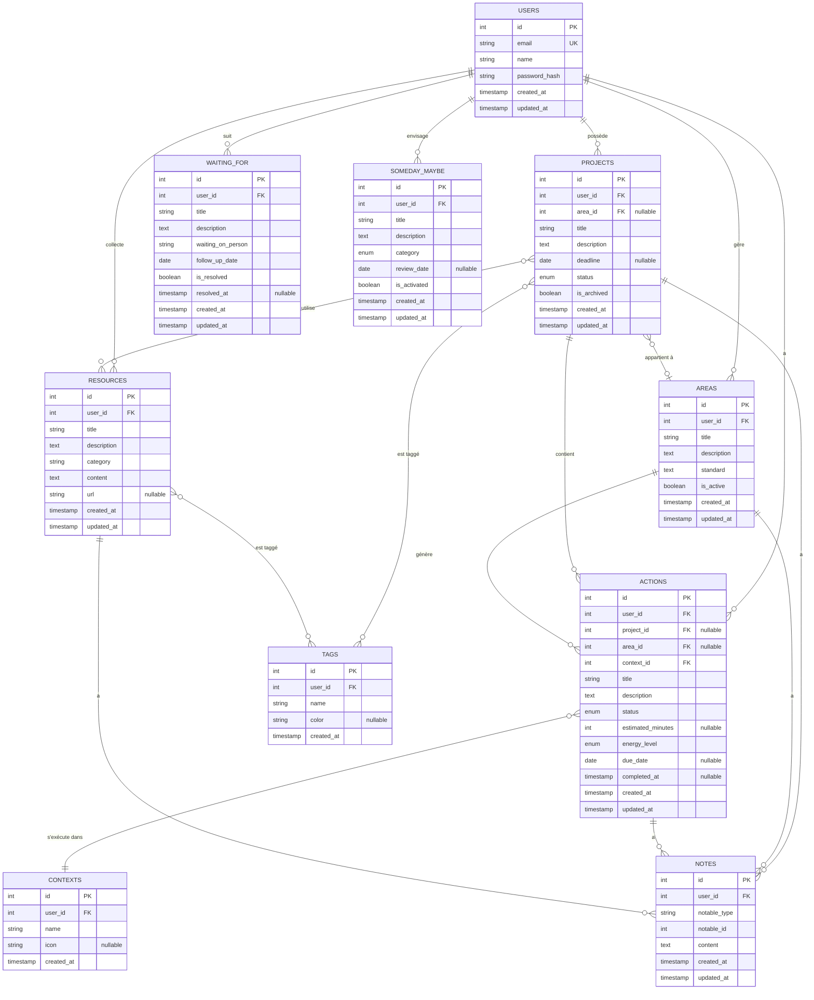
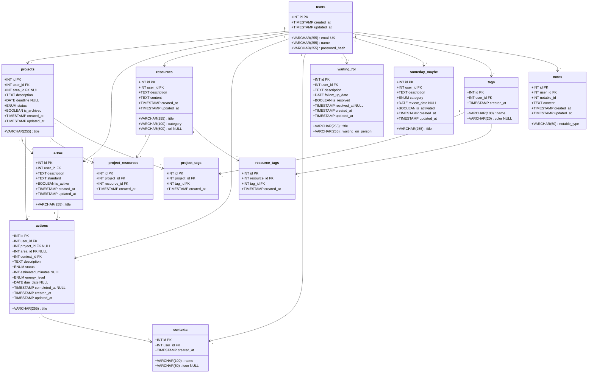

# 3.2 Atelier Pratique : Base de Données pour Second Brain (PARA + GTD)

## 1. Introduction et objectifs de l'atelier

### 1.1 Présentation du contexte

Dans cet atelier, nous allons concevoir et implémenter une **base de données relationnelle complète** pour gérer un système de productivité personnel basé sur les méthodes **PARA** (Projects, Areas, Resources, Archives) et **GTD** (Getting Things Done).

L'objectif est de créer une structure de données capable de :
- Organiser l'information selon les 4 catégories PARA
- Gérer le workflow GTD (capture, clarification, organisation, révision, action)
- Supporter plusieurs utilisateurs
- Maintenir l'intégrité des données
- Permettre des requêtes efficaces pour les opérations quotidiennes

### 1.2 Objectifs pédagogiques

À la fin de cet atelier, vous serez capable de :
1. **Analyser** les besoins fonctionnels d'une application complexe
2. **Modéliser** un système avec des relations multiples entre entités
3. **Concevoir** un schéma relationnel normalisé
4. **Implémenter** une base de données avec contraintes d'intégrité
5. **Écrire** des requêtes SQL pour des cas d'usage réels
6. **Justifier** vos choix de conception (types de données, contraintes, index)

### 1.3 Prérequis techniques

- Connaissance du langage SQL (DDL et DML)
- Compréhension des concepts de bases de données relationnelles :
  - Clés primaires et étrangères
  - Normalisation (1NF, 2NF, 3NF)
  - Contraintes d'intégrité
  - Index
- Notions de modélisation entité-association
- Lecture de diagrammes Mermaid

### 1.4 Conventions de nommage

Dans cet atelier, nous utiliserons les conventions suivantes :
- **Tables** : `snake_case` au pluriel (ex: `users`, `next_actions`)
- **Colonnes** : `snake_case` (ex: `user_id`, `created_at`)
- **Clés primaires** : `id` (entier auto-incrémenté)
- **Clés étrangères** : `<table>_id` (ex: `user_id`, `project_id`)
- **Timestamps** : `created_at`, `updated_at` pour tracer les modifications

---

## 2. Analyse des besoins fonctionnels

### 2.1 Entités principales à modéliser

#### **Entités PARA**

1. **Users (Utilisateurs)**
   - Système multi-utilisateurs
   - Chaque utilisateur a son propre système PARA+GTD

2. **Projects (Projets)**
   - Objectifs avec date limite
   - Appartiennent à un utilisateur
   - Peuvent être actifs ou archivés
   - Ont un statut (en cours, terminé, en pause, annulé)

3. **Areas (Domaines de responsabilité)**
   - Responsabilités continues sans date de fin
   - Standards à maintenir
   - Appartiennent à un utilisateur

4. **Resources (Ressources)**
   - Sujets d'intérêt
   - Documentation, références
   - Organisées par thème/catégorie

5. **Archives**
   - Projets terminés ou abandonnés
   - Domaines inactifs
   - Ressources obsolètes
   - Conservation de l'historique

#### **Entités GTD**

6. **Actions (Actions/Tâches)**
   - Prochaines actions concrètes
   - Liées à un projet ou un domaine
   - Ont un contexte d'exécution
   - Ont un statut (à faire, en cours, terminée, annulée)

7. **Contexts (Contextes)**
   - Lieux ou outils nécessaires (@ordinateur, @téléphone, @courses, @bureau)
   - Permettent de filtrer les actions selon la situation

8. **Waiting_For (En attente)**
   - Actions déléguées ou en attente d'une réponse
   - Personne responsable
   - Date de suivi

9. **Someday_Maybe (Un jour/Peut-être)**
   - Idées de projets futurs
   - Rêves, aspirations
   - Revue périodique

#### **Entités de support**

10. **Tags (Étiquettes)**
    - Catégorisation flexible
    - Applicable à projets, ressources, actions

11. **Notes**
    - Notes libres associées à n'importe quelle entité
    - Support Markdown

### 2.2 Relations entre les entités

- Un **User** possède plusieurs **Projects**, **Areas**, **Resources**
- Un **Project** contient plusieurs **Actions**
- Une **Action** appartient à un **Context**
- Un **Project** peut être lié à une **Area**
- Une **Resource** peut être liée à plusieurs **Projects** (relation N:N)
- Les **Tags** peuvent être appliqués à plusieurs entités (relation N:N)
- Les **Notes** peuvent être attachées à plusieurs types d'entités (polymorphisme)

---

## 3. Modélisation conceptuelle

### 3.1 Diagramme Entité-Association (ER)



### 3.2 Description détaillée des entités

#### **USERS (Utilisateurs)**
- `id` : Identifiant unique
- `email` : Email unique pour connexion
- `name` : Nom complet de l'utilisateur
- `password_hash` : Mot de passe hashé (sécurité)
- `created_at` : Date de création du compte
- `updated_at` : Date de dernière modification

#### **PROJECTS (Projets)**
- `id` : Identifiant unique
- `user_id` : Propriétaire du projet
- `area_id` : Domaine de responsabilité associé (optionnel)
- `title` : Titre du projet
- `description` : Description détaillée
- `deadline` : Date limite (optionnelle)
- `status` : Statut (not_started, in_progress, on_hold, completed, cancelled)
- `is_archived` : Indique si le projet est archivé
- `created_at`, `updated_at` : Timestamps de traçabilité

#### **AREAS (Domaines de responsabilité)**
- `id` : Identifiant unique
- `user_id` : Propriétaire du domaine
- `title` : Titre du domaine (ex: "Santé", "Finances")
- `description` : Description du domaine
- `standard` : Standard à maintenir (ex: "Faire du sport 3x/semaine")
- `is_active` : Indique si le domaine est actif
- `created_at`, `updated_at` : Timestamps

#### **RESOURCES (Ressources)**
- `id` : Identifiant unique
- `user_id` : Propriétaire de la ressource
- `title` : Titre de la ressource
- `description` : Description courte
- `category` : Catégorie/thème (ex: "SQL", "Design", "Marketing")
- `content` : Contenu complet (Markdown)
- `url` : URL externe (optionnelle)
- `created_at`, `updated_at` : Timestamps

#### **ACTIONS (Actions/Tâches)**
- `id` : Identifiant unique
- `user_id` : Propriétaire de l'action
- `project_id` : Projet associé (optionnel)
- `area_id` : Domaine associé (optionnel)
- `context_id` : Contexte d'exécution
- `title` : Titre de l'action (verbe d'action + complément)
- `description` : Description détaillée
- `status` : Statut (todo, in_progress, done, cancelled)
- `estimated_minutes` : Durée estimée en minutes
- `energy_level` : Niveau d'énergie requis (low, medium, high)
- `due_date` : Date d'échéance (optionnelle)
- `completed_at` : Date de complétion
- `created_at`, `updated_at` : Timestamps

#### **CONTEXTS (Contextes)**
- `id` : Identifiant unique
- `user_id` : Propriétaire du contexte
- `name` : Nom du contexte (ex: "@ordinateur", "@téléphone")
- `icon` : Icône pour l'interface (optionnel)
- `created_at` : Timestamp

#### **WAITING_FOR (En attente)**
- `id` : Identifiant unique
- `user_id` : Propriétaire
- `title` : Titre de l'élément en attente
- `description` : Description
- `waiting_on_person` : Personne dont on attend une réponse
- `follow_up_date` : Date de relance
- `is_resolved` : Indique si résolu
- `resolved_at` : Date de résolution
- `created_at`, `updated_at` : Timestamps

#### **SOMEDAY_MAYBE (Un jour/Peut-être)**
- `id` : Identifiant unique
- `user_id` : Propriétaire
- `title` : Titre de l'idée
- `description` : Description
- `category` : Catégorie (personal, professional, learning, travel, etc.)
- `review_date` : Date de prochaine revue
- `is_activated` : Indique si transformé en projet actif
- `created_at`, `updated_at` : Timestamps

#### **TAGS (Étiquettes)**
- `id` : Identifiant unique
- `user_id` : Propriétaire du tag
- `name` : Nom du tag
- `color` : Couleur pour l'interface (optionnel)
- `created_at` : Timestamp

#### **NOTES (Notes)**
- `id` : Identifiant unique
- `user_id` : Auteur de la note
- `notable_type` : Type d'entité (Project, Area, Resource, Action)
- `notable_id` : ID de l'entité associée
- `content` : Contenu de la note (Markdown)
- `created_at`, `updated_at` : Timestamps

### 3.3 Relations et cardinalités

| Relation | Type | Cardinalité | Description |
|----------|------|-------------|-------------|
| User → Projects | 1:N | Un utilisateur possède plusieurs projets | Obligatoire |
| User → Areas | 1:N | Un utilisateur gère plusieurs domaines | Obligatoire |
| User → Actions | 1:N | Un utilisateur a plusieurs actions | Obligatoire |
| Project → Actions | 1:N | Un projet contient plusieurs actions | Optionnel |
| Project → Area | N:1 | Un projet peut appartenir à un domaine | Optionnel |
| Action → Context | N:1 | Une action s'exécute dans un contexte | Obligatoire |
| Project ↔ Resources | N:N | Relation plusieurs-à-plusieurs | Table de jonction |
| Project ↔ Tags | N:N | Relation plusieurs-à-plusieurs | Table de jonction |

---

## 4. Modélisation logique

### 4.1 Schéma relationnel complet



### 4.2 Liste des tables avec colonnes et types

| Table | Colonnes principales | Types de données |
|-------|---------------------|------------------|
| **users** | id, email, name, password_hash | INT, VARCHAR(255), VARCHAR(255), VARCHAR(255) |
| **projects** | id, user_id, area_id, title, description, deadline, status, is_archived | INT, INT, INT, VARCHAR(255), TEXT, DATE, ENUM, BOOLEAN |
| **areas** | id, user_id, title, description, standard, is_active | INT, INT, VARCHAR(255), TEXT, TEXT, BOOLEAN |
| **resources** | id, user_id, title, description, category, content, url | INT, INT, VARCHAR(255), TEXT, VARCHAR(100), TEXT, VARCHAR(500) |
| **actions** | id, user_id, project_id, area_id, context_id, title, status, estimated_minutes, energy_level, due_date | INT, INT, INT, INT, INT, VARCHAR(255), ENUM, INT, ENUM, DATE |
| **contexts** | id, user_id, name, icon | INT, INT, VARCHAR(100), VARCHAR(50) |
| **waiting_for** | id, user_id, title, waiting_on_person, follow_up_date, is_resolved | INT, INT, VARCHAR(255), VARCHAR(255), DATE, BOOLEAN |
| **someday_maybe** | id, user_id, title, description, category, review_date, is_activated | INT, INT, VARCHAR(255), TEXT, ENUM, DATE, BOOLEAN |
| **tags** | id, user_id, name, color | INT, INT, VARCHAR(100), VARCHAR(20) |
| **notes** | id, user_id, notable_type, notable_id, content | INT, INT, VARCHAR(50), INT, TEXT |
| **project_resources** | id, project_id, resource_id | INT, INT, INT |
| **project_tags** | id, project_id, tag_id | INT, INT, INT |
| **resource_tags** | id, resource_id, tag_id | INT, INT, INT |

---

## 5. Scripts de création de la base de données

### 5.1 Création de la base de données

```sql
-- ============================================
-- Création de la base de données Second Brain
-- ============================================

-- Supprimer la base si elle existe déjà (ATTENTION en production !)
DROP DATABASE IF EXISTS second_brain_db;

-- Créer la base de données avec encodage UTF-8
CREATE DATABASE second_brain_db
    CHARACTER SET utf8mb4
    COLLATE utf8mb4_unicode_ci;

-- Utiliser la base de données
USE second_brain_db;
```

### 5.2 Création des tables

```sql
-- ============================================
-- Table: users
-- Description: Utilisateurs du système
-- ============================================
CREATE TABLE users (
    id INT AUTO_INCREMENT,
    email VARCHAR(255) NOT NULL,
    name VARCHAR(255) NOT NULL,
    password_hash VARCHAR(255) NOT NULL,
    created_at TIMESTAMP DEFAULT CURRENT_TIMESTAMP,
    updated_at TIMESTAMP DEFAULT CURRENT_TIMESTAMP ON UPDATE CURRENT_TIMESTAMP
) ENGINE=InnoDB DEFAULT CHARSET=utf8mb4 COLLATE=utf8mb4_unicode_ci;

-- ============================================
-- Table: areas
-- Description: Domaines de responsabilité (PARA)
-- ============================================
CREATE TABLE areas (
    id INT AUTO_INCREMENT,
    user_id INT NOT NULL,
    title VARCHAR(255) NOT NULL,
    description TEXT,
    standard TEXT COMMENT 'Standard à maintenir pour ce domaine',
    is_active BOOLEAN DEFAULT TRUE,
    created_at TIMESTAMP DEFAULT CURRENT_TIMESTAMP,
    updated_at TIMESTAMP DEFAULT CURRENT_TIMESTAMP ON UPDATE CURRENT_TIMESTAMP
) ENGINE=InnoDB DEFAULT CHARSET=utf8mb4 COLLATE=utf8mb4_unicode_ci;

-- ============================================
-- Table: projects
-- Description: Projets avec objectifs et deadlines (PARA)
-- ============================================
CREATE TABLE projects (
    id INT AUTO_INCREMENT,
    user_id INT NOT NULL,
    area_id INT NULL COMMENT 'Domaine de responsabilité associé (optionnel)',
    title VARCHAR(255) NOT NULL,
    description TEXT,
    deadline DATE NULL COMMENT 'Date limite du projet',
    status ENUM('not_started', 'in_progress', 'on_hold', 'completed', 'cancelled') 
        DEFAULT 'not_started',
    is_archived BOOLEAN DEFAULT FALSE,
    created_at TIMESTAMP DEFAULT CURRENT_TIMESTAMP,
    updated_at TIMESTAMP DEFAULT CURRENT_TIMESTAMP ON UPDATE CURRENT_TIMESTAMP
) ENGINE=InnoDB DEFAULT CHARSET=utf8mb4 COLLATE=utf8mb4_unicode_ci;

-- ============================================
-- Table: resources
-- Description: Ressources et documentation (PARA)
-- ============================================
CREATE TABLE resources (
    id INT AUTO_INCREMENT,
    user_id INT NOT NULL,
    title VARCHAR(255) NOT NULL,
    description TEXT,
    category VARCHAR(100) NOT NULL COMMENT 'Catégorie thématique (SQL, Design, etc.)',
    content TEXT COMMENT 'Contenu complet en Markdown',
    url VARCHAR(500) NULL COMMENT 'URL externe optionnelle',
    created_at TIMESTAMP DEFAULT CURRENT_TIMESTAMP,
    updated_at TIMESTAMP DEFAULT CURRENT_TIMESTAMP ON UPDATE CURRENT_TIMESTAMP
) ENGINE=InnoDB DEFAULT CHARSET=utf8mb4 COLLATE=utf8mb4_unicode_ci;

-- ============================================
-- Table: contexts
-- Description: Contextes d'exécution GTD (@ordinateur, @téléphone, etc.)
-- ============================================
CREATE TABLE contexts (
    id INT AUTO_INCREMENT,
    user_id INT NOT NULL,
    name VARCHAR(100) NOT NULL COMMENT 'Nom du contexte (ex: @ordinateur)',
    icon VARCHAR(50) NULL COMMENT 'Icône pour l''interface utilisateur',
    created_at TIMESTAMP DEFAULT CURRENT_TIMESTAMP
) ENGINE=InnoDB DEFAULT CHARSET=utf8mb4 COLLATE=utf8mb4_unicode_ci;

-- ============================================
-- Table: actions
-- Description: Actions/Tâches GTD (Next Actions)
-- ============================================
CREATE TABLE actions (
    id INT AUTO_INCREMENT,
    user_id INT NOT NULL,
    project_id INT NULL COMMENT 'Projet associé (optionnel)',
    area_id INT NULL COMMENT 'Domaine associé (optionnel)',
    context_id INT NOT NULL COMMENT 'Contexte d''exécution requis',
    title VARCHAR(255) NOT NULL COMMENT 'Titre de l''action (verbe + complément)',
    description TEXT,
    status ENUM('todo', 'in_progress', 'done', 'cancelled') DEFAULT 'todo',
    estimated_minutes INT NULL COMMENT 'Durée estimée en minutes',
    energy_level ENUM('low', 'medium', 'high') DEFAULT 'medium' 
        COMMENT 'Niveau d''énergie requis',
    due_date DATE NULL COMMENT 'Date d''échéance (optionnelle)',
    completed_at TIMESTAMP NULL COMMENT 'Date de complétion',
    created_at TIMESTAMP DEFAULT CURRENT_TIMESTAMP,
    updated_at TIMESTAMP DEFAULT CURRENT_TIMESTAMP ON UPDATE CURRENT_TIMESTAMP
) ENGINE=InnoDB DEFAULT CHARSET=utf8mb4 COLLATE=utf8mb4_unicode_ci;

-- ============================================
-- Table: waiting_for
-- Description: Éléments en attente GTD (Waiting For)
-- ============================================
CREATE TABLE waiting_for (
    id INT AUTO_INCREMENT,
    user_id INT NOT NULL,
    title VARCHAR(255) NOT NULL,
    description TEXT,
    waiting_on_person VARCHAR(255) NOT NULL COMMENT 'Personne dont on attend une réponse',
    follow_up_date DATE NOT NULL COMMENT 'Date de relance prévue',
    is_resolved BOOLEAN DEFAULT FALSE,
    resolved_at TIMESTAMP NULL,
    created_at TIMESTAMP DEFAULT CURRENT_TIMESTAMP,
    updated_at TIMESTAMP DEFAULT CURRENT_TIMESTAMP ON UPDATE CURRENT_TIMESTAMP
) ENGINE=InnoDB DEFAULT CHARSET=utf8mb4 COLLATE=utf8mb4_unicode_ci;

-- ============================================
-- Table: someday_maybe
-- Description: Idées et projets futurs GTD (Someday/Maybe)
-- ============================================
CREATE TABLE someday_maybe (
    id INT AUTO_INCREMENT,
    user_id INT NOT NULL,
    title VARCHAR(255) NOT NULL,
    description TEXT,
    category ENUM('personal', 'professional', 'learning', 'travel', 'creative', 'other') 
        DEFAULT 'other',
    review_date DATE NULL COMMENT 'Date de prochaine revue',
    is_activated BOOLEAN DEFAULT FALSE COMMENT 'Transformé en projet actif ?',
    created_at TIMESTAMP DEFAULT CURRENT_TIMESTAMP,
    updated_at TIMESTAMP DEFAULT CURRENT_TIMESTAMP ON UPDATE CURRENT_TIMESTAMP
) ENGINE=InnoDB DEFAULT CHARSET=utf8mb4 COLLATE=utf8mb4_unicode_ci;

-- ============================================
-- Table: tags
-- Description: Étiquettes pour catégorisation flexible
-- ============================================
CREATE TABLE tags (
    id INT AUTO_INCREMENT,
    user_id INT NOT NULL,
    name VARCHAR(100) NOT NULL,
    color VARCHAR(20) NULL COMMENT 'Couleur hexadécimale (ex: #FF5733)',
    created_at TIMESTAMP DEFAULT CURRENT_TIMESTAMP
) ENGINE=InnoDB DEFAULT CHARSET=utf8mb4 COLLATE=utf8mb4_unicode_ci;

-- ============================================
-- Table: notes
-- Description: Notes polymorphiques attachées à différentes entités
-- ============================================
CREATE TABLE notes (
    id INT AUTO_INCREMENT,
    user_id INT NOT NULL,
    notable_type VARCHAR(50) NOT NULL COMMENT 'Type d''entité (Project, Area, Resource, Action)',
    notable_id INT NOT NULL COMMENT 'ID de l''entité associée',
    content TEXT NOT NULL COMMENT 'Contenu de la note en Markdown',
    created_at TIMESTAMP DEFAULT CURRENT_TIMESTAMP,
    updated_at TIMESTAMP DEFAULT CURRENT_TIMESTAMP ON UPDATE CURRENT_TIMESTAMP
) ENGINE=InnoDB DEFAULT CHARSET=utf8mb4 COLLATE=utf8mb4_unicode_ci;

-- ============================================
-- Tables de jonction (relations N:N)
-- ============================================

-- Relation Project <-> Resource
CREATE TABLE project_resources (
    id INT AUTO_INCREMENT,
    project_id INT NOT NULL,
    resource_id INT NOT NULL,
    created_at TIMESTAMP DEFAULT CURRENT_TIMESTAMP,
    PRIMARY KEY (id)
) ENGINE=InnoDB DEFAULT CHARSET=utf8mb4 COLLATE=utf8mb4_unicode_ci;

-- Relation Project <-> Tag
CREATE TABLE project_tags (
    id INT AUTO_INCREMENT,
    project_id INT NOT NULL,
    tag_id INT NOT NULL,
    created_at TIMESTAMP DEFAULT CURRENT_TIMESTAMP,
    PRIMARY KEY (id)
) ENGINE=InnoDB DEFAULT CHARSET=utf8mb4 COLLATE=utf8mb4_unicode_ci;

-- Relation Resource <-> Tag
CREATE TABLE resource_tags (
    id INT AUTO_INCREMENT,
    resource_id INT NOT NULL,
    tag_id INT NOT NULL,
    created_at TIMESTAMP DEFAULT CURRENT_TIMESTAMP,
    PRIMARY KEY (id)
) ENGINE=InnoDB DEFAULT CHARSET=utf8mb4 COLLATE=utf8mb4_unicode_ci;
```

---

## 6. Contraintes d'intégrité

### 6.1 Types de contraintes

#### **6.1.1 Intégrité de domaine**

Les contraintes de domaine assurent que les valeurs des colonnes respectent des règles spécifiques.

**Exemples dans notre schéma :**

```sql
-- Types ENUM pour limiter les valeurs possibles
status ENUM('not_started', 'in_progress', 'on_hold', 'completed', 'cancelled')

-- Contraintes NOT NULL pour les champs obligatoires
email VARCHAR(255) NOT NULL
title VARCHAR(255) NOT NULL

-- Valeurs par défaut
is_archived BOOLEAN DEFAULT FALSE
created_at TIMESTAMP DEFAULT CURRENT_TIMESTAMP
```

**Justification :**
- Les ENUM empêchent les erreurs de saisie et garantissent la cohérence
- Les NOT NULL évitent les données incomplètes
- Les DEFAULT simplifient les insertions et assurent des valeurs cohérentes

#### **6.1.2 Intégrité d'entité (Clés primaires)**

Chaque table doit avoir une clé primaire unique pour identifier chaque enregistrement.

**Justification :**
- Garantit l'unicité de chaque enregistrement
- Permet les références entre tables
- Optimise les performances des jointures

#### **6.1.3 Intégrité référentielle (Clés étrangères)**

Les clés étrangères maintiennent la cohérence entre les tables liées.

**Règles de suppression/mise à jour :**

| Règle | Description | Utilisation dans notre schéma |
|-------|-------------|-------------------------------|
| **CASCADE** | Supprime/met à jour automatiquement les enregistrements liés | User → Projects (si user supprimé, ses projets aussi) |
| **SET NULL** | Met la clé étrangère à NULL | Project → Area (si area supprimée, project.area_id = NULL) |
| **RESTRICT** | Empêche la suppression si des enregistrements liés existent | Context → Actions (ne peut pas supprimer un contexte utilisé) |
| **NO ACTION** | Similaire à RESTRICT | Par défaut dans certains SGBD |

#### **6.1.4 Contraintes métier spécifiques**

**Contrainte 1 : Une action ne peut pas appartenir à la fois à un projet ET à un domaine**

```sql
-- Cette contrainte sera ajoutée via un CHECK ou un trigger
-- CHECK ((project_id IS NOT NULL AND area_id IS NULL) OR 
--        (project_id IS NULL AND area_id IS NOT NULL) OR
--        (project_id IS NULL AND area_id IS NULL))
```

**Justification :** Dans la méthodologie GTD, une action est soit liée à un projet spécifique, soit à un domaine de responsabilité, mais pas aux deux simultanément pour éviter la confusion.

**Contrainte 2 : Un projet archivé ne peut pas avoir de statut "in_progress"**

```sql
-- Vérification via trigger ou logique applicative
-- Si is_archived = TRUE, alors status != 'in_progress'
```

**Justification :** Un projet archivé est par définition inactif.

**Contrainte 3 : La date de follow-up d'un "waiting_for" doit être dans le futur**

```sql
-- CHECK (follow_up_date >= CURRENT_DATE)
```

**Justification :** Une date de relance dans le passé n'a pas de sens.

---

## 7. Scripts de création des clés

### 7.1 Clés primaires

```sql
-- ============================================
-- Ajout des clés primaires
-- ============================================

ALTER TABLE users
    ADD PRIMARY KEY (id);

ALTER TABLE areas
    ADD PRIMARY KEY (id);

ALTER TABLE projects
    ADD PRIMARY KEY (id);

ALTER TABLE resources
    ADD PRIMARY KEY (id);

ALTER TABLE contexts
    ADD PRIMARY KEY (id);

ALTER TABLE actions
    ADD PRIMARY KEY (id);

ALTER TABLE waiting_for
    ADD PRIMARY KEY (id);

ALTER TABLE someday_maybe
    ADD PRIMARY KEY (id);

ALTER TABLE tags
    ADD PRIMARY KEY (id);

ALTER TABLE notes
    ADD PRIMARY KEY (id);

-- Les tables de jonction ont déjà leur PRIMARY KEY définie lors de la création
```

### 7.2 Contraintes d'unicité

```sql
-- ============================================
-- Contraintes d'unicité
-- ============================================

-- Email unique pour chaque utilisateur
ALTER TABLE users
    ADD UNIQUE KEY unique_email (email);

-- Nom de contexte unique par utilisateur
ALTER TABLE contexts
    ADD UNIQUE KEY unique_context_per_user (user_id, name);

-- Nom de tag unique par utilisateur
ALTER TABLE tags
    ADD UNIQUE KEY unique_tag_per_user (user_id, name);

-- Éviter les doublons dans les tables de jonction
ALTER TABLE project_resources
    ADD UNIQUE KEY unique_project_resource (project_id, resource_id);

ALTER TABLE project_tags
    ADD UNIQUE KEY unique_project_tag (project_id, tag_id);

ALTER TABLE resource_tags
    ADD UNIQUE KEY unique_resource_tag (resource_id, tag_id);
```

### 7.3 Clés étrangères avec règles de suppression

```sql
-- ============================================
-- Clés étrangères - Table: areas
-- ============================================
ALTER TABLE areas
    ADD CONSTRAINT fk_areas_user
        FOREIGN KEY (user_id) 
        REFERENCES users(id)
        ON DELETE CASCADE  -- Si user supprimé, ses areas aussi
        ON UPDATE CASCADE;

-- ============================================
-- Clés étrangères - Table: projects
-- ============================================
ALTER TABLE projects
    ADD CONSTRAINT fk_projects_user
        FOREIGN KEY (user_id) 
        REFERENCES users(id)
        ON DELETE CASCADE  -- Si user supprimé, ses projets aussi
        ON UPDATE CASCADE;

ALTER TABLE projects
    ADD CONSTRAINT fk_projects_area
        FOREIGN KEY (area_id) 
        REFERENCES areas(id)
        ON DELETE SET NULL  -- Si area supprimée, project.area_id = NULL
        ON UPDATE CASCADE;

-- ============================================
-- Clés étrangères - Table: resources
-- ============================================
ALTER TABLE resources
    ADD CONSTRAINT fk_resources_user
        FOREIGN KEY (user_id) 
        REFERENCES users(id)
        ON DELETE CASCADE
        ON UPDATE CASCADE;

-- ============================================
-- Clés étrangères - Table: contexts
-- ============================================
ALTER TABLE contexts
    ADD CONSTRAINT fk_contexts_user
        FOREIGN KEY (user_id) 
        REFERENCES users(id)
        ON DELETE CASCADE
        ON UPDATE CASCADE;

-- ============================================
-- Clés étrangères - Table: actions
-- ============================================
ALTER TABLE actions
    ADD CONSTRAINT fk_actions_user
        FOREIGN KEY (user_id) 
        REFERENCES users(id)
        ON DELETE CASCADE
        ON UPDATE CASCADE;

ALTER TABLE actions
    ADD CONSTRAINT fk_actions_project
        FOREIGN KEY (project_id) 
        REFERENCES projects(id)
        ON DELETE CASCADE  -- Si projet supprimé, ses actions aussi
        ON UPDATE CASCADE;

ALTER TABLE actions
    ADD CONSTRAINT fk_actions_area
        FOREIGN KEY (area_id) 
        REFERENCES areas(id)
        ON DELETE SET NULL  -- Si area supprimée, action.area_id = NULL
        ON UPDATE CASCADE;

ALTER TABLE actions
    ADD CONSTRAINT fk_actions_context
        FOREIGN KEY (context_id) 
        REFERENCES contexts(id)
        ON DELETE RESTRICT  -- Ne peut pas supprimer un contexte utilisé
        ON UPDATE CASCADE;

-- ============================================
-- Clés étrangères - Table: waiting_for
-- ============================================
ALTER TABLE waiting_for
    ADD CONSTRAINT fk_waiting_for_user
        FOREIGN KEY (user_id) 
        REFERENCES users(id)
        ON DELETE CASCADE
        ON UPDATE CASCADE;

-- ============================================
-- Clés étrangères - Table: someday_maybe
-- ============================================
ALTER TABLE someday_maybe
    ADD CONSTRAINT fk_someday_maybe_user
        FOREIGN KEY (user_id) 
        REFERENCES users(id)
        ON DELETE CASCADE
        ON UPDATE CASCADE;

-- ============================================
-- Clés étrangères - Table: tags
-- ============================================
ALTER TABLE tags
    ADD CONSTRAINT fk_tags_user
        FOREIGN KEY (user_id) 
        REFERENCES users(id)
        ON DELETE CASCADE
        ON UPDATE CASCADE;

-- ============================================
-- Clés étrangères - Table: notes
-- ============================================
ALTER TABLE notes
    ADD CONSTRAINT fk_notes_user
        FOREIGN KEY (user_id) 
        REFERENCES users(id)
        ON DELETE CASCADE
        ON UPDATE CASCADE;

-- ============================================
-- Clés étrangères - Tables de jonction
-- ============================================

-- project_resources
ALTER TABLE project_resources
    ADD CONSTRAINT fk_project_resources_project
        FOREIGN KEY (project_id) 
        REFERENCES projects(id)
        ON DELETE CASCADE
        ON UPDATE CASCADE;

ALTER TABLE project_resources
    ADD CONSTRAINT fk_project_resources_resource
        FOREIGN KEY (resource_id) 
        REFERENCES resources(id)
        ON DELETE CASCADE
        ON UPDATE CASCADE;

-- project_tags
ALTER TABLE project_tags
    ADD CONSTRAINT fk_project_tags_project
        FOREIGN KEY (project_id) 
        REFERENCES projects(id)
        ON DELETE CASCADE
        ON UPDATE CASCADE;

ALTER TABLE project_tags
    ADD CONSTRAINT fk_project_tags_tag
        FOREIGN KEY (tag_id) 
        REFERENCES tags(id)
        ON DELETE CASCADE
        ON UPDATE CASCADE;

-- resource_tags
ALTER TABLE resource_tags
    ADD CONSTRAINT fk_resource_tags_resource
        FOREIGN KEY (resource_id) 
        REFERENCES resources(id)
        ON DELETE CASCADE
        ON UPDATE CASCADE;

ALTER TABLE resource_tags
    ADD CONSTRAINT fk_resource_tags_tag
        FOREIGN KEY (tag_id) 
        REFERENCES tags(id)
        ON DELETE CASCADE
        ON UPDATE CASCADE;
```

**Justification des choix de règles :**

| Relation | Règle | Justification |
|----------|-------|---------------|
| User → Projects/Areas/Actions | CASCADE | Si un utilisateur est supprimé, toutes ses données doivent l'être aussi |
| Project → Area | SET NULL | Si un domaine est supprimé, le projet reste mais perd son lien |
| Action → Context | RESTRICT | Ne pas supprimer un contexte encore utilisé (intégrité des données) |
| Project → Actions | CASCADE | Si un projet est supprimé, ses actions n'ont plus de sens |

### 7.4 Index pour optimisation des requêtes

```sql
-- ============================================
-- Index pour optimisation des performances
-- ============================================

-- Index sur les colonnes fréquemment utilisées dans les WHERE et JOIN

-- Table: projects
CREATE INDEX idx_projects_user_status ON projects(user_id, status);
CREATE INDEX idx_projects_area ON projects(area_id);
CREATE INDEX idx_projects_archived ON projects(is_archived);
CREATE INDEX idx_projects_deadline ON projects(deadline);

-- Table: actions
CREATE INDEX idx_actions_user_status ON actions(user_id, status);
CREATE INDEX idx_actions_context ON actions(context_id);
CREATE INDEX idx_actions_project ON actions(project_id);
CREATE INDEX idx_actions_area ON actions(area_id);
CREATE INDEX idx_actions_due_date ON actions(due_date);
CREATE INDEX idx_actions_energy ON actions(energy_level);

-- Table: resources
CREATE INDEX idx_resources_user_category ON resources(user_id, category);

-- Table: waiting_for
CREATE INDEX idx_waiting_for_user_resolved ON waiting_for(user_id, is_resolved);
CREATE INDEX idx_waiting_for_follow_up ON waiting_for(follow_up_date);

-- Table: someday_maybe
CREATE INDEX idx_someday_maybe_user_activated ON someday_maybe(user_id, is_activated);
CREATE INDEX idx_someday_maybe_category ON someday_maybe(category);

-- Table: notes (pour les requêtes polymorphiques)
CREATE INDEX idx_notes_notable ON notes(notable_type, notable_id);
CREATE INDEX idx_notes_user ON notes(user_id);

-- Table: contexts
CREATE INDEX idx_contexts_user ON contexts(user_id);

-- Table: tags
CREATE INDEX idx_tags_user ON tags(user_id);
```

**Justification des index :**
- **Colonnes de filtrage fréquent** : user_id, status, is_archived
- **Colonnes de jointure** : Toutes les clés étrangères
- **Colonnes de tri** : deadline, due_date, follow_up_date
- **Index composites** : Pour les requêtes filtrant sur plusieurs colonnes simultanément

---

## 8. Scripts d'insertion de données d'exemple

### 8.1 Scénario : Marie et Thomas, deux utilisateurs du système

Nous allons créer un jeu de données cohérent avec deux utilisateurs qui utilisent le système PARA+GTD pour gérer leur vie professionnelle et personnelle.

```sql
-- ============================================
-- Insertion des utilisateurs
-- ============================================

INSERT INTO users (email, name, password_hash) VALUES
('marie.dupont@email.com', 'Marie Dupont', '$2y$10$abcdefghijklmnopqrstuvwxyz123456'),
('thomas.martin@email.com', 'Thomas Martin', '$2y$10$zyxwvutsrqponmlkjihgfedcba654321');

-- Récupération des IDs (pour référence)
-- Marie: user_id = 1
-- Thomas: user_id = 2

-- ============================================
-- Insertion des domaines de responsabilité (Areas)
-- ============================================

-- Domaines de Marie
INSERT INTO areas (user_id, title, description, standard, is_active) VALUES
(1, 'Santé et Fitness', 'Maintenir une bonne forme physique et mentale', 'Faire du sport 3x/semaine, méditer 10min/jour', TRUE),
(1, 'Finances Personnelles', 'Gestion du budget et investissements', 'Réviser le budget mensuellement, épargner 20% des revenus', TRUE),
(1, 'Développement Professionnel', 'Compétences en data science et SQL', 'Apprendre 1 nouvelle compétence par trimestre', TRUE),
(1, 'Relations Familiales', 'Maintenir des liens de qualité avec la famille', 'Appeler les parents 1x/semaine, visiter 1x/mois', TRUE);

-- Domaines de Thomas
INSERT INTO areas (user_id, title, description, standard, is_active) VALUES
(2, 'Gestion Appartement', 'Entretien et administration du logement', 'Payer les factures à temps, entretien régulier', TRUE),
(2, 'Carrière Développeur', 'Évolution professionnelle en développement web', 'Contribuer à l''open source, se former continuellement', TRUE),
(2, 'Vie Sociale', 'Maintenir et développer les amitiés', 'Organiser 1 sortie/mois avec des amis', TRUE);

-- ============================================
-- Insertion des projets (Projects)
-- ============================================

-- Projets de Marie
INSERT INTO projects (user_id, area_id, title, description, deadline, status, is_archived) VALUES
(1, 3, 'Certification SQL Avancé', 'Obtenir la certification SQL avancée pour progresser professionnellement', '2025-06-30', 'in_progress', FALSE),
(1, 1, 'Programme Marathon', 'Préparer et courir un semi-marathon', '2025-09-15', 'in_progress', FALSE),
(1, 2, 'Optimisation Budget 2025', 'Réduire les dépenses mensuelles de 15%', '2025-03-31', 'in_progress', FALSE),
(1, NULL, 'Rénovation Cuisine', 'Rénover la cuisine de l''appartement', '2025-05-01', 'not_started', FALSE),
(1, 3, 'Présentation Conférence Data', 'Préparer une présentation sur les bases de données NoSQL', '2025-02-20', 'completed', TRUE);

-- Projets de Thomas
INSERT INTO projects (user_id, area_id, title, description, deadline, status, is_archived) VALUES
(2, 2, 'Contribuer à PostgreSQL', 'Faire ma première contribution au projet PostgreSQL', '2025-04-30', 'in_progress', FALSE),
(2, 1, 'Déménagement Appartement', 'Organiser le déménagement vers le nouvel appartement', '2025-03-15', 'in_progress', FALSE),
(2, 3, 'Organiser Soirée Jeux', 'Organiser une soirée jeux de société avec 8 amis', '2025-02-10', 'not_started', FALSE);

-- ============================================
-- Insertion des contextes (Contexts)
-- ============================================

-- Contextes de Marie
INSERT INTO contexts (user_id, name, icon) VALUES
(1, '@ordinateur', '💻'),
(1, '@téléphone', '📱'),
(1, '@courses', '🛒'),
(1, '@maison', '🏠'),
(1, '@bureau', '🏢'),
(1, '@salle-sport', '🏋️');

-- Contextes de Thomas
INSERT INTO contexts (user_id, name, icon) VALUES
(2, '@ordinateur', '💻'),
(2, '@téléphone', '📱'),
(2, '@extérieur', '🚶'),
(2, '@maison', '🏠');

-- ============================================
-- Insertion des actions (Actions)
-- ============================================

-- Actions de Marie pour le projet "Certification SQL Avancé"
INSERT INTO actions (user_id, project_id, area_id, context_id, title, description, status, estimated_minutes, energy_level, due_date) VALUES
(1, 1, NULL, 1, 'Terminer le chapitre 5 du cours SQL', 'Étudier les transactions et le contrôle de concurrence', 'in_progress', 90, 'high', '2025-01-20'),
(1, 1, NULL, 1, 'Faire les exercices pratiques sur les index', 'Compléter les 10 exercices du module 4', 'todo', 60, 'medium', '2025-01-22'),
(1, 1, NULL, 1, 'Réviser les jointures complexes', 'Revoir les LEFT JOIN, RIGHT JOIN, FULL OUTER JOIN', 'todo', 45, 'medium', NULL);

-- Actions de Marie pour le projet "Programme Marathon"
INSERT INTO actions (user_id, project_id, area_id, context_id, title, description, status, estimated_minutes, energy_level, due_date) VALUES
(1, 2, NULL, 6, 'Courir 10km ce samedi', 'Sortie longue selon le plan d''entraînement', 'todo', 60, 'high', '2025-01-18'),
(1, 2, NULL, 2, 'Acheter nouvelles chaussures de running', 'Aller au magasin spécialisé pour essayer plusieurs modèles', 'todo', 90, 'low', '2025-01-25');

-- Actions de Marie pour le domaine "Finances Personnelles"
INSERT INTO actions (user_id, project_id, area_id, context_id, title, description, status, estimated_minutes, energy_level, due_date) VALUES
(1, NULL, 2, 1, 'Réviser le budget de janvier', 'Analyser les dépenses et ajuster les catégories', 'todo', 30, 'medium', '2025-01-31'),
(1, NULL, 2, 2, 'Appeler la banque pour les frais', 'Négocier la suppression des frais de tenue de compte', 'todo', 15, 'low', '2025-01-20');

-- Actions de Marie sans projet ni domaine (actions ponctuelles)
INSERT INTO actions (user_id, project_id, area_id, context_id, title, description, status, estimated_minutes, energy_level, due_date) VALUES
(1, NULL, NULL, 3, 'Acheter du lait et des œufs', 'Courses alimentaires de base', 'todo', 10, 'low', NULL),
(1, NULL, NULL, 2, 'Prendre RDV dentiste', 'Contrôle annuel', 'todo', 5, 'low', '2025-01-25');

-- Actions de Thomas pour le projet "Contribuer à PostgreSQL"
INSERT INTO actions (user_id, project_id, area_id, context_id, title, description, status, estimated_minutes, energy_level, due_date) VALUES
(2, 6, NULL, 7, 'Lire la documentation de contribution PostgreSQL', 'Comprendre le processus de contribution', 'done', 60, 'medium', NULL),
(2, 6, NULL, 7, 'Configurer l''environnement de développement PostgreSQL', 'Installer et compiler PostgreSQL depuis les sources', 'in_progress', 120, 'high', '2025-01-19'),
(2, 6, NULL, 7, 'Identifier un bug débutant à corriger', 'Parcourir les issues taggées "good first issue"', 'todo', 45, 'medium', NULL);

-- Actions de Thomas pour le projet "Déménagement"
INSERT INTO actions (user_id, project_id, area_id, context_id, title, description, status, estimated_minutes, energy_level, due_date) VALUES
(2, 7, NULL, 8, 'Appeler 3 entreprises de déménagement', 'Obtenir des devis comparatifs', 'todo', 30, 'low', '2025-01-22'),
(2, 7, NULL, 10, 'Trier les affaires à donner', 'Faire le tri dans les placards', 'todo', 180, 'medium', '2025-02-01');

-- ============================================
-- Insertion des ressources (Resources)
-- ============================================

-- Ressources de Marie
INSERT INTO resources (user_id, title, description, category, content, url) VALUES
(1, 'Guide complet des index SQL', 'Documentation sur les différents types d''index et leur utilisation', 'SQL', '# Les Index SQL\n\n## Types d''index\n- B-Tree\n- Hash\n- GiST\n- GIN\n\n## Quand utiliser un index\n...', 'https://use-the-index-luke.com'),
(1, 'Plan d''entraînement semi-marathon', 'Programme de 12 semaines pour préparer un semi-marathon', 'Sport', '# Plan 12 semaines\n\n## Semaine 1-4: Base\n- 3 sorties/semaine\n- Distance progressive\n...', NULL),
(1, 'Modèle de budget mensuel', 'Template Excel pour suivre ses finances', 'Finances', 'Template avec catégories: Logement, Alimentation, Transport, Loisirs, Épargne', NULL);

-- Ressources de Thomas
INSERT INTO resources (user_id, title, description, category, content, url) VALUES
(2, 'Architecture PostgreSQL', 'Notes sur l''architecture interne de PostgreSQL', 'Bases de données', '# Architecture PostgreSQL\n\n## Processus\n- Postmaster\n- Backend processes\n- Background workers\n...', 'https://www.postgresql.org/docs/'),
(2, 'Checklist déménagement', 'Liste complète des tâches pour un déménagement réussi', 'Organisation', '# Checklist déménagement\n\n## 2 mois avant\n- Résilier bail\n- Chercher déménageurs\n\n## 1 mois avant\n- Cartons\n- Changement adresse\n...', NULL);

-- ============================================
-- Insertion des éléments "En attente" (Waiting For)
-- ============================================

INSERT INTO waiting_for (user_id, title, description, waiting_on_person, follow_up_date, is_resolved) VALUES
(1, 'Réponse inscription certification SQL', 'Attente de confirmation d''inscription à l''examen', 'Organisme de certification', '2025-01-25', FALSE),
(1, 'Devis rénovation cuisine', 'Attente du devis de l''artisan', 'Jean Dupuis (artisan)', '2025-01-22', FALSE),
(2, 'Validation PR sur GitHub', 'Attente de review de ma pull request', 'Mainteneur du projet', '2025-01-20', FALSE),
(2, 'Confirmation date déménagement', 'Attente de confirmation de la date par le propriétaire', 'M. Leblanc (propriétaire)', '2025-01-18', FALSE);

-- ============================================
-- Insertion des idées "Un jour/Peut-être" (Someday/Maybe)
-- ============================================

INSERT INTO someday_maybe (user_id, title, description, category, review_date, is_activated) VALUES
(1, 'Apprendre le japonais', 'Commencer l''apprentissage du japonais pour un futur voyage', 'learning', '2025-03-01', FALSE),
(1, 'Créer un blog sur les bases de données', 'Partager mes connaissances en SQL et NoSQL', 'creative', '2025-02-15', FALSE),
(1, 'Voyage au Japon', 'Organiser un voyage de 2 semaines au Japon', 'travel', '2025-06-01', FALSE),
(2, 'Contribuer à un projet Rust', 'Apprendre Rust et contribuer à un projet open source', 'professional', '2025-04-01', FALSE),
(2, 'Créer une application mobile', 'Développer une app de gestion de tâches en React Native', 'creative', '2025-03-15', FALSE);

-- ============================================
-- Insertion des tags
-- ============================================

INSERT INTO tags (user_id, name, color) VALUES
(1, 'urgent', '#FF0000'),
(1, 'important', '#FFA500'),
(1, 'apprentissage', '#0000FF'),
(1, 'santé', '#00FF00'),
(2, 'open-source', '#800080'),
(2, 'personnel', '#FFC0CB');

-- ============================================
-- Insertion des relations Project <-> Resource
-- ============================================

INSERT INTO project_resources (project_id, resource_id) VALUES
(1, 1),  -- Projet "Certification SQL" utilise "Guide index SQL"
(2, 2),  -- Projet "Marathon" utilise "Plan d'entraînement"
(3, 3),  -- Projet "Budget 2025" utilise "Modèle budget"
(7, 5);  -- Projet "Déménagement" utilise "Checklist déménagement"

-- ============================================
-- Insertion des relations Project <-> Tag
-- ============================================

INSERT INTO project_tags (project_id, tag_id) VALUES
(1, 3),  -- Projet "Certification SQL" taggé "apprentissage"
(2, 4),  -- Projet "Marathon" taggé "santé"
(3, 2),  -- Projet "Budget 2025" taggé "important"
(6, 5);  -- Projet "Contribuer PostgreSQL" taggé "open-source"

-- ============================================
-- Insertion des relations Resource <-> Tag
-- ============================================

INSERT INTO resource_tags (resource_id, tag_id) VALUES
(1, 3),  -- Ressource "Guide index SQL" taggée "apprentissage"
(2, 4),  -- Ressource "Plan entraînement" taggée "santé"
(4, 5);  -- Ressource "Architecture PostgreSQL" taggée "open-source"

-- ============================================
-- Insertion de notes
-- ============================================

INSERT INTO notes (user_id, notable_type, notable_id, content) VALUES
(1, 'Project', 1, '# Notes de progression\n\nJ''ai terminé 60% du cours. Les concepts de transactions sont complexes mais fascinants.\n\n## Points à réviser\n- Niveaux d''isolation\n- Deadlocks'),
(1, 'Action', 1, 'Prévoir 2h pour ce chapitre, il est dense.'),
(2, 'Project', 6, '# Ressources utiles\n\n- [Guide contribution](https://wiki.postgresql.org/wiki/Developer_FAQ)\n- Contact: john@postgresql.org'),
(1, 'Area', 2, 'Objectif 2025: Économiser 5000€ pour les vacances');
```

### 8.2 Vérification des données insérées

```sql
-- Vérifier le nombre d'enregistrements par table
SELECT 'users' AS table_name, COUNT(*) AS count FROM users
UNION ALL
SELECT 'areas', COUNT(*) FROM areas
UNION ALL
SELECT 'projects', COUNT(*) FROM projects
UNION ALL
SELECT 'contexts', COUNT(*) FROM contexts
UNION ALL
SELECT 'actions', COUNT(*) FROM actions
UNION ALL
SELECT 'resources', COUNT(*) FROM resources
UNION ALL
SELECT 'waiting_for', COUNT(*) FROM waiting_for
UNION ALL
SELECT 'someday_maybe', COUNT(*) FROM someday_maybe
UNION ALL
SELECT 'tags', COUNT(*) FROM tags
UNION ALL
SELECT 'notes', COUNT(*) FROM notes;
```

---

## 9. Requêtes SQL d'exemple

### 9.1 Requêtes de consultation (SELECT)

#### **Requête 1 : Lister toutes les actions à faire par contexte pour un utilisateur**

```sql
-- Afficher les actions "todo" de Marie, groupées par contexte
SELECT
    c.name AS contexte,
    c.icon,
    a.title AS action,
    a.estimated_minutes AS duree_min,
    a.energy_level AS energie,
    a.due_date AS echeance,
    CASE
        WHEN p.title IS NOT NULL THEN CONCAT('Projet: ', p.title)
        WHEN ar.title IS NOT NULL THEN CONCAT('Domaine: ', ar.title)
        ELSE 'Action ponctuelle'
    END AS origine
FROM actions a
JOIN contexts c ON a.context_id = c.id
LEFT JOIN projects p ON a.project_id = p.id
LEFT JOIN areas ar ON a.area_id = ar.id
WHERE a.user_id = 1
  AND a.status = 'todo'
ORDER BY c.name, a.due_date ASC NULLS LAST;
```

**Explication :**
- Jointure avec `contexts` pour obtenir le nom du contexte
- LEFT JOIN avec `projects` et `areas` car une action peut ne pas être liée
- Filtre sur user_id et status
- Tri par contexte puis par date d'échéance

#### **Requête 2 : Afficher tous les projets actifs avec leur progression**

```sql
-- Tableau de bord des projets actifs de Marie
SELECT
    p.title AS projet,
    a.title AS domaine,
    p.status AS statut,
    p.deadline AS echeance,
    DATEDIFF(p.deadline, CURDATE()) AS jours_restants,
    COUNT(ac.id) AS total_actions,
    SUM(CASE WHEN ac.status = 'done' THEN 1 ELSE 0 END) AS actions_terminees,
    ROUND(
        SUM(CASE WHEN ac.status = 'done' THEN 1 ELSE 0 END) * 100.0 / COUNT(ac.id),
        1
    ) AS pourcentage_completion
FROM projects p
LEFT JOIN areas a ON p.area_id = a.id
LEFT JOIN actions ac ON p.id = ac.project_id
WHERE p.user_id = 1
  AND p.is_archived = FALSE
GROUP BY p.id, p.title, a.title, p.status, p.deadline
ORDER BY p.deadline ASC NULLS LAST;
```

**Explication :**
- Calcul du nombre de jours restants avec DATEDIFF
- Agrégation pour compter les actions totales et terminées
- Calcul du pourcentage de complétion
- GROUP BY nécessaire pour l'agrégation

#### **Requête 3 : Trouver les actions en attente depuis plus de 7 jours**

```sql
-- Éléments "Waiting For" nécessitant une relance
SELECT
    w.title AS element,
    w.waiting_on_person AS personne,
    w.follow_up_date AS date_relance,
    DATEDIFF(CURDATE(), w.created_at) AS jours_attente,
    w.description
FROM waiting_for w
WHERE w.user_id = 1
  AND w.is_resolved = FALSE
  AND DATEDIFF(CURDATE(), w.created_at) > 7
ORDER BY w.follow_up_date ASC;
```

**Explication :**
- Calcul du nombre de jours d'attente
- Filtre sur les éléments non résolus
- Condition sur la durée d'attente (> 7 jours)

#### **Requête 4 : Lister les projets sans prochaine action définie (alerte GTD)**

```sql
-- Projets actifs sans action "todo" ou "in_progress" (problème GTD !)
SELECT
    p.title AS projet,
    p.status AS statut,
    p.deadline AS echeance,
    COUNT(a.id) AS nombre_actions,
    SUM(CASE WHEN a.status IN ('todo', 'in_progress') THEN 1 ELSE 0 END) AS actions_actives
FROM projects p
LEFT JOIN actions a ON p.id = a.project_id
WHERE p.user_id = 1
  AND p.is_archived = FALSE
  AND p.status IN ('not_started', 'in_progress')
GROUP BY p.id, p.title, p.status, p.deadline
HAVING SUM(CASE WHEN a.status IN ('todo', 'in_progress') THEN 1 ELSE 0 END) = 0
   OR COUNT(a.id) = 0
ORDER BY p.deadline ASC;
```

**Explication :**
- Identifie les projets actifs sans prochaine action
- Utilise HAVING pour filtrer après agrégation
- Alerte importante dans la méthodologie GTD

#### **Requête 5 : Tableau de bord complet d'un utilisateur**

```sql
-- Vue d'ensemble du système PARA+GTD de Marie
SELECT
    'Projets actifs' AS categorie,
    COUNT(*) AS nombre
FROM projects
WHERE user_id = 1 AND is_archived = FALSE

UNION ALL

SELECT
    'Actions à faire',
    COUNT(*)
FROM actions
WHERE user_id = 1 AND status = 'todo'

UNION ALL

SELECT
    'Actions en cours',
    COUNT(*)
FROM actions
WHERE user_id = 1 AND status = 'in_progress'

UNION ALL

SELECT
    'En attente (non résolu)',
    COUNT(*)
FROM waiting_for
WHERE user_id = 1 AND is_resolved = FALSE

UNION ALL

SELECT
    'Idées Someday/Maybe',
    COUNT(*)
FROM someday_maybe
WHERE user_id = 1 AND is_activated = FALSE

UNION ALL

SELECT
    'Domaines actifs',
    COUNT(*)
FROM areas
WHERE user_id = 1 AND is_active = TRUE

UNION ALL

SELECT
    'Ressources',
    COUNT(*)
FROM resources
WHERE user_id = 1;
```

**Explication :**
- Utilise UNION ALL pour combiner plusieurs comptages
- Donne une vue d'ensemble rapide du système
- Utile pour la revue hebdomadaire GTD

#### **Requête 6 : Actions triées par contexte et niveau d'énergie**

```sql
-- Choisir la prochaine action selon le contexte et l'énergie disponible
SELECT
    c.name AS contexte,
    a.energy_level AS energie_requise,
    a.title AS action,
    a.estimated_minutes AS duree,
    p.title AS projet
FROM actions a
JOIN contexts c ON a.context_id = c.id
LEFT JOIN projects p ON a.project_id = p.id
WHERE a.user_id = 1
  AND a.status = 'todo'
  AND c.name = '@ordinateur'  -- Contexte actuel
  AND a.energy_level IN ('low', 'medium')  -- Énergie disponible
ORDER BY
    CASE a.energy_level
        WHEN 'low' THEN 1
        WHEN 'medium' THEN 2
        WHEN 'high' THEN 3
    END,
    a.estimated_minutes ASC;
```

**Explication :**
- Filtre par contexte actuel et niveau d'énergie
- Tri intelligent : actions peu énergivores d'abord
- Puis tri par durée (actions courtes en premier)

### 9.2 Requêtes de modification (UPDATE)

#### **Requête 7 : Marquer une action comme terminée**

```sql
-- Compléter une action
UPDATE actions
SET
    status = 'done',
    completed_at = CURRENT_TIMESTAMP,
    updated_at = CURRENT_TIMESTAMP
WHERE id = 1 AND user_id = 1;
```

#### **Requête 8 : Archiver un projet terminé**

```sql
-- Archiver un projet et mettre à jour son statut
UPDATE projects
SET
    status = 'completed',
    is_archived = TRUE,
    updated_at = CURRENT_TIMESTAMP
WHERE id = 5 AND user_id = 1;

-- Optionnel: Archiver aussi toutes les actions du projet
UPDATE actions
SET
    status = 'done',
    updated_at = CURRENT_TIMESTAMP
WHERE project_id = 5 AND status != 'done';
```

#### **Requête 9 : Activer une idée "Someday/Maybe" en projet**

```sql
-- Transformer une idée en projet actif
-- Étape 1: Récupérer les infos de l'idée
SELECT id, title, description, category
FROM someday_maybe
WHERE id = 2 AND user_id = 1;

-- Étape 2: Créer le projet
INSERT INTO projects (user_id, title, description, status, is_archived)
SELECT
    user_id,
    title,
    description,
    'not_started',
    FALSE
FROM someday_maybe
WHERE id = 2 AND user_id = 1;

-- Étape 3: Marquer l'idée comme activée
UPDATE someday_maybe
SET
    is_activated = TRUE,
    updated_at = CURRENT_TIMESTAMP
WHERE id = 2 AND user_id = 1;
```

### 9.3 Requêtes analytiques avancées

#### **Requête 10 : Statistiques de productivité par domaine**

```sql
-- Analyser la productivité par domaine de responsabilité
SELECT
    ar.title AS domaine,
    COUNT(DISTINCT p.id) AS projets_actifs,
    COUNT(a.id) AS total_actions,
    SUM(CASE WHEN a.status = 'done' THEN 1 ELSE 0 END) AS actions_terminees,
    SUM(CASE WHEN a.status = 'todo' THEN 1 ELSE 0 END) AS actions_a_faire,
    ROUND(
        SUM(CASE WHEN a.status = 'done' THEN 1 ELSE 0 END) * 100.0 /
        NULLIF(COUNT(a.id), 0),
        1
    ) AS taux_completion
FROM areas ar
LEFT JOIN projects p ON ar.id = p.area_id AND p.is_archived = FALSE
LEFT JOIN actions a ON ar.id = a.area_id OR p.id = a.project_id
WHERE ar.user_id = 1 AND ar.is_active = TRUE
GROUP BY ar.id, ar.title
ORDER BY taux_completion DESC;
```

**Explication :**
- Agrégation multi-niveaux (domaines → projets → actions)
- Calcul du taux de complétion par domaine
- NULLIF pour éviter la division par zéro
- Utile pour la revue mensuelle

---

## 10. Exercices pratiques

### Exercice 1 : Requête de base (Facile ⭐)

**Énoncé :**
Écrivez une requête SQL pour afficher toutes les ressources de la catégorie "SQL" appartenant à Marie (user_id = 1), triées par date de création décroissante.

**Colonnes à afficher :**
- Titre de la ressource
- Description
- URL (si disponible)
- Date de création

**Indice :** Utilisez une simple requête SELECT avec WHERE et ORDER BY.

<details>
<summary>💡 Solution</summary>

```sql
SELECT
    title AS titre,
    description,
    url,
    created_at AS date_creation
FROM resources
WHERE user_id = 1
  AND category = 'SQL'
ORDER BY created_at DESC;
```
</details>

---

### Exercice 2 : Jointures et agrégation (Moyen ⭐⭐)

**Énoncé :**
Créez une requête qui affiche pour chaque contexte de Thomas (user_id = 2) :
- Le nom du contexte
- Le nombre total d'actions dans ce contexte
- Le nombre d'actions terminées
- Le nombre d'actions restantes (todo + in_progress)

**Indice :** Utilisez JOIN, GROUP BY et des expressions CASE dans SUM().

<details>
<summary>💡 Solution</summary>

```sql
SELECT
    c.name AS contexte,
    COUNT(a.id) AS total_actions,
    SUM(CASE WHEN a.status = 'done' THEN 1 ELSE 0 END) AS actions_terminees,
    SUM(CASE WHEN a.status IN ('todo', 'in_progress') THEN 1 ELSE 0 END) AS actions_restantes
FROM contexts c
LEFT JOIN actions a ON c.id = a.context_id
WHERE c.user_id = 2
GROUP BY c.id, c.name
ORDER BY actions_restantes DESC;
```
</details>

---

### Exercice 3 : Requête complexe avec sous-requête (Difficile ⭐⭐⭐)

**Énoncé :**
Identifiez les projets de Marie qui ont des actions en retard (due_date dépassée et status != 'done'). Pour chaque projet, affichez :
- Le titre du projet
- Le nombre d'actions en retard
- La date d'échéance la plus ancienne parmi les actions en retard
- Le nombre de jours de retard de l'action la plus ancienne

**Indice :** Utilisez des jointures, des agrégations, et la fonction DATEDIFF. Filtrez avec HAVING.

<details>
<summary>💡 Solution</summary>

```sql
SELECT
    p.title AS projet,
    COUNT(a.id) AS actions_en_retard,
    MIN(a.due_date) AS echeance_plus_ancienne,
    DATEDIFF(CURDATE(), MIN(a.due_date)) AS jours_retard
FROM projects p
JOIN actions a ON p.id = a.project_id
WHERE p.user_id = 1
  AND a.status != 'done'
  AND a.due_date < CURDATE()
GROUP BY p.id, p.title
HAVING COUNT(a.id) > 0
ORDER BY jours_retard DESC;
```
</details>

---

### Exercice 4 : Mise à jour conditionnelle (Moyen ⭐⭐)

**Énoncé :**
Écrivez une requête UPDATE pour mettre automatiquement le statut de tous les projets de Marie à 'completed' si toutes leurs actions sont terminées (status = 'done') et qu'ils ont au moins une action.

**Contrainte :** N'utilisez qu'une seule requête UPDATE avec une sous-requête.

**Indice :** Utilisez une sous-requête corrélée dans la clause WHERE.

<details>
<summary>💡 Solution</summary>

```sql
UPDATE projects p
SET
    status = 'completed',
    updated_at = CURRENT_TIMESTAMP
WHERE p.user_id = 1
  AND p.status != 'completed'
  AND EXISTS (
      SELECT 1
      FROM actions a
      WHERE a.project_id = p.id
  )
  AND NOT EXISTS (
      SELECT 1
      FROM actions a
      WHERE a.project_id = p.id
        AND a.status != 'done'
  );
```

**Explication :**
- Premier EXISTS : vérifie qu'il y a au moins une action
- Second NOT EXISTS : vérifie qu'il n'y a aucune action non terminée
- Si les deux conditions sont vraies, le projet est complété
</details>

---

### Exercice 5 : Requête analytique avancée (Très difficile ⭐⭐⭐⭐)

**Énoncé :**
Créez une requête qui génère un rapport hebdomadaire pour Marie montrant :
- Pour chaque jour de la semaine en cours (lundi à dimanche)
- Le nombre d'actions créées ce jour-là
- Le nombre d'actions terminées ce jour-là
- Le temps total estimé des actions terminées (en heures)
- Le "score de productivité" : (actions terminées / actions créées) * 100

**Contraintes :**
- Utilisez des fonctions de date (WEEK, DAYOFWEEK, etc.)
- Gérez les jours sans activité (afficher 0)
- Triez par jour de la semaine

**Indice :** Vous aurez besoin d'une table de nombres ou d'une requête récursive pour générer tous les jours de la semaine, puis de LEFT JOIN avec les actions.

<details>
<summary>💡 Solution</summary>

```sql
-- Solution avec CTE (Common Table Expression) pour générer les jours
WITH RECURSIVE semaine AS (
    -- Générer les 7 jours de la semaine en cours
    SELECT
        DATE_SUB(CURDATE(), INTERVAL WEEKDAY(CURDATE()) DAY) AS jour
    UNION ALL
    SELECT
        DATE_ADD(jour, INTERVAL 1 DAY)
    FROM semaine
    WHERE jour < DATE_ADD(DATE_SUB(CURDATE(), INTERVAL WEEKDAY(CURDATE()) DAY), INTERVAL 6 DAY)
),
actions_creees AS (
    SELECT
        DATE(created_at) AS jour,
        COUNT(*) AS nb_creees
    FROM actions
    WHERE user_id = 1
      AND WEEK(created_at) = WEEK(CURDATE())
      AND YEAR(created_at) = YEAR(CURDATE())
    GROUP BY DATE(created_at)
),
actions_terminees AS (
    SELECT
        DATE(completed_at) AS jour,
        COUNT(*) AS nb_terminees,
        SUM(estimated_minutes) / 60.0 AS heures_total
    FROM actions
    WHERE user_id = 1
      AND status = 'done'
      AND WEEK(completed_at) = WEEK(CURDATE())
      AND YEAR(completed_at) = YEAR(CURDATE())
    GROUP BY DATE(completed_at)
)
SELECT
    DAYNAME(s.jour) AS jour_semaine,
    s.jour AS date,
    COALESCE(ac.nb_creees, 0) AS actions_creees,
    COALESCE(at.nb_terminees, 0) AS actions_terminees,
    COALESCE(at.heures_total, 0) AS heures_productives,
    CASE
        WHEN COALESCE(ac.nb_creees, 0) = 0 THEN 0
        ELSE ROUND(COALESCE(at.nb_terminees, 0) * 100.0 / ac.nb_creees, 1)
    END AS score_productivite
FROM semaine s
LEFT JOIN actions_creees ac ON s.jour = ac.jour
LEFT JOIN actions_terminees at ON s.jour = at.jour
ORDER BY s.jour;
```

**Explication :**
- CTE `semaine` : génère les 7 jours de la semaine en cours
- CTE `actions_creees` : compte les actions créées par jour
- CTE `actions_terminees` : compte les actions terminées et calcule le temps
- Requête principale : joint tout avec COALESCE pour gérer les NULL
- Calcul du score avec protection contre la division par zéro
</details>

---

## Conclusion

Félicitations ! Vous avez maintenant une base de données complète et fonctionnelle pour gérer un système PARA+GTD.

### Points clés à retenir :

1. **Modélisation** : Toujours partir des besoins fonctionnels avant de concevoir le schéma
2. **Normalisation** : Éviter la redondance tout en maintenant la performance
3. **Contraintes** : Les contraintes d'intégrité sont essentielles pour la qualité des données
4. **Index** : Optimiser les requêtes fréquentes avec des index appropriés
5. **Requêtes** : Maîtriser les jointures, agrégations et sous-requêtes pour exploiter les données


**Bon courage dans vos projets de bases de données ! 🚀**
