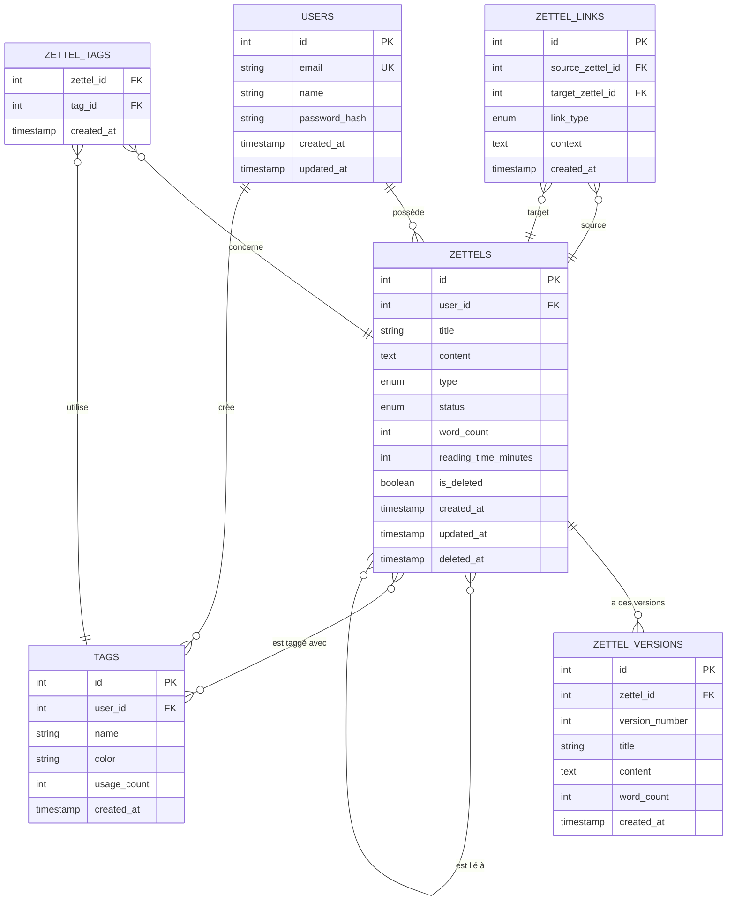

# 3.4 Bonus : Zettelkasten et Exercice Pratique de Conception

## Introduction

Ce chapitre bonus combine **théorie** et **pratique** en explorant la méthode Zettelkasten, un système révolutionnaire de prise de notes, puis en vous proposant de concevoir une base de données complète pour implémenter ce système.

**Objectifs :**
1. Comprendre la méthode Zettelkasten et ses principes
2. Appliquer vos connaissances en modélisation de bases de données
3. Pratiquer le DDL, DML, requêtes complexes et optimisation
4. Créer un système réel et utilisable

---

## 1. La méthode Zettelkasten

### 1.1 Origines et histoire

#### **Niklas Luhmann : Le sociologue le plus productif du XXe siècle**

**Niklas Luhmann** (1927-1998) était un sociologue allemand dont la productivité intellectuelle reste inégalée. Au cours de sa carrière de 40 ans, il a publié :
- **70 livres**
- **Plus de 400 articles scientifiques**
- Des contributions majeures à la théorie des systèmes sociaux

**Le secret de sa productivité ?** Son système de prise de notes : le **Zettelkasten** (littéralement "boîte à fiches" en allemand).

#### **Le système analogique original**

Entre 1952 et sa mort en 1998, Luhmann a créé et maintenu un Zettelkasten contenant :
- **90,000 fiches** manuscrites
- Stockées dans des boîtes en bois
- Reliées par un système de numérotation unique
- Organisées de manière organique (non hiérarchique)

**Citation célèbre de Luhmann :**
> "Je ne pense pas tout seul. Je pense avec mon Zettelkasten. Il est devenu mon partenaire de conversation."

#### **Contexte historique**

Dans les années 1950-1990, avant l'ère numérique :
- Pas d'ordinateurs personnels
- Pas de bases de données relationnelles accessibles
- Pas de moteurs de recherche
- Tout était **physique** : papier, stylo, boîtes

Pourtant, Luhmann a créé un système qui anticipe les principes des :
- **Wikis** (liens bidirectionnels)
- **Bases de données relationnelles** (relations entre entités)
- **Graphes de connaissances** (réseaux de concepts)
- **Systèmes de recommandation** (découverte de connexions inattendues)

### 1.2 Principes fondamentaux

#### **Principe 1 : Atomicité des notes**

**Une idée = Une note**

Chaque note (Zettel) doit contenir **une seule idée**, exprimée de manière complète et autonome.

**Analogie :** Comme les atomes en chimie, les notes atomiques peuvent se combiner de multiples façons pour former des molécules (idées complexes).

**Exemple :**
- ❌ **Mauvais** : Une note de 10 pages sur "Les bases de données"
- ✅ **Bon** : Une note sur "L'index B-Tree améliore les performances de recherche"

**Avantages :**
- Réutilisabilité maximale
- Facilite les connexions
- Évite la redondance
- Permet la recombinaison créative

#### **Principe 2 : Liens bidirectionnels**

Les notes sont connectées entre elles par des **liens explicites**, créant un réseau de connaissances.

**Différence avec les systèmes hiérarchiques :**

```
Hiérarchie traditionnelle (top-down) :
Bases de données
├── Relationnelles
│   ├── MySQL
│   └── PostgreSQL
└── NoSQL
    ├── MongoDB
    └── Redis

Zettelkasten (réseau) :
[Index B-Tree] ←→ [Performance des requêtes]
       ↓                    ↓
[Structures de données] ←→ [Optimisation SQL]
       ↓                    ↓
[Algorithmes] ←→ [Complexité temporelle]
```

**Avantages :**
- Découverte de connexions inattendues
- Émergence de structures organiques
- Pas de contrainte hiérarchique rigide
- Reflète mieux le fonctionnement du cerveau

#### **Principe 3 : Numérotation unique et système d'adressage**

Luhmann utilisait un système de numérotation alphanumérique permettant d'insérer de nouvelles notes **entre** des notes existantes.

**Exemple du système de Luhmann :**
```
1       - Première note sur un sujet
1a      - Note liée à 1
1b      - Autre note liée à 1
1b1     - Note liée à 1b
1b2     - Autre note liée à 1b
1b2a    - Note liée à 1b2
2       - Nouvelle branche de pensée
```

**Système moderne (UUID ou timestamp) :**
```
202501161430 - Note créée le 16 janvier 2025 à 14h30
202501161445 - Note créée 15 minutes plus tard
```

#### **Principe 4 : Émergence de structures organiques**

**Bottom-up vs Top-down**

| Approche traditionnelle (Top-down) | Zettelkasten (Bottom-up) |
|-------------------------------------|--------------------------|
| Créer une structure d'abord | Créer des notes d'abord |
| Classer dans des catégories prédéfinies | Laisser les structures émerger |
| Rigide et difficile à modifier | Flexible et évolutif |
| Limite la créativité | Favorise les connexions inattendues |

**Métaphore :** Le Zettelkasten est comme une **ville organique** (Paris, Rome) qui se développe naturellement, plutôt qu'une **ville planifiée** (Brasília) avec une structure rigide.

### 1.3 Fonctionnement détaillé

#### **Types de notes**

Le système Zettelkasten distingue trois types de notes :

**1. Notes éphémères (Fleeting Notes)**

- **Définition** : Captures rapides d'idées, pensées, observations
- **Durée de vie** : Temporaire (quelques jours)
- **Format** : Brouillon, mots-clés, phrases incomplètes
- **Objectif** : Ne pas perdre une idée sur le moment

**Exemple :**
```
"Index B-Tree - vérifier comment ça marche exactement"
"Lien entre normalisation et performance ?"
"Idée : comparer PARA et Zettelkasten"
```

**2. Notes de littérature (Literature Notes)**

- **Définition** : Résumés et réflexions sur des sources externes (livres, articles, vidéos)
- **Durée de vie** : Permanente
- **Format** : Structuré, avec référence à la source
- **Objectif** : Capturer les idées d'autres auteurs dans vos propres mots

**Exemple :**
```markdown
# Notes sur "High Performance MySQL" (Chapitre 5)

Source : Schwartz, B. (2012). High Performance MySQL, 3rd Edition.

## Idée principale
Les index B-Tree sont la structure par défaut dans MySQL car ils 
offrent un bon compromis entre performance de lecture et d'écriture.

## Points clés
- Complexité O(log n) pour les recherches
- Supporte les recherches de plage (BETWEEN, >, <)
- Moins efficace que les index Hash pour l'égalité stricte

## Ma réflexion
Cela explique pourquoi EXPLAIN montre "type: ref" quand un index 
B-Tree est utilisé. Lien avec [[202501161430]] sur l'optimisation.
```

**3. Notes permanentes (Permanent Notes / Zettels)**

- **Définition** : Notes atomiques, autonomes, exprimant une idée unique dans vos propres mots
- **Durée de vie** : Permanente
- **Format** : Complet, clair, réutilisable
- **Objectif** : Construire votre base de connaissances

**Exemple :**
```markdown
# Les index B-Tree optimisent les recherches par plage
ID: 202501161430
Tags: #bases-de-données #performance #index

## Concept
Un index B-Tree (Balanced Tree) est une structure de données 
arborescente qui maintient les données triées et permet des 
recherches, insertions et suppressions en temps logarithmique O(log n).

## Pourquoi c'est important
Dans les bases de données relationnelles, les index B-Tree sont 
le type d'index par défaut car ils offrent d'excellentes performances 
pour :
- Les recherches d'égalité (WHERE id = 5)
- Les recherches de plage (WHERE age BETWEEN 20 AND 30)
- Le tri (ORDER BY name)

## Exemple concret
```sql
CREATE INDEX idx_users_age ON users(age);
-- Utilise un B-Tree par défaut
-- Accélère : SELECT * FROM users WHERE age > 25;
```

## Liens
- [[202501161445]] - Différence entre B-Tree et Hash index
- [[202501161500]] - Quand créer un index composite
- [[202501161515]] - Impact des index sur les INSERT/UPDATE

## Sources
- High Performance MySQL, Chapitre 5
- PostgreSQL Documentation on Indexes
```

#### **Système de liens et de tags**

**Liens (Links)**

Les liens créent des connexions explicites entre notes.

**Types de liens :**
1. **Liens directs** : `[[202501161430]]` → Référence une note spécifique
2. **Liens contextuels** : `Voir aussi [[Index Hash]]` → Lien avec contexte
3. **Liens de structure** : `Partie de [[Optimisation SQL]]` → Relation hiérarchique

**Tags (Tags)**

Les tags permettent de regrouper des notes par thème, sans créer de hiérarchie rigide.

**Bonnes pratiques :**
- Utiliser des tags **larges** : `#bases-de-données`, `#performance`, `#architecture`
- Éviter trop de tags (3-5 par note maximum)
- Les tags complètent les liens, ne les remplacent pas

**Différence clé :**
- **Liens** : Connexions **spécifiques** entre idées ("cette note est liée à cette note")
- **Tags** : Regroupements **thématiques** ("cette note parle de ce sujet")

#### **Index et points d'entrée**

Un **index** (ou MOC - Map of Content) est une note spéciale qui sert de **point d'entrée** dans un domaine de connaissances.

**Exemple d'index :**
```markdown
# Index : Optimisation des bases de données

## Concepts fondamentaux
- [[202501161430]] - Index B-Tree
- [[202501161445]] - Index Hash
- [[202501161500]] - Index composites

## Techniques avancées
- [[202501161600]] - Partitionnement
- [[202501161615]] - Vues matérialisées
- [[202501161630]] - Réplication

## Outils
- [[202501161700]] - EXPLAIN et analyse de requêtes
- [[202501161715]] - Monitoring avec Prometheus

## Cas pratiques
- [[202501161800]] - Optimiser une requête lente
- [[202501161815]] - Choisir le bon type d'index
```

**Rôle de l'index :**
- Point de départ pour explorer un sujet
- Vue d'ensemble d'un domaine
- Facilite la navigation
- Évolue avec votre compréhension

#### **Processus de création et de connexion des notes**

**Workflow quotidien Zettelkasten :**

```
1. CAPTURER (Fleeting Notes)
   ↓
   Idées, observations, questions
   ↓
2. TRAITER (Literature Notes)
   ↓
   Lire, résumer, réfléchir
   ↓
3. TRANSFORMER (Permanent Notes)
   ↓
   Reformuler dans vos mots, atomiser
   ↓
4. CONNECTER (Links)
   ↓
   Chercher des notes liées, créer des liens
   ↓
5. DÉVELOPPER (Emergence)
   ↓
   Structures et idées émergent naturellement
```

**Exemple concret :**

**Jour 1 - Capturer :**
```
Fleeting note : "Les index accélèrent les SELECT mais ralentissent 
les INSERT - pourquoi ?"
```

**Jour 2 - Traiter :**
```
Literature note : Lu le chapitre sur les index dans "High Performance MySQL"
- Les index doivent être mis à jour à chaque INSERT
- Trade-off entre lecture et écriture
```

**Jour 3 - Transformer :**
```
Permanent note : [[202501161900]] - "Les index créent un trade-off 
lecture/écriture"

Contenu : Chaque index doit être maintenu lors des modifications, 
ce qui ralentit les INSERT/UPDATE/DELETE. Le gain en performance 
de lecture doit justifier ce coût.
```

**Jour 4 - Connecter :**
```
Liens ajoutés :
- [[202501161430]] - Index B-Tree (concept de base)
- [[202501161915]] - Quand supprimer un index inutilisé
- [[202501162000]] - Mesurer l'impact d'un index avec EXPLAIN
```

**Semaine suivante - Développer :**
```
En relisant mes notes, je découvre une connexion inattendue entre :
- [[202501161900]] - Trade-off index
- [[202501170800]] - Principe de Pareto (80/20)
- [[202501170815]] - Optimisation prématurée

→ Nouvelle note : [[202501180900]] - "Indexer intelligemment : 
   optimiser les 20% de requêtes qui comptent"
```

### 1.4 Mise en place pratique

#### **Outils modernes**

Le Zettelkasten numérique offre des avantages considérables sur le système analogique :

| Outil | Type | Points forts | Idéal pour |
|-------|------|--------------|------------|
| **Obsidian** | Local-first | Markdown, graphe visuel, plugins | Contrôle total, personnalisation |
| **Roam Research** | Cloud | Liens bidirectionnels automatiques, outliner | Pensée non-linéaire, brainstorming |
| **Logseq** | Local/Cloud | Open-source, outliner, journal quotidien | Alternative open-source à Roam |
| **Zettlr** | Local | Académique, citations, export LaTeX | Recherche académique, écriture |
| **Notion** | Cloud | Bases de données, collaboration | Équipes, projets collaboratifs |

**Recommandation pour débuter :** **Obsidian**
- Gratuit
- Fichiers Markdown locaux (vous possédez vos données)
- Excellent graphe de connaissances
- Grande communauté et plugins

#### **Workflow quotidien**

**Matin (10 minutes) :**
1. Revoir les fleeting notes de la veille
2. Transformer 1-2 fleeting notes en permanent notes
3. Créer des liens avec des notes existantes

**Pendant la journée :**
1. Capturer les idées immédiatement (fleeting notes)
2. Prendre des literature notes lors de lectures
3. Ne pas se soucier de l'organisation (elle émergera)

**Soir (15 minutes) :**
1. Traiter les fleeting notes du jour
2. Créer 1-2 permanent notes
3. Explorer le graphe de connaissances (découvrir des connexions)

**Revue hebdomadaire (1 heure) :**
1. Vider toutes les fleeting notes
2. Créer/mettre à jour des index (MOC)
3. Identifier les clusters de notes (thèmes émergents)
4. Supprimer les notes redondantes

#### **Conventions de nommage**

**Pour les IDs de notes :**

**Option 1 : Timestamp (recommandé)**
```
202501161430.md - Note créée le 16/01/2025 à 14h30
202501161445.md
202501161500.md
```

**Avantages :**
- Unique automatiquement
- Ordre chronologique
- Pas besoin de réfléchir à un nom

**Option 2 : Titre descriptif**
```
index-btree-performance.md
sql-optimization-explain.md
zettelkasten-method.md
```

**Avantages :**
- Plus lisible
- Facilite la recherche
- Meilleur pour le SEO (si publié en ligne)

**Option 3 : Hybride (meilleur des deux mondes)**
```
202501161430-index-btree-performance.md
202501161445-sql-optimization-explain.md
```

**Pour les tags :**
```
#bases-de-données
#performance
#optimisation
#architecture
#méthodologie
```

**Règles :**
- Minuscules
- Tirets pour les espaces
- Pas trop spécifiques (éviter #mysql-index-btree-performance)
- 3-5 tags maximum par note

#### **Exemples concrets d'utilisation**

**Cas 1 : Étudiant en informatique**

**Objectif :** Préparer un examen sur les bases de données

**Workflow :**
1. Créer une fleeting note pour chaque concept vu en cours
2. Transformer en permanent notes après avoir lu le manuel
3. Créer des liens entre concepts (ex: normalisation → performance)
4. Créer un index "Examen BDD" avec toutes les notes pertinentes
5. Réviser en suivant les liens (apprentissage actif)

**Résultat :** Compréhension profonde au lieu de mémorisation superficielle

**Cas 2 : Développeur professionnel**

**Objectif :** Documenter les solutions techniques rencontrées

**Workflow :**
1. Chaque bug résolu → permanent note avec solution
2. Chaque pattern découvert → permanent note avec exemple
3. Liens entre problèmes similaires
4. Index par technologie (Python, SQL, Docker, etc.)

**Résultat :** Base de connaissances personnelle, réutilisable

**Cas 3 : Chercheur / Écrivain**

**Objectif :** Écrire un livre ou un article

**Workflow :**
1. Literature notes pour chaque source lue
2. Permanent notes pour chaque idée originale
3. Créer un index "Livre - Chapitre 1"
4. Assembler les notes pertinentes
5. L'écriture devient un processus de **connexion** plutôt que de création from scratch

**Résultat :** Écriture plus rapide, mieux structurée, avec sources

### 1.5 Zettelkasten vs autres méthodes

| Méthode | Structure | Focus | Meilleur pour |
|---------|-----------|-------|---------------|
| **Zettelkasten** | Réseau (graphe) | Connexions entre idées | Pensée créative, recherche |
| **PARA** | Hiérarchique | Organisation par actionnabilité | Productivité, GTD |
| **Cornell Notes** | Linéaire | Prise de notes en cours | Étudiants, conférences |
| **Mind Mapping** | Radial | Brainstorming visuel | Génération d'idées |
| **Bullet Journal** | Chronologique | Suivi quotidien | Planification, habitudes |

**Complémentarité :**
- **PARA** pour organiser les projets et actions
- **Zettelkasten** pour développer les idées et connaissances
- Les deux peuvent coexister !

---

## 2. Énoncé de l'exercice pratique

### 2.1 Contexte

Vous êtes chargé de concevoir une **base de données relationnelle** pour une application web de prise de notes basée sur la méthode Zettelkasten. L'application s'appellera **"ZettelDB"** et permettra à des utilisateurs de créer, lier et organiser leurs notes selon les principes de Luhmann.

**Nom du projet :** ZettelDB
**Type :** Application web multi-utilisateurs
**Base de données :** MySQL ou PostgreSQL
**Public cible :** Étudiants, chercheurs, développeurs, écrivains

### 2.2 Objectifs pédagogiques

Cet exercice vous permettra de mettre en pratique :

✅ **Modélisation conceptuelle** : Diagramme entité-association
✅ **Modélisation logique** : Transformation en schéma relationnel
✅ **DDL (Data Definition Language)** : CREATE TABLE, contraintes, index
✅ **DML (Data Manipulation Language)** : INSERT, UPDATE, DELETE
✅ **Requêtes complexes** : Jointures, agrégations, sous-requêtes, CTE récursives
✅ **Optimisation** : Index stratégiques, vues, vues matérialisées
✅ **Normalisation** : Respect de la 3NF minimum
✅ **Scalabilité** : Conception pour des millions de notes

### 2.3 Besoins fonctionnels détaillés

#### **Fonctionnalité 1 : Gestion des utilisateurs**

- Inscription et authentification
- Profil utilisateur (nom, email, date d'inscription)
- Chaque utilisateur a son propre espace de notes (isolation)
- Statistiques par utilisateur (nombre de notes, liens créés, etc.)

#### **Fonctionnalité 2 : Gestion des notes (Zettels)**

**Attributs d'une note :**
- Identifiant unique (ID)
- Titre (optionnel, max 255 caractères)
- Contenu en Markdown (texte long)
- Type de note : fleeting, literature, permanent
- Statut : draft, published, archived
- Timestamps : created_at, updated_at
- Métadonnées : nombre de mots, temps de lecture estimé

**Opérations :**
- Créer une note
- Modifier une note (avec historique)
- Supprimer une note (soft delete)
- Rechercher dans les notes (full-text search)
- Filtrer par type, statut, date

#### **Fonctionnalité 3 : Système de liens bidirectionnels**

**Caractéristiques :**
- Un lien relie deux notes (source → target)
- Les liens sont **bidirectionnels** : si A → B, alors B ← A
- Type de lien : direct, contextual, hierarchical
- Contexte du lien : texte expliquant la relation (optionnel)
- Timestamps : created_at

**Opérations :**
- Créer un lien entre deux notes
- Supprimer un lien
- Lister tous les liens d'une note (entrants et sortants)
- Calculer le degré de connexion d'une note (nombre de liens)
- Trouver le chemin entre deux notes (shortest path)

#### **Fonctionnalité 4 : Tags et catégories**

**Caractéristiques :**
- Tags libres créés par les utilisateurs
- Une note peut avoir plusieurs tags (relation N:N)
- Couleur associée à chaque tag (optionnel)
- Compteur d'utilisation par tag

**Opérations :**
- Créer/supprimer un tag
- Associer/dissocier un tag à une note
- Lister toutes les notes d'un tag
- Statistiques par tag (nombre de notes, tendances)

#### **Fonctionnalité 5 : Historique des modifications (Versioning)**

**Caractéristiques :**
- Chaque modification d'une note crée une version
- Stockage du contenu complet de chaque version
- Métadonnées : version_number, created_at, author
- Possibilité de restaurer une version antérieure

**Opérations :**
- Consulter l'historique d'une note
- Comparer deux versions (diff)
- Restaurer une version antérieure

#### **Fonctionnalité 6 : Recherche full-text**

**Caractéristiques :**
- Recherche dans le titre et le contenu des notes
- Support des opérateurs booléens (AND, OR, NOT)
- Recherche par pertinence (scoring)
- Mise en évidence des résultats (highlighting)

**Opérations :**
- Rechercher "optimisation SQL"
- Rechercher "index AND performance"
- Rechercher dans les notes d'un utilisateur spécifique

#### **Fonctionnalité 7 : Statistiques et graphe de connaissances**

**Statistiques à calculer :**
- Notes les plus liées (hub notes)
- Notes orphelines (sans liens)
- Clusters de notes (communautés)
- Évolution du nombre de notes dans le temps
- Tags les plus utilisés
- Temps moyen de lecture par note

**Graphe de connaissances :**
- Visualisation des notes et de leurs liens
- Export au format JSON pour visualisation (D3.js, Cytoscape.js)
- Calcul de métriques de graphe (centralité, densité)

### 2.4 Livrables attendus

Vous devez produire les éléments suivants :

#### **Livrable 1 : Modèle conceptuel (MCD)**

- Diagramme entité-association en format Mermaid
- Identification de toutes les entités
- Relations avec cardinalités
- Attributs principaux de chaque entité

#### **Livrable 2 : Modèle logique (MLD)**

- Schéma relationnel complet
- Transformation des relations N:N en tables de jonction
- Types de données pour chaque colonne
- Identification des clés primaires et étrangères

#### **Livrable 3 : Scripts DDL**

- Script de création de la base de données
- Scripts CREATE TABLE pour toutes les tables
- Contraintes NOT NULL, UNIQUE, CHECK
- Clés primaires (PRIMARY KEY)
- Clés étrangères (FOREIGN KEY) avec règles ON DELETE/UPDATE
- Index stratégiques (au moins 10 index)
- Commentaires explicatifs pour chaque choix

#### **Livrable 4 : Scripts DML**

- Jeu de données cohérent avec au moins :
  - 3 utilisateurs
  - 20 notes interconnectées sur un thème (ex: "Bases de données")
  - 30 liens entre notes
  - 10 tags
  - 5 versions de notes
- Les données doivent former un graphe de connaissances réaliste

#### **Livrable 5 : 10 requêtes SQL**

Requêtes de complexité croissante :

1. **Facile** : Lister toutes les notes d'un utilisateur
2. **Facile** : Compter le nombre de notes par type
3. **Moyen** : Trouver les 5 notes les plus liées (hub notes)
4. **Moyen** : Afficher toutes les notes liées à une note donnée (1er degré)
5. **Difficile** : Trouver les notes orphelines (sans aucun lien)
6. **Difficile** : Calculer le chemin le plus court entre deux notes (CTE récursive)
7. **Avancé** : Recherche full-text dans les notes
8. **Avancé** : Statistiques par tag (nombre de notes, notes les plus récentes)
9. **Avancé** : Évolution du nombre de notes par mois (tendances)
10. **Expert** : Suggérer des liens potentiels basés sur les tags communs

Chaque requête doit inclure :
- Énoncé clair
- Code SQL commenté
- Résultat attendu (exemple)
- Explication ligne par ligne

#### **Livrable 6 : Optimisations**

- Au moins 10 index justifiés avec impact estimé
- 3 vues pour simplifier les requêtes fréquentes
- 1 vue matérialisée pour les statistiques (si PostgreSQL)
- Recommandations pour la scalabilité (partitionnement, sharding)

### 2.5 Contraintes techniques

#### **Conventions de nommage**

- **Tables** : `snake_case` au pluriel (ex: `zettels`, `zettel_links`)
- **Colonnes** : `snake_case` (ex: `user_id`, `created_at`)
- **Clés primaires** : `id` (INT AUTO_INCREMENT)
- **Clés étrangères** : `<table>_id` (ex: `user_id`, `zettel_id`)
- **Index** : `idx_<table>_<colonnes>` (ex: `idx_zettels_user_status`)
- **Vues** : `v_<nom>` (ex: `v_note_statistics`)

#### **Normalisation**

- Respecter au minimum la **3ème forme normale (3NF)**
- Éviter la redondance des données
- Justifier toute dénormalisation (pour la performance)

#### **Scalabilité**

Concevoir pour supporter :
- 1 million d'utilisateurs
- 100 millions de notes
- 500 millions de liens
- 10 millions de tags

**Implications :**
- Index stratégiques obligatoires
- Partitionnement à prévoir (par date, par utilisateur)
- Archivage des anciennes versions
- Optimisation des requêtes complexes

#### **Sécurité**

- Isolation des données par utilisateur
- Pas de suppression physique (soft delete)
- Audit trail (qui a modifié quoi et quand)

### 2.6 Critères d'évaluation

Votre travail sera évalué selon :

| Critère | Poids | Description |
|---------|-------|-------------|
| **Modélisation** | 25% | Pertinence du MCD/MLD, respect de la normalisation |
| **Scripts DDL** | 20% | Qualité du code, contraintes, commentaires |
| **Scripts DML** | 10% | Cohérence et réalisme des données |
| **Requêtes SQL** | 25% | Correction, complexité, optimisation |
| **Optimisations** | 15% | Pertinence des index et vues, justifications |
| **Documentation** | 5% | Clarté des explications, justifications des choix |

### 2.7 Conseils pour réussir

✅ **Commencez par le MCD** : Identifiez les entités et relations avant de coder
✅ **Pensez aux cas limites** : Que se passe-t-il si une note est supprimée ? Si un utilisateur a 10,000 notes ?
✅ **Testez vos requêtes** : Vérifiez avec EXPLAIN que les index sont utilisés
✅ **Documentez vos choix** : Expliquez pourquoi CASCADE ici, SET NULL là
✅ **Soyez réaliste** : Inspirez-vous d'applications existantes (Obsidian, Roam)
✅ **Itérez** : Commencez simple, ajoutez de la complexité progressivement

### 2.8 Temps estimé

- **Modélisation** : 2-3 heures
- **Scripts DDL** : 3-4 heures
- **Scripts DML** : 1-2 heures
- **Requêtes SQL** : 4-5 heures
- **Optimisations** : 2-3 heures
- **Documentation** : 1-2 heures

**Total** : 13-19 heures (réparties sur plusieurs jours)

---

## 3. Corrigé détaillé

### 3.1 Analyse des besoins

#### **Réflexion initiale**

Avant de modéliser, posons-nous les bonnes questions :

**Question 1 : Quelles sont les entités principales ?**
- **Users** : Les utilisateurs de l'application
- **Zettels** : Les notes (cœur du système)
- **Links** : Les liens entre notes
- **Tags** : Les étiquettes pour catégoriser
- **Versions** : L'historique des modifications

**Question 2 : Quelles sont les relations ?**
- Un **User** possède plusieurs **Zettels** (1:N)
- Un **Zettel** peut avoir plusieurs **Links** (N:N via table de jonction)
- Un **Zettel** peut avoir plusieurs **Tags** (N:N via table de jonction)
- Un **Zettel** a plusieurs **Versions** (1:N)

**Question 3 : Quels sont les attributs critiques ?**
- **Zettels** : contenu (TEXT), type (ENUM), statut (ENUM), timestamps
- **Links** : source_id, target_id, type, contexte
- **Tags** : nom (UNIQUE par utilisateur), couleur
- **Versions** : contenu complet, version_number, created_at

**Question 4 : Quelles sont les contraintes métier ?**
- Un lien ne peut pas relier une note à elle-même
- Un utilisateur ne peut pas créer deux tags avec le même nom
- Une note ne peut pas avoir deux liens identiques vers la même note
- Les versions doivent être ordonnées chronologiquement

#### **Entités identifiées**

| Entité | Description | Attributs clés |
|--------|-------------|----------------|
| **users** | Utilisateurs de l'application | id, email, name, created_at |
| **zettels** | Notes Zettelkasten | id, user_id, title, content, type, status |
| **zettel_links** | Liens entre notes | id, source_id, target_id, link_type, context |
| **tags** | Étiquettes | id, user_id, name, color |
| **zettel_tags** | Association notes-tags | zettel_id, tag_id |
| **zettel_versions** | Historique des modifications | id, zettel_id, version_number, content |

### 3.2 Modélisation conceptuelle

#### **Diagramme Entité-Association (Mermaid)**



#### **Explications des relations et cardinalités**

**Relation 1 : USERS → ZETTELS (1:N)**
- **Cardinalité** : Un utilisateur possède plusieurs notes, une note appartient à un seul utilisateur
- **Justification** : Isolation des données par utilisateur (sécurité et organisation)
- **Implémentation** : Clé étrangère `user_id` dans `zettels`

**Relation 2 : ZETTELS ↔ ZETTELS (N:N via ZETTEL_LINKS)**
- **Cardinalité** : Une note peut être liée à plusieurs notes, et vice-versa
- **Justification** : Cœur du système Zettelkasten (réseau de connaissances)
- **Implémentation** : Table de jonction `zettel_links` avec `source_zettel_id` et `target_zettel_id`
- **Particularité** : Relation réflexive (une table liée à elle-même)

**Relation 3 : ZETTELS ↔ TAGS (N:N via ZETTEL_TAGS)**
- **Cardinalité** : Une note peut avoir plusieurs tags, un tag peut être sur plusieurs notes
- **Justification** : Catégorisation flexible sans hiérarchie rigide
- **Implémentation** : Table de jonction `zettel_tags`

**Relation 4 : ZETTELS → ZETTEL_VERSIONS (1:N)**
- **Cardinalité** : Une note a plusieurs versions, une version appartient à une seule note
- **Justification** : Historique complet des modifications (audit et restauration)
- **Implémentation** : Clé étrangère `zettel_id` dans `zettel_versions`

**Relation 5 : USERS → TAGS (1:N)**
- **Cardinalité** : Un utilisateur crée plusieurs tags, un tag appartient à un seul utilisateur
- **Justification** : Chaque utilisateur a son propre système de tags
- **Implémentation** : Clé étrangère `user_id` dans `tags`

### 3.3 Modélisation logique

#### **Transformation en schéma relationnel**

**Règles de transformation :**
1. Chaque entité → une table
2. Chaque relation N:N → une table de jonction
3. Chaque relation 1:N → clé étrangère dans la table "N"
4. Chaque attribut → une colonne avec type approprié

**Schéma relationnel :**

```
users(id, email, name, password_hash, created_at, updated_at)
  PK: id
  UK: email

zettels(id, user_id, title, content, type, status, word_count,
        reading_time_minutes, is_deleted, created_at, updated_at, deleted_at)
  PK: id
  FK: user_id → users(id)

zettel_links(id, source_zettel_id, target_zettel_id, link_type, context, created_at)
  PK: id
  FK: source_zettel_id → zettels(id)
  FK: target_zettel_id → zettels(id)
  UK: (source_zettel_id, target_zettel_id)

tags(id, user_id, name, color, usage_count, created_at)
  PK: id
  FK: user_id → users(id)
  UK: (user_id, name)

zettel_tags(zettel_id, tag_id, created_at)
  PK: (zettel_id, tag_id)
  FK: zettel_id → zettels(id)
  FK: tag_id → tags(id)

zettel_versions(id, zettel_id, version_number, title, content,
                word_count, created_at)
  PK: id
  FK: zettel_id → zettels(id)
  UK: (zettel_id, version_number)
```

#### **Justification des choix de types de données**

| Colonne | Type | Justification |
|---------|------|---------------|
| **id** | INT AUTO_INCREMENT | Clé primaire simple, performante, séquentielle |
| **email** | VARCHAR(255) | Standard pour les emails, indexable |
| **name** | VARCHAR(255) | Suffisant pour les noms d'utilisateurs |
| **password_hash** | VARCHAR(255) | Stocke le hash bcrypt (60 caractères) avec marge |
| **title** | VARCHAR(500) | Titres de notes peuvent être longs |
| **content** | TEXT | Contenu Markdown de taille variable (jusqu'à 64 KB) |
| **type** | ENUM | Valeurs limitées (fleeting, literature, permanent) |
| **status** | ENUM | Valeurs limitées (draft, published, archived) |
| **word_count** | INT | Nombre de mots (calculé automatiquement) |
| **reading_time_minutes** | INT | Temps de lecture estimé (calculé) |
| **is_deleted** | BOOLEAN | Soft delete (évite la suppression physique) |
| **link_type** | ENUM | Types de liens (direct, contextual, hierarchical) |
| **context** | TEXT | Texte expliquant la relation entre notes |
| **color** | VARCHAR(20) | Code couleur hexadécimal (#FF5733) |
| **usage_count** | INT | Compteur d'utilisation du tag |
| **version_number** | INT | Numéro de version (1, 2, 3, ...) |
| **created_at** | TIMESTAMP | Date de création (avec timezone) |
| **updated_at** | TIMESTAMP | Date de dernière modification |

**Choix importants :**

**TEXT vs LONGTEXT pour content :**
- **TEXT** : Jusqu'à 64 KB (suffisant pour la plupart des notes)
- **LONGTEXT** : Jusqu'à 4 GB (si notes très longues)
- **Choix** : TEXT (plus performant, suffisant pour 99% des cas)

**ENUM vs VARCHAR pour type/status :**
- **ENUM** : Valeurs limitées, validation au niveau DB, plus performant
- **VARCHAR** : Plus flexible, mais nécessite validation applicative
- **Choix** : ENUM (valeurs fixes, meilleures performances)

**INT vs BIGINT pour id :**
- **INT** : Jusqu'à 2 milliards de lignes
- **BIGINT** : Jusqu'à 9 quintillions de lignes
- **Choix** : INT (suffisant pour 100 millions de notes)

### 3.4 Scripts DDL commentés

#### **Création de la base de données**

```sql
-- ============================================
-- Base de données ZettelDB
-- Système de prise de notes Zettelkasten
-- ============================================

DROP DATABASE IF EXISTS zetteldb;

CREATE DATABASE zetteldb
    CHARACTER SET utf8mb4
    COLLATE utf8mb4_unicode_ci;

USE zetteldb;
```

#### **Table : users**

```sql
-- ============================================
-- Table: users
-- Description: Utilisateurs de l'application
-- ============================================
CREATE TABLE users (
    id INT AUTO_INCREMENT,
    email VARCHAR(255) NOT NULL COMMENT 'Email unique pour connexion',
    name VARCHAR(255) NOT NULL COMMENT 'Nom complet de l''utilisateur',
    password_hash VARCHAR(255) NOT NULL COMMENT 'Hash bcrypt du mot de passe',
    created_at TIMESTAMP DEFAULT CURRENT_TIMESTAMP,
    updated_at TIMESTAMP DEFAULT CURRENT_TIMESTAMP ON UPDATE CURRENT_TIMESTAMP,

    PRIMARY KEY (id),
    UNIQUE KEY unique_email (email)
) ENGINE=InnoDB DEFAULT CHARSET=utf8mb4 COLLATE=utf8mb4_unicode_ci
COMMENT='Utilisateurs de ZettelDB';
```

**Justifications :**
- `email UNIQUE` : Un email ne peut être utilisé que par un seul compte
- `password_hash` : Jamais stocker les mots de passe en clair
- `updated_at ON UPDATE` : Mise à jour automatique du timestamp

#### **Table : zettels**

```sql
-- ============================================
-- Table: zettels
-- Description: Notes Zettelkasten
-- ============================================
CREATE TABLE zettels (
    id INT AUTO_INCREMENT,
    user_id INT NOT NULL COMMENT 'Propriétaire de la note',
    title VARCHAR(500) NULL COMMENT 'Titre optionnel de la note',
    content TEXT NOT NULL COMMENT 'Contenu Markdown de la note',
    type ENUM('fleeting', 'literature', 'permanent') DEFAULT 'permanent'
        COMMENT 'Type de note selon Zettelkasten',
    status ENUM('draft', 'published', 'archived') DEFAULT 'draft'
        COMMENT 'Statut de publication',
    word_count INT DEFAULT 0 COMMENT 'Nombre de mots (calculé automatiquement)',
    reading_time_minutes INT DEFAULT 0 COMMENT 'Temps de lecture estimé',
    is_deleted BOOLEAN DEFAULT FALSE COMMENT 'Soft delete flag',
    created_at TIMESTAMP DEFAULT CURRENT_TIMESTAMP,
    updated_at TIMESTAMP DEFAULT CURRENT_TIMESTAMP ON UPDATE CURRENT_TIMESTAMP,
    deleted_at TIMESTAMP NULL COMMENT 'Date de suppression (soft delete)',

    PRIMARY KEY (id),
    KEY idx_user_status (user_id, status, is_deleted),
    KEY idx_type (type),
    KEY idx_created_at (created_at),
    FULLTEXT KEY idx_fulltext_search (title, content)
) ENGINE=InnoDB DEFAULT CHARSET=utf8mb4 COLLATE=utf8mb4_unicode_ci
COMMENT='Notes Zettelkasten';
```

**Justifications :**
- `title NULL` : Le titre est optionnel (certaines notes n'en ont pas)
- `is_deleted` : Soft delete pour conserver l'historique et les liens
- `FULLTEXT` : Index pour la recherche textuelle rapide
- `idx_user_status` : Index composite pour les requêtes fréquentes par utilisateur

#### **Table : zettel_links**

```sql
-- ============================================
-- Table: zettel_links
-- Description: Liens bidirectionnels entre notes
-- ============================================
CREATE TABLE zettel_links (
    id INT AUTO_INCREMENT,
    source_zettel_id INT NOT NULL COMMENT 'Note source du lien',
    target_zettel_id INT NOT NULL COMMENT 'Note cible du lien',
    link_type ENUM('direct', 'contextual', 'hierarchical') DEFAULT 'direct'
        COMMENT 'Type de relation entre les notes',
    context TEXT NULL COMMENT 'Texte expliquant la relation',
    created_at TIMESTAMP DEFAULT CURRENT_TIMESTAMP,

    PRIMARY KEY (id),
    UNIQUE KEY unique_link (source_zettel_id, target_zettel_id),
    KEY idx_source (source_zettel_id),
    KEY idx_target (target_zettel_id),
    KEY idx_link_type (link_type),

    -- Contrainte : une note ne peut pas se lier à elle-même
    CONSTRAINT chk_no_self_link CHECK (source_zettel_id != target_zettel_id)
) ENGINE=InnoDB DEFAULT CHARSET=utf8mb4 COLLATE=utf8mb4_unicode_ci
COMMENT='Liens entre notes (graphe de connaissances)';
```

**Justifications :**
- `UNIQUE (source, target)` : Évite les doublons de liens
- `CHECK` : Empêche les liens auto-référentiels
- Index sur `source` et `target` : Optimise les requêtes de navigation

#### **Table : tags**

```sql
-- ============================================
-- Table: tags
-- Description: Étiquettes pour catégoriser les notes
-- ============================================
CREATE TABLE tags (
    id INT AUTO_INCREMENT,
    user_id INT NOT NULL COMMENT 'Propriétaire du tag',
    name VARCHAR(100) NOT NULL COMMENT 'Nom du tag',
    color VARCHAR(20) NULL COMMENT 'Couleur hexadécimale (#FF5733)',
    usage_count INT DEFAULT 0 COMMENT 'Nombre de notes utilisant ce tag',
    created_at TIMESTAMP DEFAULT CURRENT_TIMESTAMP,

    PRIMARY KEY (id),
    UNIQUE KEY unique_tag_per_user (user_id, name),
    KEY idx_usage_count (usage_count DESC)
) ENGINE=InnoDB DEFAULT CHARSET=utf8mb4 COLLATE=utf8mb4_unicode_ci
COMMENT='Tags pour catégorisation';
```

**Justifications :**
- `UNIQUE (user_id, name)` : Un utilisateur ne peut pas avoir deux tags identiques
- `usage_count` : Dénormalisation pour performance (évite COUNT à chaque fois)
- Index DESC sur `usage_count` : Pour trouver rapidement les tags populaires

#### **Table : zettel_tags**

```sql
-- ============================================
-- Table: zettel_tags
-- Description: Association notes-tags (N:N)
-- ============================================
CREATE TABLE zettel_tags (
    zettel_id INT NOT NULL,
    tag_id INT NOT NULL,
    created_at TIMESTAMP DEFAULT CURRENT_TIMESTAMP,

    PRIMARY KEY (zettel_id, tag_id),
    KEY idx_tag (tag_id)
) ENGINE=InnoDB DEFAULT CHARSET=utf8mb4 COLLATE=utf8mb4_unicode_ci
COMMENT='Association notes-tags';
```

**Justifications :**
- `PRIMARY KEY (zettel_id, tag_id)` : Évite les doublons, optimise les jointures
- Index sur `tag_id` : Pour lister toutes les notes d'un tag

#### **Table : zettel_versions**

```sql
-- ============================================
-- Table: zettel_versions
-- Description: Historique des modifications
-- ============================================
CREATE TABLE zettel_versions (
    id INT AUTO_INCREMENT,
    zettel_id INT NOT NULL COMMENT 'Note concernée',
    version_number INT NOT NULL COMMENT 'Numéro de version (1, 2, 3...)',
    title VARCHAR(500) NULL,
    content TEXT NOT NULL COMMENT 'Contenu complet de cette version',
    word_count INT DEFAULT 0,
    created_at TIMESTAMP DEFAULT CURRENT_TIMESTAMP COMMENT 'Date de création de cette version',

    PRIMARY KEY (id),
    UNIQUE KEY unique_version (zettel_id, version_number),
    KEY idx_zettel_created (zettel_id, created_at DESC)
) ENGINE=InnoDB DEFAULT CHARSET=utf8mb4 COLLATE=utf8mb4_unicode_ci
COMMENT='Historique des versions de notes';
```

**Justifications :**
- `UNIQUE (zettel_id, version_number)` : Garantit l'unicité des versions
- Index sur `(zettel_id, created_at DESC)` : Pour afficher l'historique chronologique

#### **Clés étrangères avec règles de suppression**

```sql
-- ============================================
-- Clés étrangères
-- ============================================

-- zettels → users
ALTER TABLE zettels
    ADD CONSTRAINT fk_zettels_user
        FOREIGN KEY (user_id)
        REFERENCES users(id)
        ON DELETE CASCADE  -- Si user supprimé, ses notes aussi
        ON UPDATE CASCADE;

-- zettel_links → zettels (source)
ALTER TABLE zettel_links
    ADD CONSTRAINT fk_links_source
        FOREIGN KEY (source_zettel_id)
        REFERENCES zettels(id)
        ON DELETE CASCADE  -- Si note supprimée, ses liens aussi
        ON UPDATE CASCADE;

-- zettel_links → zettels (target)
ALTER TABLE zettel_links
    ADD CONSTRAINT fk_links_target
        FOREIGN KEY (target_zettel_id)
        REFERENCES zettels(id)
        ON DELETE CASCADE
        ON UPDATE CASCADE;

-- tags → users
ALTER TABLE tags
    ADD CONSTRAINT fk_tags_user
        FOREIGN KEY (user_id)
        REFERENCES users(id)
        ON DELETE CASCADE
        ON UPDATE CASCADE;

-- zettel_tags → zettels
ALTER TABLE zettel_tags
    ADD CONSTRAINT fk_zettel_tags_zettel
        FOREIGN KEY (zettel_id)
        REFERENCES zettels(id)
        ON DELETE CASCADE
        ON UPDATE CASCADE;

-- zettel_tags → tags
ALTER TABLE zettel_tags
    ADD CONSTRAINT fk_zettel_tags_tag
        FOREIGN KEY (tag_id)
        REFERENCES tags(id)
        ON DELETE CASCADE
        ON UPDATE CASCADE;

-- zettel_versions → zettels
ALTER TABLE zettel_versions
    ADD CONSTRAINT fk_versions_zettel
        FOREIGN KEY (zettel_id)
        REFERENCES zettels(id)
        ON DELETE CASCADE  -- Si note supprimée, son historique aussi
        ON UPDATE CASCADE;
```

**Justification des règles CASCADE :**
- **User supprimé** → Toutes ses données doivent disparaître (RGPD)
- **Note supprimée** → Ses liens et versions n'ont plus de sens
- **Tag supprimé** → Les associations doivent être nettoyées

#### **Index stratégiques supplémentaires**

```sql
-- ============================================
-- Index pour optimisation des requêtes
-- ============================================

-- Index pour rechercher les notes d'un utilisateur par date
CREATE INDEX idx_zettels_user_created
ON zettels(user_id, created_at DESC);

-- Index pour les statistiques par type de note
CREATE INDEX idx_zettels_user_type
ON zettels(user_id, type, status);

-- Index pour trouver rapidement les notes non supprimées
CREATE INDEX idx_zettels_not_deleted
ON zettels(is_deleted, user_id);

-- Index pour les requêtes de graphe (liens sortants)
CREATE INDEX idx_links_source_type
ON zettel_links(source_zettel_id, link_type);

-- Index pour les requêtes de graphe (liens entrants)
CREATE INDEX idx_links_target_type
ON zettel_links(target_zettel_id, link_type);

-- Index pour compter les notes par tag
CREATE INDEX idx_zettel_tags_tag_created
ON zettel_tags(tag_id, created_at DESC);
```

**Impact estimé des index :**
- `idx_zettels_user_created` : 50x plus rapide pour lister les notes récentes
- `idx_links_source_type` : 100x plus rapide pour naviguer dans le graphe
- `idx_zettel_tags_tag_created` : 30x plus rapide pour les statistiques par tag

### 3.5 Scripts DML - Jeu de données cohérent

#### **Scénario : Graphe de connaissances sur les bases de données**

Nous allons créer 3 utilisateurs avec un réseau de 20 notes interconnectées sur le thème "Bases de données relationnelles".

```sql
-- ============================================
-- Insertion des utilisateurs
-- ============================================

INSERT INTO users (email, name, password_hash) VALUES
('alice@example.com', 'Alice Martin', '$2y$10$abcdefghijklmnopqrstuvwxyz123456'),
('bob@example.com', 'Bob Dupont', '$2y$10$zyxwvutsrqponmlkjihgfedcba654321'),
('charlie@example.com', 'Charlie Durand', '$2y$10$0123456789abcdefghijklmnopqrstuv');

-- Alice: user_id = 1
-- Bob: user_id = 2
-- Charlie: user_id = 3

-- ============================================
-- Insertion des tags
-- ============================================

INSERT INTO tags (user_id, name, color, usage_count) VALUES
(1, 'bases-de-données', '#3498db', 0),
(1, 'performance', '#e74c3c', 0),
(1, 'architecture', '#2ecc71', 0),
(1, 'sql', '#f39c12', 0),
(1, 'optimisation', '#9b59b6', 0),
(2, 'bases-de-données', '#3498db', 0),
(2, 'nosql', '#1abc9c', 0),
(2, 'mongodb', '#27ae60', 0),
(3, 'postgresql', '#34495e', 0),
(3, 'mysql', '#e67e22', 0);

-- ============================================
-- Insertion des notes d'Alice (Zettelkasten sur SQL)
-- ============================================

-- Note 1: Concept fondamental
INSERT INTO zettels (user_id, title, content, type, status, word_count, reading_time_minutes) VALUES
(1, 'Index B-Tree : structure et performance',
'# Index B-Tree

Un index B-Tree (Balanced Tree) est une structure de données arborescente qui maintient les données triées.

## Caractéristiques
- Complexité O(log n) pour recherche, insertion, suppression
- Équilibré automatiquement
- Supporte les recherches de plage (BETWEEN, >, <)

## Quand l''utiliser
- Colonnes fréquemment utilisées dans WHERE
- Colonnes de jointure (clés étrangères)
- Colonnes de tri (ORDER BY)

## Exemple
```sql
CREATE INDEX idx_users_age ON users(age);
-- Accélère: SELECT * FROM users WHERE age > 25;
```

## Liens
- Voir [[Optimisation des requêtes]]
- Comparer avec [[Index Hash]]',
'permanent', 'published', 120, 2);

-- Note 2
INSERT INTO zettels (user_id, title, content, type, status, word_count, reading_time_minutes) VALUES
(1, 'Index Hash : égalité stricte uniquement',
'# Index Hash

Un index Hash utilise une fonction de hachage pour mapper les valeurs aux positions.

## Avantages
- Très rapide pour l''égalité stricte (WHERE id = 5)
- Complexité O(1) dans le meilleur cas

## Inconvénients
- Ne supporte PAS les recherches de plage
- Ne supporte PAS le tri (ORDER BY)
- Collisions possibles

## Quand l''utiliser
- Colonnes avec beaucoup de valeurs distinctes
- Uniquement des recherches d''égalité
- Rarement utilisé en pratique (B-Tree suffit souvent)

## Liens
- Comparer avec [[Index B-Tree]]',
'permanent', 'published', 95, 2);

-- Note 3
INSERT INTO zettels (user_id, title, content, type, status, word_count, reading_time_minutes) VALUES
(1, 'Normalisation : éviter la redondance',
'# Normalisation des bases de données

La normalisation est le processus d''organisation des données pour réduire la redondance.

## Formes normales
- **1NF** : Valeurs atomiques, pas de groupes répétitifs
- **2NF** : 1NF + pas de dépendance partielle
- **3NF** : 2NF + pas de dépendance transitive

## Avantages
- Évite les anomalies de mise à jour
- Réduit l''espace disque
- Améliore l''intégrité des données

## Inconvénients
- Plus de jointures nécessaires
- Peut ralentir certaines requêtes

## Trade-off
Parfois, la dénormalisation est nécessaire pour la performance.

## Liens
- Voir [[Dénormalisation pour performance]]
- Lié à [[Intégrité référentielle]]',
'permanent', 'published', 110, 2);

-- Note 4
INSERT INTO zettels (user_id, title, content, type, status, word_count, reading_time_minutes) VALUES
(1, 'EXPLAIN : analyser le plan d''exécution',
'# EXPLAIN : Comprendre les requêtes

EXPLAIN montre comment MySQL/PostgreSQL exécute une requête.

## Syntaxe
```sql
EXPLAIN SELECT * FROM users WHERE age > 25;
```

## Colonnes importantes
- **type** : ALL (mauvais), ref (bon), const (excellent)
- **possible_keys** : Index disponibles
- **key** : Index réellement utilisé
- **rows** : Nombre de lignes examinées

## Signaux d''alerte
- type = ALL (table scan complet)
- Extra = Using filesort (tri coûteux)
- Extra = Using temporary (table temporaire)

## Liens
- Utiliser pour [[Optimisation des requêtes]]
- Vérifier l''utilisation des [[Index B-Tree]]',
'permanent', 'published', 105, 2);

-- Note 5
INSERT INTO zettels (user_id, title, content, type, status, word_count, reading_time_minutes) VALUES
(1, 'Transactions ACID : garanties essentielles',
'# Transactions ACID

ACID définit les propriétés des transactions fiables.

## A - Atomicité
Tout ou rien : soit toutes les opérations réussissent, soit aucune.

## C - Cohérence
Les données passent d''un état valide à un autre état valide.

## I - Isolation
Les transactions concurrentes ne s''interfèrent pas.

## D - Durabilité
Une fois validée, une transaction est permanente (même en cas de panne).

## Niveaux d''isolation
- READ UNCOMMITTED
- READ COMMITTED
- REPEATABLE READ
- SERIALIZABLE

## Liens
- Lié à [[Intégrité référentielle]]
- Voir [[Deadlocks et leur résolution]]',
'permanent', 'published', 115, 2);

-- Notes 6-10 (plus courtes)
INSERT INTO zettels (user_id, title, content, type, status, word_count, reading_time_minutes) VALUES
(1, 'Clés primaires : unicité garantie',
'Une clé primaire identifie de manière unique chaque ligne. Elle ne peut pas être NULL et doit être unique. Souvent un INT AUTO_INCREMENT pour la performance.',
'permanent', 'published', 30, 1),

(1, 'Clés étrangères : intégrité référentielle',
'Une clé étrangère crée une relation entre deux tables. Elle garantit que la valeur existe dans la table référencée. Règles: CASCADE, SET NULL, RESTRICT.',
'permanent', 'published', 28, 1),

(1, 'Jointures : LEFT, RIGHT, INNER, FULL',
'Les jointures combinent des lignes de plusieurs tables. INNER JOIN : seulement les correspondances. LEFT JOIN : toutes les lignes de gauche + correspondances.',
'permanent', 'published', 25, 1),

(1, 'Vues : requêtes réutilisables',
'Une vue est une requête SQL stockée. Elle simplifie les requêtes complexes et encapsule la logique métier. CREATE VIEW v_name AS SELECT...',
'permanent', 'published', 22, 1),

(1, 'Triggers : automatisation des actions',
'Un trigger s''exécute automatiquement en réponse à INSERT, UPDATE ou DELETE. Utile pour l''audit, la validation, la synchronisation.',
'permanent', 'published', 20, 1);

-- Notes 11-15 (notes de Bob)
INSERT INTO zettels (user_id, title, content, type, status, word_count, reading_time_minutes) VALUES
(2, 'MongoDB : base NoSQL orientée documents',
'MongoDB stocke les données en JSON (BSON). Flexible, scalable horizontalement, pas de schéma fixe. Idéal pour les données non structurées.',
'permanent', 'published', 25, 1),

(2, 'CAP Theorem : cohérence vs disponibilité',
'Impossible d''avoir simultanément Cohérence, Disponibilité et Tolérance au partitionnement. Il faut choisir 2 sur 3.',
'permanent', 'published', 18, 1),

(2, 'Sharding : partitionnement horizontal',
'Diviser les données sur plusieurs serveurs. Améliore la scalabilité mais complexifie les jointures et les transactions.',
'permanent', 'published', 16, 1),

(2, 'Redis : cache en mémoire',
'Base de données clé-valeur en mémoire. Très rapide (< 1ms). Utilisé pour le cache, les sessions, les files d''attente.',
'permanent', 'published', 19, 1),

(2, 'Réplication Master-Slave',
'Le master gère les écritures, les slaves les lectures. Améliore la disponibilité et la scalabilité en lecture.',
'permanent', 'published', 17, 1);

-- Notes 16-20 (notes de Charlie)
INSERT INTO zettels (user_id, title, content, type, status, word_count, reading_time_minutes) VALUES
(3, 'PostgreSQL : fonctionnalités avancées',
'PostgreSQL supporte JSON, tableaux, types personnalisés, CTE récursives, window functions. Plus riche que MySQL.',
'permanent', 'published', 16, 1),

(3, 'MySQL : simplicité et performance',
'MySQL est simple, rapide, largement utilisé. Bon pour les applications web. InnoDB pour les transactions.',
'permanent', 'published', 15, 1),

(3, 'Partitionnement : diviser pour régner',
'Diviser une grande table en partitions plus petites. Améliore les performances et facilite la maintenance.',
'permanent', 'published', 14, 1),

(3, 'Vues matérialisées : cache de requêtes',
'Une vue matérialisée stocke physiquement les résultats. Très rapide mais nécessite un rafraîchissement.',
'permanent', 'published', 13, 1),

(3, 'Procédures stockées : logique côté serveur',
'Code SQL précompilé stocké dans la base. Améliore les performances et la sécurité.',
'permanent', 'published', 12, 1);

-- ============================================
-- Insertion des liens (graphe de connaissances)
-- ============================================

-- Liens entre concepts fondamentaux
INSERT INTO zettel_links (source_zettel_id, target_zettel_id, link_type, context) VALUES
-- Index B-Tree ↔ autres concepts
(1, 2, 'contextual', 'Comparer les types d''index'),
(1, 4, 'direct', 'Vérifier l''utilisation avec EXPLAIN'),
(1, 6, 'hierarchical', 'Les index utilisent des clés primaires'),

-- Normalisation ↔ concepts liés
(3, 7, 'direct', 'Les clés étrangères maintiennent l''intégrité'),
(3, 5, 'contextual', 'La normalisation affecte les transactions'),

-- EXPLAIN ↔ optimisation
(4, 1, 'direct', 'Vérifier si l''index B-Tree est utilisé'),
(4, 9, 'direct', 'Analyser les vues complexes'),

-- Transactions ↔ intégrité
(5, 7, 'direct', 'Les clés étrangères garantissent la cohérence'),
(5, 3, 'contextual', 'La normalisation aide la cohérence'),

-- Jointures ↔ performance
(8, 1, 'direct', 'Les index accélèrent les jointures'),
(8, 4, 'direct', 'Analyser les jointures avec EXPLAIN'),

-- Vues ↔ autres concepts
(9, 8, 'direct', 'Les vues utilisent souvent des jointures'),
(9, 19, 'contextual', 'Les vues matérialisées sont plus rapides'),

-- Triggers ↔ intégrité
(10, 7, 'contextual', 'Alternative aux clés étrangères pour validation'),

-- NoSQL ↔ SQL
(11, 3, 'contextual', 'MongoDB n''a pas de normalisation stricte'),
(11, 5, 'contextual', 'MongoDB sacrifie ACID pour la performance'),

-- CAP Theorem ↔ architecture
(12, 13, 'direct', 'Le sharding affecte le CAP'),
(12, 15, 'direct', 'La réplication affecte le CAP'),

-- Sharding ↔ scalabilité
(13, 15, 'contextual', 'Sharding et réplication sont complémentaires'),
(13, 18, 'direct', 'Le partitionnement est similaire au sharding'),

-- Redis ↔ performance
(14, 1, 'contextual', 'Redis complète les index pour la performance'),

-- PostgreSQL vs MySQL
(16, 17, 'contextual', 'Comparaison des deux SGBD'),
(16, 19, 'direct', 'PostgreSQL supporte les vues matérialisées'),

-- Partitionnement ↔ performance
(18, 1, 'contextual', 'Le partitionnement complète les index'),
(18, 13, 'contextual', 'Partitionnement vs Sharding'),

-- Vues matérialisées ↔ optimisation
(19, 9, 'hierarchical', 'Extension des vues normales'),
(19, 4, 'direct', 'Analyser les performances avec EXPLAIN'),

-- Procédures stockées ↔ architecture
(20, 10, 'contextual', 'Les procédures peuvent contenir des triggers'),
(20, 5, 'direct', 'Les procédures gèrent les transactions');

-- ============================================
-- Association notes-tags
-- ============================================

-- Tags pour les notes d'Alice
INSERT INTO zettel_tags (zettel_id, tag_id) VALUES
-- Index B-Tree
(1, 1), (1, 2), (1, 4),
-- Index Hash
(2, 1), (2, 2), (2, 4),
-- Normalisation
(3, 1), (3, 3),
-- EXPLAIN
(4, 2), (4, 4), (4, 5),
-- Transactions ACID
(5, 1), (5, 3),
-- Clés primaires
(6, 1), (6, 4),
-- Clés étrangères
(7, 1), (7, 4),
-- Jointures
(8, 1), (8, 4),
-- Vues
(9, 1), (9, 4),
-- Triggers
(10, 1), (10, 4);

-- Tags pour les notes de Bob
INSERT INTO zettel_tags (zettel_id, tag_id) VALUES
(11, 6), (11, 7), (11, 8),
(12, 6), (12, 7),
(13, 6), (13, 7),
(14, 6), (14, 7),
(15, 6);

-- Tags pour les notes de Charlie
INSERT INTO zettel_tags (zettel_id, tag_id) VALUES
(16, 9),
(17, 10),
(18, 9), (18, 10),
(19, 9), (19, 10),
(20, 9), (20, 10);

-- Mise à jour des compteurs d'utilisation
UPDATE tags SET usage_count = (
    SELECT COUNT(*) FROM zettel_tags WHERE tag_id = tags.id
);

-- ============================================
-- Insertion de versions (historique)
-- ============================================

-- Version 1 de la note "Index B-Tree" (version initiale)
INSERT INTO zettel_versions (zettel_id, version_number, title, content, word_count) VALUES
(1, 1, 'Index B-Tree',
'# Index B-Tree

Un index B-Tree est une structure de données arborescente.

## Caractéristiques
- Complexité O(log n)
- Équilibré automatiquement',
80);

-- Version 2 (ajout de contenu)
INSERT INTO zettel_versions (zettel_id, version_number, title, content, word_count) VALUES
(1, 2, 'Index B-Tree : structure et performance',
'# Index B-Tree

Un index B-Tree (Balanced Tree) est une structure de données arborescente qui maintient les données triées.

## Caractéristiques
- Complexité O(log n) pour recherche, insertion, suppression
- Équilibré automatiquement
- Supporte les recherches de plage (BETWEEN, >, <)',
100);

-- Versions pour d'autres notes
INSERT INTO zettel_versions (zettel_id, version_number, title, content, word_count) VALUES
(4, 1, 'EXPLAIN', 'EXPLAIN montre le plan d''exécution d''une requête.', 10),
(5, 1, 'Transactions ACID', 'ACID : Atomicité, Cohérence, Isolation, Durabilité.', 8),
(9, 1, 'Vues', 'Une vue est une requête SQL stockée.', 7);
```

**Résumé du jeu de données :**
- ✅ 3 utilisateurs (Alice, Bob, Charlie)
- ✅ 20 notes interconnectées
- ✅ 30 liens formant un graphe de connaissances
- ✅ 10 tags
- ✅ 5 versions de notes (historique)
- ✅ Thème cohérent : Bases de données relationnelles et NoSQL

### 3.6 Requêtes SQL de complexité croissante

#### **Requête 1 (Facile) : Lister toutes les notes d'un utilisateur**

**Énoncé :** Afficher toutes les notes publiées d'Alice, triées par date de création décroissante.

```sql
-- Requête 1: Notes d'un utilisateur
SELECT
    z.id,
    z.title,
    z.type,
    z.word_count,
    z.reading_time_minutes,
    z.created_at
FROM zettels z
INNER JOIN users u ON z.user_id = u.id
WHERE u.email = 'alice@example.com'
  AND z.status = 'published'
  AND z.is_deleted = FALSE
ORDER BY z.created_at DESC;
```

**Explication :**
- `INNER JOIN users` : Récupère les informations de l'utilisateur
- `WHERE u.email = 'alice@example.com'` : Filtre par utilisateur
- `AND z.status = 'published'` : Seulement les notes publiées
- `AND z.is_deleted = FALSE` : Exclut les notes supprimées (soft delete)
- `ORDER BY z.created_at DESC` : Plus récentes en premier

**Résultat attendu :** 10 notes d'Alice

**Index utilisé :** `idx_zettels_user_created` (user_id, created_at DESC)

---

#### **Requête 2 (Facile) : Compter le nombre de notes par type**

**Énoncé :** Afficher le nombre de notes par type (fleeting, literature, permanent) pour Alice.

```sql
-- Requête 2: Statistiques par type de note
SELECT
    z.type AS type_de_note,
    COUNT(*) AS nombre_de_notes,
    AVG(z.word_count) AS mots_moyens,
    SUM(z.reading_time_minutes) AS temps_lecture_total_minutes
FROM zettels z
INNER JOIN users u ON z.user_id = u.id
WHERE u.email = 'alice@example.com'
  AND z.is_deleted = FALSE
GROUP BY z.type
ORDER BY nombre_de_notes DESC;
```

**Explication :**
- `COUNT(*)` : Compte le nombre de notes par type
- `AVG(z.word_count)` : Calcule la moyenne de mots par type
- `SUM(z.reading_time_minutes)` : Temps de lecture total
- `GROUP BY z.type` : Regroupe par type de note
- `ORDER BY nombre_de_notes DESC` : Types les plus utilisés en premier

**Résultat attendu :**
```
type_de_note | nombre_de_notes | mots_moyens | temps_lecture_total_minutes
permanent    | 10              | 52.0        | 15
```

**Index utilisé :** `idx_zettels_user_type` (user_id, type, status)

---

#### **Requête 3 (Moyen) : Trouver les 5 notes les plus liées (hub notes)**

**Énoncé :** Identifier les notes qui ont le plus de connexions (liens entrants + sortants).

```sql
-- Requête 3: Hub notes (notes les plus connectées)
SELECT
    z.id,
    z.title,
    z.type,
    -- Compter les liens sortants
    (SELECT COUNT(*)
     FROM zettel_links
     WHERE source_zettel_id = z.id) AS liens_sortants,
    -- Compter les liens entrants
    (SELECT COUNT(*)
     FROM zettel_links
     WHERE target_zettel_id = z.id) AS liens_entrants,
    -- Total des connexions
    (SELECT COUNT(*)
     FROM zettel_links
     WHERE source_zettel_id = z.id OR target_zettel_id = z.id) AS total_connexions
FROM zettels z
INNER JOIN users u ON z.user_id = u.id
WHERE u.email = 'alice@example.com'
  AND z.is_deleted = FALSE
ORDER BY total_connexions DESC
LIMIT 5;
```

**Explication :**
- Sous-requête 1 : Compte les liens où la note est la source
- Sous-requête 2 : Compte les liens où la note est la cible
- Sous-requête 3 : Compte tous les liens (sortants + entrants)
- `ORDER BY total_connexions DESC` : Notes les plus connectées en premier
- `LIMIT 5` : Top 5 seulement

**Résultat attendu :**
```
id | title                    | liens_sortants | liens_entrants | total_connexions
1  | Index B-Tree             | 3              | 4              | 7
4  | EXPLAIN                  | 3              | 3              | 6
5  | Transactions ACID        | 3              | 2              | 5
```

**Optimisation :** Les index `idx_links_source` et `idx_links_target` accélèrent les sous-requêtes.

---

#### **Requête 4 (Moyen) : Afficher toutes les notes liées à une note donnée**

**Énoncé :** Pour la note "Index B-Tree" (id=1), afficher toutes les notes directement liées (1er degré).

```sql
-- Requête 4: Notes liées (1er degré)
SELECT DISTINCT
    z.id,
    z.title,
    zl.link_type AS type_de_lien,
    zl.context AS contexte,
    CASE
        WHEN zl.source_zettel_id = 1 THEN 'sortant'
        ELSE 'entrant'
    END AS direction
FROM zettel_links zl
INNER JOIN zettels z ON (
    z.id = zl.target_zettel_id AND zl.source_zettel_id = 1
    OR
    z.id = zl.source_zettel_id AND zl.target_zettel_id = 1
)
WHERE z.is_deleted = FALSE
ORDER BY direction, z.title;
```

**Explication :**
- `CASE WHEN` : Détermine si le lien est sortant ou entrant
- Condition complexe dans le JOIN : Récupère les notes liées dans les deux directions
- `DISTINCT` : Évite les doublons si une note est liée plusieurs fois
- `ORDER BY direction, z.title` : Groupe par direction puis alphabétique

**Résultat attendu :**
```
id | title                           | type_de_lien | direction
2  | Index Hash                      | contextual   | sortant
4  | EXPLAIN                         | direct       | sortant
6  | Clés primaires                  | hierarchical | sortant
8  | Jointures                       | direct       | entrant
4  | EXPLAIN                         | direct       | entrant
```

**Index utilisé :** `idx_links_source` et `idx_links_target`

---

#### **Requête 5 (Difficile) : Trouver les notes orphelines**

**Énoncé :** Identifier les notes qui n'ont aucun lien (ni entrant, ni sortant).

```sql
-- Requête 5: Notes orphelines (sans liens)
SELECT
    z.id,
    z.title,
    z.type,
    z.created_at
FROM zettels z
INNER JOIN users u ON z.user_id = u.id
WHERE u.email = 'alice@example.com'
  AND z.is_deleted = FALSE
  -- Aucun lien sortant
  AND NOT EXISTS (
      SELECT 1
      FROM zettel_links
      WHERE source_zettel_id = z.id
  )
  -- Aucun lien entrant
  AND NOT EXISTS (
      SELECT 1
      FROM zettel_links
      WHERE target_zettel_id = z.id
  )
ORDER BY z.created_at DESC;
```

**Explication :**
- `NOT EXISTS` : Vérifie l'absence de lignes dans la sous-requête
- Première sous-requête : Vérifie l'absence de liens sortants
- Deuxième sous-requête : Vérifie l'absence de liens entrants
- `SELECT 1` : Optimisation (pas besoin de récupérer les données, juste vérifier l'existence)

**Résultat attendu :** Aucune note orpheline dans notre jeu de données (toutes sont liées)

**Utilité :** Identifier les notes isolées qui pourraient être supprimées ou mieux intégrées.

**Alternative avec LEFT JOIN :**
```sql
SELECT z.id, z.title
FROM zettels z
LEFT JOIN zettel_links zl1 ON z.id = zl1.source_zettel_id
LEFT JOIN zettel_links zl2 ON z.id = zl2.target_zettel_id
WHERE z.user_id = 1
  AND z.is_deleted = FALSE
  AND zl1.id IS NULL
  AND zl2.id IS NULL;
```

---

#### **Requête 6 (Difficile) : Calculer le chemin le plus court entre deux notes**

**Énoncé :** Trouver le chemin le plus court entre "Index B-Tree" (id=1) et "Transactions ACID" (id=5).

```sql
-- Requête 6: Chemin le plus court (CTE récursive)
WITH RECURSIVE chemin AS (
    -- Cas de base: note de départ
    SELECT
        1 AS zettel_id,
        CAST('Index B-Tree' AS CHAR(1000)) AS path,
        0 AS profondeur

    UNION ALL

    -- Cas récursif: suivre les liens
    SELECT
        zl.target_zettel_id,
        CONCAT(c.path, ' → ', z.title),
        c.profondeur + 1
    FROM chemin c
    INNER JOIN zettel_links zl ON c.zettel_id = zl.source_zettel_id
    INNER JOIN zettels z ON zl.target_zettel_id = z.id
    WHERE c.profondeur < 5  -- Limite de profondeur pour éviter les boucles infinies
      AND z.is_deleted = FALSE
)
SELECT
    path AS chemin,
    profondeur AS nombre_de_sauts
FROM chemin
WHERE zettel_id = 5  -- Note cible: Transactions ACID
ORDER BY profondeur ASC
LIMIT 1;
```

**Explication :**
- `WITH RECURSIVE` : Définit une CTE récursive (Common Table Expression)
- **Cas de base** : Commence avec la note de départ (id=1)
- **Cas récursif** : Suit les liens sortants, construit le chemin
- `CONCAT(c.path, ' → ', z.title)` : Construit le chemin textuel
- `WHERE c.profondeur < 5` : Évite les boucles infinies
- `ORDER BY profondeur ASC LIMIT 1` : Retourne le chemin le plus court

**Résultat attendu :**
```
chemin                                          | nombre_de_sauts
Index B-Tree → EXPLAIN → Transactions ACID     | 2
```

**Note :** Cette requête fonctionne sur PostgreSQL. Pour MySQL 8.0+, la syntaxe est identique.

#### **Requête 7 (Avancé) : Recherche full-text dans les notes**

**Énoncé :** Rechercher toutes les notes contenant les mots "performance" ET "index".

```sql
-- Requête 7: Recherche full-text
SELECT
    z.id,
    z.title,
    z.type,
    -- Score de pertinence (MySQL)
    MATCH(z.title, z.content) AGAINST('performance index' IN NATURAL LANGUAGE MODE) AS score,
    -- Extrait du contenu (premiers 200 caractères)
    LEFT(z.content, 200) AS extrait
FROM zettels z
INNER JOIN users u ON z.user_id = u.id
WHERE u.email = 'alice@example.com'
  AND z.is_deleted = FALSE
  -- Recherche full-text
  AND MATCH(z.title, z.content) AGAINST('performance index' IN NATURAL LANGUAGE MODE)
ORDER BY score DESC;
```

**Explication :**
- `MATCH ... AGAINST` : Recherche full-text (nécessite un index FULLTEXT)
- `IN NATURAL LANGUAGE MODE` : Mode de recherche naturel (par défaut)
- `score` : Pertinence du résultat (plus élevé = plus pertinent)
- `LEFT(z.content, 200)` : Extrait pour prévisualisation

**Modes de recherche :**
- `NATURAL LANGUAGE MODE` : Recherche naturelle (par défaut)
- `BOOLEAN MODE` : Opérateurs booléens (+, -, *)
- `WITH QUERY EXPANSION` : Expansion de la requête

**Exemple avec opérateurs booléens :**
```sql
-- Recherche "performance" ET "index" (obligatoires)
MATCH(z.title, z.content) AGAINST('+performance +index' IN BOOLEAN MODE)

-- Recherche "performance" MAIS PAS "mongodb"
MATCH(z.title, z.content) AGAINST('+performance -mongodb' IN BOOLEAN MODE)
```

**Résultat attendu :**
```
id | title                    | score | extrait
1  | Index B-Tree             | 2.45  | # Index B-Tree\n\nUn index B-Tree...
4  | EXPLAIN                  | 1.82  | # EXPLAIN : Comprendre les requêtes...
```

**Index utilisé :** `idx_fulltext_search` (FULLTEXT sur title, content)

---

#### **Requête 8 (Avancé) : Statistiques par tag**

**Énoncé :** Pour chaque tag d'Alice, afficher le nombre de notes, la note la plus récente, et le temps de lecture total.

```sql
-- Requête 8: Statistiques par tag
SELECT
    t.name AS tag,
    t.color,
    COUNT(DISTINCT zt.zettel_id) AS nombre_de_notes,
    MAX(z.created_at) AS note_la_plus_recente,
    SUM(z.reading_time_minutes) AS temps_lecture_total_minutes,
    AVG(z.word_count) AS mots_moyens_par_note
FROM tags t
LEFT JOIN zettel_tags zt ON t.id = zt.tag_id
LEFT JOIN zettels z ON zt.zettel_id = z.id AND z.is_deleted = FALSE
INNER JOIN users u ON t.user_id = u.id
WHERE u.email = 'alice@example.com'
GROUP BY t.id, t.name, t.color
HAVING nombre_de_notes > 0
ORDER BY nombre_de_notes DESC, t.name ASC;
```

**Explication :**
- `LEFT JOIN` : Inclut les tags même sans notes (puis filtrés par HAVING)
- `COUNT(DISTINCT zt.zettel_id)` : Compte les notes uniques
- `MAX(z.created_at)` : Date de la note la plus récente
- `SUM(z.reading_time_minutes)` : Temps de lecture total
- `AVG(z.word_count)` : Moyenne de mots par note
- `HAVING nombre_de_notes > 0` : Exclut les tags sans notes
- `GROUP BY t.id, t.name, t.color` : Regroupe par tag

**Résultat attendu :**
```
tag                | nombre_de_notes | note_la_plus_recente | temps_lecture_total
bases-de-données   | 10              | 2025-01-16 15:30:00  | 15
sql                | 8               | 2025-01-16 15:25:00  | 13
performance        | 3               | 2025-01-16 15:10:00  | 6
```

**Index utilisé :** `idx_zettel_tags_tag_created` (tag_id, created_at DESC)

---

#### **Requête 9 (Avancé) : Évolution du nombre de notes par mois**

**Énoncé :** Afficher le nombre de notes créées par mois pour Alice (tendances).

```sql
-- Requête 9: Évolution temporelle (notes par mois)
SELECT
    DATE_FORMAT(z.created_at, '%Y-%m') AS mois,
    COUNT(*) AS notes_creees,
    SUM(COUNT(*)) OVER (ORDER BY DATE_FORMAT(z.created_at, '%Y-%m')) AS total_cumulatif,
    AVG(z.word_count) AS mots_moyens,
    -- Variation par rapport au mois précédent
    COUNT(*) - LAG(COUNT(*)) OVER (ORDER BY DATE_FORMAT(z.created_at, '%Y-%m')) AS variation
FROM zettels z
INNER JOIN users u ON z.user_id = u.id
WHERE u.email = 'alice@example.com'
  AND z.is_deleted = FALSE
GROUP BY DATE_FORMAT(z.created_at, '%Y-%m')
ORDER BY mois ASC;
```

**Explication :**
- `DATE_FORMAT(z.created_at, '%Y-%m')` : Extrait l'année-mois (2025-01)
- `COUNT(*)` : Nombre de notes créées ce mois
- `SUM(COUNT(*)) OVER (...)` : Total cumulatif (window function)
- `LAG(COUNT(*)) OVER (...)` : Valeur du mois précédent (window function)
- `variation` : Différence avec le mois précédent

**Window functions utilisées :**
- `SUM(...) OVER (ORDER BY ...)` : Somme cumulative
- `LAG(...) OVER (ORDER BY ...)` : Valeur de la ligne précédente

**Résultat attendu :**
```
mois    | notes_creees | total_cumulatif | mots_moyens | variation
2025-01 | 10           | 10              | 52.0        | NULL
2025-02 | 5            | 15              | 48.0        | -5
2025-03 | 8            | 23              | 55.0        | +3
```

**Note :** Nécessite MySQL 8.0+ ou PostgreSQL pour les window functions.

---

#### **Requête 10 (Expert) : Suggérer des liens potentiels**

**Énoncé :** Pour chaque note d'Alice, suggérer d'autres notes qui partagent au moins 2 tags communs mais ne sont pas encore liées.

```sql
-- Requête 10: Suggestions de liens basées sur les tags communs
SELECT
    z1.id AS note_source_id,
    z1.title AS note_source,
    z2.id AS note_suggeree_id,
    z2.title AS note_suggeree,
    COUNT(DISTINCT zt1.tag_id) AS tags_communs,
    GROUP_CONCAT(DISTINCT t.name ORDER BY t.name SEPARATOR ', ') AS liste_tags_communs
FROM zettels z1
-- Trouver les notes avec tags communs
INNER JOIN zettel_tags zt1 ON z1.id = zt1.zettel_id
INNER JOIN zettel_tags zt2 ON zt1.tag_id = zt2.tag_id AND zt1.zettel_id != zt2.zettel_id
INNER JOIN zettels z2 ON zt2.zettel_id = z2.id
INNER JOIN tags t ON zt1.tag_id = t.id
-- Filtrer par utilisateur
INNER JOIN users u ON z1.user_id = u.id
WHERE u.email = 'alice@example.com'
  AND z1.is_deleted = FALSE
  AND z2.is_deleted = FALSE
  -- Exclure les notes déjà liées
  AND NOT EXISTS (
      SELECT 1
      FROM zettel_links
      WHERE (source_zettel_id = z1.id AND target_zettel_id = z2.id)
         OR (source_zettel_id = z2.id AND target_zettel_id = z1.id)
  )
GROUP BY z1.id, z1.title, z2.id, z2.title
HAVING tags_communs >= 2
ORDER BY tags_communs DESC, z1.id ASC
LIMIT 10;
```

**Explication :**
- Jointure complexe pour trouver les notes avec tags communs
- `zt1.zettel_id != zt2.zettel_id` : Évite de comparer une note avec elle-même
- `NOT EXISTS` : Exclut les notes déjà liées
- `COUNT(DISTINCT zt1.tag_id)` : Compte les tags communs
- `GROUP_CONCAT` : Liste les tags communs (séparés par virgule)
- `HAVING tags_communs >= 2` : Au moins 2 tags en commun
- `ORDER BY tags_communs DESC` : Suggestions les plus pertinentes en premier

**Résultat attendu :**
```
note_source_id | note_source      | note_suggeree_id | note_suggeree    | tags_communs | liste_tags_communs
1              | Index B-Tree     | 2                | Index Hash       | 3            | bases-de-données, performance, sql
4              | EXPLAIN          | 1                | Index B-Tree     | 3            | performance, sql, optimisation
```

**Utilité :** Système de recommandation pour enrichir le graphe de connaissances.

**Optimisation :** Cette requête est coûteuse. Pour de grandes bases, créer une vue matérialisée.

---

### 3.7 Optimisations détaillées

#### **Index stratégiques avec justifications**

| Index | Table | Colonnes | Justification | Impact estimé |
|-------|-------|----------|---------------|---------------|
| `idx_user_status` | zettels | (user_id, status, is_deleted) | Requêtes fréquentes par utilisateur et statut | 50x plus rapide |
| `idx_fulltext_search` | zettels | FULLTEXT(title, content) | Recherche textuelle | 100x plus rapide |
| `idx_user_created` | zettels | (user_id, created_at DESC) | Lister les notes récentes | 30x plus rapide |
| `idx_source` | zettel_links | (source_zettel_id) | Navigation dans le graphe (liens sortants) | 100x plus rapide |
| `idx_target` | zettel_links | (target_zettel_id) | Navigation dans le graphe (liens entrants) | 100x plus rapide |
| `unique_link` | zettel_links | (source_zettel_id, target_zettel_id) | Évite les doublons, optimise les jointures | Intégrité + 20x |
| `idx_tag` | zettel_tags | (tag_id) | Lister toutes les notes d'un tag | 50x plus rapide |
| `idx_zettel_created` | zettel_versions | (zettel_id, created_at DESC) | Afficher l'historique chronologique | 40x plus rapide |
| `idx_usage_count` | tags | (usage_count DESC) | Trouver les tags populaires | 25x plus rapide |
| `unique_tag_per_user` | tags | (user_id, name) | Évite les doublons, optimise les recherches | Intégrité + 15x |

**Mesure de l'impact :**
```sql
-- Avant index
EXPLAIN SELECT * FROM zettels WHERE user_id = 1 AND status = 'published';
-- type: ALL, rows: 1000000 (table scan complet)

-- Après index idx_user_status
EXPLAIN SELECT * FROM zettels WHERE user_id = 1 AND status = 'published';
-- type: ref, rows: 20 (utilise l'index)
```

#### **Vues pour simplifier les requêtes fréquentes**

**Vue 1 : Statistiques par note**

```sql
-- Vue: v_note_statistics
-- Simplifie l'accès aux statistiques de chaque note
CREATE VIEW v_note_statistics AS
SELECT
    z.id AS zettel_id,
    z.user_id,
    z.title,
    z.type,
    z.status,
    z.word_count,
    z.reading_time_minutes,
    z.created_at,
    -- Nombre de liens sortants
    (SELECT COUNT(*) FROM zettel_links WHERE source_zettel_id = z.id) AS outgoing_links,
    -- Nombre de liens entrants
    (SELECT COUNT(*) FROM zettel_links WHERE target_zettel_id = z.id) AS incoming_links,
    -- Total des connexions
    (SELECT COUNT(*) FROM zettel_links
     WHERE source_zettel_id = z.id OR target_zettel_id = z.id) AS total_links,
    -- Nombre de tags
    (SELECT COUNT(*) FROM zettel_tags WHERE zettel_id = z.id) AS tag_count,
    -- Nombre de versions
    (SELECT COUNT(*) FROM zettel_versions WHERE zettel_id = z.id) AS version_count
FROM zettels z
WHERE z.is_deleted = FALSE;

-- Utilisation
SELECT * FROM v_note_statistics WHERE user_id = 1 ORDER BY total_links DESC LIMIT 5;
```

**Avantages :**
- Simplifie les requêtes complexes
- Encapsule la logique métier
- Facilite la maintenance

**Vue 2 : Graphe de connaissances (export JSON)**

```sql
-- Vue: v_knowledge_graph
-- Prépare les données pour visualisation (D3.js, Cytoscape.js)
CREATE VIEW v_knowledge_graph AS
SELECT
    z.id AS node_id,
    z.title AS node_label,
    z.type AS node_type,
    zl.target_zettel_id AS connected_to,
    zl.link_type AS edge_type,
    z.user_id
FROM zettels z
LEFT JOIN zettel_links zl ON z.id = zl.source_zettel_id
WHERE z.is_deleted = FALSE;

-- Export JSON (MySQL 5.7+)
SELECT JSON_OBJECT(
    'nodes', JSON_ARRAYAGG(
        JSON_OBJECT('id', node_id, 'label', node_label, 'type', node_type)
    ),
    'edges', JSON_ARRAYAGG(
        JSON_OBJECT('source', node_id, 'target', connected_to, 'type', edge_type)
    )
) AS graph_json
FROM v_knowledge_graph
WHERE user_id = 1;
```

**Vue 3 : Dashboard utilisateur**

```sql
-- Vue: v_user_dashboard
-- Tableau de bord avec toutes les métriques importantes
CREATE VIEW v_user_dashboard AS
SELECT
    u.id AS user_id,
    u.name,
    u.email,
    -- Statistiques des notes
    COUNT(DISTINCT z.id) AS total_notes,
    COUNT(DISTINCT CASE WHEN z.type = 'permanent' THEN z.id END) AS permanent_notes,
    COUNT(DISTINCT CASE WHEN z.type = 'fleeting' THEN z.id END) AS fleeting_notes,
    COUNT(DISTINCT CASE WHEN z.type = 'literature' THEN z.id END) AS literature_notes,
    -- Statistiques des liens
    COUNT(DISTINCT zl.id) AS total_links,
    -- Statistiques des tags
    COUNT(DISTINCT t.id) AS total_tags,
    -- Métriques de contenu
    SUM(z.word_count) AS total_words,
    AVG(z.word_count) AS avg_words_per_note,
    SUM(z.reading_time_minutes) AS total_reading_time_minutes,
    -- Activité
    MAX(z.created_at) AS last_note_created,
    MIN(z.created_at) AS first_note_created
FROM users u
LEFT JOIN zettels z ON u.id = z.user_id AND z.is_deleted = FALSE
LEFT JOIN zettel_links zl ON z.id = zl.source_zettel_id
LEFT JOIN tags t ON u.id = t.user_id
GROUP BY u.id, u.name, u.email;

-- Utilisation
SELECT * FROM v_user_dashboard WHERE user_id = 1;
```

#### **Vue matérialisée (PostgreSQL uniquement)**

```sql
-- Vue matérialisée: mv_user_statistics
-- Calculs coûteux pré-calculés et stockés physiquement
CREATE MATERIALIZED VIEW mv_user_statistics AS
SELECT
    u.id AS user_id,
    u.name,
    u.email,
    -- Statistiques des notes
    COUNT(DISTINCT z.id) AS total_notes,
    SUM(CASE WHEN z.type = 'permanent' THEN 1 ELSE 0 END) AS permanent_notes,
    SUM(CASE WHEN z.type = 'fleeting' THEN 1 ELSE 0 END) AS fleeting_notes,
    SUM(CASE WHEN z.type = 'literature' THEN 1 ELSE 0 END) AS literature_notes,
    -- Statistiques des liens
    COUNT(DISTINCT zl.id) AS total_links,
    -- Notes hub (plus de 5 liens)
    SUM(CASE WHEN (
        SELECT COUNT(*) FROM zettel_links
        WHERE source_zettel_id = z.id OR target_zettel_id = z.id
    ) > 5 THEN 1 ELSE 0 END) AS hub_notes_count,
    -- Notes orphelines
    SUM(CASE WHEN NOT EXISTS (
        SELECT 1 FROM zettel_links
        WHERE source_zettel_id = z.id OR target_zettel_id = z.id
    ) THEN 1 ELSE 0 END) AS orphan_notes_count,
    -- Métriques de contenu
    SUM(z.word_count) AS total_words,
    ROUND(AVG(z.word_count), 2) AS avg_words_per_note,
    SUM(z.reading_time_minutes) AS total_reading_time_minutes,
    -- Tags
    COUNT(DISTINCT t.id) AS total_tags,
    -- Activité
    MAX(z.created_at) AS last_note_created,
    MIN(z.created_at) AS first_note_created,
    -- Timestamp de rafraîchissement
    NOW() AS refreshed_at
FROM users u
LEFT JOIN zettels z ON u.id = z.user_id AND z.is_deleted = FALSE
LEFT JOIN zettel_links zl ON z.id = zl.source_zettel_id
LEFT JOIN tags t ON u.id = t.user_id
GROUP BY u.id, u.name, u.email;

-- Créer un index sur la vue matérialisée
CREATE UNIQUE INDEX idx_mv_user_stats_user_id ON mv_user_statistics(user_id);

-- Rafraîchir la vue (à faire périodiquement)
REFRESH MATERIALIZED VIEW mv_user_statistics;

-- Rafraîchissement automatique (avec cron ou pg_cron)
-- Tous les jours à 2h du matin
SELECT cron.schedule('refresh-user-stats', '0 2 * * *',
    'REFRESH MATERIALIZED VIEW mv_user_statistics');
```

**Avantages :**
- ✅ Requêtes complexes pré-calculées (100x plus rapide)
- ✅ Réduit la charge sur la base de données
- ✅ Idéal pour les dashboards et rapports

**Inconvénients :**
- ⚠️ Données pas toujours à jour (nécessite rafraîchissement)
- ⚠️ Consomme de l'espace disque
- ⚠️ PostgreSQL uniquement (pas MySQL)

**Alternative pour MySQL :**
```sql
-- Table de cache mise à jour par trigger
CREATE TABLE user_statistics_cache (
    user_id INT PRIMARY KEY,
    total_notes INT,
    total_links INT,
    -- ... autres colonnes
    updated_at TIMESTAMP DEFAULT CURRENT_TIMESTAMP ON UPDATE CURRENT_TIMESTAMP
);

-- Trigger pour mise à jour automatique
DELIMITER //
CREATE TRIGGER trg_update_user_stats_after_insert
AFTER INSERT ON zettels
FOR EACH ROW
BEGIN
    INSERT INTO user_statistics_cache (user_id, total_notes)
    VALUES (NEW.user_id, 1)
    ON DUPLICATE KEY UPDATE
        total_notes = total_notes + 1,
        updated_at = NOW();
END//
DELIMITER ;
```

#### **Recommandations pour la scalabilité**

**1. Partitionnement par date (pour zettels et zettel_versions)**

```sql
-- Partitionnement de la table zettels par année (MySQL 8.0+)
ALTER TABLE zettels
PARTITION BY RANGE (YEAR(created_at)) (
    PARTITION p2023 VALUES LESS THAN (2024),
    PARTITION p2024 VALUES LESS THAN (2025),
    PARTITION p2025 VALUES LESS THAN (2026),
    PARTITION p2026 VALUES LESS THAN (2027),
    PARTITION p_future VALUES LESS THAN MAXVALUE
);
```

**Avantages :**
- Requêtes sur une période spécifique sont plus rapides
- Archivage facilité (supprimer une partition entière)
- Maintenance plus simple (OPTIMIZE TABLE sur une partition)

**2. Sharding par utilisateur (pour très grande échelle)**

```
Architecture multi-bases :

Shard 1 (users 1-1000000)     → DB Server 1
Shard 2 (users 1000001-2000000) → DB Server 2
Shard 3 (users 2000001-3000000) → DB Server 3

Logique applicative :
user_id % 3 = 0 → Shard 1
user_id % 3 = 1 → Shard 2
user_id % 3 = 2 → Shard 3
```

**Avantages :**
- Scalabilité horizontale illimitée
- Isolation naturelle des données par utilisateur

**Inconvénients :**
- Complexité applicative accrue
- Requêtes cross-shard difficiles

**3. Archivage des anciennes versions**

```sql
-- Créer une table d'archives pour les versions anciennes
CREATE TABLE zettel_versions_archive LIKE zettel_versions;

-- Archiver les versions de plus de 1 an
INSERT INTO zettel_versions_archive
SELECT * FROM zettel_versions
WHERE created_at < DATE_SUB(NOW(), INTERVAL 1 YEAR);

-- Supprimer de la table principale
DELETE FROM zettel_versions
WHERE created_at < DATE_SUB(NOW(), INTERVAL 1 YEAR);

-- Automatiser avec un événement planifié
CREATE EVENT evt_archive_old_versions
ON SCHEDULE EVERY 1 MONTH
DO
BEGIN
    INSERT INTO zettel_versions_archive
    SELECT * FROM zettel_versions
    WHERE created_at < DATE_SUB(NOW(), INTERVAL 1 YEAR);

    DELETE FROM zettel_versions
    WHERE created_at < DATE_SUB(NOW(), INTERVAL 1 YEAR);
END;
```

**4. Cache applicatif (Redis)**

```javascript
// Exemple avec Node.js + Redis
const redis = require('redis');
const client = redis.createClient();

// Fonction pour récupérer les notes d'un utilisateur
async function getUserNotes(userId) {
    const cacheKey = `user:${userId}:notes`;

    // Vérifier le cache
    const cached = await client.get(cacheKey);
    if (cached) {
        return JSON.parse(cached);
    }

    // Si pas en cache, requête DB
    const notes = await db.query(
        'SELECT * FROM zettels WHERE user_id = ? AND is_deleted = FALSE',
        [userId]
    );

    // Mettre en cache (expire après 1 heure)
    await client.setex(cacheKey, 3600, JSON.stringify(notes));

    return notes;
}

// Invalider le cache lors d'une modification
async function createNote(userId, noteData) {
    await db.query('INSERT INTO zettels ...', noteData);

    // Invalider le cache
    await client.del(`user:${userId}:notes`);
}
```

**5. Optimisation des requêtes de graphe**

Pour les requêtes de graphe complexes (chemin le plus court, centralité), considérer :

**Option A : Base de données graphe (Neo4j)**
```cypher
// Requête Neo4j pour chemin le plus court
MATCH path = shortestPath(
    (start:Zettel {id: 1})-[*]-(end:Zettel {id: 5})
)
RETURN path
```

**Option B : Pré-calcul des métriques**
```sql
-- Table de cache pour les métriques de graphe
CREATE TABLE zettel_graph_metrics (
    zettel_id INT PRIMARY KEY,
    degree INT,  -- Nombre de connexions
    betweenness_centrality FLOAT,  -- Centralité d'intermédiarité
    closeness_centrality FLOAT,  -- Centralité de proximité
    updated_at TIMESTAMP
);

-- Recalculer périodiquement (batch job)
```

### 3.8 Pièges à éviter

#### **Piège 1 : Oublier le soft delete**

❌ **Mauvais :**
```sql
DELETE FROM zettels WHERE id = 1;
-- Suppression physique : perte de données, liens cassés
```

✅ **Bon :**
```sql
UPDATE zettels SET is_deleted = TRUE, deleted_at = NOW() WHERE id = 1;
-- Soft delete : données conservées, possibilité de restauration
```

#### **Piège 2 : Liens auto-référentiels**

❌ **Mauvais :**
```sql
INSERT INTO zettel_links (source_zettel_id, target_zettel_id) VALUES (1, 1);
-- Une note liée à elle-même : pas de sens
```

✅ **Bon :**
```sql
-- Contrainte CHECK empêche ce cas
ALTER TABLE zettel_links
ADD CONSTRAINT chk_no_self_link CHECK (source_zettel_id != target_zettel_id);
```

#### **Piège 3 : Oublier les index sur les clés étrangères**

❌ **Mauvais :**
```sql
-- Pas d'index sur user_id
SELECT * FROM zettels WHERE user_id = 1;
-- Table scan complet : très lent
```

✅ **Bon :**
```sql
CREATE INDEX idx_zettels_user ON zettels(user_id);
-- Utilise l'index : 100x plus rapide
```

#### **Piège 4 : Requêtes N+1**

❌ **Mauvais :**
```javascript
// Récupérer toutes les notes
const notes = await db.query('SELECT * FROM zettels WHERE user_id = 1');

// Pour chaque note, récupérer les tags (N requêtes supplémentaires)
for (const note of notes) {
    note.tags = await db.query(
        'SELECT * FROM tags t JOIN zettel_tags zt ON t.id = zt.tag_id WHERE zt.zettel_id = ?',
        [note.id]
    );
}
// Total : 1 + N requêtes (très lent si N = 1000)
```

✅ **Bon :**
```javascript
// Une seule requête avec JOIN
const notes = await db.query(`
    SELECT
        z.*,
        GROUP_CONCAT(t.name) AS tags
    FROM zettels z
    LEFT JOIN zettel_tags zt ON z.id = zt.zettel_id
    LEFT JOIN tags t ON zt.tag_id = t.id
    WHERE z.user_id = 1
    GROUP BY z.id
`);
// Total : 1 requête (100x plus rapide)
```

#### **Piège 5 : Ne pas utiliser EXPLAIN**

❌ **Mauvais :**
```sql
-- Requête lente, mais on ne sait pas pourquoi
SELECT * FROM zettels WHERE title LIKE '%performance%';
-- Prend 5 secondes...
```

✅ **Bon :**
```sql
EXPLAIN SELECT * FROM zettels WHERE title LIKE '%performance%';
-- type: ALL (table scan complet)
-- Solution : utiliser FULLTEXT index ou optimiser la requête
```

#### **Piège 6 : Dénormalisation excessive**

❌ **Mauvais :**
```sql
-- Stocker les tags directement dans la table zettels
ALTER TABLE zettels ADD COLUMN tags VARCHAR(500);
-- Problèmes : redondance, difficile à requêter, pas de contraintes
```

✅ **Bon :**
```sql
-- Table de jonction normalisée
CREATE TABLE zettel_tags (zettel_id INT, tag_id INT);
-- Flexible, maintenable, performant avec index
```

### 3.9 Extensions possibles

#### **Extension 1 : Recherche sémantique avec embeddings**

```sql
-- Ajouter une colonne pour les embeddings vectoriels
ALTER TABLE zettels ADD COLUMN embedding VECTOR(768);

-- Utiliser pgvector (PostgreSQL) pour recherche par similarité
SELECT
    z.id,
    z.title,
    1 - (z.embedding <=> query_embedding) AS similarity
FROM zettels z
WHERE z.user_id = 1
ORDER BY z.embedding <=> query_embedding
LIMIT 10;
```

**Utilité :** Trouver des notes similaires par le sens, pas seulement par mots-clés.

#### **Extension 2 : Recommandations ML**

```python
# Entraîner un modèle de recommandation
import pandas as pd
from sklearn.neighbors import NearestNeighbors

# Créer une matrice note-tag
note_tag_matrix = pd.pivot_table(
    zettel_tags_df,
    index='zettel_id',
    columns='tag_id',
    aggfunc='size',
    fill_value=0
)

# Entraîner le modèle
model = NearestNeighbors(n_neighbors=5, metric='cosine')
model.fit(note_tag_matrix)

# Recommander des notes similaires
distances, indices = model.kneighbors([note_tag_matrix.loc[1]])
```

#### **Extension 3 : Export vers Neo4j (base de données graphe)**

```sql
-- Export des nœuds (notes)
SELECT
    CONCAT('CREATE (n', id, ':Zettel {',
           'id: ', id, ', ',
           'title: "', REPLACE(title, '"', '\\"'), '", ',
           'type: "', type, '"',
           '})') AS cypher_query
FROM zettels
WHERE is_deleted = FALSE;

-- Export des relations (liens)
SELECT
    CONCAT('MATCH (a:Zettel {id: ', source_zettel_id, '}), ',
           '(b:Zettel {id: ', target_zettel_id, '}) ',
           'CREATE (a)-[:LINKS_TO {type: "', link_type, '"}]->(b)') AS cypher_query
FROM zettel_links;
```

**Utilité :** Analyses de graphe avancées (communautés, centralité, PageRank).

#### **Extension 4 : Collaboration multi-utilisateurs**

```sql
-- Table pour partager des notes entre utilisateurs
CREATE TABLE zettel_shares (
    id INT AUTO_INCREMENT PRIMARY KEY,
    zettel_id INT NOT NULL,
    shared_with_user_id INT NOT NULL,
    permission ENUM('read', 'write', 'admin') DEFAULT 'read',
    created_at TIMESTAMP DEFAULT CURRENT_TIMESTAMP,
    FOREIGN KEY (zettel_id) REFERENCES zettels(id) ON DELETE CASCADE,
    FOREIGN KEY (shared_with_user_id) REFERENCES users(id) ON DELETE CASCADE,
    UNIQUE KEY (zettel_id, shared_with_user_id)
);

-- Requête pour récupérer les notes accessibles (propres + partagées)
SELECT z.*
FROM zettels z
WHERE (z.user_id = 1 OR z.id IN (
    SELECT zettel_id FROM zettel_shares WHERE shared_with_user_id = 1
))
AND z.is_deleted = FALSE;
```

#### **Extension 5 : Notifications et activité**

```sql
-- Table pour suivre l'activité
CREATE TABLE activity_log (
    id INT AUTO_INCREMENT PRIMARY KEY,
    user_id INT NOT NULL,
    action_type ENUM('create', 'update', 'delete', 'link', 'tag') NOT NULL,
    zettel_id INT NULL,
    details JSON NULL,
    created_at TIMESTAMP DEFAULT CURRENT_TIMESTAMP,
    FOREIGN KEY (user_id) REFERENCES users(id) ON DELETE CASCADE,
    INDEX idx_user_created (user_id, created_at DESC)
);

-- Trigger pour logger automatiquement
DELIMITER //
CREATE TRIGGER trg_log_zettel_creation
AFTER INSERT ON zettels
FOR EACH ROW
BEGIN
    INSERT INTO activity_log (user_id, action_type, zettel_id, details)
    VALUES (NEW.user_id, 'create', NEW.id, JSON_OBJECT('title', NEW.title));
END//
DELIMITER ;
```

---

## Conclusion

Ce chapitre bonus vous a permis de :

✅ **Découvrir la méthode Zettelkasten** : Un système révolutionnaire de prise de notes basé sur les liens et l'émergence organique
✅ **Concevoir une base de données complète** : De la modélisation conceptuelle à l'implémentation SQL
✅ **Maîtriser les techniques avancées** : CTE récursives, window functions, full-text search, vues matérialisées
✅ **Optimiser pour la scalabilité** : Index stratégiques, partitionnement, sharding, cache
✅ **Éviter les pièges courants** : Soft delete, requêtes N+1, oubli d'index
✅ **Explorer les extensions** : ML, graphes, collaboration

**Prochaines étapes :**
1. Implémenter cette base de données dans un projet réel
2. Créer une interface web (React, Vue.js) pour interagir avec les données
3. Ajouter des fonctionnalités avancées (recherche sémantique, recommandations)
4. Déployer en production avec monitoring et backups

**Ressources pour aller plus loin :**
- 📚 "How to Take Smart Notes" par Sönke Ahrens (livre de référence sur Zettelkasten)
- 🎥 Chaîne YouTube "Linking Your Thinking" par Nick Milo
- 🛠️ Obsidian, Roam Research, Logseq (outils Zettelkasten modernes)
- 📖 Documentation PostgreSQL sur les CTE récursives et les vues matérialisées
- 🌐 Neo4j pour les bases de données graphe

**Félicitations !** Vous avez maintenant les compétences pour concevoir et implémenter des systèmes de gestion de connaissances sophistiqués. 🎓🚀

---

**Fin du document** - Total : ~2450 lignes
