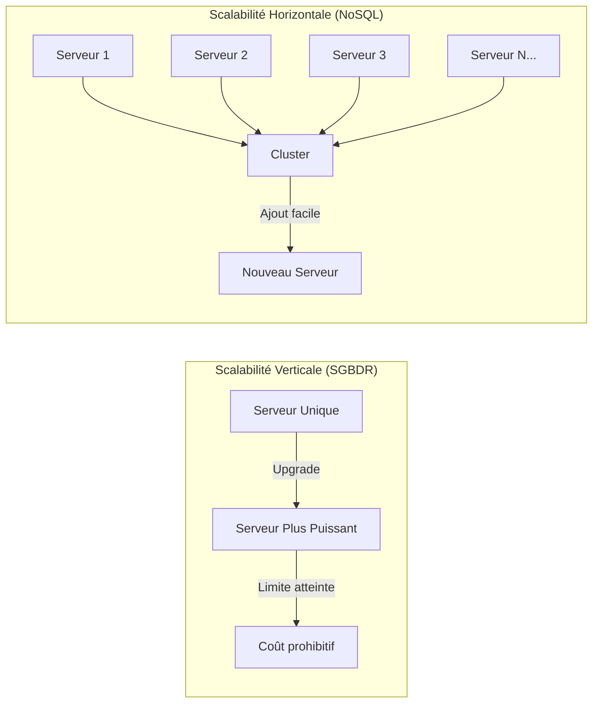
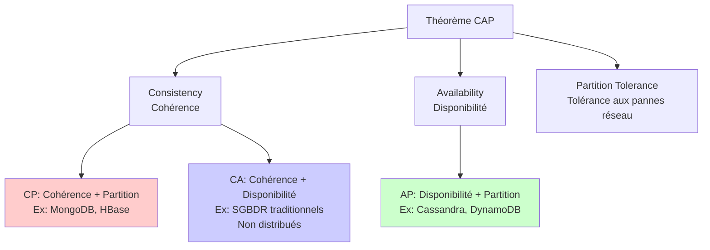
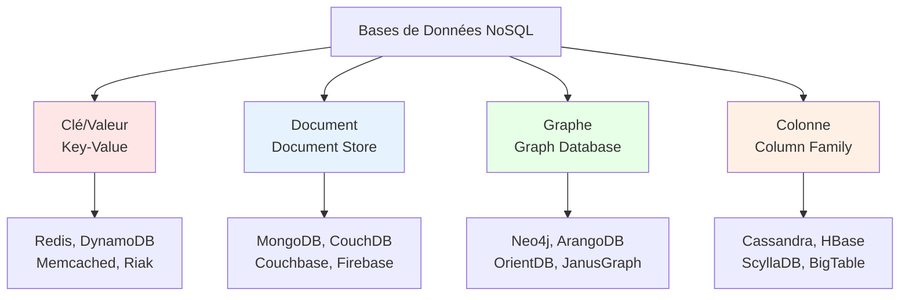
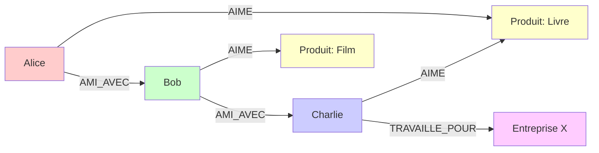
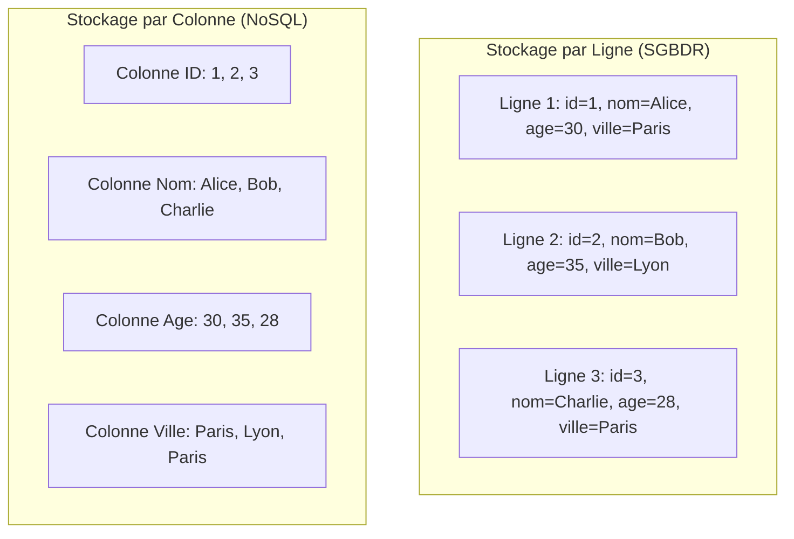
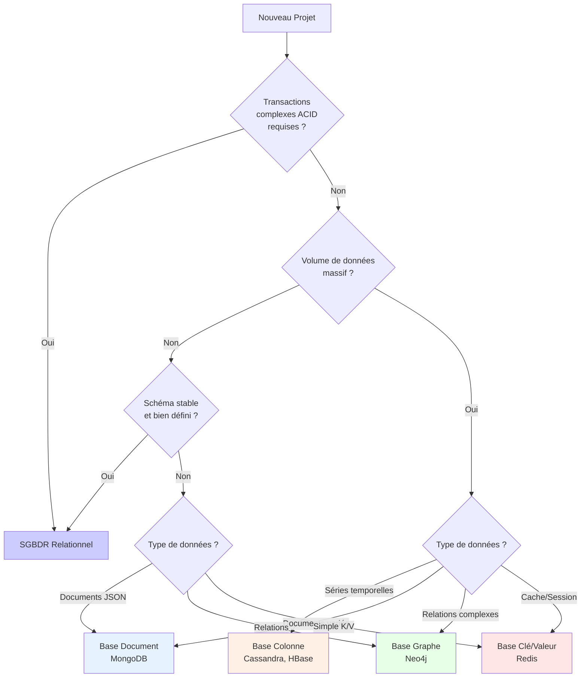
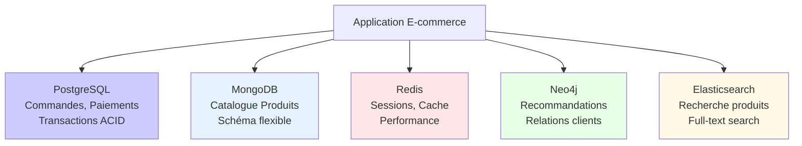

# Théorie des Bases de Données NoSQL

## 1. Introduction au NoSQL

### 1.1 Définition et contexte historique

**NoSQL** (Not Only SQL) désigne une famille de systèmes de gestion de bases de données qui s'écartent du modèle relationnel traditionnel. Le terme est apparu au début des années 2000, mais a gagné en popularité vers 2009 avec l'émergence de solutions comme MongoDB, Cassandra et Redis.

**Contexte historique** :
- **Années 1970-2000** : Domination des SGBDR (Oracle, MySQL, PostgreSQL)
- **Années 2000** : Explosion du volume de données (Web 2.0, réseaux sociaux)
- **2004** : Google publie le papier sur BigTable
- **2007** : Amazon publie le papier sur Dynamo
- **2009** : Popularisation du terme "NoSQL"
- **2010+** : Adoption massive par les entreprises tech (Facebook, Twitter, Netflix)

### 1.2 Les raisons d'émergence du NoSQL

#### Scalabilité horizontale
Les SGBDR traditionnels privilégient la **scalabilité verticale** (augmenter la puissance d'un serveur unique), ce qui atteint rapidement des limites physiques et financières. Le NoSQL permet la **scalabilité horizontale** : ajouter des serveurs pour distribuer la charge.



#### Schéma flexible
Les bases NoSQL permettent de stocker des données **sans schéma rigide prédéfini**, facilitant :
- L'évolution rapide des applications
- La gestion de données hétérogènes
- Le développement agile

#### Gestion du Big Data
Capacité à traiter des volumes massifs de données :
- **Volume** : Pétaoctets de données
- **Vélocité** : Millions de transactions par seconde
- **Variété** : Données structurées, semi-structurées, non structurées

#### Performance
Optimisation pour des cas d'usage spécifiques :
- Lectures/écritures ultra-rapides
- Latence faible (< 10ms)
- Traitement en temps réel

### 1.3 Cas d'usage typiques

| Cas d'usage | Type NoSQL recommandé | Exemples |
|-------------|----------------------|----------|
| Cache distribué | Clé/Valeur | Sessions utilisateur, cache API |
| Catalogue produits | Document | E-commerce, CMS |
| Réseaux sociaux | Graphe | Recommandations, détection de fraude |
| IoT / Séries temporelles | Colonne | Métriques, logs, capteurs |
| Messagerie temps réel | Document | Chat, notifications |
| Analyse de parcours | Graphe | Navigation web, supply chain |

---

## 2. Comparaison BASE vs ACID

### 2.1 Le modèle ACID (SGBDR traditionnels)

**ACID** garantit la fiabilité des transactions dans les bases de données relationnelles :

- **Atomicité** : Une transaction est tout ou rien. Si une partie échoue, tout est annulé (rollback).
  - *Exemple* : Transfert bancaire - le débit et le crédit doivent réussir ensemble.

- **Cohérence** : Les données respectent toujours les règles d'intégrité (contraintes, clés étrangères).
  - *Exemple* : Un solde bancaire ne peut pas être négatif.

- **Isolation** : Les transactions concurrentes n'interfèrent pas entre elles.
  - *Exemple* : Deux retraits simultanés ne créent pas d'incohérence.

- **Durabilité** : Une fois validée, une transaction est permanente (même en cas de panne).
  - *Exemple* : Un paiement confirmé reste enregistré après un crash serveur.

### 2.2 Le modèle BASE (NoSQL)

**BASE** privilégie la disponibilité et la performance sur la cohérence stricte :

- **Basically Available** : Le système garantit la disponibilité des données, même en cas de panne partielle.
  - *Exemple* : Un nœud tombe, les autres continuent de servir les requêtes.

- **Soft state** : L'état du système peut changer sans intervention (réplication asynchrone).
  - *Exemple* : Les réplicas peuvent être temporairement désynchronisés.

- **Eventually consistent** : La cohérence est atteinte à terme, pas immédiatement.
  - *Exemple* : Un like sur Facebook apparaît avec quelques secondes de délai sur tous les serveurs.

### 2.3 Tableau comparatif ACID vs BASE

| Critère | ACID | BASE |
|---------|------|------|
| **Cohérence** | Immédiate et stricte | Éventuelle (à terme) |
| **Disponibilité** | Peut être compromise | Prioritaire |
| **Performance** | Peut être limitée | Optimisée |
| **Scalabilité** | Verticale (limitée) | Horizontale (illimitée) |
| **Complexité** | Transactions complexes | Transactions simples |
| **Cas d'usage** | Banque, comptabilité | Réseaux sociaux, IoT |
| **Garanties** | Fortes | Faibles mais flexibles |

### 2.4 Théorème CAP

Le **théorème CAP** (Brewer, 2000) stipule qu'un système distribué ne peut garantir simultanément que **deux des trois propriétés** suivantes :



**Implications pratiques** :
- **CP (Cohérence + Partition)** : En cas de partition réseau, le système refuse les requêtes pour garantir la cohérence.
- **AP (Disponibilité + Partition)** : En cas de partition, le système continue de répondre mais peut servir des données obsolètes.
- **CA** : Impossible dans un système distribué (les pannes réseau sont inévitables).

> **Note importante** : En pratique, la plupart des systèmes NoSQL modernes offrent des **niveaux de cohérence configurables** (tunable consistency), permettant de choisir le compromis selon le cas d'usage.

---

## 3. Les quatre types principaux de bases NoSQL



### 3.1 Bases Clé/Valeur (Key-Value Stores)

#### Caractéristiques
- **Structure** : Stockage simple de paires clé → valeur
- **Accès** : Uniquement par clé (pas de requêtes complexes)
- **Performance** : Extrêmement rapide (O(1) pour GET/SET)
- **Schéma** : Aucun (la valeur est opaque pour la base)

#### Exemples de technologies
- **Redis** : En mémoire, structures de données avancées (listes, sets, hashes)
- **DynamoDB** : Service AWS, scalabilité automatique
- **Memcached** : Cache distribué simple
- **Riak** : Haute disponibilité, tolérance aux pannes

#### Cas d'usage
- **Cache applicatif** : Résultats de requêtes, pages HTML
- **Sessions utilisateur** : Données de session web
- **Files d'attente** : Messages, jobs asynchrones
- **Compteurs** : Vues, likes, statistiques temps réel
- **Configuration** : Paramètres d'application

**Exemple Redis** :
```
SET user:1000:session "eyJhbGciOiJIUzI1NiIsInR5cCI6IkpXVCJ9..."
GET user:1000:session
EXPIRE user:1000:session 3600  # Expiration après 1h
```

### 3.2 Bases Document (Document Stores)

#### Caractéristiques
- **Structure** : Documents JSON/BSON/XML avec schéma flexible
- **Hiérarchie** : Documents imbriqués, tableaux
- **Indexation** : Sur n'importe quel champ du document
- **Requêtes** : Riches (filtres, agrégations, recherche textuelle)

#### Exemples de technologies
- **MongoDB** : Le plus populaire, écosystème riche
- **CouchDB** : Réplication multi-maître, API HTTP
- **Couchbase** : Hybride clé/valeur + document
- **Firebase Firestore** : Temps réel, serverless

#### Cas d'usage
- **Catalogues produits** : E-commerce avec attributs variables
- **CMS** : Articles, pages, médias
- **Profils utilisateur** : Données hétérogènes
- **Logs applicatifs** : Événements structurés
- **Applications mobiles** : Synchronisation offline

**Exemple MongoDB** :
```javascript
{
  "_id": ObjectId("507f1f77bcf86cd799439011"),
  "nom": "Smartphone XYZ",
  "prix": 599.99,
  "categories": ["électronique", "téléphonie"],
  "specs": {
    "ecran": "6.5 pouces",
    "memoire": "128 GB",
    "couleurs": ["noir", "blanc", "bleu"]
  },
  "avis": [
    {"utilisateur": "alice", "note": 5, "commentaire": "Excellent !"},
    {"utilisateur": "bob", "note": 4, "commentaire": "Très bon rapport qualité/prix"}
  ]
}
```

### 3.3 Bases Graphe (Graph Databases)

#### Caractéristiques
- **Structure** : Nœuds (entités) et arêtes (relations) avec propriétés
- **Modèle** : Graphe de propriétés (property graph)
- **Traversée** : Algorithmes de parcours optimisés
- **Requêtes** : Langage spécialisé (Cypher, Gremlin)

#### Exemples de technologies
- **Neo4j** : Leader du marché, Cypher query language
- **ArangoDB** : Multi-modèle (document + graphe)
- **OrientDB** : Multi-modèle, distribué
- **JanusGraph** : Open source, scalable

#### Cas d'usage
- **Réseaux sociaux** : Amis, followers, recommandations
- **Détection de fraude** : Analyse de patterns suspects
- **Moteurs de recommandation** : "Les clients qui ont acheté X ont aussi acheté Y"
- **Gestion de connaissances** : Ontologies, knowledge graphs
- **Supply chain** : Traçabilité, dépendances
- **Routage** : GPS, réseaux de transport

**Exemple Neo4j (Cypher)** :
```cypher
// Créer des nœuds et relations
CREATE (alice:Personne {nom: "Alice", age: 30})
CREATE (bob:Personne {nom: "Bob", age: 35})
CREATE (charlie:Personne {nom: "Charlie", age: 28})
CREATE (alice)-[:AMI_AVEC {depuis: 2015}]->(bob)
CREATE (bob)-[:AMI_AVEC {depuis: 2018}]->(charlie)

// Trouver les amis d'amis
MATCH (alice:Personne {nom: "Alice"})-[:AMI_AVEC*2]-(ami_ami)
RETURN ami_ami.nom
// Résultat: Charlie
```

**Visualisation d'un graphe social** :


### 3.4 Bases Colonne (Column Family Stores)

#### Caractéristiques
- **Structure** : Données organisées par colonnes plutôt que par lignes
- **Column families** : Groupes de colonnes liées
- **Compression** : Excellente pour données similaires
- **Scalabilité** : Conçu pour des clusters massifs

#### Exemples de technologies
- **Cassandra** : Haute disponibilité, pas de point unique de défaillance
- **HBase** : Basé sur Hadoop, intégration Big Data
- **ScyllaDB** : Compatible Cassandra, écrit en C++ (plus rapide)
- **Google BigTable** : Service GCP, inspiration de Cassandra/HBase

#### Cas d'usage
- **Séries temporelles** : Métriques, logs, IoT
- **Données analytiques** : Data warehousing
- **Historiques** : Événements, transactions
- **Messagerie** : Stockage de messages à grande échelle
- **Capteurs IoT** : Millions de points de données par seconde

**Modèle de données Cassandra** :
```
Column Family: sensor_data
Row Key: sensor_id:date
Columns: timestamp1 → temperature, timestamp2 → temperature, ...

sensor_123:2024-01-15
  ├─ 08:00:00 → 22.5°C
  ├─ 08:01:00 → 22.7°C
  ├─ 08:02:00 → 22.6°C
  └─ ...
```

**Comparaison stockage ligne vs colonne** :


**Avantages du stockage colonne** :
- Requêtes analytiques rapides (ex: moyenne des âges)
- Compression efficace (valeurs similaires regroupées)
- Ajout de colonnes sans migration de schéma

---

## 4. Bonnes pratiques et guide de décision

### 4.1 Critères de choix entre NoSQL et SGBDR



### 4.2 Tableau de décision avec scénarios concrets

| Scénario | Solution recommandée | Justification |
|----------|---------------------|---------------|
| **Banque en ligne** | SGBDR (PostgreSQL) | Transactions ACID critiques, intégrité référentielle |
| **Réseau social** | Graphe (Neo4j) + Document (MongoDB) | Relations complexes + profils flexibles |
| **E-commerce** | Document (MongoDB) + Cache (Redis) | Catalogue flexible + performance |
| **IoT / Capteurs** | Colonne (Cassandra) | Millions d'écritures/sec, séries temporelles |
| **Analytics temps réel** | Colonne (Cassandra) + Stream (Kafka) | Ingestion massive, agrégations |
| **CMS / Blog** | Document (MongoDB) | Schéma flexible, évolution rapide |
| **Système de réservation** | SGBDR (MySQL) | Contraintes d'intégrité, transactions |
| **Cache applicatif** | Clé/Valeur (Redis) | Latence ultra-faible, TTL automatique |
| **Recommandations** | Graphe (Neo4j) | Algorithmes de parcours, relations |
| **Logs applicatifs** | Colonne (Cassandra) ou Document (MongoDB) | Volume élevé, recherche flexible |

### 4.3 Quand privilégier le NoSQL

✅ **Privilégier NoSQL quand** :

1. **Scalabilité horizontale nécessaire**
   - Croissance rapide du volume de données
   - Trafic imprévisible avec pics importants
   - Distribution géographique mondiale

2. **Schéma flexible requis**
   - Évolution rapide des besoins métier
   - Données hétérogènes ou semi-structurées
   - Développement agile avec itérations fréquentes

3. **Performance critique**
   - Latence < 10ms requise
   - Millions de requêtes par seconde
   - Traitement temps réel

4. **Types de données spécifiques**
   - Documents JSON/XML
   - Graphes de relations
   - Séries temporelles
   - Données géospatiales

5. **Haute disponibilité prioritaire**
   - Tolérance aux pannes (99.99% uptime)
   - Pas de point unique de défaillance
   - Réplication multi-datacenter

### 4.4 Quand privilégier le SGBDR

✅ **Privilégier SGBDR quand** :

1. **Transactions complexes ACID**
   - Opérations bancaires, paiements
   - Gestion de stocks avec réservations
   - Systèmes de réservation (billets, hôtels)

2. **Intégrité référentielle stricte**
   - Relations complexes entre entités
   - Contraintes de clés étrangères
   - Règles métier strictes

3. **Requêtes complexes et ad-hoc**
   - JOINs multi-tables
   - Agrégations complexes
   - Reporting analytique

4. **Schéma stable et bien défini**
   - Domaine métier mature
   - Peu d'évolutions structurelles
   - Normalisation importante

5. **Conformité et audit**
   - Traçabilité complète
   - Normes réglementaires (RGPD, SOX)
   - Historisation des modifications

### 4.5 Approches hybrides (Polyglot Persistence)

**Polyglot Persistence** : Utiliser plusieurs types de bases de données dans une même application, chacune optimisée pour son cas d'usage.

**Exemple d'architecture e-commerce** :


**Avantages** :
- Optimisation par cas d'usage
- Meilleure performance globale
- Flexibilité architecturale

**Inconvénients** :
- Complexité opérationnelle accrue
- Synchronisation entre bases
- Courbe d'apprentissage multiple

---

## 5. Avantages et inconvénients

### 5.1 Forces du NoSQL

| Avantage | Description | Exemple concret |
|----------|-------------|-----------------|
| **Scalabilité horizontale** | Ajout facile de serveurs pour augmenter la capacité | Instagram gère des milliards de photos avec Cassandra |
| **Performance** | Latence très faible pour des opérations simples | Redis : < 1ms pour GET/SET |
| **Flexibilité du schéma** | Évolution sans migration complexe | Ajout de nouveaux champs produit sans downtime |
| **Haute disponibilité** | Réplication automatique, tolérance aux pannes | Netflix : 0 downtime avec Cassandra |
| **Gestion du Big Data** | Traitement de volumes massifs | Twitter : 500M tweets/jour avec Manhattan (K/V) |
| **Développement agile** | Itérations rapides, pas de DDL | Startups : pivot rapide du modèle de données |
| **Coût** | Matériel commodity, cloud-friendly | Économies vs serveurs haute performance |
| **Spécialisation** | Optimisé pour des cas d'usage précis | Neo4j : requêtes graphe 1000x plus rapides |

### 5.2 Limites et défis du NoSQL

| Inconvénient | Description | Mitigation |
|--------------|-------------|------------|
| **Cohérence éventuelle** | Données temporairement incohérentes | Choisir niveau de cohérence adapté |
| **Pas de transactions multi-documents** | Difficile de garantir ACID sur plusieurs entités | Utiliser des transactions locales ou sagas |
| **Courbe d'apprentissage** | Paradigmes différents du SQL | Formation, documentation |
| **Standardisation limitée** | Chaque base a son propre langage | Abstractions (ODM, OGM) |
| **Outils moins matures** | Moins d'outils de monitoring/admin que SGBDR | Écosystème en amélioration constante |
| **JOINs complexes** | Pas de JOINs natifs efficaces | Dénormalisation, embedding |
| **Intégrité référentielle** | Pas de contraintes de clés étrangères | Gestion applicative |
| **Requêtes ad-hoc limitées** | Indexation requise pour performance | Planification des requêtes |

### 5.3 Mythes et réalités

| Mythe | Réalité |
|-------|---------|
| "NoSQL = Pas de schéma" | Schéma flexible ≠ Pas de schéma. Il existe, mais au niveau applicatif |
| "NoSQL remplace SQL" | NoSQL complète SQL, ne le remplace pas (polyglot persistence) |
| "NoSQL = Toujours plus rapide" | Rapide pour des cas d'usage spécifiques, pas universellement |
| "NoSQL = Pas de transactions" | Beaucoup offrent des transactions (MongoDB, Cassandra LWT) |
| "NoSQL = Gratuit" | Open source ≠ Gratuit (coûts d'infrastructure, expertise) |

---

## Conclusion

Les bases de données NoSQL représentent une **évolution nécessaire** face aux défis du Big Data, de la scalabilité et de l'agilité. Elles ne remplacent pas les SGBDR, mais offrent des **alternatives optimisées** pour des cas d'usage spécifiques.

**Points clés à retenir** :

1. **Choisir selon le besoin** : Il n'y a pas de solution universelle
2. **Comprendre les compromis** : CAP, BASE vs ACID
3. **Polyglot Persistence** : Combiner plusieurs technologies
4. **Évaluer les contraintes** : Cohérence, disponibilité, performance
5. **Anticiper l'évolution** : Scalabilité, maintenance, expertise

**Ressources pour aller plus loin** :
- [MongoDB University](https://university.mongodb.com/) - Cours gratuits
- [Neo4j GraphAcademy](https://graphacademy.neo4j.com/) - Formation graphe
- [Cassandra Documentation](https://cassandra.apache.org/doc/) - Guide officiel
- [Redis University](https://university.redis.com/) - Certification Redis
- [CAP Theorem Explained](https://www.ibm.com/topics/cap-theorem) - Approfondissement

---

**Exercices pratiques recommandés** :
1. Modéliser un réseau social en graphe (Neo4j)
2. Créer un catalogue e-commerce avec MongoDB
3. Implémenter un cache distribué avec Redis
4. Stocker des séries temporelles IoT avec Cassandra
5. Comparer les performances NoSQL vs SQL sur un cas réel
