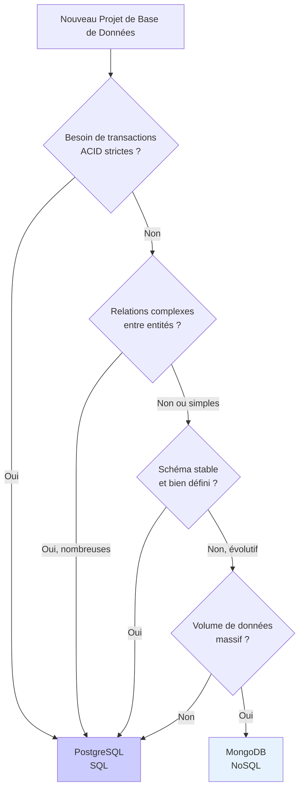
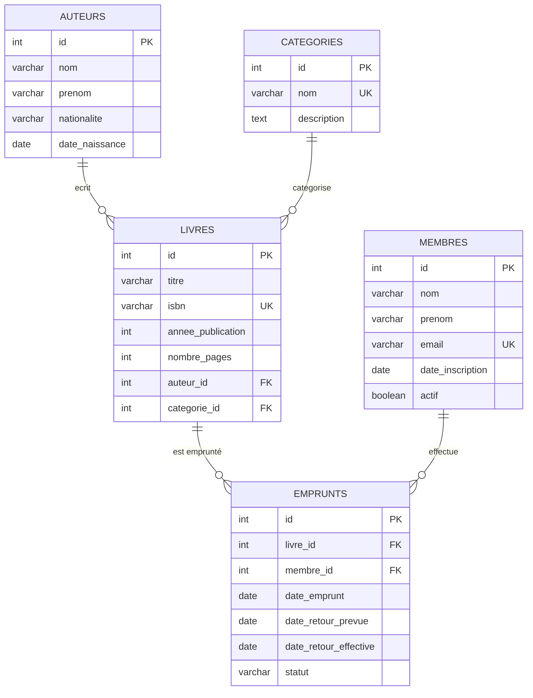
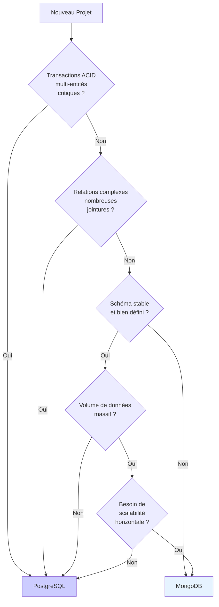

# Comparaison Pratique : SQL (PostgreSQL) vs NoSQL (MongoDB)

## 1. Introduction à la comparaison

### 1.1 Objectifs pédagogiques

À la fin de ce cours, vous serez capable de :
- ✅ Comprendre les différences fondamentales entre SQL et NoSQL
- ✅ Modéliser les mêmes données en relationnel et en document
- ✅ Traduire des requêtes SQL en MongoDB et vice-versa
- ✅ Choisir la technologie appropriée selon le contexte
- ✅ Identifier les avantages et limites de chaque approche

### 1.2 Contexte : Quand choisir SQL vs NoSQL ?



**Critères de décision** :

| Critère | Privilégier SQL | Privilégier NoSQL |
|---------|----------------|-------------------|
| **Transactions** | Complexes, multi-tables | Simples, document unique |
| **Relations** | Nombreuses, complexes | Peu ou simples |
| **Schéma** | Stable, bien défini | Flexible, évolutif |
| **Volume** | Modéré (< 1 To) | Massif (> 1 To) |
| **Scalabilité** | Verticale acceptable | Horizontale nécessaire |
| **Requêtes** | Complexes avec JOINs | Simples, par clé |
| **Intégrité** | Critique | Moins critique |

### 1.3 Cas d'usage : Système de gestion de bibliothèque

Nous allons modéliser et requêter un **système de bibliothèque** comprenant :
- 📚 **Livres** : Titre, ISBN, année de publication, nombre de pages
- ✍️ **Auteurs** : Nom, prénom, nationalité, date de naissance
- 👥 **Membres** : Nom, prénom, email, date d'inscription
- 📖 **Emprunts** : Livre emprunté, membre, dates d'emprunt et de retour
- 🏷️ **Catégories** : Fiction, Science, Histoire, etc.

---

## 2. Modélisation des données

### 2.1 Schéma relationnel (PostgreSQL)

#### Diagramme ERD (Entity-Relationship Diagram)



#### Caractéristiques du modèle relationnel

- **Normalisation** : Données réparties en tables distinctes (3NF)
- **Relations** : Clés étrangères (FK) pour lier les tables
- **Intégrité référentielle** : Contraintes pour garantir la cohérence
- **Pas de duplication** : Chaque information stockée une seule fois

### 2.2 Modèle document (MongoDB)

#### Structure JSON

**Approche 1 : Embedding (Imbrication)**

```javascript
// Collection: livres
{
  "_id": ObjectId("..."),
  "titre": "1984",
  "isbn": "978-0451524935",
  "annee_publication": 1949,
  "nombre_pages": 328,
  "auteur": {                    // ← Auteur imbriqué
    "nom": "Orwell",
    "prenom": "George",
    "nationalite": "Britannique",
    "date_naissance": ISODate("1903-06-25")
  },
  "categorie": {                 // ← Catégorie imbriquée
    "nom": "Fiction",
    "description": "Romans et nouvelles"
  },
  "emprunts": [                  // ← Historique des emprunts
    {
      "membre": {
        "nom": "Dupont",
        "prenom": "Marie",
        "email": "marie.dupont@email.fr"
      },
      "date_emprunt": ISODate("2024-11-01"),
      "date_retour_prevue": ISODate("2024-11-15"),
      "date_retour_effective": ISODate("2024-11-12"),
      "statut": "retourné"
    }
  ]
}
```

**Approche 2 : Référencement (comme SQL)**

```javascript
// Collection: auteurs
{
  "_id": ObjectId("auteur_1"),
  "nom": "Orwell",
  "prenom": "George",
  "nationalite": "Britannique",
  "date_naissance": ISODate("1903-06-25")
}

// Collection: livres
{
  "_id": ObjectId("livre_1"),
  "titre": "1984",
  "isbn": "978-0451524935",
  "annee_publication": 1949,
  "nombre_pages": 328,
  "auteur_id": ObjectId("auteur_1"),      // ← Référence
  "categorie_id": ObjectId("categorie_1") // ← Référence
}

// Collection: emprunts
{
  "_id": ObjectId("emprunt_1"),
  "livre_id": ObjectId("livre_1"),        // ← Référence
  "membre_id": ObjectId("membre_1"),      // ← Référence
  "date_emprunt": ISODate("2024-11-01"),
  "date_retour_prevue": ISODate("2024-11-15"),
  "date_retour_effective": ISODate("2024-11-12"),
  "statut": "retourné"
}
```

> **💡 Note** : Pour cet exercice, nous utiliserons l'**approche par référencement** pour faciliter la comparaison avec SQL.

### 2.3 Comparaison des approches de modélisation

| Aspect | SQL (Relationnel) | NoSQL (Document) |
|--------|-------------------|------------------|
| **Structure** | Tables avec colonnes fixes | Collections avec documents JSON flexibles |
| **Schéma** | Défini à l'avance (DDL) | Flexible, peut varier par document |
| **Relations** | Clés étrangères + JOINs | Embedding ou références + $lookup |
| **Normalisation** | Fortement normalisé (3NF) | Souvent dénormalisé (duplication) |
| **Intégrité** | Contraintes strictes (FK, CHECK) | Gérée au niveau applicatif |
| **Évolution** | Migration de schéma (ALTER TABLE) | Ajout de champs sans migration |
| **Duplication** | Évitée (normalisation) | Acceptée (performance) |

### 2.4 Normalisation vs Dénormalisation

#### Exemple : Livre avec auteur

**SQL (Normalisé)** :
```
Table AUTEURS:        Table LIVRES:
+----+--------+       +----+-------+------------+
| id | nom    |       | id | titre | auteur_id  |
+----+--------+       +----+-------+------------+
| 1  | Orwell |       | 1  | 1984  | 1          |
+----+--------+       +----+-------+------------+
                      
→ Pas de duplication, mais nécessite un JOIN
```

**MongoDB (Dénormalisé avec embedding)** :
```javascript
{
  "titre": "1984",
  "auteur": {
    "nom": "Orwell",
    "prenom": "George"
  }
}

→ Duplication si plusieurs livres du même auteur, mais pas de JOIN
```

**Avantages de la normalisation (SQL)** :
- ✅ Pas de duplication de données
- ✅ Mise à jour centralisée (un seul endroit)
- ✅ Intégrité garantie par les contraintes

**Avantages de la dénormalisation (NoSQL)** :
- ✅ Lecture ultra-rapide (une seule requête)
- ✅ Pas de JOINs coûteux
- ✅ Scalabilité horizontale facilitée

---

## 3. Requêtes comparatives côte à côte

### 3.1 Connexion aux bases de données

#### PostgreSQL

```bash
# Se connecter à PostgreSQL via Docker
docker exec -it postgres_sgbd psql -U postgres -d sgbd_cours
```

#### MongoDB

```bash
# Se connecter à MongoDB via Docker
docker exec -it mongodb_sgbd mongosh -u admin -p admin123 --authenticationDatabase admin

# Sélectionner la base de données
use bibliotheque
```

### 3.2 Sélection simple (SELECT / find)

#### SQL (PostgreSQL)

```sql
-- Tous les livres
SELECT * FROM livres;

-- Tous les livres avec colonnes spécifiques
SELECT titre, isbn, annee_publication 
FROM livres;
```

#### MongoDB

```javascript
// Tous les livres
db.livres.find()

// Tous les livres avec champs spécifiques (projection)
db.livres.find(
  {},
  { titre: 1, isbn: 1, annee_publication: 1, _id: 0 }
)
```

**Différences** :
- SQL : `SELECT colonnes` → MongoDB : `projection { champ: 1 }`
- SQL : `*` pour tout → MongoDB : `{}` pour tout
- MongoDB inclut `_id` par défaut (utiliser `_id: 0` pour l'exclure)

### 3.3 Filtrage avec conditions (WHERE / $match)

#### SQL (PostgreSQL)

```sql
-- Livres publiés après 2000
SELECT titre, annee_publication 
FROM livres 
WHERE annee_publication > 2000;

-- Livres de plus de 300 pages ET publiés après 1990
SELECT titre, nombre_pages, annee_publication
FROM livres
WHERE nombre_pages > 300 
  AND annee_publication > 1990;

-- Livres dont le titre contient "Harry"
SELECT titre 
FROM livres 
WHERE titre LIKE '%Harry%';
```

#### MongoDB

```javascript
// Livres publiés après 2000
db.livres.find(
  { annee_publication: { $gt: 2000 } },
  { titre: 1, annee_publication: 1, _id: 0 }
)

// Livres de plus de 300 pages ET publiés après 1990
db.livres.find({
  nombre_pages: { $gt: 300 },
  annee_publication: { $gt: 1990 }
})

// Livres dont le titre contient "Harry"
db.livres.find({ titre: /Harry/ })
```

**Différences** :
- SQL : `WHERE colonne > valeur` → MongoDB : `{ champ: { $gt: valeur } }`
- SQL : `AND` implicite → MongoDB : AND implicite aussi (virgule)
- SQL : `LIKE '%texte%'` → MongoDB : `/texte/` (regex)

**Opérateurs de comparaison** :

| SQL | MongoDB | Signification |
|-----|---------|---------------|
| `=` | `{ champ: valeur }` | Égal |
| `>` | `{ $gt: valeur }` | Supérieur |
| `>=` | `{ $gte: valeur }` | Supérieur ou égal |
| `<` | `{ $lt: valeur }` | Inférieur |
| `<=` | `{ $lte: valeur }` | Inférieur ou égal |
| `!=` | `{ $ne: valeur }` | Différent |
| `IN (...)` | `{ $in: [...] }` | Dans la liste |
| `LIKE '%x%'` | `/x/` | Contient |

### 3.4 Jointures (JOIN / $lookup ou embedding)

#### SQL (PostgreSQL)

```sql
-- Livres avec leurs auteurs (INNER JOIN)
SELECT l.titre, l.isbn, a.nom, a.prenom
FROM livres l
INNER JOIN auteurs a ON l.auteur_id = a.id;

-- Livres avec auteurs et catégories
SELECT
  l.titre,
  a.nom || ' ' || a.prenom AS auteur_complet,
  c.nom AS categorie
FROM livres l
INNER JOIN auteurs a ON l.auteur_id = a.id
INNER JOIN categories c ON l.categorie_id = c.id;

-- Emprunts en cours avec détails (livre, membre)
SELECT
  m.nom || ' ' || m.prenom AS membre,
  l.titre AS livre,
  e.date_emprunt,
  e.date_retour_prevue
FROM emprunts e
INNER JOIN livres l ON e.livre_id = l.id
INNER JOIN membres m ON e.membre_id = m.id
WHERE e.statut = 'en cours';
```

#### MongoDB

**Approche 1 : Avec $lookup (équivalent JOIN)**

```javascript
// Livres avec leurs auteurs
db.livres.aggregate([
  {
    $lookup: {
      from: "auteurs",
      localField: "auteur_id",
      foreignField: "_id",
      as: "auteur"
    }
  },
  {
    $unwind: "$auteur"
  },
  {
    $project: {
      titre: 1,
      isbn: 1,
      "auteur.nom": 1,
      "auteur.prenom": 1,
      _id: 0
    }
  }
])

// Livres avec auteurs et catégories
db.livres.aggregate([
  {
    $lookup: {
      from: "auteurs",
      localField: "auteur_id",
      foreignField: "_id",
      as: "auteur"
    }
  },
  {
    $lookup: {
      from: "categories",
      localField: "categorie_id",
      foreignField: "_id",
      as: "categorie"
    }
  },
  {
    $unwind: "$auteur"
  },
  {
    $unwind: "$categorie"
  },
  {
    $project: {
      titre: 1,
      auteur_complet: {
        $concat: ["$auteur.nom", " ", "$auteur.prenom"]
      },
      categorie: "$categorie.nom",
      _id: 0
    }
  }
])

// Emprunts en cours avec détails
db.emprunts.aggregate([
  {
    $match: { statut: "en cours" }
  },
  {
    $lookup: {
      from: "livres",
      localField: "livre_id",
      foreignField: "_id",
      as: "livre"
    }
  },
  {
    $lookup: {
      from: "membres",
      localField: "membre_id",
      foreignField: "_id",
      as: "membre"
    }
  },
  {
    $unwind: "$livre"
  },
  {
    $unwind: "$membre"
  },
  {
    $project: {
      membre: {
        $concat: ["$membre.nom", " ", "$membre.prenom"]
      },
      livre: "$livre.titre",
      date_emprunt: 1,
      date_retour_prevue: 1,
      _id: 0
    }
  }
])
```

**Approche 2 : Avec embedding (pas de JOIN nécessaire)**

```javascript
// Si les données sont imbriquées, une seule requête suffit
db.livres.find(
  {},
  {
    titre: 1,
    "auteur.nom": 1,
    "auteur.prenom": 1,
    "categorie.nom": 1,
    _id: 0
  }
)
```

**Différences** :
- SQL : `JOIN` natif et optimisé
- MongoDB : `$lookup` (ajouté en v3.2, moins performant que JOIN SQL)
- MongoDB : Préfère l'**embedding** pour éviter les JOINs
- SQL : Normalisation → JOINs fréquents
- MongoDB : Dénormalisation → Moins de JOINs

### 3.5 Agrégations (GROUP BY / aggregate pipeline)

#### SQL (PostgreSQL)

```sql
-- Nombre de livres par catégorie
SELECT c.nom AS categorie, COUNT(*) AS nombre_livres
FROM livres l
INNER JOIN categories c ON l.categorie_id = c.id
GROUP BY c.nom
ORDER BY nombre_livres DESC;

-- Nombre de pages moyen par auteur
SELECT
  a.nom || ' ' || a.prenom AS auteur,
  COUNT(*) AS nombre_livres,
  AVG(l.nombre_pages) AS pages_moyennes,
  MIN(l.nombre_pages) AS pages_min,
  MAX(l.nombre_pages) AS pages_max
FROM livres l
INNER JOIN auteurs a ON l.auteur_id = a.id
GROUP BY a.id, a.nom, a.prenom
ORDER BY nombre_livres DESC;

-- Nombre d'emprunts par membre
SELECT
  m.nom || ' ' || m.prenom AS membre,
  COUNT(*) AS nombre_emprunts,
  COUNT(CASE WHEN e.statut = 'en cours' THEN 1 END) AS emprunts_en_cours
FROM emprunts e
INNER JOIN membres m ON e.membre_id = m.id
GROUP BY m.id, m.nom, m.prenom
ORDER BY nombre_emprunts DESC;
```

#### MongoDB

```javascript
// Nombre de livres par catégorie
db.livres.aggregate([
  {
    $lookup: {
      from: "categories",
      localField: "categorie_id",
      foreignField: "_id",
      as: "categorie"
    }
  },
  {
    $unwind: "$categorie"
  },
  {
    $group: {
      _id: "$categorie.nom",
      nombre_livres: { $sum: 1 }
    }
  },
  {
    $sort: { nombre_livres: -1 }
  },
  {
    $project: {
      categorie: "$_id",
      nombre_livres: 1,
      _id: 0
    }
  }
])

// Nombre de pages moyen par auteur
db.livres.aggregate([
  {
    $lookup: {
      from: "auteurs",
      localField: "auteur_id",
      foreignField: "_id",
      as: "auteur"
    }
  },
  {
    $unwind: "$auteur"
  },
  {
    $group: {
      _id: "$auteur._id",
      auteur: {
        $first: {
          $concat: ["$auteur.nom", " ", "$auteur.prenom"]
        }
      },
      nombre_livres: { $sum: 1 },
      pages_moyennes: { $avg: "$nombre_pages" },
      pages_min: { $min: "$nombre_pages" },
      pages_max: { $max: "$nombre_pages" }
    }
  },
  {
    $sort: { nombre_livres: -1 }
  },
  {
    $project: {
      _id: 0,
      auteur: 1,
      nombre_livres: 1,
      pages_moyennes: 1,
      pages_min: 1,
      pages_max: 1
    }
  }
])

// Nombre d'emprunts par membre
db.emprunts.aggregate([
  {
    $lookup: {
      from: "membres",
      localField: "membre_id",
      foreignField: "_id",
      as: "membre"
    }
  },
  {
    $unwind: "$membre"
  },
  {
    $group: {
      _id: "$membre._id",
      membre: {
        $first: {
          $concat: ["$membre.nom", " ", "$membre.prenom"]
        }
      },
      nombre_emprunts: { $sum: 1 },
      emprunts_en_cours: {
        $sum: {
          $cond: [{ $eq: ["$statut", "en cours"] }, 1, 0]
        }
      }
    }
  },
  {
    $sort: { nombre_emprunts: -1 }
  },
  {
    $project: {
      _id: 0,
      membre: 1,
      nombre_emprunts: 1,
      emprunts_en_cours: 1
    }
  }
])
```

**Différences** :
- SQL : `GROUP BY` avec fonctions d'agrégation (`COUNT`, `AVG`, `SUM`)
- MongoDB : Pipeline `$group` avec opérateurs (`$sum`, `$avg`, `$min`, `$max`)
- SQL : `CASE WHEN` pour conditions → MongoDB : `$cond`
- MongoDB : Pipeline en plusieurs étapes vs SQL en une seule requête

**Fonctions d'agrégation** :

| SQL | MongoDB | Description |
|-----|---------|-------------|
| `COUNT(*)` | `{ $sum: 1 }` | Compter |
| `SUM(colonne)` | `{ $sum: "$champ" }` | Somme |
| `AVG(colonne)` | `{ $avg: "$champ" }` | Moyenne |
| `MIN(colonne)` | `{ $min: "$champ" }` | Minimum |
| `MAX(colonne)` | `{ $max: "$champ" }` | Maximum |

### 3.6 Tri et limitation (ORDER BY, LIMIT / sort, limit)

#### SQL (PostgreSQL)

```sql
-- Les 5 livres les plus récents
SELECT titre, annee_publication
FROM livres
ORDER BY annee_publication DESC
LIMIT 5;

-- Les 3 livres les plus longs
SELECT titre, nombre_pages
FROM livres
ORDER BY nombre_pages DESC
LIMIT 3;

-- Pagination : livres 11 à 20 (triés par titre)
SELECT titre, isbn
FROM livres
ORDER BY titre ASC
LIMIT 10 OFFSET 10;
```

#### MongoDB

```javascript
// Les 5 livres les plus récents
db.livres.find(
  {},
  { titre: 1, annee_publication: 1, _id: 0 }
).sort({ annee_publication: -1 }).limit(5)

// Les 3 livres les plus longs
db.livres.find(
  {},
  { titre: 1, nombre_pages: 1, _id: 0 }
).sort({ nombre_pages: -1 }).limit(3)

// Pagination : livres 11 à 20 (triés par titre)
db.livres.find(
  {},
  { titre: 1, isbn: 1, _id: 0 }
).sort({ titre: 1 }).skip(10).limit(10)
```

**Différences** :
- SQL : `ORDER BY colonne ASC/DESC` → MongoDB : `.sort({ champ: 1/-1 })`
- SQL : `LIMIT n` → MongoDB : `.limit(n)`
- SQL : `OFFSET n` → MongoDB : `.skip(n)`
- Ordre : SQL `ASC` (croissant) = MongoDB `1`, SQL `DESC` (décroissant) = MongoDB `-1`

### 3.7 Comptage (COUNT / countDocuments)

#### SQL (PostgreSQL)

```sql
-- Nombre total de livres
SELECT COUNT(*) FROM livres;

-- Nombre de livres publiés après 2000
SELECT COUNT(*)
FROM livres
WHERE annee_publication > 2000;

-- Nombre de membres actifs
SELECT COUNT(*)
FROM membres
WHERE actif = true;
```

#### MongoDB

```javascript
// Nombre total de livres
db.livres.countDocuments()

// Nombre de livres publiés après 2000
db.livres.countDocuments({ annee_publication: { $gt: 2000 } })

// Nombre de membres actifs
db.membres.countDocuments({ actif: true })
```

**Différences** :
- SQL : `COUNT(*)` dans SELECT → MongoDB : `.countDocuments()`
- MongoDB : Plus simple et direct pour le comptage

### 3.8 Sous-requêtes vs Pipeline d'agrégation

#### SQL (PostgreSQL)

```sql
-- Livres écrits par des auteurs français
SELECT titre, isbn
FROM livres
WHERE auteur_id IN (
  SELECT id
  FROM auteurs
  WHERE nationalite = 'Française'
);

-- Membres ayant emprunté plus de 3 livres
SELECT m.nom, m.prenom, m.email
FROM membres m
WHERE (
  SELECT COUNT(*)
  FROM emprunts e
  WHERE e.membre_id = m.id
) > 3;

-- Livres jamais empruntés
SELECT l.titre, l.isbn
FROM livres l
WHERE NOT EXISTS (
  SELECT 1
  FROM emprunts e
  WHERE e.livre_id = l.id
);
```

#### MongoDB

```javascript
// Livres écrits par des auteurs français
// Étape 1 : Trouver les IDs des auteurs français
const auteursFrancais = db.auteurs.find(
  { nationalite: "Française" },
  { _id: 1 }
).map(a => a._id)

// Étape 2 : Trouver les livres de ces auteurs
db.livres.find(
  { auteur_id: { $in: auteursFrancais } },
  { titre: 1, isbn: 1, _id: 0 }
)

// Ou en une seule requête avec aggregate
db.livres.aggregate([
  {
    $lookup: {
      from: "auteurs",
      localField: "auteur_id",
      foreignField: "_id",
      as: "auteur"
    }
  },
  {
    $unwind: "$auteur"
  },
  {
    $match: { "auteur.nationalite": "Française" }
  },
  {
    $project: { titre: 1, isbn: 1, _id: 0 }
  }
])

// Membres ayant emprunté plus de 3 livres
db.emprunts.aggregate([
  {
    $group: {
      _id: "$membre_id",
      nombre_emprunts: { $sum: 1 }
    }
  },
  {
    $match: { nombre_emprunts: { $gt: 3 } }
  },
  {
    $lookup: {
      from: "membres",
      localField: "_id",
      foreignField: "_id",
      as: "membre"
    }
  },
  {
    $unwind: "$membre"
  },
  {
    $project: {
      nom: "$membre.nom",
      prenom: "$membre.prenom",
      email: "$membre.email",
      _id: 0
    }
  }
])

// Livres jamais empruntés
const livresEmpruntes = db.emprunts.distinct("livre_id")
db.livres.find(
  { _id: { $nin: livresEmpruntes } },
  { titre: 1, isbn: 1, _id: 0 }
)
```

**Différences** :
- SQL : Sous-requêtes avec `IN`, `EXISTS`, `NOT EXISTS`
- MongoDB : Combinaison de requêtes ou pipeline d'agrégation
- SQL : Sous-requêtes corrélées possibles
- MongoDB : Nécessite souvent plusieurs étapes ou `$lookup`

---
## 4. Exercice pratique complet

### 4.1 Thème : Système de gestion de bibliothèque

Nous allons créer et manipuler une base de données complète pour une bibliothèque avec :
- 📚 **5 catégories** de livres
- ✍️ **6 auteurs** de différentes nationalités
- 📖 **15 livres** variés
- 👥 **8 membres** de la bibliothèque
- 📋 **12 emprunts** (en cours et terminés)

### 4.2 Partie A - PostgreSQL

#### Connexion à PostgreSQL

```bash
# Se connecter à PostgreSQL
docker exec -it postgres_sgbd psql -U postgres -d sgbd_cours
```

#### Script de création des tables

```sql
-- Supprimer les tables si elles existent déjà
DROP TABLE IF EXISTS emprunts CASCADE;
DROP TABLE IF EXISTS livres CASCADE;
DROP TABLE IF EXISTS auteurs CASCADE;
DROP TABLE IF EXISTS categories CASCADE;
DROP TABLE IF EXISTS membres CASCADE;

-- Table des catégories
CREATE TABLE categories (
    id SERIAL PRIMARY KEY,
    nom VARCHAR(100) NOT NULL UNIQUE,
    description TEXT
);

-- Table des auteurs
CREATE TABLE auteurs (
    id SERIAL PRIMARY KEY,
    nom VARCHAR(100) NOT NULL,
    prenom VARCHAR(100) NOT NULL,
    nationalite VARCHAR(100),
    date_naissance DATE,
    UNIQUE(nom, prenom)
);

-- Table des livres
CREATE TABLE livres (
    id SERIAL PRIMARY KEY,
    titre VARCHAR(255) NOT NULL,
    isbn VARCHAR(20) NOT NULL UNIQUE,
    annee_publication INTEGER CHECK (annee_publication > 1000 AND annee_publication <= EXTRACT(YEAR FROM CURRENT_DATE)),
    nombre_pages INTEGER CHECK (nombre_pages > 0),
    auteur_id INTEGER NOT NULL REFERENCES auteurs(id) ON DELETE RESTRICT,
    categorie_id INTEGER NOT NULL REFERENCES categories(id) ON DELETE RESTRICT
);

-- Table des membres
CREATE TABLE membres (
    id SERIAL PRIMARY KEY,
    nom VARCHAR(100) NOT NULL,
    prenom VARCHAR(100) NOT NULL,
    email VARCHAR(255) NOT NULL UNIQUE,
    date_inscription DATE NOT NULL DEFAULT CURRENT_DATE,
    actif BOOLEAN NOT NULL DEFAULT true
);

-- Table des emprunts
CREATE TABLE emprunts (
    id SERIAL PRIMARY KEY,
    livre_id INTEGER NOT NULL REFERENCES livres(id) ON DELETE RESTRICT,
    membre_id INTEGER NOT NULL REFERENCES membres(id) ON DELETE RESTRICT,
    date_emprunt DATE NOT NULL DEFAULT CURRENT_DATE,
    date_retour_prevue DATE NOT NULL,
    date_retour_effective DATE,
    statut VARCHAR(20) NOT NULL CHECK (statut IN ('en cours', 'retourné', 'en retard')),
    CONSTRAINT check_dates CHECK (date_retour_prevue > date_emprunt),
    CONSTRAINT check_retour CHECK (date_retour_effective IS NULL OR date_retour_effective >= date_emprunt)
);

-- Index pour améliorer les performances
CREATE INDEX idx_livres_auteur ON livres(auteur_id);
CREATE INDEX idx_livres_categorie ON livres(categorie_id);
CREATE INDEX idx_emprunts_livre ON emprunts(livre_id);
CREATE INDEX idx_emprunts_membre ON emprunts(membre_id);
CREATE INDEX idx_emprunts_statut ON emprunts(statut);
```

#### Script d'insertion des données

```sql
-- Insertion des catégories
INSERT INTO categories (nom, description) VALUES
('Fiction', 'Romans et nouvelles de fiction'),
('Science-Fiction', 'Romans de science-fiction et fantasy'),
('Histoire', 'Livres historiques et biographies'),
('Science', 'Livres scientifiques et techniques'),
('Philosophie', 'Essais philosophiques et pensée');

-- Insertion des auteurs
INSERT INTO auteurs (nom, prenom, nationalite, date_naissance) VALUES
('Orwell', 'George', 'Britannique', '1903-06-25'),
('Rowling', 'J.K.', 'Britannique', '1965-07-31'),
('Camus', 'Albert', 'Française', '1913-11-07'),
('Asimov', 'Isaac', 'Américaine', '1920-01-02'),
('Sapiens', 'Yuval Noah', 'Israélienne', '1976-02-24'),
('Hawking', 'Stephen', 'Britannique', '1942-01-08');

-- Insertion des livres
INSERT INTO livres (titre, isbn, annee_publication, nombre_pages, auteur_id, categorie_id) VALUES
-- George Orwell
('1984', '978-0451524935', 1949, 328, 1, 1),
('La Ferme des animaux', '978-0451526342', 1945, 144, 1, 1),

-- J.K. Rowling
('Harry Potter à l''école des sorciers', '978-2070584628', 1997, 320, 2, 2),
('Harry Potter et la Chambre des secrets', '978-2070584642', 1998, 368, 2, 2),
('Harry Potter et le Prisonnier d''Azkaban', '978-2070584659', 1999, 448, 2, 2),

-- Albert Camus
('L''Étranger', '978-2070360024', 1942, 186, 3, 1),
('La Peste', '978-2070360420', 1947, 279, 3, 1),
('Le Mythe de Sisyphe', '978-2070322886', 1942, 187, 3, 5),

-- Isaac Asimov
('Fondation', '978-2070360260', 1951, 280, 4, 2),
('Les Robots', '978-2290020371', 1950, 374, 4, 2),

-- Yuval Noah Harari
('Sapiens', '978-2226257017', 2011, 512, 5, 3),
('Homo Deus', '978-2226393876', 2015, 464, 5, 3),

-- Stephen Hawking
('Une brève histoire du temps', '978-2081379527', 1988, 256, 6, 4),
('L''Univers dans une coquille de noix', '978-2738112972', 2001, 224, 6, 4),
('Trous noirs et bébés univers', '978-2738104229', 1993, 245, 6, 4);

-- Insertion des membres
INSERT INTO membres (nom, prenom, email, date_inscription, actif) VALUES
('Dupont', 'Marie', 'marie.dupont@email.fr', '2023-01-15', true),
('Martin', 'Pierre', 'pierre.martin@email.fr', '2023-03-22', true),
('Bernard', 'Sophie', 'sophie.bernard@email.fr', '2023-06-10', true),
('Dubois', 'Luc', 'luc.dubois@email.fr', '2023-09-05', true),
('Moreau', 'Julie', 'julie.moreau@email.fr', '2024-01-12', true),
('Laurent', 'Thomas', 'thomas.laurent@email.fr', '2024-03-18', true),
('Simon', 'Emma', 'emma.simon@email.fr', '2024-06-25', true),
('Michel', 'Lucas', 'lucas.michel@email.fr', '2024-09-30', false);

-- Insertion des emprunts
INSERT INTO emprunts (livre_id, membre_id, date_emprunt, date_retour_prevue, date_retour_effective, statut) VALUES
-- Emprunts retournés
(1, 1, '2024-10-01', '2024-10-15', '2024-10-12', 'retourné'),
(3, 2, '2024-10-05', '2024-10-19', '2024-10-18', 'retourné'),
(6, 3, '2024-10-10', '2024-10-24', '2024-10-22', 'retourné'),
(9, 4, '2024-10-15', '2024-10-29', '2024-10-28', 'retourné'),
(11, 5, '2024-10-20', '2024-11-03', '2024-11-01', 'retourné'),

-- Emprunts en cours
(2, 1, '2024-11-01', '2024-11-15', NULL, 'en cours'),
(4, 2, '2024-11-05', '2024-11-19', NULL, 'en cours'),
(7, 3, '2024-11-08', '2024-11-22', NULL, 'en cours'),
(10, 6, '2024-11-10', '2024-11-24', NULL, 'en cours'),
(13, 7, '2024-11-12', '2024-11-26', NULL, 'en cours'),

-- Emprunts en retard
(5, 4, '2024-10-25', '2024-11-08', NULL, 'en retard'),
(12, 5, '2024-10-28', '2024-11-11', NULL, 'en retard');
```

#### Vérification des données

```sql
-- Compter les enregistrements
SELECT 'Categories' AS table_name, COUNT(*) AS count FROM categories
UNION ALL
SELECT 'Auteurs', COUNT(*) FROM auteurs
UNION ALL
SELECT 'Livres', COUNT(*) FROM livres
UNION ALL
SELECT 'Membres', COUNT(*) FROM membres
UNION ALL
SELECT 'Emprunts', COUNT(*) FROM emprunts;
```

**Résultat attendu** :
```
 table_name | count
------------+-------
 Categories |     5
 Auteurs    |     6
 Livres     |    15
 Membres    |     8
 Emprunts   |    12
```

#### 10 requêtes SQL à exécuter

**Requête 1 : Tous les livres avec leurs auteurs et catégories**

```sql
SELECT
    l.titre,
    a.nom || ' ' || a.prenom AS auteur,
    c.nom AS categorie,
    l.annee_publication
FROM livres l
INNER JOIN auteurs a ON l.auteur_id = a.id
INNER JOIN categories c ON l.categorie_id = c.id
ORDER BY l.titre;
```

**Requête 2 : Livres publiés après 2000**

```sql
SELECT
    l.titre,
    a.nom || ' ' || a.prenom AS auteur,
    l.annee_publication
FROM livres l
INNER JOIN auteurs a ON l.auteur_id = a.id
WHERE l.annee_publication > 2000
ORDER BY l.annee_publication DESC;
```

**Requête 3 : Nombre de livres par auteur**

```sql
SELECT
    a.nom || ' ' || a.prenom AS auteur,
    COUNT(*) AS nombre_livres,
    AVG(l.nombre_pages)::INTEGER AS pages_moyennes
FROM livres l
INNER JOIN auteurs a ON l.auteur_id = a.id
GROUP BY a.id, a.nom, a.prenom
ORDER BY nombre_livres DESC;
```

**Requête 4 : Nombre de livres par catégorie**

```sql
SELECT
    c.nom AS categorie,
    COUNT(*) AS nombre_livres
FROM livres l
INNER JOIN categories c ON l.categorie_id = c.id
GROUP BY c.id, c.nom
ORDER BY nombre_livres DESC;
```

**Requête 5 : Emprunts en cours avec détails**

```sql
SELECT
    m.nom || ' ' || m.prenom AS membre,
    l.titre AS livre,
    e.date_emprunt,
    e.date_retour_prevue,
    CURRENT_DATE - e.date_retour_prevue AS jours_retard
FROM emprunts e
INNER JOIN livres l ON e.livre_id = l.id
INNER JOIN membres m ON e.membre_id = m.id
WHERE e.statut = 'en cours'
ORDER BY e.date_emprunt;
```

**Requête 6 : Membres les plus actifs (nombre d'emprunts)**

```sql
SELECT
    m.nom || ' ' || m.prenom AS membre,
    m.email,
    COUNT(*) AS nombre_emprunts,
    COUNT(CASE WHEN e.statut = 'en cours' THEN 1 END) AS emprunts_en_cours
FROM emprunts e
INNER JOIN membres m ON e.membre_id = m.id
GROUP BY m.id, m.nom, m.prenom, m.email
ORDER BY nombre_emprunts DESC
LIMIT 5;
```

**Requête 7 : Livres jamais empruntés**

```sql
SELECT
    l.titre,
    a.nom || ' ' || a.prenom AS auteur,
    l.isbn
FROM livres l
INNER JOIN auteurs a ON l.auteur_id = a.id
WHERE NOT EXISTS (
    SELECT 1
    FROM emprunts e
    WHERE e.livre_id = l.id
)
ORDER BY l.titre;
```

**Requête 8 : Livres les plus empruntés**

```sql
SELECT
    l.titre,
    a.nom || ' ' || a.prenom AS auteur,
    COUNT(*) AS nombre_emprunts
FROM emprunts e
INNER JOIN livres l ON e.livre_id = l.id
INNER JOIN auteurs a ON l.auteur_id = a.id
GROUP BY l.id, l.titre, a.nom, a.prenom
ORDER BY nombre_emprunts DESC
LIMIT 5;
```

**Requête 9 : Auteurs français avec leurs livres**

```sql
SELECT
    a.nom || ' ' || a.prenom AS auteur,
    STRING_AGG(l.titre, ', ' ORDER BY l.annee_publication) AS livres
FROM auteurs a
INNER JOIN livres l ON l.auteur_id = a.id
WHERE a.nationalite = 'Française'
GROUP BY a.id, a.nom, a.prenom;
```

**Requête 10 : Statistiques globales**

```sql
SELECT
    (SELECT COUNT(*) FROM livres) AS total_livres,
    (SELECT COUNT(*) FROM membres WHERE actif = true) AS membres_actifs,
    (SELECT COUNT(*) FROM emprunts WHERE statut = 'en cours') AS emprunts_en_cours,
    (SELECT COUNT(*) FROM emprunts WHERE statut = 'en retard') AS emprunts_en_retard,
    (SELECT AVG(nombre_pages)::INTEGER FROM livres) AS pages_moyennes;
```
### 4.3 Partie B - MongoDB

#### Connexion à MongoDB

```bash
# Se connecter à MongoDB
docker exec -it mongodb_sgbd mongosh -u admin -p admin123 --authenticationDatabase admin

# Sélectionner la base de données
use bibliotheque
```

#### Script de création et insertion des données

```javascript
// Supprimer les collections si elles existent
db.categories.drop()
db.auteurs.drop()
db.livres.drop()
db.membres.drop()
db.emprunts.drop()

// Insertion des catégories
db.categories.insertMany([
  {
    _id: ObjectId("654000000000000000000001"),
    nom: "Fiction",
    description: "Romans et nouvelles de fiction"
  },
  {
    _id: ObjectId("654000000000000000000002"),
    nom: "Science-Fiction",
    description: "Romans de science-fiction et fantasy"
  },
  {
    _id: ObjectId("654000000000000000000003"),
    nom: "Histoire",
    description: "Livres historiques et biographies"
  },
  {
    _id: ObjectId("654000000000000000000004"),
    nom: "Science",
    description: "Livres scientifiques et techniques"
  },
  {
    _id: ObjectId("654000000000000000000005"),
    nom: "Philosophie",
    description: "Essais philosophiques et pensée"
  }
])

// Insertion des auteurs
db.auteurs.insertMany([
  {
    _id: ObjectId("654000000000000000000011"),
    nom: "Orwell",
    prenom: "George",
    nationalite: "Britannique",
    date_naissance: ISODate("1903-06-25")
  },
  {
    _id: ObjectId("654000000000000000000012"),
    nom: "Rowling",
    prenom: "J.K.",
    nationalite: "Britannique",
    date_naissance: ISODate("1965-07-31")
  },
  {
    _id: ObjectId("654000000000000000000013"),
    nom: "Camus",
    prenom: "Albert",
    nationalite: "Française",
    date_naissance: ISODate("1913-11-07")
  },
  {
    _id: ObjectId("654000000000000000000014"),
    nom: "Asimov",
    prenom: "Isaac",
    nationalite: "Américaine",
    date_naissance: ISODate("1920-01-02")
  },
  {
    _id: ObjectId("654000000000000000000015"),
    nom: "Sapiens",
    prenom: "Yuval Noah",
    nationalite: "Israélienne",
    date_naissance: ISODate("1976-02-24")
  },
  {
    _id: ObjectId("654000000000000000000016"),
    nom: "Hawking",
    prenom: "Stephen",
    nationalite: "Britannique",
    date_naissance: ISODate("1942-01-08")
  }
])

// Insertion des livres
db.livres.insertMany([
  // George Orwell
  {
    _id: ObjectId("654000000000000000000021"),
    titre: "1984",
    isbn: "978-0451524935",
    annee_publication: 1949,
    nombre_pages: 328,
    auteur_id: ObjectId("654000000000000000000011"),
    categorie_id: ObjectId("654000000000000000000001")
  },
  {
    _id: ObjectId("654000000000000000000022"),
    titre: "La Ferme des animaux",
    isbn: "978-0451526342",
    annee_publication: 1945,
    nombre_pages: 144,
    auteur_id: ObjectId("654000000000000000000011"),
    categorie_id: ObjectId("654000000000000000000001")
  },
  // J.K. Rowling
  {
    _id: ObjectId("654000000000000000000023"),
    titre: "Harry Potter à l'école des sorciers",
    isbn: "978-2070584628",
    annee_publication: 1997,
    nombre_pages: 320,
    auteur_id: ObjectId("654000000000000000000012"),
    categorie_id: ObjectId("654000000000000000000002")
  },
  {
    _id: ObjectId("654000000000000000000024"),
    titre: "Harry Potter et la Chambre des secrets",
    isbn: "978-2070584642",
    annee_publication: 1998,
    nombre_pages: 368,
    auteur_id: ObjectId("654000000000000000000012"),
    categorie_id: ObjectId("654000000000000000000002")
  },
  {
    _id: ObjectId("654000000000000000000025"),
    titre: "Harry Potter et le Prisonnier d'Azkaban",
    isbn: "978-2070584659",
    annee_publication: 1999,
    nombre_pages: 448,
    auteur_id: ObjectId("654000000000000000000012"),
    categorie_id: ObjectId("654000000000000000000002")
  },
  // Albert Camus
  {
    _id: ObjectId("654000000000000000000026"),
    titre: "L'Étranger",
    isbn: "978-2070360024",
    annee_publication: 1942,
    nombre_pages: 186,
    auteur_id: ObjectId("654000000000000000000013"),
    categorie_id: ObjectId("654000000000000000000001")
  },
  {
    _id: ObjectId("654000000000000000000027"),
    titre: "La Peste",
    isbn: "978-2070360420",
    annee_publication: 1947,
    nombre_pages: 279,
    auteur_id: ObjectId("654000000000000000000013"),
    categorie_id: ObjectId("654000000000000000000001")
  },
  {
    _id: ObjectId("654000000000000000000028"),
    titre: "Le Mythe de Sisyphe",
    isbn: "978-2070322886",
    annee_publication: 1942,
    nombre_pages: 187,
    auteur_id: ObjectId("654000000000000000000013"),
    categorie_id: ObjectId("654000000000000000000005")
  },
  // Isaac Asimov
  {
    _id: ObjectId("654000000000000000000029"),
    titre: "Fondation",
    isbn: "978-2070360260",
    annee_publication: 1951,
    nombre_pages: 280,
    auteur_id: ObjectId("654000000000000000000014"),
    categorie_id: ObjectId("654000000000000000000002")
  },
  {
    _id: ObjectId("654000000000000000000030"),
    titre: "Les Robots",
    isbn: "978-2290020371",
    annee_publication: 1950,
    nombre_pages: 374,
    auteur_id: ObjectId("654000000000000000000014"),
    categorie_id: ObjectId("654000000000000000000002")
  },
  // Yuval Noah Harari
  {
    _id: ObjectId("654000000000000000000031"),
    titre: "Sapiens",
    isbn: "978-2226257017",
    annee_publication: 2011,
    nombre_pages: 512,
    auteur_id: ObjectId("654000000000000000000015"),
    categorie_id: ObjectId("654000000000000000000003")
  },
  {
    _id: ObjectId("654000000000000000000032"),
    titre: "Homo Deus",
    isbn: "978-2226393876",
    annee_publication: 2015,
    nombre_pages: 464,
    auteur_id: ObjectId("654000000000000000000015"),
    categorie_id: ObjectId("654000000000000000000003")
  },
  // Stephen Hawking
  {
    _id: ObjectId("654000000000000000000033"),
    titre: "Une brève histoire du temps",
    isbn: "978-2081379527",
    annee_publication: 1988,
    nombre_pages: 256,
    auteur_id: ObjectId("654000000000000000000016"),
    categorie_id: ObjectId("654000000000000000000004")
  },
  {
    _id: ObjectId("654000000000000000000034"),
    titre: "L'Univers dans une coquille de noix",
    isbn: "978-2738112972",
    annee_publication: 2001,
    nombre_pages: 224,
    auteur_id: ObjectId("654000000000000000000016"),
    categorie_id: ObjectId("654000000000000000000004")
  },
  {
    _id: ObjectId("654000000000000000000035"),
    titre: "Trous noirs et bébés univers",
    isbn: "978-2738104229",
    annee_publication: 1993,
    nombre_pages: 245,
    auteur_id: ObjectId("654000000000000000000016"),
    categorie_id: ObjectId("654000000000000000000004")
  }
])

// Insertion des membres
db.membres.insertMany([
  {
    _id: ObjectId("654000000000000000000041"),
    nom: "Dupont",
    prenom: "Marie",
    email: "marie.dupont@email.fr",
    date_inscription: ISODate("2023-01-15"),
    actif: true
  },
  {
    _id: ObjectId("654000000000000000000042"),
    nom: "Martin",
    prenom: "Pierre",
    email: "pierre.martin@email.fr",
    date_inscription: ISODate("2023-03-22"),
    actif: true
  },
  {
    _id: ObjectId("654000000000000000000043"),
    nom: "Bernard",
    prenom: "Sophie",
    email: "sophie.bernard@email.fr",
    date_inscription: ISODate("2023-06-10"),
    actif: true
  },
  {
    _id: ObjectId("654000000000000000000044"),
    nom: "Dubois",
    prenom: "Luc",
    email: "luc.dubois@email.fr",
    date_inscription: ISODate("2023-09-05"),
    actif: true
  },
  {
    _id: ObjectId("654000000000000000000045"),
    nom: "Moreau",
    prenom: "Julie",
    email: "julie.moreau@email.fr",
    date_inscription: ISODate("2024-01-12"),
    actif: true
  },
  {
    _id: ObjectId("654000000000000000000046"),
    nom: "Laurent",
    prenom: "Thomas",
    email: "thomas.laurent@email.fr",
    date_inscription: ISODate("2024-03-18"),
    actif: true
  },
  {
    _id: ObjectId("654000000000000000000047"),
    nom: "Simon",
    prenom: "Emma",
    email: "emma.simon@email.fr",
    date_inscription: ISODate("2024-06-25"),
    actif: true
  },
  {
    _id: ObjectId("654000000000000000000048"),
    nom: "Michel",
    prenom: "Lucas",
    email: "lucas.michel@email.fr",
    date_inscription: ISODate("2024-09-30"),
    actif: false
  }
])

// Insertion des emprunts
db.emprunts.insertMany([
  // Emprunts retournés
  {
    livre_id: ObjectId("654000000000000000000021"),
    membre_id: ObjectId("654000000000000000000041"),
    date_emprunt: ISODate("2024-10-01"),
    date_retour_prevue: ISODate("2024-10-15"),
    date_retour_effective: ISODate("2024-10-12"),
    statut: "retourné"
  },
  {
    livre_id: ObjectId("654000000000000000000023"),
    membre_id: ObjectId("654000000000000000000042"),
    date_emprunt: ISODate("2024-10-05"),
    date_retour_prevue: ISODate("2024-10-19"),
    date_retour_effective: ISODate("2024-10-18"),
    statut: "retourné"
  },
  {
    livre_id: ObjectId("654000000000000000000026"),
    membre_id: ObjectId("654000000000000000000043"),
    date_emprunt: ISODate("2024-10-10"),
    date_retour_prevue: ISODate("2024-10-24"),
    date_retour_effective: ISODate("2024-10-22"),
    statut: "retourné"
  },
  {
    livre_id: ObjectId("654000000000000000000029"),
    membre_id: ObjectId("654000000000000000000044"),
    date_emprunt: ISODate("2024-10-15"),
    date_retour_prevue: ISODate("2024-10-29"),
    date_retour_effective: ISODate("2024-10-28"),
    statut: "retourné"
  },
  {
    livre_id: ObjectId("654000000000000000000031"),
    membre_id: ObjectId("654000000000000000000045"),
    date_emprunt: ISODate("2024-10-20"),
    date_retour_prevue: ISODate("2024-11-03"),
    date_retour_effective: ISODate("2024-11-01"),
    statut: "retourné"
  },
  // Emprunts en cours
  {
    livre_id: ObjectId("654000000000000000000022"),
    membre_id: ObjectId("654000000000000000000041"),
    date_emprunt: ISODate("2024-11-01"),
    date_retour_prevue: ISODate("2024-11-15"),
    date_retour_effective: null,
    statut: "en cours"
  },
  {
    livre_id: ObjectId("654000000000000000000024"),
    membre_id: ObjectId("654000000000000000000042"),
    date_emprunt: ISODate("2024-11-05"),
    date_retour_prevue: ISODate("2024-11-19"),
    date_retour_effective: null,
    statut: "en cours"
  },
  {
    livre_id: ObjectId("654000000000000000000027"),
    membre_id: ObjectId("654000000000000000000043"),
    date_emprunt: ISODate("2024-11-08"),
    date_retour_prevue: ISODate("2024-11-22"),
    date_retour_effective: null,
    statut: "en cours"
  },
  {
    livre_id: ObjectId("654000000000000000000030"),
    membre_id: ObjectId("654000000000000000000046"),
    date_emprunt: ISODate("2024-11-10"),
    date_retour_prevue: ISODate("2024-11-24"),
    date_retour_effective: null,
    statut: "en cours"
  },
  {
    livre_id: ObjectId("654000000000000000000033"),
    membre_id: ObjectId("654000000000000000000047"),
    date_emprunt: ISODate("2024-11-12"),
    date_retour_prevue: ISODate("2024-11-26"),
    date_retour_effective: null,
    statut: "en cours"
  },
  // Emprunts en retard
  {
    livre_id: ObjectId("654000000000000000000025"),
    membre_id: ObjectId("654000000000000000000044"),
    date_emprunt: ISODate("2024-10-25"),
    date_retour_prevue: ISODate("2024-11-08"),
    date_retour_effective: null,
    statut: "en retard"
  },
  {
    livre_id: ObjectId("654000000000000000000032"),
    membre_id: ObjectId("654000000000000000000045"),
    date_emprunt: ISODate("2024-10-28"),
    date_retour_prevue: ISODate("2024-11-11"),
    date_retour_effective: null,
    statut: "en retard"
  }
])
```

#### Vérification des données

```javascript
// Compter les documents
print("Categories:", db.categories.countDocuments())
print("Auteurs:", db.auteurs.countDocuments())
print("Livres:", db.livres.countDocuments())
print("Membres:", db.membres.countDocuments())
print("Emprunts:", db.emprunts.countDocuments())
```

**Résultat attendu** :
```
Categories: 5
Auteurs: 6
Livres: 15
Membres: 8
Emprunts: 12
```
#### Les mêmes 10 requêtes traduites en MongoDB

> **💡 Note** : Les requêtes MongoDB complètes avec `$lookup` sont fournies dans un fichier séparé `/cours/4_3_requetes_mongodb.js` pour faciliter la lecture. Voici un résumé des principales différences.

**Requête 1 MongoDB : Tous les livres avec leurs auteurs et catégories**
```javascript
db.livres.aggregate([
  { $lookup: { from: "auteurs", localField: "auteur_id", foreignField: "_id", as: "auteur" } },
  { $lookup: { from: "categories", localField: "categorie_id", foreignField: "_id", as: "categorie" } },
  { $unwind: "$auteur" },
  { $unwind: "$categorie" },
  { $project: { titre: 1, auteur: { $concat: ["$auteur.nom", " ", "$auteur.prenom"] }, categorie: "$categorie.nom", annee_publication: 1, _id: 0 } },
  { $sort: { titre: 1 } }
])
```

**Requête 2 MongoDB : Livres publiés après 2000**
```javascript
db.livres.aggregate([
  { $match: { annee_publication: { $gt: 2000 } } },
  { $lookup: { from: "auteurs", localField: "auteur_id", foreignField: "_id", as: "auteur" } },
  { $unwind: "$auteur" },
  { $project: { titre: 1, auteur: { $concat: ["$auteur.nom", " ", "$auteur.prenom"] }, annee_publication: 1, _id: 0 } },
  { $sort: { annee_publication: -1 } }
])
```

**Requête 7 MongoDB : Livres jamais empruntés**
```javascript
const livresEmpruntes = db.emprunts.distinct("livre_id")
db.livres.aggregate([
  { $match: { _id: { $nin: livresEmpruntes } } },
  { $lookup: { from: "auteurs", localField: "auteur_id", foreignField: "_id", as: "auteur" } },
  { $unwind: "$auteur" },
  { $project: { titre: 1, auteur: { $concat: ["$auteur.nom", " ", "$auteur.prenom"] }, isbn: 1, _id: 0 } },
  { $sort: { titre: 1 } }
])
```

### 4.4 Partie C - Analyse comparative

#### Tableau comparatif des performances

| Critère | PostgreSQL (SQL) | MongoDB (NoSQL) |
|---------|------------------|-----------------|
| **Création du schéma** | ⏱️ Complexe (DDL, contraintes, FK) | ✅ Simple (insertion directe) |
| **Insertion des données** | ✅ Rapide avec transactions | ✅ Très rapide (bulk insert) |
| **Requêtes simples** | ✅ Très rapide avec index | ✅ Très rapide |
| **Jointures (2-3 tables)** | ✅ Optimisé, natif | ⚠️ $lookup moins performant |
| **Agrégations** | ✅ GROUP BY optimisé | ✅ Pipeline flexible |
| **Sous-requêtes** | ✅ Natif et performant | ⚠️ Nécessite plusieurs étapes |
| **Intégrité des données** | ✅ Garantie par contraintes | ❌ Gérée par l'application |
| **Modification du schéma** | ⚠️ ALTER TABLE (migration) | ✅ Ajout de champs sans migration |
| **Lisibilité des requêtes** | ✅ SQL déclaratif | ⚠️ Pipeline verbeux |

#### Facilité d'écriture des requêtes

**SQL (PostgreSQL)** :
- ✅ Syntaxe déclarative et concise
- ✅ JOINs naturels et lisibles
- ✅ Agrégations simples avec GROUP BY
- ❌ Nécessite de connaître le schéma exact

**MongoDB** :
- ✅ Flexible, pas besoin de schéma strict
- ✅ Pipeline d'agrégation puissant
- ❌ $lookup verbeux pour les jointures
- ❌ Syntaxe plus longue pour les requêtes complexes

#### Lisibilité et maintenabilité

**SQL** :
```sql
-- Très lisible et concis
SELECT l.titre, a.nom, c.nom AS categorie
FROM livres l
JOIN auteurs a ON l.auteur_id = a.id
JOIN categories c ON l.categorie_id = c.id;
```

**MongoDB** :
```javascript
// Plus verbeux mais flexible
db.livres.aggregate([
  { $lookup: { from: "auteurs", localField: "auteur_id", foreignField: "_id", as: "auteur" } },
  { $lookup: { from: "categories", localField: "categorie_id", foreignField: "_id", as: "categorie" } },
  { $unwind: "$auteur" },
  { $unwind: "$categorie" },
  { $project: { titre: 1, "auteur.nom": 1, categorie: "$categorie.nom" } }
])
```

---

## 5. Avantages et limites

### 5.1 Tableau comparatif détaillé

| Aspect | SQL (PostgreSQL) | NoSQL (MongoDB) |
|--------|------------------|-----------------|
| **Modèle de données** | Relationnel, normalisé | Document, flexible |
| **Schéma** | Strict, défini à l'avance | Flexible, évolutif |
| **Transactions ACID** | ✅ Complètes, multi-tables | ⚠️ Limitées (document unique ou v4.0+) |
| **Intégrité référentielle** | ✅ Contraintes FK natives | ❌ Gérée par l'application |
| **Jointures** | ✅ Optimisées, performantes | ⚠️ $lookup moins performant |
| **Scalabilité** | ⚠️ Verticale (limitée) | ✅ Horizontale (sharding) |
| **Performance lecture** | ✅ Excellente avec index | ✅ Excellente (surtout avec embedding) |
| **Performance écriture** | ✅ Bonne | ✅ Très bonne |
| **Requêtes complexes** | ✅ SQL puissant | ⚠️ Pipeline verbeux |
| **Agrégations** | ✅ GROUP BY optimisé | ✅ Pipeline flexible |
| **Cohérence** | ✅ Immédiate (ACID) | ⚠️ Éventuelle (BASE) |
| **Duplication de données** | ❌ Évitée (normalisation) | ✅ Acceptée (performance) |
| **Courbe d'apprentissage** | ⚠️ SQL à apprendre | ⚠️ Paradigme différent |
| **Outils** | ✅ Matures (pgAdmin, DBeaver) | ✅ Bons (Compass, Mongo Express) |
| **Cas d'usage idéal** | Transactions, relations complexes | Big Data, schéma évolutif |

### 5.2 Cas d'usage recommandés

#### Privilégier PostgreSQL (SQL) quand :

✅ **Transactions complexes** : Banque, e-commerce, réservations
✅ **Relations nombreuses** : ERP, CRM, gestion de projet
✅ **Intégrité critique** : Données financières, médicales
✅ **Requêtes ad-hoc** : Reporting, analytics
✅ **Schéma stable** : Domaine métier mature
✅ **Conformité** : Audit, RGPD, normes strictes

**Exemples** :
- Système bancaire
- Gestion de commandes
- Système de réservation (hôtels, vols)
- Application de comptabilité
- Gestion des ressources humaines

#### Privilégier MongoDB (NoSQL) quand :

✅ **Schéma évolutif** : Startups, prototypes, MVP
✅ **Big Data** : Logs, IoT, analytics temps réel
✅ **Scalabilité horizontale** : Millions d'utilisateurs
✅ **Documents complexes** : CMS, catalogues produits
✅ **Performance lecture** : Cache, sessions
✅ **Développement agile** : Itérations rapides

**Exemples** :
- Réseau social (profils utilisateurs)
- Catalogue e-commerce (produits variés)
- Système de logs (millions d'événements)
- Application mobile (synchronisation offline)
- CMS (contenu hétérogène)

---

## 6. Guide de décision

### 6.1 Arbre de décision



### 6.2 Critères de choix

| Critère | Poids | SQL | NoSQL |
|---------|-------|-----|-------|
| **Transactions ACID** | ⭐⭐⭐ | ✅ | ⚠️ |
| **Relations complexes** | ⭐⭐⭐ | ✅ | ⚠️ |
| **Intégrité référentielle** | ⭐⭐⭐ | ✅ | ❌ |
| **Scalabilité horizontale** | ⭐⭐ | ⚠️ | ✅ |
| **Flexibilité du schéma** | ⭐⭐ | ⚠️ | ✅ |
| **Performance lecture** | ⭐⭐ | ✅ | ✅ |
| **Développement agile** | ⭐ | ⚠️ | ✅ |

### 6.3 Exemples de scénarios réels

#### Scénario 1 : Plateforme e-commerce

**Besoins** :
- Catalogue produits (schéma variable)
- Commandes (transactions ACID)
- Sessions utilisateur (cache)

**Solution recommandée** : **Hybride**
- PostgreSQL : Commandes, paiements, stocks
- MongoDB : Catalogue produits, avis clients
- Redis : Sessions, cache

#### Scénario 2 : Application bancaire

**Besoins** :
- Transactions financières
- Intégrité stricte
- Audit complet

**Solution recommandée** : **PostgreSQL**
- Transactions ACID critiques
- Relations complexes (comptes, virements, bénéficiaires)
- Conformité réglementaire

#### Scénario 3 : Réseau social

**Besoins** :
- Millions d'utilisateurs
- Profils hétérogènes
- Scalabilité horizontale

**Solution recommandée** : **MongoDB**
- Schéma flexible (profils variés)
- Scalabilité horizontale (sharding)
- Performance lecture (flux d'actualités)

---

## Conclusion

### Points clés à retenir

1. **SQL et NoSQL sont complémentaires**, pas concurrents
2. **Le choix dépend du contexte** : transactions, relations, volume, schéma
3. **PostgreSQL excelle** pour les transactions complexes et l'intégrité
4. **MongoDB excelle** pour la flexibilité et la scalabilité horizontale
5. **Les approches hybrides** sont souvent la meilleure solution

### Recommandations pratiques

- 🎯 **Commencez par SQL** si vous hésitez (plus universel)
- 🚀 **Utilisez NoSQL** pour des besoins spécifiques (Big Data, schéma évolutif)
- 🔄 **Combinez les deux** pour tirer parti de leurs forces respectives
- 📚 **Maîtrisez les deux paradigmes** pour être polyvalent

### Ressources pour aller plus loin

- [PostgreSQL Documentation](https://www.postgresql.org/docs/)
- [MongoDB University](https://university.mongodb.com/)
- [SQL vs NoSQL: The Differences](https://www.mongodb.com/nosql-explained/nosql-vs-sql)
- [CAP Theorem Explained](https://www.ibm.com/topics/cap-theorem)

---

**Félicitations ! Vous maîtrisez maintenant les différences entre SQL et NoSQL ! 🎓**
